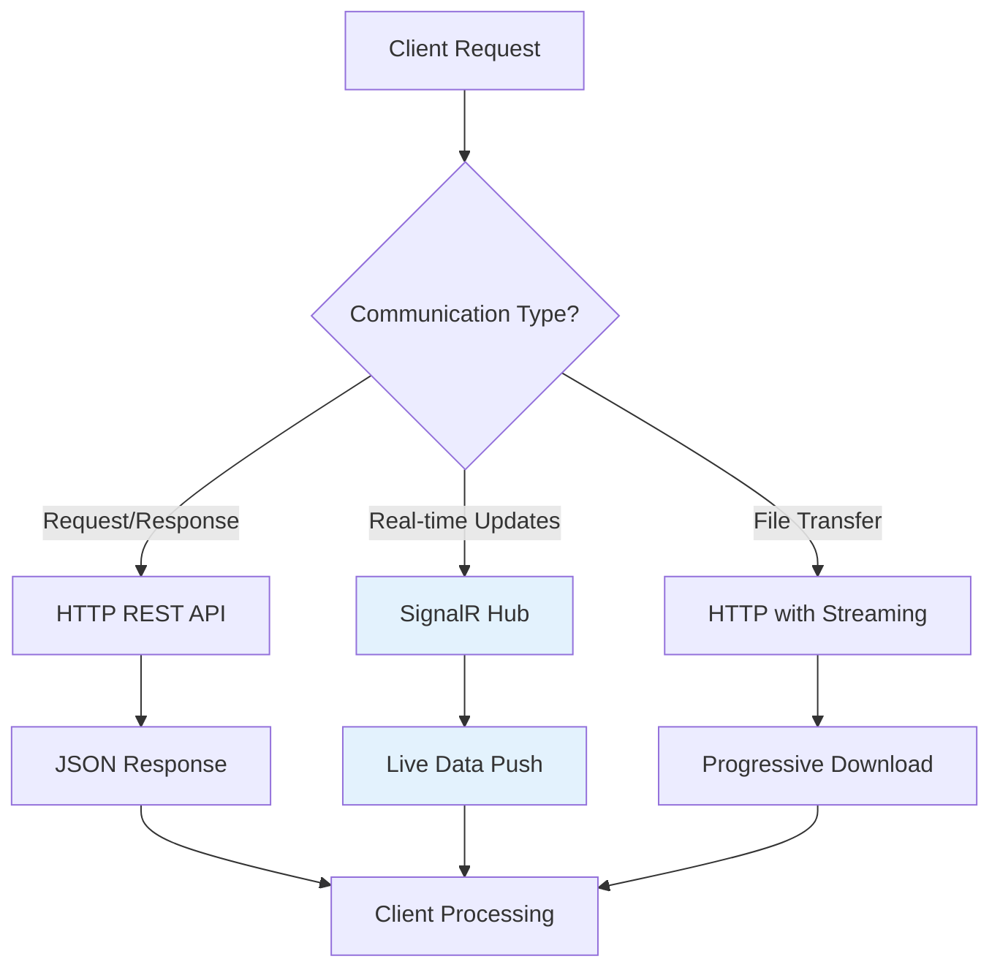
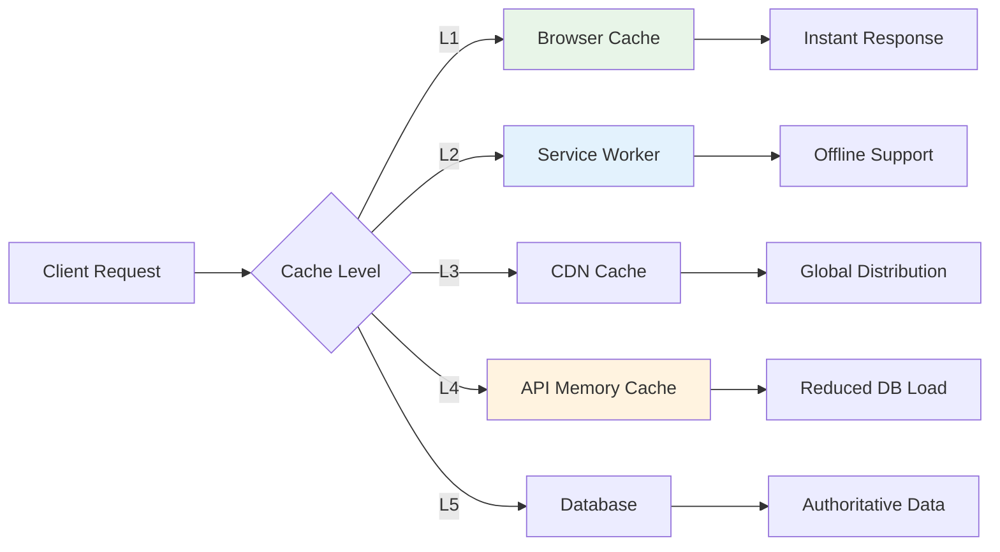
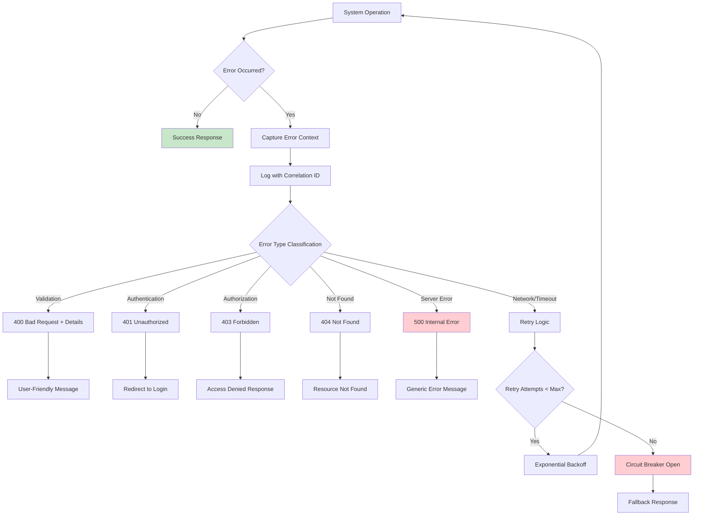
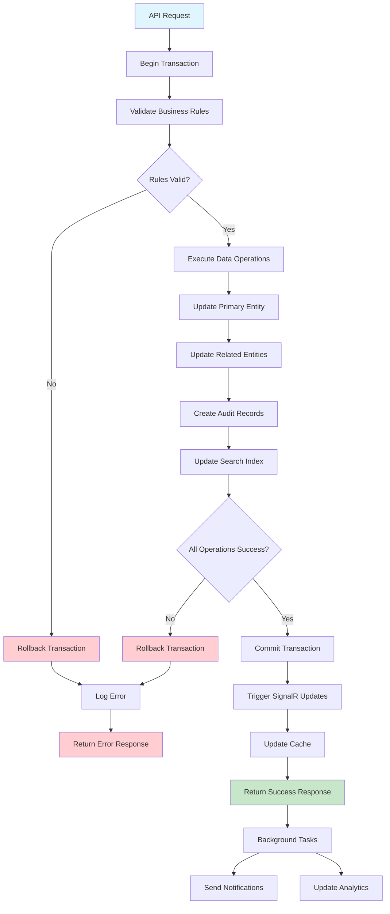
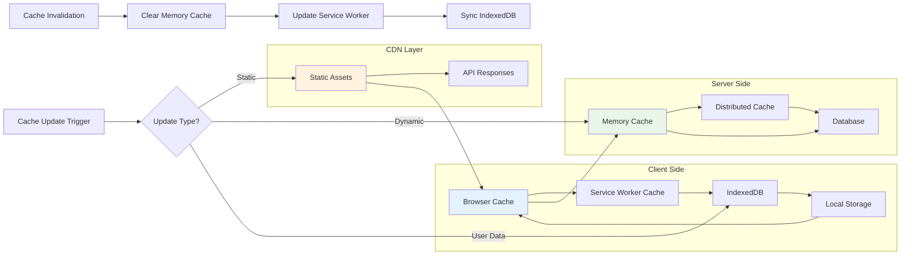
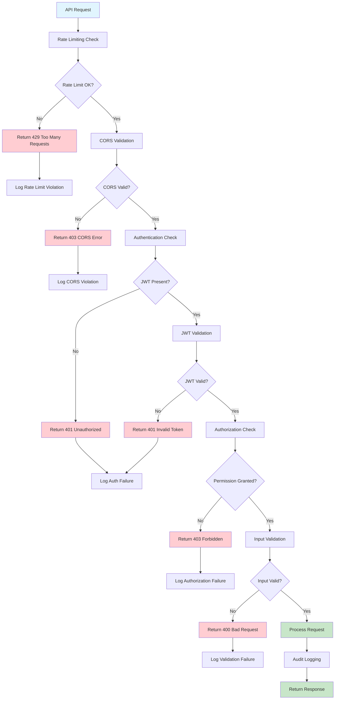
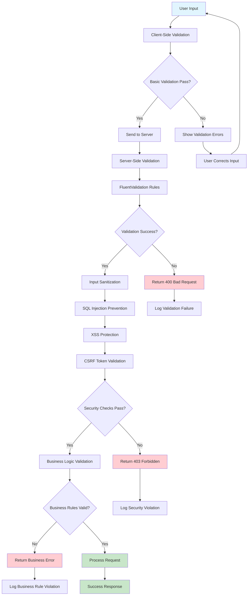

# Architecture Document: HarborFlow Suite

> **DOCUMENT STATUS:** Draft
>
> **Version:** 1.0
> **Last Updated:** 2025-11-11
> **Facilitator:** AI Agent
> **Stakeholder:** User

---

## 1. Executive Summary

> This document outlines the key architectural decisions for the **HarborFlow Suite**, a digital platform modernizing port operations and maritime workflows. Built on ASP.NET Core 9, it prioritizes operational efficiency, real-time data processing, and enhanced security, serving as a centralized hub for port operators, maritime professionals, and vessel agents. The architecture ensures a coherent, maintainable, and scalable application, guiding all AI agents in its development.

---

## 2. Project Initialization

> The base project structure and dependencies are established by the selected starter template. This is the first implementation story to be executed.

The project is initialized using ASP.NET Core 9 for the backend Web API and Blazor WebAssembly for the frontend client. This setup provides a unified development experience with C# across both layers, leveraging the latest features and performance improvements of the .NET 9 SDK. The project adheres to Clean Architecture principles from its inception, ensuring a modular, testable, and maintainable codebase. Initial dependencies include Entity Framework Core for data access, SignalR for real-time communication, and Firebase Authentication for identity management.

**Project Initialization Commands:**

To initialize the project, use the following .NET CLI commands:

1.  **Backend (ASP.NET Core Web API):**
    ```bash
    dotnet new webapi -n HarborFlowSuite.Server -o HarborFlowSuite.Server --framework net9.0
    ```
2.  **Frontend (Blazor WebAssembly PWA):**
    ```bash
    dotnet new blazorwasm -n HarborFlowSuite.Client -o HarborFlowSuite.Client --pwa --framework net9.0
    ```
3.  **Core Library:**
    ```bash
    dotnet new classlib -n HarborFlowSuite.Core -o HarborFlowSuite.Core --framework net9.0
    ```
4.  **Application Layer Library:**
    ```bash
    dotnet new classlib -n HarborFlowSuite.Application -o HarborFlowSuite.Application --framework net9.0
    ```
5.  **Infrastructure Layer Library:**
    ```bash
    dotnet new classlib -n HarborFlowSuite.Infrastructure -o HarborFlowSuite.Infrastructure --framework net9.0
    ```
6.  **Test Projects:**
    ```bash
    dotnet new xunit -n HarborFlowSuite.Application.Tests -o HarborFlowSuite.Application.Tests --framework net9.0
    dotnet new xunit -n HarborFlowSuite.Server.Tests -o HarborFlowSuite.Server.Tests --framework net9.0
    ```

**Template Verification:**

To ensure the continued currency and best practices of the chosen templates, use the following commands to search for the latest information:

*   **ASP.NET Core Web API Template:** `dotnet new webapi --help` (to check available options and versions)
*   **Blazor WebAssembly Template:** `dotnet new blazorwasm --help` (to check available options and versions)
*   **General .NET Templates:** Search online for "ASP.NET Core 9 template best practices" or "Blazor WebAssembly .NET 9 template guidance" to find official documentation and community recommendations.

---

## 3. Architectural Decisions

> The following table summarizes the critical architectural decisions made for this project. Each decision includes the technology, the specific version verified at the time of the decision, and the epics it primarily affects.

### Starter-Provided Decisions

The initial project setup leverages standard .NET 9 templates, which inherently provide the following architectural decisions:

*   **ASP.NET Core 9 Web API:** Foundation for the backend, including basic routing, middleware, and dependency injection setup.
*   **Blazor WebAssembly PWA:** Foundation for the frontend, including client-side rendering, PWA manifest, and service worker integration.
*   **Clean Architecture Structure:** The default .NET templates, when combined with best practices, guide towards a Clean Architecture separation of concerns.
*   **Entity Framework Core Integration:** Basic setup for ORM with a default database provider (though PostgreSQL is explicitly chosen later).

### Architecture Style Decisions and Tradeoffs

**Clean Architecture Selection:**

| Category           | Decision           | Version | Rationale                                                                                                                                                                                                                                                                                                                                                                                                |
|--------------------|--------------------|---------|----------------------------------------------------------------------------------------------------------------------------------------------------------------------------------------------------------------------------------------------------------------------------------------------------------------------------------------------------------------------------------------------------------|
| Architecture Style | Clean Architecture | N/A     | Provides a framework for stabilizing the application's core types, leading to a system that is more manageable and maintainable. Enables easy unit testing of the Application Core. Isolates core business logic from framework changes. (Tradeoff: Increased initial complexity and setup time, additional abstraction layers require more interfaces, more complex dependency injection configuration) |

**API-First Design:**

| Category           | Decision         | Version | Rationale                                                                                                                                                                                                                                                                                                                          |
|--------------------|------------------|---------|------------------------------------------------------------------------------------------------------------------------------------------------------------------------------------------------------------------------------------------------------------------------------------------------------------------------------------|
| Architecture Style | API-First Design | N/A     | Enables a single API to serve multiple clients (web, mobile, desktop) and allows frontend and backend teams to work in parallel. Facilitates easy integration with third-party systems. (Consideration: Requires comprehensive API documentation, API contract changes need coordination, security and rate limiting are critical) |

#### Communication Pattern Choices

**SignalR for Real-time Communication:**



**Decision Rationale:**
- SignalR automatically chooses the best transport method that is within the capabilities of the server and client
- Enhanced activity tracking using ActivitySource provides better observability, with each hub method call represented as its own activity for understanding flow and performance
- Native AOT compilation support improves performance for real-time scenarios

#### Data Storage Solution Rationale

**PostgreSQL Selection:**

| Category     | Decision   | Version | Rationale                                                                                                                                                                                                                                                                                                                                                  |
|--------------|------------|---------|------------------------------------------------------------------------------------------------------------------------------------------------------------------------------------------------------------------------------------------------------------------------------------------------------------------------------------------------------------|
| Data Storage | PostgreSQL | 16.x    | Offers full ACID compliance, advanced SQL capabilities, and excellent Entity Framework Core integration. Multiple providers offer generous free tiers. (Alternative: NoSQL databases lack strong consistency; Document databases have limited query flexibility; Commercial databases have licensing costs; Other databases have less mature .NET support) |

**Database Architecture Pattern:**
Database per service pattern with each microservice having its own private database schema, ensuring loose coupling but requiring careful management of distributed data.

#### Caching Strategy Justification

**Multi-Layer Caching Approach:**



**Strategy Benefits:**
- **Performance**: Cached assets load faster for improved responsiveness and reliability
- **Offline Support**: IndexedDB enables essential dynamic response caching for offline functionality
- **Scalability**: Reduced database load through intelligent caching layers
- **User Experience**: Instant responses for frequently accessed data

#### Security Mechanism Selection

**JWT with Firebase Authentication:**

| Category | Decision                         | Version | Rationale                                                                                                                                                                                                                                                                                        |
|----------|----------------------------------|---------|--------------------------------------------------------------------------------------------------------------------------------------------------------------------------------------------------------------------------------------------------------------------------------------------------|
| Security | JWT with Firebase Authentication | N/A     | Provides industry-standard security with Firebase JWT tokens for authentication (50K MAU free tier), Role-Based Access Control (RBAC) for granular permission management, FluentValidation + middleware for comprehensive API input validation, and HTTPS enforcement for end-to-end encryption. |

---

## 4. Technology Stack

> This section details the specific technologies, frameworks, and libraries chosen for the project, including verified versions and configuration notes. All specified versions were verified against their latest stable releases as of the document's "Last Updated" date.

### 3.1 Programming Languages

#### Backend Development

**C# 13**
- **Primary Language:** C# 13 ships with the .NET 9 SDK and includes new features such as partial properties and indexers in partial types, overload resolution priority, and field backed properties
- **Version:** Latest with .NET 9 SDK
- **Justification:** Native integration with ASP.NET Core 9, strong typing system, excellent tooling support, and comprehensive ecosystem for enterprise applications
- **Key Features:** Enhanced pattern matching, improved performance optimizations, and better nullable reference type support

**SQL (PostgreSQL Dialect)**
- **Purpose:** Database schema definition, stored procedures, and complex queries
- **Version:** PostgreSQL 16+ compatible
- **Justification:** Industry-standard for relational database operations with excellent performance characteristics

#### Frontend Development

**C# with Blazor WebAssembly**
- **Primary Language:** C# 13 for component logic and business rules
- **Justification:** Unified development experience across frontend and backend, eliminating JavaScript complexity while maintaining modern web capabilities
- **Benefits:** Type safety, shared models, reduced context switching for developers

**HTML5 & CSS3**
- **Purpose:** Markup structure and styling foundation
- **Standards:** Modern web standards with semantic HTML and responsive CSS Grid/Flexbox

**JavaScript (Minimal)**
- **Purpose:** Service worker implementation, browser API interop, and PWA functionality
- **Scope:** Limited to essential browser integrations that cannot be handled through Blazor's JavaScript interop

### 3.2 Frameworks & Libraries

#### Core Backend Framework

**ASP.NET Core 9.0**
- **Version:** 9.0 (Latest LTS)
- **Key Features:** Secure by default applications, expanded support for ahead-of-time compilation, optimized handling of static files with automatic fingerprinted versioning, and built-in support for OpenAPI document generation
- **Justification:** Production-ready framework with excellent performance, security, and scalability characteristics
- **Enhanced Capabilities:** Native AOT compilation support for SignalR client and server scenarios, providing performance benefits for real-time web communications

**SignalR with Native AOT Support**
- **Version:** ASP.NET Core 9.0 integrated
- **Purpose:** Real-time vessel position updates and live dashboard notifications
- **Key Features:** ActivitySource named Microsoft.AspNetCore.SignalR.Client for distributed tracing, hub invocations create client spans, and context propagation enabling true distributed tracing from client to server
- **Performance:** Trimming and native ahead-of-time (AOT) compilation support for both client and server scenarios

#### Frontend Framework

**Blazor WebAssembly with PWA Support**
- **Version:** .NET 9.0
- **Architecture:** Standalone WebAssembly application with PWA capabilities
- **Key Features:** Standards-based client-side web app platform supporting PWA APIs for working offline and loading instantly, independent of network speed
- **PWA Capabilities:** Offline capability implementation using service worker and local storage, with form data storage when offline and data synchronization when online

**Progressive Web App (PWA) Features**
- **Service Worker:** Located in wwwroot/service-worker.js, enables offline support by caching assets
- **Offline Strategy:** Caching dynamic responses using IndexedDB for API data storage and retrieval
- **Background Sync:** Service workers for caching, IndexedDB for dynamic data, and robust synchronization logic for offline-first functionality

#### Supporting Libraries

**Entity Framework Core 9.0**
- **Purpose:** Object-relational mapping and database operations
- **Features:** Significant updates including steps towards AOT compilation and pre-compiled queries
- **Database Provider:** PostgreSQL with Npgsql provider

**FluentValidation**
- **Purpose:** Input validation for API endpoints and DTOs
- **Integration:** ASP.NET Core middleware integration for automatic validation

**Serilog**
- **Purpose:** Structured logging with JSON output
- **Configuration:** Console and file sinks with structured data support

**Note on Breaking Changes:**
Agents should be aware that major version upgrades (e.g., .NET 8 to .NET 9) can introduce breaking changes. Always consult official migration guides and release notes when performing upgrades or encountering unexpected behavior related to version differences.

### 3.3 Open Source Dependencies

#### Backend Dependencies

**Microsoft.AspNetCore.OpenApi**
- **Version:** 9.0.x
- **Purpose:** Built-in OpenAPI document generation support, replacing Swashbuckle in templates with native Microsoft.AspNetCore.OpenApi package
- **Registry:** NuGet Package Manager

**Npgsql.EntityFrameworkCore.PostgreSQL**
- **Version:** 8.0.x (compatible with EF Core 9)
- **Purpose:** PostgreSQL database provider for Entity Framework Core
- **Registry:** NuGet Package Manager

**Microsoft.AspNetCore.SignalR**
- **Version:** 9.0.x (included in ASP.NET Core)
- **Purpose:** Real-time communication infrastructure
- **Registry:** Built-in framework component

**FluentValidation.AspNetCore**
- **Version:** 11.3.x
- **Purpose:** Model validation integration
- **Registry:** NuGet Package Manager

**Serilog.AspNetCore**
- **Version:** 8.0.x
- **Purpose:** Structured logging implementation
- **Registry:** NuGet Package Manager

#### Frontend Dependencies

**Microsoft.AspNetCore.Components.WebAssembly**
- **Version:** 9.0.x
- **Purpose:** Core Blazor WebAssembly runtime
- **Registry:** NuGet Package Manager

**Microsoft.AspNetCore.Components.WebAssembly.PWA**
- **Version:** 9.0.x
- **Purpose:** Progressive Web Application support with service-worker.published.js file for offline functionality
- **Registry:** NuGet Package Manager

**Blazored.LocalStorage**
- **Version:** 4.5.x
- **Purpose:** Browser local storage access for offline data caching and PWA functionality
- **Registry:** NuGet Package Manager

**System.Net.Http.Json**
- **Version:** 9.0.x
- **Purpose:** HTTP client with JSON serialization support
- **Registry:** NuGet Package Manager

### 3.4 Third-Party Services

#### Authentication Service

**Firebase Authentication**
- **Service Type:** Backend-as-a-Service (BaaS) authentication
- **Free Tier:** Free for the first 50,000 Monthly Active Users (MAUs) for basic email/password and social logins
- **Supported Methods:** Email & Password, Google, Facebook, Twitter, GitHub, Apple, Microsoft, and Yahoo sign-ins
- **Integration:** JWT token validation in ASP.NET Core
- **Cost Structure:** Only forced to upgrade beyond 50,000 MAUs, with MAU defined as any user account that signs in or is created within a calendar month, counted once per month regardless of sign-in frequency

#### Map Services

**OpenStreetMap with Leaflet**
- **Service Type:** Open-source mapping solution
- **Cost:** Completely free with no usage limits
- **Features:** Interactive maps, multiple tile layers, vessel position overlays
- **Justification:** No API costs, reliable service, extensive customization options

#### RSS Feed Aggregation

**Public Maritime RSS Feeds**
- **Service Type:** Public RSS/XML feeds from maritime industry sources
- **Cost:** Free public feeds
- **Implementation:** Client-side aggregation and filtering
- **Sources:** Maritime industry publications, port authorities, shipping news

### 3.5 Databases & Storage

#### Primary Database

**PostgreSQL**
- **Version:** 16.x
- **Hosting Options:** Neon serverless PostgreSQL database with autoscaling and database branching features, particularly beneficial for CI/CD and testing environments
- **Free Tier Providers:**
  - **Neon:** Serverless PostgreSQL with autoscaling and database branching, effortlessly growing with needs and simplifying environment management
  - **Supabase:** Open-source alternative to Firebase providing real-time database, authentication, and storage services built on PostgreSQL
  - **Vercel Postgres:** Streamlined PostgreSQL deployment experience, essentially white-labeled Neon Tech under Vercel's brand
- **Justification:** Robust ACID compliance, excellent performance, strong ecosystem support, and multiple free hosting options

#### Caching Strategy

**In-Memory Caching**
- **Implementation:** ASP.NET Core built-in IMemoryCache
- **Purpose:** API response caching, frequently accessed data
- **Configuration:** Configurable TTL and memory limits

**Browser Storage**
- **LocalStorage:** Browser-based storage for offline PWA functionality and dynamic data caching
- **IndexedDB:** Browser-based database for storing and retrieving API responses in offline scenarios
- **Service Worker Cache:** Asset caching for offline support, intercepting network requests to serve cached content

#### File Storage

**Local File System**
- **Purpose:** Static assets, application files, logs
- **Implementation:** Standard file system operations
- **Backup:** Regular automated backups to cloud storage

### 3.6 Development & Deployment

#### Development Tools

**Visual Studio Code**
- **Platform:** Cross-platform support (macOS, Windows, Linux)
- **Extensions:** C# Dev Kit, .NET Extension Pack, Docker extension
- **Justification:** Excellent .NET 9 support, integrated debugging, cross-platform compatibility

**Docker & Docker Compose**
- **Purpose:** Local development environment, PostgreSQL containerization
- **Configuration:** docker-compose.yml for local PostgreSQL instance
- **Benefits:** Consistent development environment across platforms

**.NET CLI**
- **Version:** 9.0.x
- **Purpose:** Project scaffolding, building, testing, and local execution
- **Cross-Platform:** Full macOS support with dotnet CLI commands

#### Build System

**MSBuild**
- **Version:** Integrated with .NET 9 SDK
- **Features:** Optimized handling of static files with automatic fingerprinted versioning, new Blazor templates with enhanced capabilities
- **Configuration:** Project files (.csproj) with modern SDK-style format

#### Containerization

**Docker**
- **Base Images:** mcr.microsoft.com/dotnet/aspnet:9.0 for runtime
- **Multi-stage Builds:** Optimized container images with minimal attack surface
- **Development:** docker-compose.yml for local PostgreSQL and development services

#### CI/CD Pipeline

**GitHub Actions**
- **Workflow:** Advanced dotnet.yml with separate jobs for Build, Test, Scan, and Deploy
- **Strategy:** Staging/Production deployment based on develop/main branches
- **Requirements:** 80% code coverage enforcement
- **Features:** Automated testing, security scanning, deployment automation

**Deployment Targets**
- **Free Hosting Options:** GitHub Pages (static assets), Railway, Render, or similar platforms with free tiers
- **Database:** Managed PostgreSQL on free tier providers (Neon, Supabase, Vercel)
- **CDN:** GitHub Pages or Netlify for static asset delivery

#### Monitoring & Health Checks

**Health Checks**
- **Endpoint:** /healthz for application health monitoring
- **Components:** Database connectivity, external service availability
- **Integration:** Built-in ASP.NET Core health check middleware

**Logging**
- **Implementation:** Serilog with structured JSON logging, supporting nullable reference type annotations and customizable JSON indentation
- **Outputs:** Console (development), structured files (production)
- **Monitoring:** Application insights through structured log analysis

#### Security & Compliance

**HTTPS Enforcement**
- **Development:** Easier setup for trusted development certificate on Linux to enable HTTPS during development
- **Production:** Automatic HTTPS redirection and HSTS headers

**CORS Policy**
- **Configuration:** Strict Cross-Origin Resource Sharing policy
- **Scope:** Limited to deployed frontend domain only

**Input Validation**
- **Implementation:** FluentValidation for all API endpoints
- **Error Handling:** RFC 7807 Problem Details for standardized error responses

---

## 5. Project Structure

> The following is the complete source code and file organization for the project. All agents MUST adhere to this structure.

The project adheres to a Clean Architecture structure, organizing code into distinct layers to promote separation of concerns, testability, and maintainability.

**High-Level Folder Structure:**

*   **HarborFlowSuite/**: The root solution folder containing all projects.
    *   **HarborFlowSuite.Application/**: Contains application-specific business logic, use cases, and interfaces. This layer orchestrates the flow of data to and from the domain layer.
        *   `Services/`: Interfaces for application services (e.g., `IAuthService.cs`, `IDashboardService.cs`).
    *   **HarborFlowSuite.Application.Tests/**: Unit tests for the Application layer.
    *   **HarborFlowSuite.Client/**: The Blazor WebAssembly PWA client application. This is the presentation layer for the user interface.
        *   `Components/`: Reusable UI components (e.g., `ChartPlaceholder.razor`, `VesselMap.razor`).
        *   `Layout/`: Application layout components (e.g., `MainLayout.razor`, `NavMenu.razor`).
        *   `Pages/`: Individual application pages.
        *   `Services/`: Client-side services.
    *   **HarborFlowSuite.Core/**: The heart of the application, containing domain entities, value objects, and core business rules. This layer has no dependencies on other layers.
        *   `DTOs/`: Data Transfer Objects for communication between layers.
        *   `Models/`: Domain models.
        *   `Services/`: Domain services.
    *   **HarborFlowSuite.Infrastructure/**: Implements interfaces defined in the Application and Core layers, handling external concerns like data persistence, external services, and third-party integrations.
        *   `Migrations/`: Database migration scripts.
        *   `Persistence/`: Database context and repository implementations.
        *   `Services/`: Implementations of application services that interact with external resources.
    *   **HarborFlowSuite.Server/**: The ASP.NET Core Web API project, acting as the entry point for API requests and SignalR communication. It orchestrates the application and infrastructure layers.
        *   `Controllers/`: API endpoints.
        *   `Hubs/`: SignalR hubs for real-time communication.
        *   `Services/`: Server-side services.
    *   **HarborFlowSuite.Server.Tests/**: Integration and unit tests for the Server layer.

This structure ensures a clear separation of concerns, making the application scalable, maintainable, and testable.

---

## 6. Epic-to-Architecture Mapping

> This section maps each project epic to its corresponding architectural components, clarifying where each piece of functionality resides within the system.

This section details how each epic's functionality is distributed across the core architectural components, highlighting the primary responsibilities of each component in delivering the epic.

*   **Epic 1: Real-time Vessel Tracking System**
    *   **Web API (ASP.NET Core 9):** Handles data ingestion of vessel positions, applies business logic, and broadcasts real-time updates via SignalR.
    *   **Blazor WebAssembly PWA:** Provides the interactive map interface, receives and displays real-time vessel position updates through the SignalR client, and renders vessel information panels.
    *   **PostgreSQL Database:** Persists historical and current vessel position data.
    *   **SignalR:** Facilitates efficient, real-time bidirectional communication between the server and connected clients for live updates.
    *   **OpenStreetMap with Leaflet:** Used by the Blazor PWA for rendering interactive maps and vessel overlays.

*   **Epic 2: User Authentication & Authorization System**
    *   **Web API (ASP.NET Core 9):** Validates JWT tokens received from clients and integrates with Firebase Authentication for secure session management.
    *   **Blazor WebAssembly PWA:** Provides user interface elements for registration, login, and manages client-side storage and refresh of authentication tokens.
    *   **Firebase Authentication:** Serves as the external identity provider, handling user credentials and issuing JWT tokens.

*   **Epic 3: Role-Based Access Control (RBAC) System**
    *   **Web API (ASP.NET Core 9):** Enforces granular permissions at the API level using policy-based authorization and custom middleware.
    *   **PostgreSQL Database:** Stores user roles, permissions, and their mappings, including company associations for data isolation.
    *   **Firebase Authentication:** (via Admin SDK) Can be used for initial user role assignment and management by administrators.

*   **Epic 4: Analytics Dashboard**
    *   **Web API (ASP.NET Core 9):** Aggregates data from the database, applies business logic for insights, and exposes analytics data through dedicated API endpoints.
    *   **Blazor WebAssembly PWA:** Renders interactive charts and visualizations, applies role-based and company-based data filtering on the client-side, and can receive real-time updates via SignalR.
    *   **PostgreSQL Database:** The primary source for all raw and aggregated analytical data.

*   **Epic 5: Service Request Management System**
    *   **Web API (ASP.NET Core 9):** Manages the lifecycle of service requests, including creation, validation, approval workflows, and triggering notifications.
    *   **Blazor WebAssembly PWA:** Provides digital forms for submitting service requests, displays request status, and shows approval history.
    *   **PostgreSQL Database:** Stores all service request details, approval records, and audit trails.

*   **Epic 6: Maritime News Aggregation**
    *   **Blazor WebAssembly PWA:** Fetches, displays, and allows client-side filtering of curated maritime industry news feeds. Utilizes browser caching for offline access.
    *   **Public Maritime RSS Feeds:** External sources from which news content is aggregated.
    *   **Caching Service (Browser Storage):** Leveraged by the PWA to store news content for improved performance and offline availability.

*   **Epic 7: Database Schema & Data Management**
    *   **PostgreSQL Database:** The foundational component responsible for persistent data storage, ensuring data integrity, and supporting all application entities.
    *   **Entity Framework Core:** Used by the Web API and Infrastructure layers for object-relational mapping, schema definition, migrations, and efficient data operations.

*   **Epic 8: Map Bookmarking System**
    *   **Web API (ASP.NET Core 9):** Provides API endpoints for users to save, retrieve, and manage their personalized map bookmarks.
    *   **Blazor WebAssembly PWA:** Offers UI elements for creating, viewing, and navigating to saved map locations.
    *   **PostgreSQL Database:** Stores user-specific map bookmark data, including coordinates and zoom levels.

*   **Epic 9: Progressive Web App (PWA) Capabilities**
    *   **Blazor WebAssembly PWA:** Implements core PWA features including service workers for asset caching, IndexedDB for dynamic data storage, background synchronization logic, and push notifications.
    *   **Caching Service (Browser Storage):** Central to enabling offline functionality and improving application responsiveness.

*   **Epic 10: Global Command Palette**
    *   **Web API (ASP.NET Core 9):** Provides a global search service that can query across different data domains (e.g., vessels, service requests).
    *   **Blazor WebAssembly PWA:** Implements the user interface for the command palette, handles keyboard shortcuts (Cmd+K/Ctrl+K), and displays search results for quick navigation.
    *   **PostgreSQL Database:** Serves as the data source for the global search index.

---

## 7. Cross-Cutting Concerns

> These decisions apply globally across the entire application to ensure consistency in logging, error handling, and other foundational aspects.

### Monitoring and Observability Approach

**Comprehensive Observability Strategy:**
- **Structured Logging**: Serilog with JSON output for centralized log analysis
- **Distributed Tracing**: SignalR's enhanced activity tracking using ActivitySource emits events for hub method calls, with each method call represented as its own activity and nested activities for understanding flow and performance
- **Health Checks**: `/healthz` endpoint monitoring database and external service connectivity
- **Performance Metrics**: Application insights through structured log analysis

**Monitoring Components:**

| Category   | Decision            | Version | Rationale                                                                                                                                                    |
|------------|---------------------|---------|--------------------------------------------------------------------------------------------------------------------------------------------------------------|
| Monitoring | API Performance     | N/A     | Tracks response times, error rates, and throughput. Alerts for >2s response time or >5% error rate, triggering auto-scaling or circuit breaker activation.   |
| Monitoring | SignalR Connections | N/A     | Tracks active connections and message throughput. Alerts for >10% connection drops or high latency, triggering connection pool adjustment or load balancing. |
| Monitoring | Database Health     | N/A     | Tracks query performance and connection pool usage. Alerts for >1s slow queries or pool exhaustion, triggering query optimization or connection scaling.     |
| Monitoring | Authentication      | N/A     | Tracks login success rates and token validation. Alerts for >20% failed logins or token errors, triggering security alerts or rate limiting.                 |
### Logging and Tracing Strategy

**Structured Logging Implementation:**
- **Serilog Configuration**: JSON-formatted logs with contextual information
- **Log Levels**: Trace, Debug, Information, Warning, Error, Critical
- **Correlation IDs**: Request tracking across distributed components
- **Sensitive Data Protection**: Automatic PII scrubbing and masking

**Distributed Tracing:**
SignalR's improved activity tracking using ActivitySource provides better observability and diagnostics for SignalR applications, enabling end-to-end request tracing across the entire system.

### Error Handling Patterns

**Comprehensive Error Handling Flow:**



**Error Handling Principles:**
- **Fail Fast**: Validate inputs early and provide immediate feedback
- **Graceful Degradation**: Maintain core functionality when non-critical services fail
- **Circuit Breaker Pattern**: Prevent cascading failures in distributed systems
**Role-Based Access Control (RBAC) Implementation:**

| Category  | Decision               | Version | Rationale                                                                                                                                              |
|-----------|------------------------|---------|--------------------------------------------------------------------------------------------------------------------------------------------------------|
| RBAC Role | System Administrator   | N/A     | All permissions (*), global access for system management and user administration.                                                                      |
| RBAC Role | Port Authority Officer | N/A     | Permissions for vessel:read:all, servicerequest:approve, dashboard:view, with cross-company visibility for operational oversight and request approval. |
| RBAC Role | Vessel Agent           | N/A     | Permissions for vessel:read:own, servicerequest:create, bookmark:manage, with company-specific data access for service requests and vessel monitoring. |
| RBAC Role | Guest                  | N/A     | Public access only, limited public information for maritime news, basic vessel information.                                                            |

**Security Architecture:**
- **JWT Token Validation**: Firebase-issued tokens validated on every API request
- **Permission Middleware**: Attribute-based authorization at controller and action levels
- **Data Filtering**: Automatic filtering based on user company association
- **Audit Trail**: Comprehensive logging of all security-related events


## 8. Implementation Patterns

> To prevent conflicts and ensure code compatibility between different AI agents, the following implementation patterns MUST be followed. These conventions cover naming, code structure, and data formats.

The project adheres to several key implementation patterns to ensure consistency, maintainability, and scalability:

*   **Clean Architecture:** As detailed in the "System Architecture" section, the project strictly follows Clean Architecture principles, separating concerns into Domain, Application, Infrastructure, and Presentation layers. This promotes testability and technology independence.
*   **Dependency Injection (DI):** All dependencies are managed through a robust DI container (built into ASP.NET Core). Components depend on abstractions (interfaces) rather than concrete implementations, facilitating loose coupling and easier testing.
*   **Repository Pattern:** Data access is abstracted through the Repository Pattern, where interfaces are defined in the Application layer and implemented in the Infrastructure layer using Entity Framework Core. This decouples the application logic from the specific data storage technology.
*   **Command Query Responsibility Segregation (CQRS) (Partial):** While not a full CQRS implementation, the application layer distinguishes between commands (actions that change state) and queries (actions that retrieve data). This helps in organizing business logic and can be evolved into a full CQRS pattern if needed.
*   **Asynchronous Programming (Async/Await):** All I/O-bound operations (e.g., database calls, external API calls) are implemented using `async/await` to ensure responsiveness and scalability of the application.
*   **DTOs (Data Transfer Objects):** DTOs are used to transfer data between different layers (e.g., between API controllers and application services, or between application services and the UI). This prevents exposing internal domain models directly and allows for data shaping.
*   **Fluent Validation:** Input validation for API endpoints and DTOs is handled using FluentValidation, providing a clear and expressive way to define validation rules.
*   **SignalR Hubs:** For real-time communication, SignalR hubs are used to manage connections and broadcast messages to connected clients, following a publish-subscribe pattern.
*   **PWA Best Practices:** The Blazor WebAssembly client implements Progressive Web App best practices, including service workers for caching, IndexedDB for offline data storage, and background synchronization logic.
*   **Conventional Naming:** Adherence to .NET naming conventions (e.g., PascalCase for classes and public members, camelCase for local variables) is strictly enforced.
*   **Code Formatting:** Consistent code formatting is maintained across the codebase, ideally enforced through editor configurations (e.g., `.editorconfig`) and CI/CD pipelines.

### Testing Patterns

To ensure the quality, reliability, and maintainability of the HarborFlow Suite, the following testing patterns will be adopted:

*   **Unit Testing:**
    *   **Purpose:** To verify the correctness of individual units of code (methods, classes) in isolation.
    *   **Framework:** xUnit.net for all .NET projects.
    *   **Naming Convention:** Test classes should follow `[ComponentName]Tests.cs` (e.g., `UserServiceTests.cs`) and test methods `[MethodUnderTest_Scenario_ExpectedBehavior]` (e.g., `GetUserById_ValidId_ReturnsUser`).
    *   **Location:** Unit tests reside in dedicated test projects (e.g., `HarborFlowSuite.Application.Tests`, `HarborFlowSuite.Core.Tests`).
    *   **Principles:** FAST (Fast, Autonomous, Repeatable, Self-validating, Timely). Avoid external dependencies; use mocking frameworks (e.g., Moq) where necessary.
*   **Integration Testing:**
    *   **Purpose:** To verify the interactions between different components or layers of the application (e.g., database access, API endpoints).
    *   **Framework:** xUnit.net with `Microsoft.AspNetCore.Mvc.Testing` for in-memory web application hosting.
    *   **Naming Convention:** Test classes should follow `[ComponentIntegration]Tests.cs` (e.g., `VesselControllerIntegrationTests.cs`).
    *   **Location:** Integration tests reside in test projects (e.g., `HarborFlowSuite.Server.Tests`).
    *   **Principles:** Test real dependencies where appropriate (e.g., a test database instance).
*   **End-to-End (E2E) Testing:**
    *   **Purpose:** To simulate real user scenarios and verify the entire application flow from UI to backend.
    *   **Framework:** Playwright for browser automation.
    *   **Naming Convention:** Test files should follow `[FeatureName]E2ETests.spec.ts` (if using TypeScript) or similar.
    *   **Location:** Dedicated E2E test project (e.g., `HarborFlowSuite.E2ETests`).
    *   **Principles:** Focus on critical user journeys. Run against deployed environments (development, staging).
*   **Mocking Strategy:**
    *   **Framework:** Moq for C# unit tests.
    *   **Usage:** Mock external dependencies (e.g., database contexts, external services, HTTP clients) to isolate the unit under test.
    *   **Principles:** Mock interfaces, not concrete classes. Avoid over-mocking; test real interactions in integration tests.
*   **Code Coverage:**
    *   **Tool:** Coverlet integrated with .NET CLI.
    *   **Target:** Maintain a minimum of 80% code coverage for core business logic (Application and Core layers).
    *   **Enforcement:** Enforced in CI/CD pipeline.

---

## 9. Novel Architectural Patterns

> This section documents any unique architectural patterns designed specifically for this project to solve problems not covered by standard industry solutions.

The HarborFlow Suite primarily leverages established and proven architectural patterns such as Clean Architecture, API-First Design, and event-driven communication via SignalR. There are no novel architectural patterns introduced that deviate significantly from industry-standard solutions. The focus is on robust implementation of these patterns to ensure maintainability, scalability, and performance.

---

## 10. Data Architecture

> Details the database schema, data models, and relationships that form the application's data layer.

### Data Management & Persistence

The system implements robust transaction management to ensure data consistency across all operations.



### Cache Management Strategy

The system implements a multi-layer caching strategy to optimize performance and support offline functionality.



### PostgreSQL Database Component

**Purpose and Responsibilities:**
PostgreSQL is a feature-rich open-source relational database that offers extensive support for different data types, full ACID compliance for transactions, and advanced indexing techniques, making it an excellent choice for microservices architecture due to its support for diverse data types and strong consistency guarantees.

**Technologies and Frameworks:**
- **PostgreSQL 16+**: Primary relational database engine
- **Entity Framework Core**: ORM with PostgreSQL provider (Npgsql)
- **Connection Pooling**: Optimized connection management
- **Migration System**: Schema versioning and deployment automation

**Key Interfaces and APIs:**
- **Entity Framework DbContext**: Primary data access interface
- **Repository Pattern**: Abstracted data access layer
- **Connection String Configuration**: Environment-specific database connections
- **Health Check Integration**: Database connectivity monitoring

**Data Persistence Requirements:**
- **ACID Compliance**: Transactional integrity for all operations
- **Referential Integrity**: Foreign key constraints and cascading rules
- **Indexing Strategy**: Optimized queries for vessel tracking and analytics
- **Backup and Recovery**: Automated backup procedures and point-in-time recovery

**Scaling Considerations:**
- **Read Replicas**: Separate read and write operations for performance
- **Connection Pooling**: Efficient connection resource management
- **Query Optimization**: Proper indexing and query plan analysis
- **Schema Evolution**: Schema versioning and continuous migration best practices for successful integration

#### Server-Side Background Job System

To handle long-running tasks, scheduled operations, and asynchronous processing without blocking the main request thread, a server-side background job system will be implemented.

*   **Technology:** Hangfire (or similar .NET-compatible library like Quartz.NET)
*   **Purpose:**
    *   **Delayed Tasks:** Schedule tasks to run at a future date/time (e.g., sending delayed notifications).
    *   **Recurring Tasks:** Execute tasks on a recurring schedule (e.g., daily data aggregation, cleanup jobs).
    *   **Fire-and-Forget Tasks:** Process tasks asynchronously without waiting for their completion (e.g., sending emails, processing large data imports).
*   **Integration:** Integrated with ASP.NET Core for dependency injection and hosted services.
*   **Persistence:** Utilizes PostgreSQL for job storage, ensuring job durability and reliability across application restarts.
*   **Monitoring:** Provides a dashboard for monitoring job status, retries, and failures.
*   **Compatibility:** Compatible with Docker containerization and scalable across multiple instances.

---

## 11. API Contracts

> Defines the structure and format for all API requests and responses, ensuring predictable communication between the client and server.

The HarborFlow Suite adopts an API-first design approach, where all functionality is exposed through well-defined RESTful API endpoints. These APIs serve as the primary communication channel between the Blazor WebAssembly PWA client and the ASP.NET Core Web API backend, as well as enabling potential future integrations with other systems.

**Key Principles of API Contracts:**

*   **RESTful Design:** APIs adhere to REST principles, utilizing standard HTTP methods (GET, POST, PUT, DELETE) for resource manipulation.
*   **Resource-Oriented:** APIs are designed around resources (e.g., `/vessels`, `/servicerequests`, `/users`), with clear and consistent naming conventions.
*   **Versioned Endpoints:** API endpoints are versioned (e.g., `/api/v1/`) to allow for backward compatibility and graceful evolution of the API.
*   **JSON as Data Format:** All request and response bodies utilize JSON (JavaScript Object Notation) for data exchange, ensuring interoperability and readability.
*   **OpenAPI Documentation:** The Web API includes built-in OpenAPI document generation support (using `Microsoft.AspNetCore.OpenApi`), providing interactive documentation (e.g., Swagger UI) that details all available endpoints, their parameters, request/response schemas, and authentication requirements. This serves as the single source of truth for API consumers.
*   **DTOs (Data Transfer Objects):** Specific DTOs are defined for API requests and responses to shape the data appropriately for external consumption, decoupling the internal domain models from the external API contract.
*   **Standardized Error Responses:** API errors follow a standardized format, leveraging RFC 7807 Problem Details for consistent and machine-readable error reporting.
*   **Authentication Headers:** All protected API endpoints require a valid JWT (JSON Web Token) to be passed in the `Authorization: Bearer <token>` header for authentication and authorization.

**Example API Structure (Conceptual):**

*   **Vessel Tracking:**
    *   `GET /api/v1/vessels`: Retrieve a list of all vessels (filtered by user permissions).
    *   `GET /api/v1/vessels/{id}`: Retrieve details for a specific vessel.
    *   `POST /api/v1/vessels/{id}/position`: Update a vessel's position (real-time updates handled via SignalR).
*   **Service Request Management:**
    *   `GET /api/v1/servicerequests`: Retrieve a list of service requests (filtered by user permissions).
    *   `POST /api/v1/servicerequests`: Create a new service request.
    *   `PUT /api/v1/servicerequests/{id}/status`: Update the status of a service request (e.g., approve, reject).
*   **User Management:**
    *   `GET /api/v1/users/profile`: Retrieve the authenticated user's profile.
    *   `PUT /api/v1/users/profile`: Update the authenticated user's profile.

**SignalR Hub Contracts:**

In addition to REST APIs, SignalR hubs define contracts for real-time communication:

*   **VesselHub:**
    *   **Server-to-Client:** `ReceiveVesselUpdate(VesselUpdateDto update)`
    *   **Client-to-Server:** `JoinVesselGroup(string vesselId)`
*   **DashboardHub:**
    *   **Server-to-Client:** `ReceiveDashboardUpdate(DashboardUpdateDto update)`

These contracts ensure predictable and efficient communication for both traditional request/response and real-time scenarios.

---

## 12. Security Architecture

> Outlines the mechanisms for authentication, authorization, data protection, and threat mitigation.

The HarborFlow Suite is designed with a strong emphasis on security, implementing multiple layers of protection to safeguard data and ensure authorized access.

### Security Implications

| Feature | Security Risk         | Mitigation                                 |
|---------|-----------------------|--------------------------------------------|
| F-001   | Vessel data exposure  | Role-based access control, data encryption |
| F-002   | Authentication bypass | JWT validation, secure token handling      |
| F-003   | Privilege escalation  | Permission validation at multiple layers   |
| F-005   | Data tampering        | Input validation, audit trails             |

### Authentication and Authorization Framework

**Role-Based Access Control (RBAC) Implementation:**

| Category  | Decision               | Version | Rationale                                                                                                                                              |
|-----------|------------------------|---------|--------------------------------------------------------------------------------------------------------------------------------------------------------|
| RBAC Role | System Administrator   | N/A     | All permissions (*), global access for system management and user administration.                                                                      |
| RBAC Role | Port Authority Officer | N/A     | Permissions for vessel:read:all, servicerequest:approve, dashboard:view, with cross-company visibility for operational oversight and request approval. |
| RBAC Role | Vessel Agent           | N/A     | Permissions for vessel:read:own, servicerequest:create, bookmark:manage, with company-specific data access for service requests and vessel monitoring. |
| RBAC Role | Guest                  | N/A     | Public access only, limited public information for maritime news, basic vessel information.                                                            |

**Security Architecture:**
- **JWT Token Validation**: Firebase-issued tokens validated on every API request
- **Permission Middleware**: Attribute-based authorization at controller and action levels
- **Data Filtering**: Automatic filtering based on user company association
- **Audit Trail**: Comprehensive logging of all security-related events

### API Security Enforcement

The system enforces comprehensive API security measures at multiple layers to protect against various attack vectors.



### Input Validation & Sanitization

The system implements comprehensive input validation to prevent security vulnerabilities and ensure data integrity.



---

## 13. Deployment Architecture

> Describes the infrastructure, environments (development, staging, production), and CI/CD pipeline for deploying the application.

The HarborFlow Suite is designed for efficient development, robust build processes, and flexible deployment across various environments, leveraging modern containerization and CI/CD practices.

### Development & Deployment

#### Development Tools

**Visual Studio Code**
- **Platform:** Cross-platform support (macOS, Windows, Linux)
- **Extensions:** C# Dev Kit, .NET Extension Pack, Docker extension
- **Justification:** Excellent .NET 9 support, integrated debugging, cross-platform compatibility

**Docker & Docker Compose**
- **Purpose:** Local development environment, PostgreSQL containerization
- **Configuration:** docker-compose.yml for local PostgreSQL instance
- **Benefits:** Consistent development environment across platforms

**.NET CLI**
- **Version:** 9.0.x
- **Purpose:** Project scaffolding, building, testing, and local execution
- **Cross-Platform:** Full macOS support with dotnet CLI commands

#### Build System

**MSBuild**
- **Version:** Integrated with .NET 9 SDK
- **Features:** Optimized handling of static files with automatic fingerprinted versioning, new Blazor templates with enhanced capabilities
- **Configuration:** Project files (.csproj) with modern SDK-style format

#### Containerization

**Docker**
- **Base Images:** mcr.microsoft.com/dotnet/aspnet:9.0 for runtime
- **Multi-stage Builds:** Optimized container images with minimal attack surface
- **Development:** docker-compose.yml for local PostgreSQL and development services

#### CI/CD Pipeline

**GitHub Actions**
- **Workflow:** Advanced dotnet.yml with separate jobs for Build, Test, Scan, and Deploy
- **Strategy:** Staging/Production deployment based on develop/main branches
- **Requirements:** 80% code coverage enforcement
- **Features:** Automated testing, security scanning, deployment automation

**Deployment Targets**
- **Free Hosting Options:** GitHub Pages (static assets), Railway, Render, or similar platforms with free tiers
- **Database:** Managed PostgreSQL on free tier providers (Neon, Supabase, Vercel)
- **CDN:** GitHub Pages or Netlify for static asset delivery


---

## 14. Architecture Decision Records (ADRs)

> A log of significant architectural decisions, including the context, tradeoffs considered, and rationale for the final choice.

Architecture Decision Records (ADRs) will be created and maintained as needed to document significant architectural decisions made throughout the project lifecycle. Each ADR will capture the context of the decision, the options considered, the chosen solution, and the rationale behind it, along with any implications or consequences. This ensures transparency, provides a historical log of architectural evolution, and facilitates onboarding for new team members.

Initial ADRs will cover:
*   Selection of Clean Architecture.
*   Choice of ASP.NET Core 9 and Blazor WebAssembly.
*   Decision to use PostgreSQL as the primary database.
*   Integration of Firebase Authentication.
*   Adoption of SignalR for real-time communication.