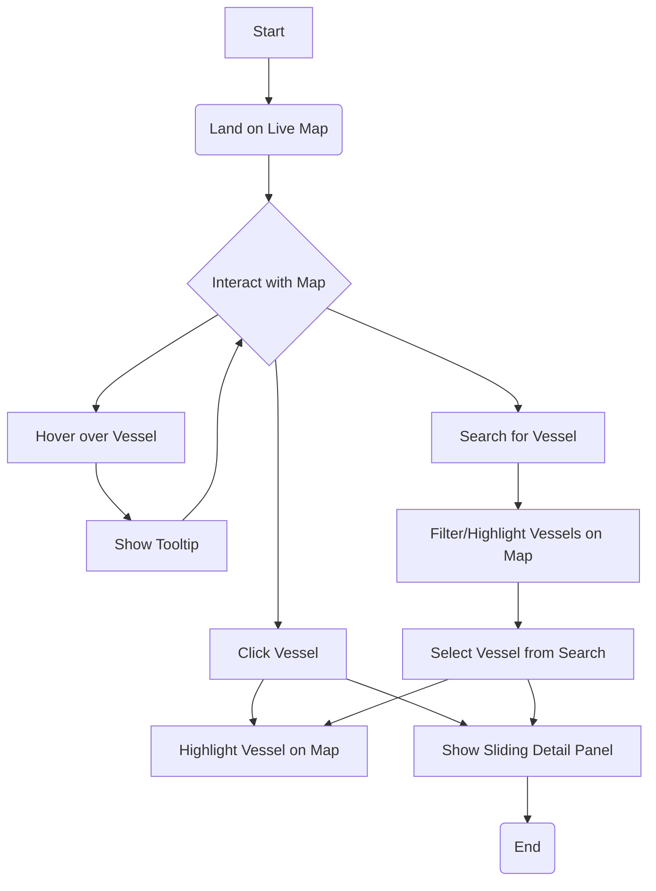
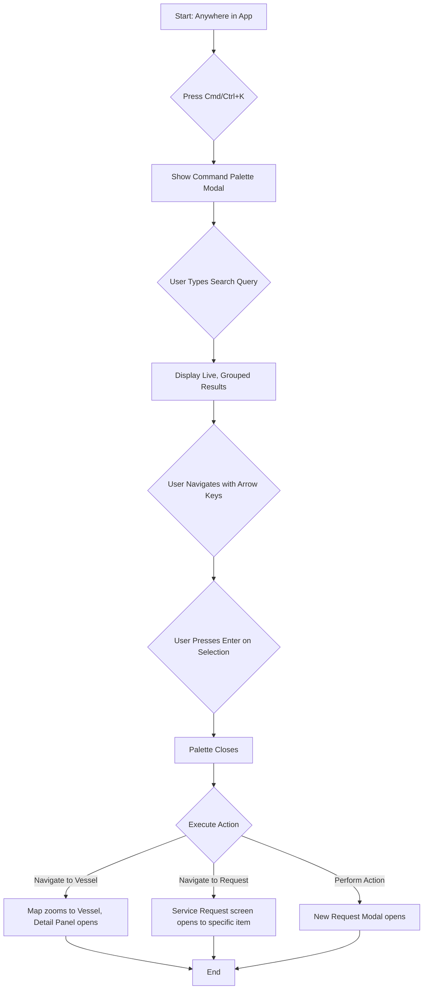

# HarborFlow_dotnet_Suite_Marseillo_v2 UX Design Specification

_Created on 2025-11-11 by BMad_
_Generated using BMad Method - Create UX Design Workflow v1.0_

---

## Executive Summary

The HarborFlow Suite is a modern, web-based platform designed to digitize and streamline maritime port operations. It replaces manual processes with a unified system for real-time vessel tracking, service request management, and operational analytics, all built on a .NET 9 and Blazor PWA stack.

**Target Users:** The primary users are Port Authority Officers who need operational oversight, Vessel Agents who manage their company's service requests, and System Administrators who manage the platform itself.

---

## 1. Project Vision

**Vision:** The HarborFlow Suite aims to transform port operations and maritime workflows by digitizing manual processes into an intuitive, unified digital platform, delivering measurable operational efficiency and enhanced decision-making.
**Users:** Primary users are Port Authority Officers, Vessel Agents, and System Administrators.
**Core Experience:** Real-time vessel tracking map interaction, effortless search/navigation via Global Command Palette, and critical service request workflow management.
**Desired Feeling:** Empowerment, confident control, efficiency, productivity, calm, and focus, leading to mastery over complexity.
**Platform:** Primarily web, with desktop next, and mobile in the future.
**Inspiration:** Slack (Quick Switcher), Trello (Kanban), VesselFinder (Live Map) - informing efficiency, visual workflow, and progressive disclosure.
**UX Complexity:** High, due to multiple user roles, complex real-time data, interactive workflows, and multi-platform considerations.

---

## 1. Design System Foundation

### 1.1 Design System Choice

**Chosen Design System:** MudBlazor

**Rationale:**
MudBlazor aligns perfectly with the goals outlined in the `target_tech_spec_HarborFlow_dotnet_suite.md` for the following reasons:

*   **Aligns with Project Goals (Fast Development & Professional UI):** The tech spec calls for a "production-grade system" that provides an "intuitive, unified digital experience." MudBlazor delivers on this by providing a comprehensive set of pre-built Material Design components. This directly supports the goal of fast development with great defaults, allowing us to focus on core business logic rather than building a UI from scratch.

*   **Supports Core Features:** The spec requires an Analytics Dashboard (F-004) and a Service Request Management System (F-005). MudBlazor's extensive component library, which includes data tables, charts, and various form inputs, provides the exact tools needed to build these data-heavy interfaces efficiently.

*   **No Need for Uniqueness (Yet):** The project's primary success factors are user adoption, performance, and reliability—not complete visual uniqueness. MudBlazor's professional and familiar Material Design aesthetic is a strength, as it provides an intuitive experience for users like Port Authority Officers and Vessel Agents.

*   **Themeable for the Future:** While no strict brand guidelines are defined yet, MudBlazor's built-in theming system is flexible enough to accommodate future branding needs without requiring a full custom implementation now.

---

## 2. Core User Experience

### 2.1 Defining Experience

**Core Experience:**
The most frequent action for users will be viewing and interacting with the real-time vessel tracking map. This is the central hub for "real-time situational awareness" and is described as a "Critical" priority feature (F-001) that provides core operational visibility.

Searching for information and navigating the system via the Global Command Palette (Cmd+K/Ctrl+K) should feel completely effortless. This feature (F-010) is designed specifically to improve user productivity and make accessing any feature or data point, like finding a vessel or a service request, quick and seamless.

The most critical user action is managing the service request workflow (creating, tracking, and approving requests). This digital workflow (F-005) is a high-priority feature that replaces error-prone manual processes. Failure in this system, such as a lost request or a missed approval, would have direct and significant negative operational consequences, undermining a primary business value of the entire suite.

**Platform:**
The initial focus is on the web platform. After web implementation is complete, development will continue for desktop, with future plans for mobile.

### 2.2 Desired Emotional Response

Based on the technical specifications, the primary feeling users should experience when using HarborFlow Suite is one of **empowerment and confident control**. The entire system is designed to transform their work from a state of reactive chaos into one of proactive command.

**1. Empowered and In Control:** This is the core emotional goal. The previous system is described as manual, fragmented, and error-prone, which creates a feeling of uncertainty and helplessness. HarborFlow counters this directly.
  - **Why they feel it:** The real-time vessel tracking map gives them a god-like view of their domain. The analytics dashboard transforms raw data into actionable insights. Instead of guessing, they are making data-driven decisions. This shift from reacting to commanding their environment is the ultimate form of empowerment in a high-stakes operational role.

**2. Efficient and Productive:** Users should feel like their time is suddenly more valuable. The application is a force multiplier for their efforts.
  - **Why they feel it:** The system promises a "reduction in manual processing time by 60-80%." The streamlined service request workflow eliminates tedious paperwork and phone calls. The Global Command Palette (Cmd+K) makes them feel like a power user, navigating the entire system with speed and precision. They are no longer bogged down by process; they are executing tasks.

**3. Calm and Focused:** By centralizing information and automating workflows, the system removes significant mental overhead and anxiety.
  - **Why they feel it:** A "centralized hub" and "unified digital experience" mean they aren't juggling emails, spreadsheets, and phone calls. The PWA's offline capabilities provide a safety net, ensuring the application is reliable even with a spotty connection. Knowing that service requests have a clear status and audit trail provides peace of mind that nothing will be lost or forgotten.

The feeling that would make them evangelize the application is **mastery over complexity**. They would tell a story of transformation:
> "You know how we used to spend half our day chasing down vessel locations and tracking service approvals on paper? I just open HarborFlow, and it's all right there, live. I can see the entire port's activity at a glance and approve three requests from my tablet before my first coffee. It feels less like a tool and more like a superpower. It didn't just make my job easier; it made me better at my job."

This feeling of gaining effortless command over a previously chaotic and stressful environment is a powerful experience that users would be excited to share.

### 2.3 Inspiration and UX Patterns

To ensure HarborFlow Suite leverages familiar and effective interaction paradigms, we've analyzed key UX patterns from applications users already appreciate:

**1. Slack (Quick Switcher - Cmd+K/Ctrl+K)**
*   **Compelling UX:** Instant, keyboard-driven navigation and search across diverse content. Prioritizes speed, intelligent matching (fuzzy search, learning user behavior), and flexible querying.
*   **Applicability to HarborFlow:** Directly informs the Global Command Palette (F-010). The command palette should offer instantaneous access to vessels, service requests, and other features, supporting fuzzy matching and a keyboard-first approach for power users.

**2. Trello (Kanban Board)**
*   **Compelling UX:** Visual organization of tasks into clear workflow stages with intuitive drag-and-drop interaction. Highly customizable with labels, due dates, and collaborative features.
*   **Applicability to HarborFlow:** Highly relevant for the Service Request Management System (F-005). A visual, card-based interface can represent service request statuses (e.g., Pending, Approved, Rejected), making workflow progression clear and status changes intuitive via drag-and-drop.

**3. VesselFinder (Live Map)**
*   **Compelling UX:** Displays dense, real-time data (vessel positions) without clutter, providing detailed information on demand (progressive disclosure) via a simple click. Features intuitive navigation, clear visual hierarchy, and filtering/layering options.
*   **Applicability to HarborFlow:** Directly informs the Real-time Vessel Tracking System (F-001). The interactive map should prioritize clarity, offer detailed vessel information on click, and allow users to customize their view with various data layers and filters. Performance and responsiveness are critical for real-time data.

**Synthesized UX Principles for HarborFlow:**

*   **Efficiency through Command & Search:** Implement a highly responsive and intelligent global command palette for quick search and navigation, leveraging intelligent matching and a keyboard-first approach.
*   **Visual Workflow Management:** Utilize visual, card-based interfaces for managing complex workflows like service requests, enabling intuitive status changes and clear oversight.
*   **Progressive Disclosure of Information:** Present essential information upfront, but reveal detailed data only when actively requested by the user, preventing information overload.
*   **Clear Visual Hierarchy and Layering:** Employ strong visual hierarchy and customizable data layers to manage the complexity of real-time data on maps and dashboards.
*   **Real-time Responsiveness and Performance:** Ensure all real-time data updates and user interactions are fast, smooth, and consistent across all supported platforms.
*   **Intuitive Interaction:** Design for natural and effortless interactions, such as drag-and-drop for workflow manipulation and seamless map navigation.
*   **Keyboard Accessibility:** Prioritize keyboard-driven interactions, especially for core functionalities and power-user features, to enhance efficiency.

### 2.4 Novel UX Patterns

Based on the analysis of the defining experience and inspiration apps, the core user experience for HarborFlow Suite primarily leverages established UX patterns. The application of these patterns to the maritime domain, particularly the unified live map for "see and manage" functionality, is innovative within its context, but the underlying interaction patterns themselves are well-understood. Therefore, no entirely novel UX patterns are required at this stage.

### 2.5 Core Experience Principles

These principles will guide every UX decision for HarborFlow Suite:

*   **Speed:** Key actions, especially search/navigation (Global Command Palette) and real-time map updates, must feel instantaneous. Workflow actions (e.g., approving a service request) should be completed with minimal friction and perceived latency.
*   **Guidance:** Users should feel supported but not constrained. Onboarding should be guided, but experienced users should be able to operate efficiently without excessive hand-holding. Contextual help and clear feedback are essential.
*   **Flexibility:** The system should offer flexibility for power users (e.g., advanced filtering on maps, keyboard shortcuts) while maintaining simplicity for common tasks. Users should have control over their view (e.g., map layers, dashboard customization).
*   **Feedback:** Feedback should be immediate, clear, and context-sensitive. For critical actions (e.g., service request approval), feedback should be explicit and reassuring. For real-time updates, it should be subtle but noticeable. Errors should be communicated clearly with actionable recovery steps.

### 3.1 Color System

**Chosen Theme:** A hybrid theme combining the dark mode foundation of "High-Tech Command" with the thematically-rich and professional colors from "Nautical Professional".

*   **Base:** Dark theme for a focused, "command center" environment that reduces eye strain and makes critical information stand out.
*   **Primary Color:** `#0d47a1` (Deep, authoritative blue for primary actions and key elements, evoking trust and stability).
*   **Secondary Color:** `#00838f` (Teal for secondary actions and highlights, suggesting calm and growth).
*   **Semantic Colors:**
    *   **Success:** `#2e7d32` (Green)
    *   **Warning:** `#ff8f00` (Yellow/Amber)
    *   **Error:** `#c62828` (Red)
    *   **Info:** `#3b82f6` (Blue for informational messages)
*   **Neutral Colors (Dark Theme Palette):**
    *   **Background Dark:** `#111827` (Main application background)
    *   **Background Light:** `#1f2937` (Sidebar, cards, secondary elements)
    *   **Text Light:** `#d1d5db` (Primary text on dark backgrounds)
    *   **Text Dark:** `#b0b8c4` (Secondary text, labels - adjusted for AA contrast)
    *   **Border/Divider:** `#374151` (Separators, outlines)

### 3.2 Typography

*   **Font Family:** **Inter** will be used for both headings and body text. Its clean, geometric lines are highly legible on screens and complement the modern, high-tech aesthetic.
*   **Monospace Font:** **Roboto Mono** will be used for any fixed-width data display, ensuring clarity and alignment.
*   **Type Scale:** A standard typographic scale will be applied to ensure clear visual hierarchy and readability.
    *   **H1:** 2.5rem (40px)
    *   **H2:** 2rem (32px)
    *   **H3:** 1.75rem (28px)
    *   **H4:** 1.5rem (24px)
    *   **H5:** 1.25rem (20px)
    *   **H6:** 1.125rem (18px)
    *   **Body:** 1rem (16px)
    *   **Small:** 0.875rem (14px)
*   **Font Weights:**
    *   **Regular:** 400 (for body text, labels)
    *   **Medium:** 500 (for emphasis, subheadings)
    *   **SemiBold:** 600 (for strong emphasis, primary headings)
    *   **Bold:** 700 (for critical information, call-to-actions)
*   **Line Heights:**
    *   **Headings:** 1.2
    *   **Body Text:** 1.5

### 3.3 Spacing & Layout

*   **Base Unit:** An 8px grid system will be used for all spacing and sizing, ensuring consistency and a harmonious layout.
*   **Spacing Scale (Multiples of 8px):**
    *   `space-1`: 8px
    *   `space-2`: 16px
    *   `space-3`: 24px
    *   `space-4`: 32px
    *   `space-5`: 40px
    *   `space-6`: 48px
    *   (and so on, in multiples of 8px)
*   **Layout Grid:** A 12-column responsive grid system will be implemented for flexible and adaptive layouts.
    *   **Gutters:** 16px (between columns)
*   **Container Widths (Max-width for main content areas):**
    *   **Small (sm):** 540px
    *   **Medium (md):** 720px
    *   **Large (lg):** 960px
    *   **Extra Large (xl):** 1140px

**Interactive Visualizations:**

- Color Theme Explorer: [ux-color-themes.html](./ux-color-themes.html)

---

## 4. Design Direction

### 4.1 Chosen Design Approach

**Chosen Direction:** A hybrid approach combining the foundational layout of **Direction #1 (Sidebar / Dense)** with the content-first goal of **Direction #3 (Top Nav / Minimal)**, enabled by a **collapsible sidebar**.

**Rationale:**

*   **Foundation: Direction #1 (Sidebar / Dense):** The philosophy of an "Information-rich command center for power users" perfectly matches the needs of Port Authority Officers and Vessel Agents. A persistent left sidebar is critical for a true command center, allowing users to switch instantly between the live Map, the Analytics Dashboard, and Service Requests without losing context. This layout is built for efficiency and multitasking, supporting the core emotional goal of empowerment and control.

*   **Enhancement: Incorporate the Goal of Direction #3 (Top Nav / Minimal):** The "content-first approach, maximizing vertical space" from Direction #3 is ideal for the core map experience. This can be achieved without sacrificing the navigational benefits of the sidebar by making the sidebar collapsible.

**Implementation:**

*   **Default View:** The application will default to the dense sidebar layout, providing immediate access to navigation and key information.
*   **Collapsible Sidebar:** A prominent and intuitive control will allow users to collapse the sidebar, maximizing the content area. This is particularly beneficial for focusing on the real-time vessel tracking map.
*   **Flexibility:** This hybrid approach delivers the best of both worlds: the information density and efficiency needed by a power user, combined with the flexibility of a focused, full-screen view when required. It fully supports the vision of an empowered user in complete control of their domain.

**Interactive Mockups:**

- Design Direction Showcase: [ux-design-directions.html](./ux-design-directions.html)

---

## 5. User Journey Flows

### 5.1 Critical User Paths

#### Journey 1: Real-time Vessel Monitoring

*   **User Goal:** To monitor maritime activity, track vessel positions in real-time, and access detailed vessel information.
*   **Approach:** Direct landing on a full-screen live map with a collapsible sidebar. Vessel details are shown in a sliding panel from the right.

**Flow Steps:**

1.  **User lands on the application.**
    *   **User sees:** A full-screen live map of the port with vessel icons. The sidebar is visible on the left with the "Map" link active.
    *   **User does:** Nothing (initial view).
    *   **System responds:** Vessel icons are displayed at their real-time positions.
2.  **User hovers over a vessel icon.**
    *   **User sees:** A small tooltip with the vessel's name and current speed.
    *   **User does:** Moves the mouse over a vessel icon.
    *   **System responds:** Displays the tooltip.
3.  **User clicks a vessel icon.**
    *   **User sees:** The selected vessel's icon is highlighted, and a detailed information panel slides in from the right.
    *   **User does:** Clicks a vessel icon.
    *   **System responds:** Highlights the icon and displays the sliding panel.
4.  **User searches for a specific vessel.**
    *   **User sees:** As they type in the search bar (or command palette), other vessels dim, and matching vessels are highlighted.
    *   **User does:** Types a vessel name or ID in the search bar or command palette.
    *   **System responds:** Dynamically filters and highlights vessels on the map.
5.  **User selects a vessel from the search results.**
    *   **User sees:** The map pans/zooms to the selected vessel, its icon is highlighted, and the detail panel slides in.
    *   **User does:** Clicks a vessel in the search results.
    *   **System responds:** Pans/zooms the map and displays the detail panel.

**Decision Points:**

*   User chooses to hover or click a vessel.
*   User chooses to search for a vessel.

**Error States:**

*   **Live feed interrupted:**
    *   **Indication:** A non-intrusive banner appears at the top stating "Live data feed interrupted. Displaying last known positions." Vessel icons turn grey to indicate stale data.
    *   **Recovery:** The system will attempt to reconnect automatically every 15 seconds. A "Retry Now" button on the banner allows the user to trigger a manual reconnection attempt. The banner disappears once the connection is restored.
*   **Map data fails to load:**
    *   **Indication:** The map area shows a loading spinner indefinitely.
    *   **Recovery:** After 10 seconds, the spinner is replaced with an error message: "Could not load map data. Please check your connection and try again." A "Reload Map" button is provided.

**Success State:**

*   The user has a specific vessel selected, its icon is highlighted, and the detail panel is open, displaying the required information.

**Flow Diagram:**




#### Journey 2: Service Request Creation (Vessel Agent)

*   **User Goal:** To create a new service request for a vessel with maximum efficiency and minimal errors.
*   **Approach:** A contextual smart form presented in a modal window, initiated from the vessel's detail panel or a global button.

**Flow Steps:**

1.  **User initiates request.**
    *   **Path A (Contextual):** Clicks the "+ New Service Request" button within a vessel's sliding detail panel.
    *   **Path B (Global):** Clicks "Service Requests" in the main sidebar, then clicks the global "+ New Request" button on the list page.
2.  **System displays the request form.**
    *   A modal window appears, focusing the user on the task.
    *   If the contextual path was taken, the vessel's name and ID are pre-populated and read-only.
3.  **User fills out the smart form.**
    *   Selects Service Type (e.g., "Pilotage," "Bunkering").
    *   Selects Location (e.g., "Berth 12").
    *   Picks the desired Date & Time.
    *   (Optional) Adds notes or attaches documents.
4.  **User submits the form.**
    *   Clicks the "Submit Request" button.
5.  **System provides multi-layered feedback.**
    *   The "Submit" button immediately enters a "Submitting..." disabled state with a spinner.
    *   On success, the modal content is replaced with a clear success message (e.g., "✓ Request #SR-12345 Submitted").
    *   Simultaneously, a non-intrusive "toast" notification appears, confirming submission without interrupting the user's broader workflow.
6.  **System confirms success and navigates.**
    *   After a brief moment, the modal window closes automatically.
    *   The user is navigated to the main "Service Requests" screen.
    *   The newly created request appears at the top of the list, clearly marked with a "Pending" status badge.

**Error States:**

*   **Form Validation Failure:**
    *   **Indication:** If the user clicks "Submit" with invalid data, the form is not submitted. The invalid fields are highlighted in red, and a descriptive error message appears below each (e.g., "This field is required," "Please select a future date"). A summary error message appears at the top of the form: "Please correct the errors below."
    *   **Recovery:** The user corrects the invalid fields and can re-submit the form. The "Submit" button remains active.
*   **Submission Failure (Network/Server Error):**
    *   **Indication:** The "Submitting..." state on the button is replaced by a "Retry" state. A `MudAlert` with `Severity="Severity.Error"` appears within the modal, stating "Failed to submit request. Please try again."
    *   **Recovery:** The user can click the "Retry" button to attempt submission again. The form data is preserved. A "Cancel" button allows the user to close the modal and discard the request.

**Success State:**

*   The user sees their new request at the top of the service request list with a "Pending" status, feeling confident that their action was completed successfully.

**Flow Diagram:**

```mermaid
graph TD
    subgraph "Entry Points"
        A[Map View: Click Vessel] --> B[Vessel Detail Panel];
        B --> C{Click "+ New Service Request"};
        D[Sidebar: Click "Service Requests"] --> E[Service Request List];
        E --> F{Click "+ New Request"};
    end

    subgraph "Form Interaction"
        C --> G[Show Request Modal (Vessel Pre-populated)];
        F --> H[Show Request Modal (Blank)];
        G --> I(Fill Form);
        H --> I;
        I --> J{Submit Request};
    end

    subgraph "Feedback & Confirmation"
        J --> K[Show "Submitting..." state];
        K --> L[Show Success in Modal & Toast];
        L --> M[Auto-navigate to Service Request List];
        M --> N[New Request appears at top with "Pending" status];
    end

    N --> Z[End];
```


#### Journey 3: Service Request Review & Approval (Port Authority Officer)

*   **User Goal:** To efficiently review incoming service requests and make a clear decision (Approve/Reject) in a high-throughput environment.
*   **Approach:** A two-pane "Review Command Center" layout with a request queue on the left and details (including a mini-map) on the right, optimized for rapid, sequential decision-making.

**Flow Steps:**

1.  **User is notified of new requests.**
    *   An ambient notification badge on the "Service Requests" sidebar icon shows the number of pending items.
    *   A real-time toast notification may briefly appear when a new request is submitted.
2.  **User navigates to the review screen.**
    *   Clicks the "Service Requests" icon in the sidebar.
3.  **System displays the Review Command Center.**
    *   **Left Pane:** A dense, scrollable list of pending requests. The top item is selected by default.
    *   **Right Pane:** Full details of the selected request, including a mini-map for spatial context. `Approve` and `Reject` buttons are prominent.
4.  **User reviews the request and makes a decision.**
    *   Scans the details in the right pane.
    *   (Optional) Uses keyboard arrows to navigate the queue, which instantly updates the detail pane.
    *   **Path A (Approve):** Clicks the `Approve` button or presses the 'A' key.
    *   **Path B (Reject):** Clicks the `Reject` button or presses the 'R' key, which reveals a required text field for the rejection reason. The user types a reason and confirms.
5.  **System provides feedback and advances the queue.**
    *   The action button enters a brief loading state.
    *   The completed request is instantly removed from the queue with a smooth animation.
    *   The detail pane automatically loads the next request, creating a seamless "review -> act -> next" loop.
    *   A confirmation toast appears (e.g., "Request #SR-12345 Approved").
6.  **User reaches "Inbox Zero".**
    *   When the last request is actioned, the queue displays a clear "No pending requests" message.
    *   The notification badge on the sidebar icon disappears, providing a satisfying sense of completion.

**Error States:**

*   **Action Failure (Network/Server Error):**
    *   **Indication:** If the "Approve" or "Reject" action fails, the loading state on the button ceases, and a `MudSnackbar` (toast) appears with an error message (e.g., "Error: Could not approve request. Please try again.").
    *   **Recovery:** The request remains in the queue and selected, allowing the user to retry the action. The system does not automatically advance.

**Success State:**

*   The officer has processed all pending requests, the queue is empty, and they feel confident that all necessary decisions have been made efficiently.

**Flow Diagram:**

```mermaid
graph TD
    A[Start] --> B{New Request Notification};
    B --> C[Click "Service Requests" in Sidebar];
    C --> D[Display Two-Pane Review Screen];
    D --> E{Review Request Details};
    E --> F{Select Action};
    F -- Approve --> G[Click Approve Button];
    F -- Reject --> H[Click Reject Button];
    H --> I[Enter Rejection Reason];
    I --> J[Confirm Rejection];
    G --> K{Process Decision};
    J --> K;
    K --> L[Animate Removal from Queue];
    L --> M[Auto-load Next Request];
    M --> E;
    E -- No More Requests --> N["Inbox Zero" State];
    N --> Z[End];
```


#### Journey 4: Global Command Palette Usage

*   **User Goal:** To find anything in the application (a vessel, a service request, a feature) and navigate there instantly, without using the mouse.
*   **Approach:** A centered modal command palette, activated by a keyboard shortcut (`Cmd/Ctrl+K`), with live, fuzzy search across all major entities.

**Flow Steps:**

1.  **User activates the palette.**
    *   Presses `Cmd+K` (macOS) or `Ctrl+K` (Windows/Linux) from anywhere in the application.
2.  **System displays the palette.**
    *   A sleek, centered modal appears, dimming the background application to bring focus.
    *   An auto-focused search input appears at the top, along with a default list of "Suggested Actions."
3.  **User types a search query.**
    *   As the user types (e.g., "pilot"), the results list updates instantly with every keystroke.
4.  **System displays live, intelligent results.**
    *   The search is fuzzy and queries across all major entities simultaneously.
    *   Results are clearly grouped by category (e.g., Actions, Vessels, Service Requests), each with a distinct icon and contextual information.
5.  **User navigates and selects a result.**
    *   Uses the `Up/Down` arrow keys to highlight the desired item.
    *   Presses `Enter` to execute the action for the highlighted item.
6.  **System executes the action instantly.**
    *   The command palette closes with a quick, fluid animation.
    *   The application state changes immediately to reflect the selection (e.g., navigates to the map and zooms to a vessel, opens a specific service request, or opens the "New Request" modal).

**Error States:**

*   **No Results Found:**
    *   **Indication:** If a query yields no matches, the results area displays a clear message: "No results for '[user's query]'".
    *   **Recovery:** The user can clear the query or type a new one. The input remains focused.
*   **Search Service Failure:**
    *   **Indication:** If the backend search fails, the results area displays an error message: "Search is temporarily unavailable. Please try again shortly."
    *   **Recovery:** The user can close the palette and try again later. The system may automatically retry the search after a few seconds.

**Success State:**

*   The user's intent is fulfilled almost instantaneously. The journey from thinking "I need to find vessel X" to seeing its details on the screen is a sub-second keyboard command, reinforcing the feeling of speed and mastery.

**Flow Diagram:**



{{user_journey_flows}}

---

## 6. Component Library

### 6.1 Component Strategy

Our component strategy is to leverage our chosen design system, **MudBlazor**, as much as possible, while creating a few high-level, custom components for the unique parts of our application. This approach ensures a consistent, professional look and feel while accelerating development.

**1. Leverage MudBlazor Extensively:**
The vast majority of our UI will be built using standard MudBlazor components. This includes, but is not limited to:
*   **Layout:** `MudLayout`, `MudAppBar`, `MudDrawer` (for our collapsible sidebar), `MudGrid`.
*   **Forms:** `MudForm`, `MudTextField`, `MudSelect`, `MudDatePicker`, `MudTimePicker`, `MudButton`, `MudFileUpload`.
*   **Notifications:** `MudBadge` (for notification counts), `MudSnackbar` (for toast notifications).
*   **Data Display & Interaction:** `MudList`, `MudDialog`, `MudCard`, `MudTable`, `MudChart`.

**2. Identify Key Custom Components:**
We will create a small number of high-level, application-specific components. These will be built by composing standard MudBlazor components and will encapsulate the unique business logic of HarborFlow.

*   **`VesselMap` Component:**
    *   **Purpose:** Integrates a third-party mapping library (e.g., Leaflet) to display real-time vessel positions and port infrastructure.
    *   **User-facing Value:** Provides the core "command center" visual overview of port activity.
    *   **Content/Data:** Real-time vessel data (position, speed, type), port features (berths, channels), user-defined layers.
    *   **User Actions:** Pan, zoom, hover (for tooltips), click (for detail panel), layer toggling.
    *   **States:** Loading, active, error (e.g., live feed interrupted), empty (no vessels).
    *   **Variants:** Different map styles (street, satellite), customizable layers.
    *   **Behavior:** Smooth vessel movement, dynamic icon scaling with zoom, interactive tooltips.
    *   **Accessibility:** Keyboard navigation for map controls, screen reader announcements for selected vessels/layers.

*   **`VesselDetailPanel` Component:**
    *   **Purpose:** Displays comprehensive information about a selected vessel in a sliding panel.
    *   **User-facing Value:** Provides on-demand, in-context details without losing the map view.
    *   **Content/Data:** Vessel name, IMO, destination, ETA, cargo, status, recent events, actions (e.g., "New Service Request").
    *   **User Actions:** Close panel, initiate service request, view historical data.
    *   **States:** Loading (while fetching details), active (displaying data), empty (no details available).
    *   **Variants:** Content adapts based on vessel type or user role.
    *   **Behavior:** Slides in from the right, overlays part of the map, dismissible.
    *   **Accessibility:** Keyboard focus management within the panel, clear headings and labels for screen readers.

*   **`ServiceRequestQueue` Component:**
    *   **Purpose:** Implements the two-pane "Review Command Center" layout for Port Authority Officers.
    *   **User-facing Value:** Enables high-throughput review and decision-making for service requests.
    *   **Content/Data:** Left pane: compact list of pending requests (vessel, type, time). Right pane: full request details, mini-map, action buttons.
    *   **User Actions:** Select request, approve, reject (with reason), navigate queue (keyboard).
    *   **States:** Loading, active (displaying requests), empty (no pending requests - "Inbox Zero").
    *   **Variants:** May have different filter/sort options for the queue.
    *   **Behavior:** Automatic advancement to next request after action, smooth removal of processed requests.
    *   **Accessibility:** Full keyboard navigation, clear focus indicators, ARIA roles for list/detail structure.

*   **`GlobalCommandPalette` Component:**
    *   **Purpose:** Provides instant, keyboard-driven search and navigation across the entire application.
    *   **User-facing Value:** Acts as a power-user tool for rapid "intent-to-action" execution.
    *   **Content/Data:** Search input, grouped results (Actions, Vessels, Service Requests), suggested actions.
    *   **User Actions:** Type search query, navigate results (Up/Down arrows), select result (Enter), dismiss (Esc).
    *   **States:** Open, searching, no results, executing action.
    *   **Variants:** None, consistent across app.
    *   **Behavior:** Centered modal overlay, background dimming, live fuzzy search, instant navigation/action.
    *   **Accessibility:** Full keyboard operability, screen reader announcements for search results and selected items, focus management.

**3. Component Naming and Organization:**
*   All custom components will be placed in the `HarborFlowSuite.Client/Components` directory.
*   They will follow a clear, PascalCase naming convention (e.g., `VesselMap.razor`, `ServiceRequestQueue.razor`).
*   This strategy allows us to build a unique, powerful application while still benefiting from the stability, consistency, and richness of the MudBlazor component library.

**4. Design System Components Customization Needs:**
*   **Theming:** MudBlazor's theming capabilities will be used to apply our custom color palette, typography, and spacing scale globally.
*   **Overrides:** Minor CSS overrides may be necessary for specific component instances to perfectly align with the visual design, but these will be minimized.
*   **Configuration:** MudBlazor components will be configured to align with our UX pattern decisions (e.g., `MudSnackbar` placement and duration, `MudDialog` default sizes).

---

## 7. UX Pattern Decisions

### 7.1 Consistency Rules

To ensure a cohesive, predictable, and intuitive user experience across the entire HarborFlow Suite, the following UX patterns will be consistently applied.

**1. Data Display & Information Hierarchy:**
*   **Primary Content:** The main content area is reserved for the user's primary task (e.g., the live map, the service request queue).
*   **Secondary Context:** The right-hand sliding panel is the standard pattern for displaying detailed information related to a selected item from the main content area. This preserves the user's context by keeping the primary content visible.
*   **Quick Scans:** Tooltips on hover are to be used for quick identification of elements (e.g., a vessel's name on the map) without requiring a click.
*   **Density:** Interfaces will be information-dense but well-organized, prioritizing scannability for power users. Whitespace will be used intentionally to group related information and guide the user's eye.

**2. User Input & Actions:**
*   **Button Hierarchy:**
    *   **Primary Actions:** The single most important action on a page or in a modal (e.g., "Submit Request," "Approve") will always be a `MudButton` with `Color="Color.Primary"`.
    *   **Secondary Actions:** Less critical or alternative actions will use the default or `Color="Color.Secondary"` `MudButton`.
    *   **Tertiary Actions:** Subtle actions, often text-based or icon-only, for less prominent functions (e.g., "View Details" link, filter toggles).
    *   **Destructive Actions:** Any action that is destructive or irreversible (e.g., "Delete," "Cancel Request") will be colored with `Color="Color.Error"` and will **always** open a confirmation `MudDialog` before proceeding.
*   **Forms:**
    *   **Presentation:** All forms for creating or editing complex data will be presented within a `MudDialog` (modal) to focus the user on the input task.
    *   **Labels:** All input fields will have clear, persistent labels positioned above the input field.
    *   **Validation:** Real-time validation feedback will be provided as the user types, with clear error messages displayed directly below the affected field.
    *   **Help Text:** Contextual help text will be available for complex fields, appearing on focus or via an info icon.

**3. Navigation:**
*   **Primary Navigation:** The collapsible `MudDrawer` (left sidebar) is the primary method for navigating between the main sections of the application (e.g., Map, Service Requests, Dashboard).
*   **Power Navigation:** The `GlobalCommandPalette` (Cmd/Ctrl+K) is the primary method for power users to instantly find and navigate to specific items (vessels, requests) or perform actions.
*   **Contextual Navigation:** Navigation to a specific item's detail view will be handled by selecting it from a list or map, which then reveals its detail panel or navigates to the item's dedicated page.
*   **Breadcrumbs:** For multi-level navigation, breadcrumbs will be used to show the user's current location within the application hierarchy.
*   **Back Button:** A consistent "Back" button or icon will be provided in detail views or modals where appropriate, allowing users to return to the previous context.

**4. Feedback & Status Communication:**
*   **Asynchronous Actions:** Any action that requires a backend call (e.g., submitting a form) will provide immediate feedback by disabling the action button and showing a loading indicator (`MudProgressCircular`).
*   **Confirmation:** Successful completion of an action will be confirmed with a non-intrusive `MudSnackbar` (toast notification) that appears in the bottom-right corner and auto-dismisses after 3-5 seconds.
*   **Status Indicators:** The status of items (e.g., "Pending," "Approved," "Rejected") will be consistently displayed using `MudChip` components with corresponding semantic colors (Warning for Pending, Success for Approved, Error for Rejected, Info for informational states).
*   **Errors:** System or validation errors will be clearly displayed using the `MudAlert` component with `Severity="Severity.Error"`, providing actionable information where possible.

**5. Modal Patterns:**
*   **Purpose:** Modals (`MudDialog`) are used for focused tasks (forms, confirmations) that require user attention without navigating away from the current context.
*   **Sizes:** Standard sizes (small, medium, large, full-width) will be used, adapting to content length.
*   **Dismiss Behavior:** Modals can be dismissed by clicking outside, pressing `Esc`, or using an explicit "Close" button. Destructive action modals will require explicit confirmation.
*   **Focus Management:** Focus will automatically shift to the first interactive element within the modal upon opening and be trapped within the modal until dismissed.
*   **Stacking:** Multiple modals will stack appropriately, with the most recent modal always on top and receiving focus.

**6. Empty State Patterns:**
*   **First Use:** For features with no data yet, a friendly message will guide the user on how to get started (e.g., "No service requests yet. Click here to create your first one!").
*   **No Results:** When a search or filter yields no results, a clear message will inform the user and suggest alternative actions (e.g., "No vessels found matching 'XYZ'. Try a different search term.").
*   **Cleared Content:** After all items in a list are processed (e.g., "Inbox Zero" for service requests), a positive confirmation message will be displayed.

**7. Search Patterns:**
*   **Trigger:** Global search is triggered by `Cmd/Ctrl+K`. Local search (e.g., within a table) will use a dedicated search input field.
*   **Results:** Results will be displayed instantly as the user types, grouped by category, with clear titles and contextual information.
*   **Filters:** Advanced filtering options will be available alongside search results, allowing users to refine their queries.
*   **No Results:** A clear "No results found" message will be displayed, with suggestions for refining the search.

**8. Date/Time Patterns:**
*   **Pickers:** `MudDatePicker` and `MudTimePicker` components will be used for all date and time input.
*   **Format:** Dates will be displayed in a user-friendly, localized format (e.g., "Nov 11, 2025" or "11/11/2025"). Times will be displayed in 24-hour format (e.g., "14:30") unless user preferences dictate otherwise.
*   **Timezone:** All backend data will be stored in UTC, and displayed times will be converted to the user's local timezone.

---

## 8. Responsive Design & Accessibility

### 8.1 Responsive Strategy

Our responsive strategy ensures a consistent and effective user experience across all target platforms, from large desktop monitors to mobile devices. The approach is "desktop-first," optimizing for the power-user command center experience and then gracefully adapting to smaller viewports.

*   **Desktop (lg, xl breakpoints):** This is the full HarborFlow experience. The collapsible sidebar is persistent, and information-dense layouts like the two-pane "Review Command Center" are standard.
*   **Tablet (md breakpoint):** To preserve horizontal space, the sidebar will be collapsed by default, acting as an overlay when opened. Two-pane layouts will stack vertically to maintain readability and usability.
*   **Mobile (xs, sm breakpoints):** The experience is adapted for a smaller, touch-first interface.
    *   The sidebar is hidden and accessible via a standard "hamburger" menu icon.
    *   Multi-pane layouts are converted into a "list -> detail" navigation flow. Tapping an item on a list screen will navigate the user to a new, full-screen detail view.
    *   On the map, detail panels will appear as "bottom sheets" that slide up from the bottom, a common and intuitive mobile pattern.
*   **Implementation:** We will use MudBlazor's built-in responsive grid system (`MudGrid`) and breakpoint utilities to ensure content reflows smoothly and appropriately for each device class.

### 8.2 Accessibility (a11y) Strategy

Accessibility is a core requirement, not an afterthought. Our goal is to make HarborFlow usable by the widest possible audience, ensuring compliance with modern accessibility standards (WCAG 2.1 AA).

*   **Keyboard Navigation:** All interactive elements—from sidebar links to map icons and form fields—will be reachable and operable via the keyboard. A logical and predictable focus order will be maintained throughout the application. The Global Command Palette is a key feature that exemplifies this keyboard-first commitment.
*   **Screen Reader Support:** We will use semantic HTML5 elements to give structure and meaning to all content. For custom or complex components (like the command palette or the two-pane view), we will use ARIA (Accessible Rich Internet Applications) roles and attributes to ensure they are fully understandable and operable by screen readers.
*   **Color Contrast:** Our chosen color palette has been audited to ensure all text and meaningful UI elements meet WCAG 2.1 AA standards for color contrast against their backgrounds. The palette is confirmed to be compliant. This is critical for users with low vision.
*   **Alternative Text:** All meaningful images, icons, and data visualizations will have descriptive alternative text (`alt` tags). Purely decorative elements will be hidden from screen readers to avoid unnecessary noise.
*   **Leverage MudBlazor:** We will rely on MudBlazor's built-in accessibility features and follow their documented best practices for creating accessible components and layouts. Regular testing with accessibility tools (e.g., browser extensions, screen readers) will be part of the development process.

---

## 9. Implementation Guidance

### 9.1 Completion Summary

This UX Design Specification provides a comprehensive foundation for the design and development of the HarborFlow Suite. Through a collaborative process, we have established a clear and unified vision for the user experience.

**Key Decisions and Outcomes:**

*   **Core Vision:** We are building a "high-tech command center" for port operations, designed to evoke feelings of **empowerment, confident control, and efficiency**. The defining experience is the ability to **see and manage the entire port's activity on one live map**.

*   **Design System:** We will use **MudBlazor** as our foundational component library to ensure rapid development and a professional, consistent UI.

*   **Visual Foundation:** We have chosen a unique and thematically appropriate visual style: a **dark mode "High-Tech Command" theme** combined with a professional **"Nautical" color palette**. The primary font will be **Inter**, supported by an 8px grid system.

*   **Design Direction:** The application will be built around a **dense, information-rich layout with a collapsible sidebar**. This provides the flexibility for both high-level multitasking and immersive, content-first focus.

*   **Critical User Journeys:** We have mapped out the detailed interaction flows for our three most critical user journeys:
    1.  **Real-time Vessel Monitoring**
    2.  **Service Request Creation & Approval**
    3.  **Global Command Palette Usage**

*   **Implementation Strategy:** We have defined clear strategies for our **component library**, consistent **UX patterns**, **responsive design**, and **accessibility (a11y)**, ensuring a robust and inclusive application.

This document, along with the interactive `ux-color-themes.html` and `ux-design-directions.html` mockups, provides a complete and actionable guide for the subsequent phases of development. It represents a shared understanding of the user experience we are committed to delivering.

---

## Appendix

### Related Documents

- Product Requirements: `/Users/marseillosatrian/Downloads/HarborFlow_dotnet_Suite_Marseillo_v2/docs/bmm-PRD.md or PRD.md or product-requirements.md`
- Product Brief: `/Users/marseillosatrian/Downloads/HarborFlow_dotnet_Suite_Marseillo_v2/docs/product-brief.md or brief.md or project-brief.md`
- Brainstorming: `/Users/marseillosatrian/Downloads/HarborFlow_dotnet_Suite_Marseillo_v2/docs/brainstorming.md or brainstorm.md or ideation.md`

### Core Interactive Deliverables

This UX Design Specification was created through visual collaboration:

- **Color Theme Visualizer**: /Users/marseillosatrian/Downloads/HarborFlow_dotnet_Suite_Marseillo_v2/docs/ux-color-themes.html
  - Interactive HTML showing all color theme options explored
  - Live UI component examples in each theme
  - Side-by-side comparison and semantic color usage

- **Design Direction Mockups**: /Users/marseillosatrian/Downloads/HarborFlow_dotnet_Suite_Marseillo_v2/docs/ux-design-directions.html
  - Interactive HTML with 6-8 complete design approaches
  - Full-screen mockups of key screens
  - Design philosophy and rationale for each direction

### Optional Enhancement Deliverables

_This section will be populated if additional UX artifacts are generated through follow-up workflows._

<!-- Additional deliverables added here by other workflows -->

### Next Steps & Follow-Up Workflows

This UX Design Specification can serve as input to:

- **Wireframe Generation Workflow** - Create detailed wireframes from user flows
- **Figma Design Workflow** - Generate Figma files via MCP integration
- **Interactive Prototype Workflow** - Build clickable HTML prototypes
- **Component Showcase Workflow** - Create interactive component library
- **AI Frontend Prompt Workflow** - Generate prompts for v0, Lovable, Bolt, etc.
- **Solution Architecture Workflow** - Define technical architecture with UX context

### Version History

| Date     | Version | Changes                         | Author        |
| -------- | ------- | ------------------------------- | ------------- |
| 2025-11-11 | 1.0     | Initial UX Design Specification | BMad |

---

_This UX Design Specification was created through collaborative design facilitation, not template generation. All decisions were made with user input and are documented with rationale._
