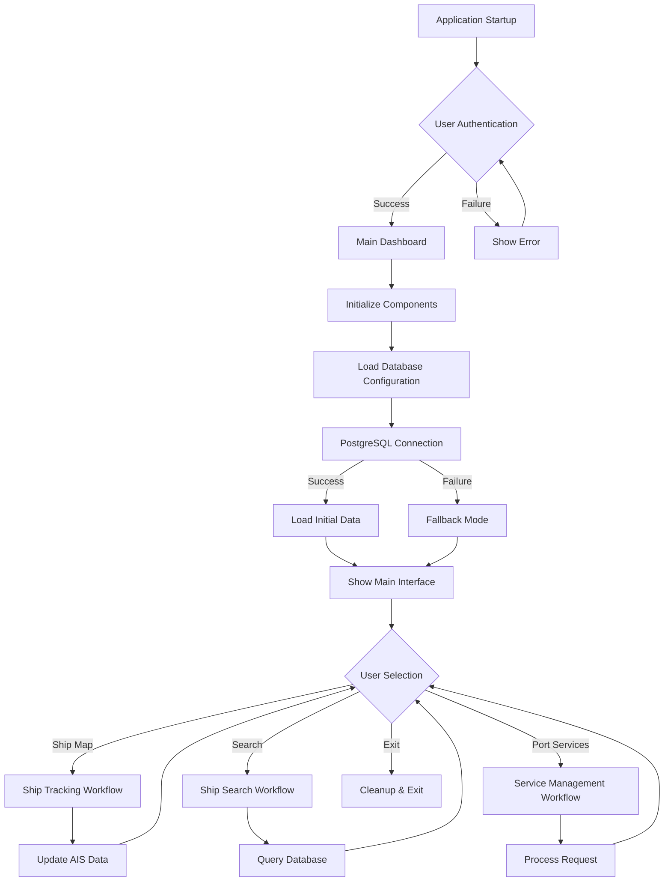
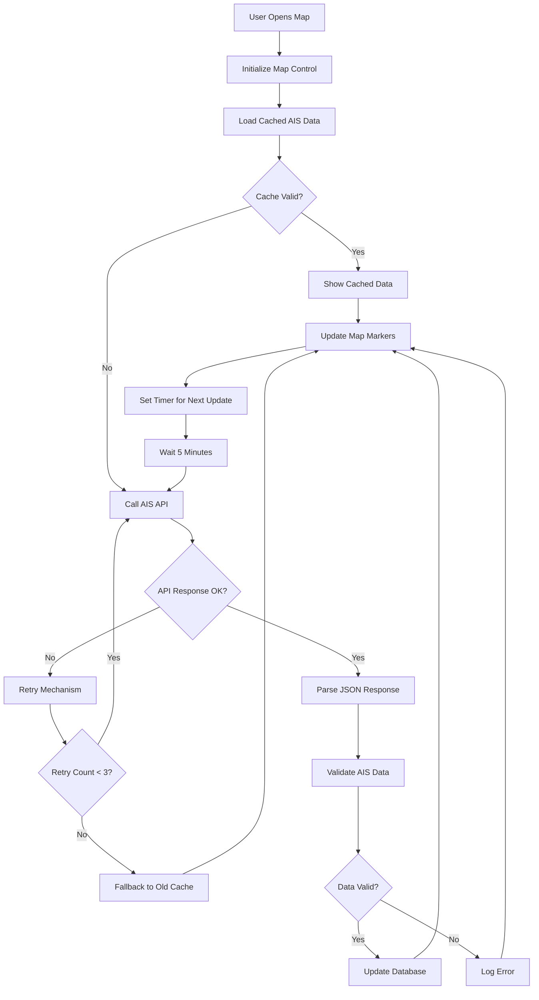

# HarborFlow Project Documentation

## 1. Project Overview

HarborFlow is a Smart Port Management System designed to digitize and streamline operational workflows in a port. This project is built as a desktop application using .NET 9 with Windows Presentation Foundation (WPF), following the MVVM pattern.

### 1.1. Key Features

- **Real-time Vessel Tracking:** Track vessel positions in real-time on an interactive map using AIS data.
- **Digital Workflow Management:** A platform for submitting and approving port service requests.
- **Centralized Information Portal:** A single point of access for all port-related information for stakeholders.

## 2. Technology Stack

- **.NET 9 WPF:** For the desktop application.
- **PostgreSQL:** As the primary database.
- **Entity Framework Core 9:** For data access.
- **MVVM Pattern:** For a clean and maintainable architecture.
- **FluentValidation:** For model validation.
- **Microsoft.Extensions.Hosting:** For dependency injection and configuration.
- **Microsoft.Web.WebView2:** For embedding web content in the WPF application.
- **Microsoft.Xaml.Behaviors.Wpf:** For creating interactive behaviors in WPF.

## 3. Project Structure

The solution is divided into the following projects, following the principles of Clean Architecture:

- **HarborFlow.Core:** This is the core of the application, containing the domain models (entities) and the interfaces for the services. It has no dependencies on other projects in the solution.
- **HarborFlow.Application:** This project contains the business logic of the application. It implements the interfaces defined in `HarborFlow.Core` and orchestrates the domain models to perform application-specific tasks.
- **HarborFlow.Infrastructure:** This project handles all external concerns, such as data access, file system access, and communication with external APIs. It implements the interfaces defined in `HarborFlow.Core` and provides the concrete implementation for the data access layer using Entity Framework Core.
- **HarborFlow.Wpf:** This is the presentation layer of the application, built with WPF and the MVVM pattern. It is responsible for the user interface and user experience.
- **HarborFlow.Tests:** This project contains unit and integration tests for the application, ensuring the quality and correctness of the code.

## 4. Configuration

The application's configuration is stored in the `appsettings.json` file in the `HarborFlow.Wpf` project.

```json
{
  "ConnectionStrings": {
    "DefaultConnection": "Host=localhost;Port=5432;Database=harborflow.db;Username=marseillosatrian;Password=bizero11"
  },
  "ApiKeys": {
    "AisStream": "b783f9f5cc6a2b442ca08547824d6d5908c3960c"
  }
}
```

- **DefaultConnection:** The connection string for the PostgreSQL database.
- **AisStream:** The API key for the AIS data stream service.

## 5. Database Schema

The database schema is defined in the `HarborFlowDbContext.cs` file in the `HarborFlow.Infrastructure` project. The database contains the following tables:

- **vessels:** Stores information about the vessels, including their IMO, MMSI, and metadata.
- **VesselPositions:** Stores the real-time position of the vessels.
- **Users:** Stores user information for authentication and authorization.
- **ServiceRequests:** Stores information about the port service requests.
- **ApprovalHistories:** Stores the approval history for the service requests.

## 6. How to Run

1.  **Clone the repository.**
2.  **Configure the database connection:**
    - Open the `appsettings.json` file in the `HarborFlow.Wpf` project.
    - Update the `DefaultConnection` string with your PostgreSQL connection details.
3.  **Run the database migrations:**
    - Open a terminal in the `HarborFlow.Infrastructure` directory.
    - Run the command: `dotnet ef database update`
4.  **Run the application:**
    - Set the `HarborFlow.Wpf` project as the startup project.
    - Run the application from Visual Studio or by using the command `dotnet run` in the `HarborFlow.Wpf` directory.

## 7. Development Environment

While the core business logic of HarborFlow can be developed on any platform that supports .NET 9, the main user interface is a Windows Presentation Foundation (WPF) application. This imposes some limitations on the development environment.

### 7.1. Windows-Specific Tasks

The following tasks must be performed on a Windows operating system:

- **Running and Debugging the Application:** The `HarborFlow.Wpf` application can only be run and debugged on Windows.
- **Running Unit Tests:** The unit tests in the `HarborFlow.Tests` project require the .NET Desktop Runtime, which is only available on Windows.
- **Visual Verification:** Any changes to the user interface in the `.xaml` files must be visually verified by running the application on Windows.

### 7.2. Cross-Platform Development

Developers on macOS or Linux can contribute to the following projects:

- `HarborFlow.Core`
- `HarborFlow.Application`
- `HarborFlow.Infrastructure`

However, any work that touches the UI or requires verification through tests must be validated on a Windows environment before being considered complete.

## 8. System Architecture

HarborFlow adopts a 3-Tier Architecture optimized for WPF desktop applications with the Model-View-ViewModel (MVVM) pattern. This architecture is chosen based on the fundamental principles of Separation of Concerns and Dependency Inversion to create a testable, maintainable, and efficiently developable system.

### 8.1. Core Components

| Component Name | Primary Responsibility | Key Dependencies | Integration Points |
|---|---|---|---|
| WPF Presentation Layer | Manages the user interface and user interaction through XAML and ViewModels | .NET 9 WPF, MVVM Framework | Business Logic Layer, Configuration Service |
| Business Logic Layer | Implements business rules, validation, and application workflow orchestration | Domain Models, Validation Rules | Data Access Layer, External Services |
| Data Access Layer | Manages data persistence and communication with the PostgreSQL database | Entity Framework Core 9, Npgsql Provider | PostgreSQL Database, Caching Layer |
| External Integration Layer | Handles communication with AIS APIs and other third-party services | HTTP Client, JSON Serialization | AIS Data Providers, Authentication Services |

### 8.2. Data Flow

The data flow in the HarborFlow system follows a unidirectional pattern starting from the presentation layer and flowing through the business layer to the data access layer. When a user interacts with the WPF interface, the action is captured by the ViewModel which then calls the appropriate business service.

## 9. Features

### 9.1. F-001: Basic Map with Ship Positions

This feature provides an interactive map view that displays real-time vessel positions using AIS (Automatic Identification System) data from third-party service providers. Datalastic is an international global data API provider with one of the largest maritime databases. See real-time ship locations, ETAs, destinations, statuses etc.

### 9.2. F-002: Ship Search

A search system that allows users to find ships by ship name or IMO (International Maritime Organization) number with the results displayed on the map and in a list.

### 9.3. F-003: Port Service Management

A digital platform for managing port service requests, including submission, approval, and monitoring of request status from various maritime stakeholders.

## 10. System Workflows

### 10.1. Main System Workflow



### 10.2. AIS Based Ship Tracking Workflow



## 11. Architectural Decisions

### 11.1. Clean Architecture

The project follows the Clean Architecture principles to create a separation of concerns, making the system easier to maintain, test, and evolve. The dependencies flow inwards, from the outer layers (UI and Infrastructure) to the inner layers (Application and Core). This ensures that the core business logic is independent of any specific UI framework or data access technology.

### 11.2. MVVM Pattern

The Model-View-ViewModel (MVVM) pattern is used in the WPF application to separate the user interface (View) from the business logic and data (Model). The ViewModel acts as an intermediary, preparing data from the Model for the View and handling user interactions.

### 11.3. Dependency Injection

The application uses the built-in dependency injection container in .NET to manage the dependencies between the different components. This makes the application more modular and easier to test.

## 12. Future Improvements

- **Offline Support:** Enhance the offline capabilities of the application to allow users to work with cached data when they are not connected to the internet.
- **Real-time Notifications:** Implement a real-time notification system to alert users about important events, such as the approval of a service request or the arrival of a vessel.
- **Mobile Application:** Develop a mobile application for iOS and Android to provide users with access to the system on the go.
