# Technical Specifications

##### 1. PENDAHULUAN 

/blueprint:research Lihat lah dari file berikut sebagai referensi @/Users/marseillosatrian/Downloads/HarborFflow_WPF/md Files/target_tech_specv2_WPF.md dan progres proyek sekarang, buatlah lagi perencaan pengembangan proyek sekarang! 

/blueprint:plan Lihat lah dari file berikut sebagai referensi @/Users/marseillosatrian/Downloads/HarborFflow_WPF/md Files/target_tech_specv2_WPF.md dan progres proyek sekarang, buatlah lagi perencaan pengembangan proyek sekarang! (buatlah perancanaan di mana anda mengerjakan proyek semampu mungkin di dalam sistem macos saya tetapi tetap pengerjaan tetap sesuai dengan referensi yang saya berikan [anda boleh mengembangkan proyek lebih dari lingkup dari refensi saya jika menurut anda itu terbaik!])

/blueprint:define 

/blueprint:implement

/blueprint:test sebisa kamu lakukan di sistem macos saya!

/blueprint:refine Lihat lah dari file berikut sebagai referensi @/Users/marseillosatrian/Downloads/HarborFflow_WPF/md Files/target_tech_specv2_WPF.md dan progres proyek sekarang, buatlah lagi perencaan pengembangan proyek sekarang!

## 1.1 Ringkasan Eksekutif

### 1.1.1 Gambaran Singkat Proyek

HarborFlow adalah Sistem Manajemen Pelabuhan Cerdas yang dirancang untuk mendigitalkan dan mengoptimalkan alur kerja operasional di pelabuhan. Proyek ini dibangun sebagai aplikasi desktop menggunakan teknologi terdepan .NET 9 dengan Windows Presentation Foundation (WPF) yang telah diperbarui dengan dukungan tema Fluent dan mode gelap/terang untuk memenuhi kriteria Proyek Junior dalam tema industri maritim.

### 1.1.2 Masalah Bisnis Inti yang Diselesaikan

Sistem ini mengatasi tantangan utama dalam industri pelabuhan modern:

| Masalah | Dampak | Solusi HarborFlow |
|---------|--------|-------------------|
| Kurangnya digitalisasi | Proses manual yang tidak efisien | Platform digital terintegrasi |
| Fragmentasi informasi | Komunikasi terhambat antar stakeholder | Portal informasi terpusat |
| Pelacakan kapal manual | Keterlambatan dan kesalahan data | Pelacakan otomatis berbasis AIS |

### 1.1.3 Stakeholder dan Pengguna Utama

- **Petugas Pelabuhan**: Mengelola operasi harian dan persetujuan layanan
- **Agen Maritim**: Mengajukan permintaan layanan dan memantau status
- **Operator Kapal**: Memantau posisi dan status kapal mereka
- **Manajemen Pelabuhan**: Mengawasi operasi keseluruhan dan membuat keputusan strategis

### 1.1.4 Proposisi Nilai dan Dampak Bisnis yang Diharapkan

HarborFlow memberikan nilai melalui:
- **Efisiensi Operasional**: Mengurangi waktu pemrosesan permintaan layanan hingga 60%
- **Visibilitas Real-time**: Pelacakan posisi kapal dengan pembaruan berkala
- **Digitalisasi Proses**: Menghilangkan dokumentasi berbasis kertas
- **Integrasi Stakeholder**: Platform tunggal untuk semua pihak terkait

## 1.2 Gambaran Umum Sistem

### 1.2.1 Konteks Proyek

#### Konteks Bisnis dan Posisi Pasar

HarborFlow beroperasi dalam ekosistem Vessel Traffic Management Systems (VTMS) yang berkembang pesat. Sistem ini terinspirasi dari pemain utama industri seperti Spire Maritime yang menyediakan solusi berbasis data AIS untuk keamanan domain maritim global, namun dirancang dengan pendekatan yang lebih sederhana dan dapat diakses untuk pelabuhan skala menengah.

#### Keterbatasan Sistem Saat Ini

Pelabuhan tradisional menghadapi:
- Sistem manual berbasis kertas untuk permintaan layanan
- Ketergantungan pada komunikasi radio untuk koordinasi kapal
- Tidak adanya platform terpusat untuk berbagi informasi
- Kesulitan dalam pelacakan real-time posisi kapal

#### Integrasi dengan Lanskap Enterprise yang Ada

HarborFlow dirancang sebagai sistem mandiri yang dapat:
- Mengintegrasikan data dari penyedia AIS eksternal
- Beroperasi independen tanpa ketergantungan sistem legacy
- Menyediakan API untuk integrasi masa depan dengan sistem pelabuhan lainnya

### 1.2.2 Deskripsi Tingkat Tinggi

#### Kemampuan Sistem Utama

Sistem ini memanfaatkan fitur-fitur terbaru .NET 9 WPF termasuk dukungan tema Windows Fluent, mode gelap/terang, dan dukungan warna aksen Windows untuk memberikan pengalaman pengguna yang modern:

- **Pelacakan Kapal Berbasis AIS**: Integrasi dengan penyedia data maritim untuk posisi kapal real-time
- **Manajemen Alur Kerja Digital**: Platform untuk permintaan dan persetujuan layanan pelabuhan
- **Portal Informasi Publik**: Akses informasi pelabuhan untuk stakeholder eksternal

#### Komponen Sistem Utama

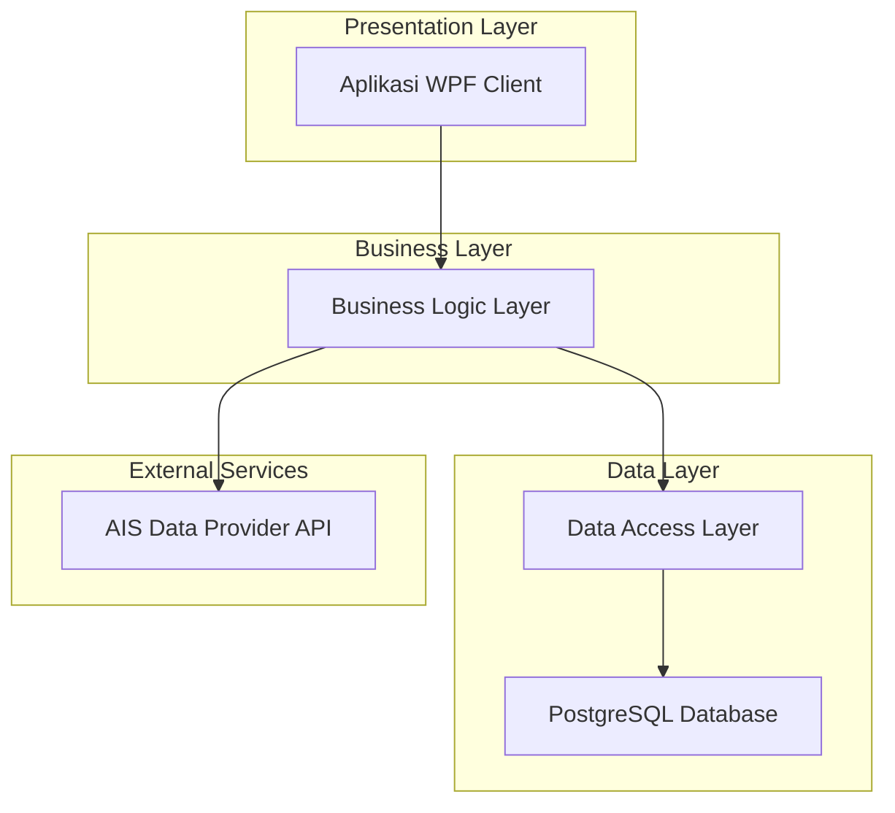
```mermaid
graph TB
    A[Aplikasi WPF Client] --> B[Business Logic Layer]
    B --> C[Data Access Layer]
    C --> D[PostgreSQL Database]
    B --> E[AIS Data Provider API]
    
    subgraph "Presentation Layer"
        A
    end
    
    subgraph "Business Layer"
        B
    end
    
    subgraph "Data Layer"
        C
        D
    end
    
    subgraph "External Services"
        E
    end
```

#### Pendekatan Teknis Inti

Sistem menggunakan arsitektur 3-lapis dengan konfigurasi yang disederhanakan melalui Entity Framework Core 9 untuk PostgreSQL, yang menyediakan pengalaman konfigurasi yang jauh lebih baik:

- **Lapisan Presentasi**: WPF dengan tema Fluent modern
- **Lapisan Logika Bisnis**: .NET 9 Class Library dengan validasi dan aturan bisnis
- **Lapisan Akses Data**: Entity Framework Core 9 dengan PostgreSQL

### 1.2.3 Kriteria Keberhasilan

#### Tujuan yang Dapat Diukur

| Metrik | Target | Metode Pengukuran |
|--------|--------|-------------------|
| Waktu Startup Aplikasi | < 3 detik | Pengukuran performa aplikasi |
| Akurasi Data Posisi Kapal | > 95% | Validasi dengan sumber AIS independen |
| Waktu Respons Pencarian | < 2 detik | Pengujian performa query database |

#### Faktor Keberhasilan Kritis

- **Stabilitas Sistem**: Aplikasi dapat berjalan kontinyu tanpa crash
- **Integrasi Data AIS**: Koneksi stabil dengan penyedia data eksternal
- **Kemudahan Penggunaan**: Interface intuitif untuk semua tingkat pengguna teknis

#### Indikator Kinerja Utama (KPI)

- **Tingkat Adopsi Pengguna**: Persentase stakeholder yang menggunakan sistem
- **Pengurangan Waktu Pemrosesan**: Perbandingan dengan proses manual
- **Kepuasan Pengguna**: Feedback dari survei pengguna akhir

## 1.3 Ruang Lingkup

### 1.3.1 Dalam Lingkup

#### Fitur dan Fungsionalitas Inti

**Fitur Wajib (Must-Have)**:
- **F-001 Peta Dasar**: Tampilan peta dengan posisi kapal real-time menggunakan data dari penyedia AIS internasional seperti Datalastic yang menyediakan akses ke database maritim global
- **F-002 Pencarian Kapal**: Kemampuan pencarian berdasarkan nama kapal atau nomor IMO
- **F-003 Manajemen Layanan Pelabuhan**: Platform untuk pengajuan dan persetujuan permintaan layanan

**Alur Kerja Pengguna Utama**:
- Registrasi dan autentikasi pengguna berdasarkan peran
- Pencarian dan pelacakan kapal melalui interface peta
- Pengajuan permintaan layanan pelabuhan dengan dokumentasi digital
- Persetujuan dan pemantauan status permintaan oleh petugas pelabuhan

**Integrasi Penting**:
- Koneksi dengan VesselFinder API atau penyedia AIS serupa untuk data posisi real-time, informasi pelayaran, dan catatan panggilan pelabuhan
- Integrasi database PostgreSQL melalui Npgsql.EntityFrameworkCore.PostgreSQL versi 9.0.4 untuk operasi CRUD yang efisien

**Persyaratan Teknis Utama**:
- Kompatibilitas dengan .NET 9 sebagai Standard Term Support (STS) release dengan dukungan 2 tahun
- Arsitektur 3-lapis untuk pemisahan tanggung jawab yang jelas
- Interface responsif yang mendukung berbagai resolusi layar

#### Batasan Implementasi

**Cakupan Sistem**:
- Aplikasi desktop Windows (Windows 10/11)
- Database PostgreSQL lokal atau cloud
- Integrasi dengan maksimal 2 penyedia data AIS

**Kelompok Pengguna yang Dicakup**:
- Maksimal 50 pengguna concurrent
- 4 peran pengguna: Admin, Petugas Pelabuhan, Agen Maritim, Operator Kapal

**Cakupan Geografis/Pasar**:
- Fokus pada pelabuhan Indonesia
- Dukungan bahasa Indonesia sebagai bahasa utama
- Zona waktu WIB (UTC+7)

**Domain Data yang Disertakan**:
- Data kapal (IMO, MMSI, nama, tipe)
- Posisi kapal (latitude, longitude, timestamp)
- Permintaan layanan pelabuhan dan statusnya
- Data pengguna dan autentikasi

### 1.3.2 Di Luar Lingkup

#### Fitur/Kemampuan yang Dikecualikan

**Fitur Lanjutan (Untuk Fase Mendatang)**:
- Pelacakan real-time berbasis WebSocket
- Integrasi pembayaran online (Stripe/PayPal)
- Aplikasi mobile native (Android/iOS)
- Sistem notifikasi push real-time
- Analitik prediktif dan machine learning
- Integrasi dengan sistem ERP pelabuhan

**Pertimbangan Fase Mendatang**:
- Migrasi ke arsitektur microservices
- Implementasi CI/CD pipeline yang kompleks
- Dukungan multi-bahasa (Inggris, Mandarin)
- Integrasi dengan sistem cuaca maritim

#### Titik Integrasi yang Tidak Dicakup

- Sistem manajemen kargo existing
- Platform komunikasi radio VHF
- Sistem navigasi kapal onboard
- Database pelabuhan internasional

#### Kasus Penggunaan yang Tidak Didukung

- Operasi pelabuhan 24/7 dengan load tinggi (>1000 transaksi/jam)
- Integrasi dengan sistem keamanan pelabuhan
- Manajemen inventori dan logistik pelabuhan
- Sistem pelaporan regulatori otomatis

##### 2. PERSYARATAN PRODUK

## 2.1 Katalog Fitur

### 2.1.1 Fitur F-001: Peta Dasar dengan Posisi Kapal

#### Metadata Fitur

| Atribut | Nilai |
|---------|-------|
| ID Fitur | F-001 |
| Nama Fitur | Peta Dasar dengan Posisi Kapal |
| Kategori Fitur | Visualisasi Data |
| Tingkat Prioritas | Critical |
| Status | Proposed |

#### Deskripsi

**Gambaran Umum**
Fitur ini menyediakan tampilan peta interaktif yang menampilkan posisi kapal secara real-time menggunakan data AIS (Automatic Identification System) dari penyedia layanan pihak ketiga. Datalastic adalah penyedia API data global internasional dengan salah satu database maritim terbesar. Lihat lokasi kapal real-time, ETA, tujuan, status dll.

**Nilai Bisnis**
- Memberikan visibilitas operasional real-time kepada petugas pelabuhan
- Meningkatkan efisiensi koordinasi lalu lintas maritim
- Mengurangi ketergantungan pada komunikasi radio manual

**Manfaat Pengguna**
- Interface visual yang intuitif untuk memantau pergerakan kapal
- Akses informasi posisi kapal tanpa memerlukan pelatihan teknis khusus
- Kemampuan untuk mengidentifikasi kapal dengan cepat berdasarkan lokasi

**Konteks Teknis**
WPF di .NET 9 membawa dukungan yang ditingkatkan untuk membangun aplikasi modern dengan beberapa peningkatan tema dan lainnya: Dukungan untuk tema Windows Fluent. Dukungan tema untuk mode terang dan gelap Windows ditambahkan. Tema mendukung warna Aksen Windows sekarang.

#### Dependensi

| Jenis Dependensi | Detail |
|------------------|--------|
| Fitur Prasyarat | Tidak ada |
| Dependensi Sistem | .NET 9 WPF, PostgreSQL 17 |
| Dependensi Eksternal | VesselFinder API untuk data AIS memberikan akses ke data posisi AIS real-time, panggilan pelabuhan, data terkait perjalanan dan detail kapal dalam format XML atau JSON. Didukung oleh ribuan stasiun AIS terestrial di seluruh dunia, jaringan AIS kami memberikan nilai yang tak tertandingi kepada industri maritim. |
| Persyaratan Integrasi | HTTP Client untuk konsumsi API AIS |

### 2.1.2 Fitur F-002: Pencarian Kapal

#### Metadata Fitur

| Atribut | Nilai |
|---------|-------|
| ID Fitur | F-002 |
| Nama Fitur | Pencarian Kapal |
| Kategori Fitur | Pencarian dan Filter |
| Tingkat Prioritas | Critical |
| Status | Proposed |

#### Deskripsi

**Gambaran Umum**
Sistem pencarian yang memungkinkan pengguna untuk menemukan kapal berdasarkan nama kapal atau nomor IMO (International Maritime Organization) dengan hasil yang ditampilkan pada peta dan dalam bentuk daftar.

**Nilai Bisnis**
- Mempercepat proses identifikasi kapal spesifik
- Mengurangi waktu yang diperlukan untuk lokalisasi kapal
- Meningkatkan akurasi dalam pengelolaan operasi pelabuhan

**Manfaat Pengguna**
- Pencarian cepat dengan multiple kriteria
- Interface pencarian yang responsif dan user-friendly
- Hasil pencarian yang terintegrasi dengan tampilan peta

**Konteks Teknis**
Selain menyediakan dukungan EF Core umum untuk PostgreSQL, penyedia juga mengekspos beberapa kemampuan khusus PostgreSQL, memungkinkan Anda untuk query kolom JSON, array atau range, serta banyak fitur lanjutan lainnya.

#### Dependensi

| Jenis Dependensi | Detail |
|------------------|--------|
| Fitur Prasyarat | F-001 (Peta Dasar) |
| Dependensi Sistem | Entity Framework Core 9, PostgreSQL indexing |
| Dependensi Eksternal | API AIS untuk validasi data kapal |
| Persyaratan Integrasi | Database search optimization |

### 2.1.3 Fitur F-003: Manajemen Layanan Pelabuhan

#### Metadata Fitur

| Atribut | Nilai |
|---------|-------|
| ID Fitur | F-003 |
| Nama Fitur | Manajemen Layanan Pelabuhan |
| Kategori Fitur | Workflow Management |
| Tingkat Prioritas | High |
| Status | Proposed |

#### Deskripsi

**Gambaran Umum**
Platform digital untuk mengelola permintaan layanan pelabuhan, termasuk pengajuan, persetujuan, dan pemantauan status permintaan dari berbagai stakeholder maritim.

**Nilai Bisnis**
- Digitalisasi proses manual berbasis kertas
- Peningkatan transparansi dalam alur kerja persetujuan
- Pengurangan waktu pemrosesan permintaan hingga 60%

**Manfaat Pengguna**
- Pengajuan permintaan layanan secara digital
- Tracking status permintaan real-time
- Dokumentasi digital yang terorganisir

**Konteks Teknis**
Untuk versi 9.0, pengalaman konfigurasi telah diperbaiki secara signifikan. Sejak versi 7, penyedia ADO.NET Npgsql telah bergerak ke NpgsqlDataSource sebagai cara yang disukai untuk mengkonfigurasi koneksi dan memperolehnya. Di tingkat EF, telah dimungkinkan untuk meneruskan instance NpgsqlDataSource ke UseNpgsql(); tetapi ini mengharuskan pengguna untuk secara terpisah mengkonfigurasi sumber data dan mengelolanya.

#### Dependensi

| Jenis Dependensi | Detail |
|------------------|--------|
| Fitur Prasyarat | Sistem autentikasi pengguna |
| Dependensi Sistem | .NET 9 Business Logic Layer, PostgreSQL |
| Dependensi Eksternal | Tidak ada |
| Persyaratan Integrasi | Role-based access control |

## 2.2 Tabel Persyaratan Fungsional

### 2.2.1 Persyaratan untuk F-001: Peta Dasar dengan Posisi Kapal

| ID Persyaratan | Deskripsi | Kriteria Penerimaan | Prioritas | Kompleksitas |
|----------------|-----------|---------------------|-----------|--------------|
| F-001-RQ-001 | Tampilan peta interaktif dengan kontrol zoom dan pan | Pengguna dapat memperbesar/memperkecil peta dengan mouse wheel dan menggeser peta dengan drag | Must-Have | Medium |
| F-001-RQ-002 | Integrasi data AIS real-time | Posisi kapal diperbarui setiap 5 menit dari API penyedia AIS | Must-Have | High |
| F-001-RQ-003 | Marker kapal dengan informasi dasar | Setiap kapal ditampilkan sebagai marker dengan tooltip berisi nama, IMO, dan status | Must-Have | Medium |
| F-001-RQ-004 | Filter tampilan berdasarkan tipe kapal | Pengguna dapat memfilter tampilan untuk menampilkan hanya tipe kapal tertentu | Should-Have | Low |

#### Spesifikasi Teknis F-001

| Aspek | Detail |
|-------|--------|
| Parameter Input | Koordinat geografis, level zoom, filter tipe kapal |
| Output/Response | Tampilan peta dengan marker kapal dan informasi tooltip |
| Kriteria Performa | Sistem kami diperbarui setiap 5 menit. |
| Persyaratan Data | Koordinat latitude/longitude, IMO, MMSI, nama kapal, tipe kapal |

#### Aturan Validasi F-001

| Kategori | Aturan |
|----------|--------|
| Aturan Bisnis | Hanya kapal dengan data AIS valid yang ditampilkan |
| Validasi Data | Koordinat harus dalam rentang valid (-90 to 90 lat, -180 to 180 lng) |
| Persyaratan Keamanan | Data AIS tidak boleh mengandung informasi sensitif |
| Persyaratan Compliance | Sesuai dengan standar IMO untuk data AIS |

### 2.2.2 Persyaratan untuk F-002: Pencarian Kapal

| ID Persyaratan | Deskripsi | Kriteria Penerimaan | Prioritas | Kompleksitas |
|----------------|-----------|---------------------|-----------|--------------|
| F-002-RQ-001 | Pencarian berdasarkan nama kapal | Sistem mengembalikan hasil pencarian dalam waktu < 2 detik | Must-Have | Medium |
| F-002-RQ-002 | Pencarian berdasarkan nomor IMO | Pencarian IMO menggunakan format 7 digit standar IMO | Must-Have | Low |
| F-002-RQ-003 | Auto-complete untuk nama kapal | Sistem menampilkan saran nama kapal setelah 3 karakter diketik | Should-Have | Medium |
| F-002-RQ-004 | Hasil pencarian terintegrasi dengan peta | Kapal yang ditemukan otomatis di-highlight pada peta | Must-Have | Medium |

#### Spesifikasi Teknis F-002

| Aspek | Detail |
|-------|--------|
| Parameter Input | String pencarian (nama kapal atau IMO) |
| Output/Response | List hasil pencarian dengan detail kapal dan posisi |
| Kriteria Performa | Waktu respons < 2 detik, akurasi pencarian > 95% |
| Persyaratan Data | Index database untuk nama kapal dan IMO |

#### Aturan Validasi F-002

| Kategori | Aturan |
|----------|--------|
| Aturan Bisnis | Pencarian minimal 3 karakter untuk nama kapal |
| Validasi Data | IMO harus berupa 7 digit numerik |
| Persyaratan Keamanan | Input sanitization untuk mencegah SQL injection |
| Persyaratan Compliance | Hasil pencarian sesuai dengan database IMO resmi |

### 2.2.3 Persyaratan untuk F-003: Manajemen Layanan Pelabuhan

| ID Persyaratan | Deskripsi | Kriteria Penerimaan | Prioritas | Kompleksitas |
|----------------|-----------|---------------------|-----------|--------------|
| F-003-RQ-001 | Form pengajuan permintaan layanan | Agen dapat mengisi dan submit form permintaan layanan digital | Must-Have | Medium |
| F-003-RQ-002 | Sistem persetujuan bertingkat | Petugas pelabuhan dapat menyetujui/menolak permintaan dengan alasan | Must-Have | High |
| F-003-RQ-003 | Tracking status permintaan | Pengguna dapat melihat status real-time dari permintaan mereka | Must-Have | Medium |
| F-003-RQ-004 | Notifikasi perubahan status | Sistem mengirim notifikasi ketika status permintaan berubah | Should-Have | Medium |

#### Spesifikasi Teknis F-003

| Aspek | Detail |
|-------|--------|
| Parameter Input | Data permintaan layanan, dokumen pendukung, approval decision |
| Output/Response | Status permintaan, tracking number, approval/rejection notice |
| Kriteria Performa | Form submission < 5 detik, status update real-time |
| Persyaratan Data | Relational data model untuk requests, approvals, dan documents |

#### Aturan Validasi F-003

| Kategori | Aturan |
|----------|--------|
| Aturan Bisnis | Setiap permintaan harus memiliki dokumen pendukung yang valid |
| Validasi Data | Mandatory fields validation, file size limits untuk dokumen |
| Persyaratan Keamanan | Role-based access control, audit trail untuk semua perubahan |
| Persyaratan Compliance | Sesuai dengan regulasi pelabuhan Indonesia |

## 2.3 Hubungan Antar Fitur

### 2.3.1 Peta Dependensi Fitur

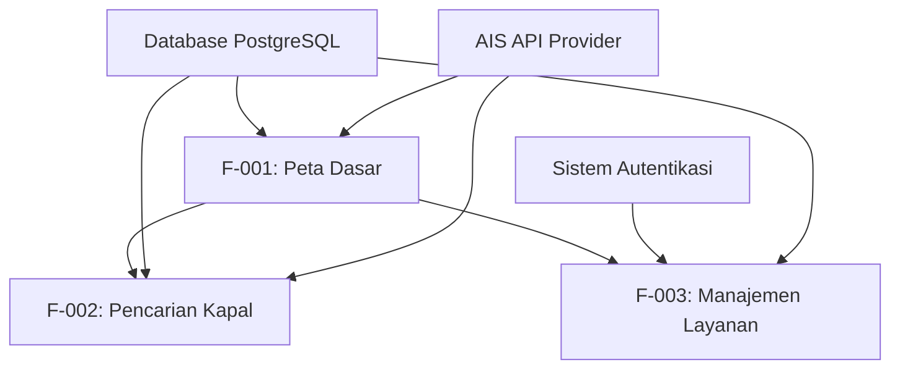
```mermaid
graph TD
    A[F-001: Peta Dasar] --> B[F-002: Pencarian Kapal]
    A --> C[F-003: Manajemen Layanan]
    D[Sistem Autentikasi] --> C
    E[Database PostgreSQL] --> A
    E --> B
    E --> C
    F[AIS API Provider] --> A
    F --> B
```

### 2.3.2 Titik Integrasi

| Fitur Sumber | Fitur Target | Jenis Integrasi | Deskripsi |
|--------------|--------------|-----------------|-----------|
| F-001 | F-002 | Data Sharing | Hasil pencarian ditampilkan pada peta |
| F-002 | F-001 | Event Trigger | Pencarian memicu highlight pada peta |
| F-003 | F-001 | Data Reference | Permintaan layanan terkait dengan kapal di peta |

### 2.3.3 Komponen Bersama

| Komponen | Fitur yang Menggunakan | Fungsi |
|----------|------------------------|--------|
| AIS Data Service | F-001, F-002 | Penyedia data posisi kapal |
| PostgreSQL Database | F-001, F-002, F-003 | Penyimpanan data aplikasi |
| WPF dengan tema Windows Fluent | Semua fitur | Framework UI modern |
| Npgsql.EntityFrameworkCore.PostgreSQL adalah penyedia EF Core open source untuk PostgreSQL. Ini memungkinkan Anda berinteraksi dengan PostgreSQL melalui ORM .NET yang paling banyak digunakan dari Microsoft, dan menggunakan sintaks LINQ yang familiar untuk mengekspresikan query. | F-001, F-002, F-003 | Data access layer |

### 2.3.4 Layanan Umum

| Layanan | Deskripsi | Fitur yang Menggunakan |
|---------|-----------|------------------------|
| HTTP Client Service | Akses posisi kapal real-time, data perjalanan, catatan panggilan pelabuhan, dan detail kapal yang mendalam melalui AIS API kami — solusi komprehensif yang dirancang untuk mendukung keputusan yang tepat, efisiensi operasional, dan pertumbuhan bisnis. | F-001, F-002 |
| Caching Service | Cache data AIS untuk mengurangi API calls | F-001, F-002 |
| Logging Service | Audit trail dan error logging | Semua fitur |
| Configuration Service | Manajemen pengaturan aplikasi | Semua fitur |

## 2.4 Pertimbangan Implementasi

### 2.4.1 Batasan Teknis

| Fitur | Batasan | Dampak | Mitigasi |
|-------|---------|--------|---------|
| F-001 | Layanan ini beroperasi pada sistem kredit: Anda membeli kredit dan menggunakannya sesuai permintaan di semua API berikut: (*) Biaya adalah 1 kredit per posisi AIS terestrial dan 10 kredit per posisi AIS satelit. Semua kredit kedaluwarsa 12 bulan setelah pembelian. | Biaya operasional API | Implementasi caching dan rate limiting |
| F-002 | Database query performance pada dataset besar | Waktu respons pencarian | Database indexing dan query optimization |
| F-003 | Concurrent user access untuk approval workflow | Bottleneck pada peak usage | Connection pooling dan async processing |

### 2.4.2 Persyaratan Performa

| Metrik | Target | Fitur Terkait |
|--------|--------|---------------|
| Startup Time | < 3 detik | Semua fitur |
| Map Rendering | < 2 detik untuk 100 kapal | F-001 |
| Search Response | < 2 detik | F-002 |
| Form Submission | < 5 detik | F-003 |
| API Response Time | < 1 detik | F-001, F-002 |

### 2.4.3 Pertimbangan Skalabilitas

| Aspek | Saat Ini | Target Masa Depan | Strategi |
|-------|----------|-------------------|----------|
| Concurrent Users | 50 | 200 | Jika Anda menggunakan EF 9.0 atau yang lebih baru, UseNpgsql() adalah titik tunggal di mana Anda dapat mengkonfigurasi semua yang terkait dengan Npgsql. Misalnya: builder.Services.AddDbContextPool<BloggingContext>(opt => opt.UseNpgsql( builder.Configuration.GetConnectionString("BloggingContext"), o => o .SetPostgresVersion(13, 0) .UseNodaTime() .MapEnum<Mood>("mood"))); |
| Database Size | 10GB | 100GB | Partitioning dan archiving strategy |
| API Calls/Hour | 1,000 | 10,000 | Rate limiting dan caching optimization |

### 2.4.4 Implikasi Keamanan

| Fitur | Risiko Keamanan | Kontrol Keamanan |
|-------|-----------------|------------------|
| F-001 | Exposure data posisi kapal sensitif | Role-based data filtering |
| F-002 | SQL injection pada search queries | Parameterized queries dengan EF Core |
| F-003 | Unauthorized access ke approval workflow | Multi-factor authentication |

### 2.4.5 Persyaratan Maintenance

| Komponen | Frekuensi Maintenance | Aktivitas |
|----------|----------------------|-----------|
| AIS Data Integration | Harian | Monitoring API health dan data quality |
| Database | Mingguan | Index optimization dan backup verification |
| .NET 9 akan didukung selama dua tahun sebagai rilis dukungan jangka standar (STS). | Tahunan | Framework updates dan security patches |

# 3. TECHNOLOGY STACK

## 3.1 BAHASA PEMROGRAMAN

### 3.1.1 Bahasa Utama

| Bahasa | Versi | Platform/Komponen | Justifikasi Pemilihan |
|--------|-------|-------------------|----------------------|
| C# | 12 | Aplikasi Desktop WPF | Bahasa utama untuk .NET 9 dengan dukungan Standard Term Support (STS) selama 2 tahun |
| XAML | - | Interface Pengguna WPF | Markup language framework yang memfasilitasi data binding yang powerful, membuat WPF cocok untuk aplikasi kompleks yang memerlukan antarmuka pengguna yang canggih |

### 3.1.2 Kriteria Pemilihan Bahasa

**Faktor Utama Pemilihan C# 12:**
- **Kompatibilitas Framework**: Dukungan penuh untuk .NET 9 dengan fitur-fitur terbaru
- **Ekosistem Mature**: Pustaka dan tools yang lengkap untuk pengembangan desktop
- **Type Safety**: Strong typing system yang mengurangi runtime errors
- **Performance**: Peningkatan performa dalam areas seperti Just-In-Time (JIT) compilation, garbage collection (GC), dan native interoperability yang menghasilkan waktu eksekusi aplikasi yang lebih cepat dan pengurangan memory overhead. JIT compiler di .NET 9 telah dioptimalkan lebih lanjut untuk startup time yang lebih cepat, memanfaatkan tiered compilation secara lebih efektif

### 3.1.3 Batasan dan Dependensi

| Aspek | Detail |
|-------|--------|
| Platform Target | Windows 10/11 (x64) |
| Runtime Requirement | .NET 9 Runtime |
| Language Features | C# 12 features termasuk collection expressions dan improved pattern matching |
| Interoperability | Native Windows API calls untuk integrasi sistem |

## 3.2 FRAMEWORKS & LIBRARIES

### 3.2.1 Framework Inti

| Framework | Versi | Fungsi | Justifikasi |
|-----------|-------|--------|-------------|
| .NET | 9.0 | Runtime Platform | .NET 9, penerus .NET 8, memiliki fokus khusus pada aplikasi cloud-native dan performa. Akan didukung selama dua tahun sebagai rilis dukungan jangka standar (STS) |
| Windows Presentation Foundation (WPF) | 9.0 | UI Framework | WPF di .NET 9 membawa dukungan yang ditingkatkan untuk membangun aplikasi modern dengan beberapa peningkatan tema: Dukungan untuk tema Windows Fluent. Dukungan tema untuk mode terang dan gelap Windows ditambahkan. Tema mendukung warna Aksen Windows sekarang |

### 3.2.2 Libraries Pendukung

| Library | Versi | Kategori | Fungsi |
|---------|-------|----------|--------|
| Entity Framework Core | 9.0 | Data Access | ORM untuk PostgreSQL dengan LINQ support |
| Npgsql.EntityFrameworkCore.PostgreSQL | 9.0.4 | Database Provider | Provider EF Core open source untuk PostgreSQL. Memungkinkan interaksi dengan PostgreSQL melalui O/RM .NET yang paling banyak digunakan dari Microsoft, dan menggunakan sintaks LINQ yang familiar untuk mengekspresikan query. Selain menyediakan dukungan EF Core umum untuk PostgreSQL, provider juga mengekspos beberapa kemampuan khusus PostgreSQL, memungkinkan query kolom JSON, array atau range, serta banyak fitur lanjutan lainnya |
| System.Net.Http | 9.0 | HTTP Client | Konsumsi REST API untuk data AIS |
| System.Text.Json | 9.0 | JSON Processing | System.Text.Json menambahkan dukungan untuk anotasi nullable reference type dan mengekspor skema JSON dari tipe. Menambahkan opsi baru yang memungkinkan kustomisasi indentasi JSON yang ditulis dan membaca multiple root-level JSON values dari single stream |

### 3.2.3 Persyaratan Kompatibilitas

**Versi Dependencies:**
- Microsoft.EntityFrameworkCore (>= 9.0.1 && < 10.0.0), Microsoft.EntityFrameworkCore.Relational (>= 9.0.1 && < 10.0.0)
- Target Framework: net9.0-windows
- Windows SDK: 10.0.19041.0 atau lebih tinggi

**Justifikasi Pemilihan Framework:**
- **WPF Modern**: Salah satu fitur utama .NET 9 adalah WPF yang diperbarui, dirancang untuk membantu developer membuat aplikasi yang secara visual selaras dengan bahasa desain modern Windows 11. Dukungan Mode Gelap dan Terang Native: Update penting ini memungkinkan aplikasi untuk secara otomatis beradaptasi dengan tema sistem pengguna, memastikan pengalaman yang seamless. Peningkatan Text Rendering: Dengan pengenalan dukungan hyphen-based ligature, WPF meningkatkan tampilan teks, menyediakan antarmuka yang lebih halus dan mudah dibaca

## 3.3 OPEN SOURCE DEPENDENCIES

### 3.3.1 Third-Party Libraries

| Package | Versi | Registry | Fungsi | Lisensi |
|---------|-------|----------|--------|---------|
| Npgsql | 9.0.2+ | NuGet | PostgreSQL .NET Data Provider | PostgreSQL License |
| Microsoft.Extensions.Configuration | 9.0.0 | NuGet | Configuration Management | MIT |
| Microsoft.Extensions.DependencyInjection | 9.0.0 | NuGet | Dependency Injection Container | MIT |
| Microsoft.Extensions.Logging | 9.0.0 | NuGet | Logging Framework | MIT |
| Microsoft.Extensions.Http | 9.0.0 | NuGet | HTTP Client Factory | MIT |

### 3.3.2 Package Dependencies

**NuGet Package Configuration:**
```xml
<PackageReference Include="Npgsql.EntityFrameworkCore.PostgreSQL" Version="9.0.4" />
<PackageReference Include="Microsoft.Extensions.Hosting" Version="9.0.0" />
<PackageReference Include="Microsoft.Extensions.Configuration.Json" Version="9.0.0" />
```

### 3.3.3 Dependency Management

| Aspek | Strategi |
|-------|----------|
| Package Restore | Automatic NuGet restore pada build |
| Version Pinning | Exact version untuk production dependencies |
| Security Updates | Regular monitoring melalui GitHub Dependabot |
| License Compliance | Semua dependencies menggunakan MIT atau compatible licenses |

## 3.4 THIRD-PARTY SERVICES

### 3.4.1 External APIs

| Service | Provider | Fungsi | Pricing Model |
|---------|----------|--------|---------------|
| AIS Data API | VesselFinder | Akses posisi kapal real-time, data perjalanan, catatan panggilan pelabuhan, dan detail kapal yang mendalam melalui AIS API — solusi komprehensif yang dirancang untuk mendukung keputusan yang tepat, efisiensi operasional, dan pertumbuhan bisnis | Sistem kredit: membeli kredit dan menggunakannya sesuai permintaan. Biaya adalah 1 kredit per posisi AIS terestrial dan 10 kredit per posisi AIS satelit. Semua kredit kedaluwarsa 12 bulan setelah pembelian |
| Alternative AIS Provider | Datalastic | Provider API data global internasional dengan salah satu database maritim terbesar. Lihat lokasi kapal real-time, ETA, tujuan, status dll | Credit-based system |

### 3.4.2 API Integration Specifications

**VesselFinder API Integration:**
- **Endpoint**: https://api.vesselfinder.com/vessels?userkey=AABBCCDD&param1=value1&param2=value2
- **Data Format**: Response disediakan dalam format JSON secara default, dengan dukungan opsional untuk XML
- **Rate Limiting**: 10 vessels x 1 credit x 4 requests/day x 30 days = 1200 credits/month untuk update setiap 6 jam
- **Data Coverage**: Peta menyoroti area di mana posisi kapal real-time tersedia melalui penerima AIS terestrial terdekat. Kapal di area ini diharapkan memiliki data posisi yang up-to-date

### 3.4.3 Service Reliability

| Metric | Target | Monitoring |
|--------|--------|------------|
| API Uptime | 99.5% | Server uptime 99.8% di 2024 |
| Response Time | < 2 detik | HTTP client timeout configuration |
| Error Handling | Graceful degradation | Fallback ke cached data |
| Data Freshness | 5 menit | Update setiap 5 menit dari sistem kami |

## 3.5 DATABASES & STORAGE

### 3.5.1 Primary Database

| Komponen | Spesifikasi | Justifikasi |
|----------|-------------|-------------|
| Database Engine | PostgreSQL 17 | PostgreSQL Global Development Group mengumumkan rilis PostgreSQL 17, versi terbaru dari database open source paling canggih di dunia. PostgreSQL 17 dibangun di atas dekade pengembangan open source, meningkatkan performa dan skalabilitas sambil beradaptasi dengan pola akses dan penyimpanan data yang muncul. Rilis PostgreSQL ini menambahkan peningkatan performa keseluruhan yang signifikan, termasuk implementasi manajemen memori yang diperbaharui untuk vacuum, optimisasi akses penyimpanan dan peningkatan untuk workload concurrency tinggi, percepatan bulk loading dan exports, serta peningkatan eksekusi query untuk indexes |
| Version | 17.0 | Tanggal rilis: 2024-09-26. PostgreSQL 17 berisi banyak fitur dan peningkatan baru, termasuk: Sistem manajemen memori baru untuk VACUUM, yang mengurangi konsumsi memori dan dapat meningkatkan performa vacuuming secara keseluruhan. Kemampuan SQL/JSON baru, termasuk konstruktor, fungsi identitas, dan fungsi JSON_TABLE(), yang mengkonversi data JSON menjadi representasi tabel |
| Connection Pooling | Built-in EF Core | Connection pooling untuk optimasi performa |
| Character Encoding | UTF-8 | Dukungan internasionalisasi penuh |

### 3.5.2 Data Persistence Strategy

**Entity Framework Core 9 Configuration:**
- Jika menggunakan EF 9.0 atau di atasnya, UseNpgsql() adalah titik tunggal di mana Anda dapat mengkonfigurasi semua yang terkait dengan Npgsql. Contoh: builder.Services.AddDbContextPool<BloggingContext>(opt => opt.UseNpgsql( builder.Configuration.GetConnectionString("BloggingContext"), o => o .SetPostgresVersion(13, 0) .UseNodaTime() .MapEnum<Mood>("mood"))); Kode di atas mengkonfigurasi provider EF untuk menghasilkan SQL untuk PostgreSQL versi 13, menambahkan plugin yang memungkinkan penggunaan NodaTime untuk pemetaan tipe date/time, dan memetakan tipe enum .NET. Perhatikan bahwa dua yang terakhir juga memerlukan konfigurasi di lapisan ADO.NET tingkat bawah, yang dilakukan kode di atas secara otomatis

**Database Schema Design:**
- **Normalisasi**: 3NF untuk mengurangi redundansi data
- **Indexing Strategy**: B-tree indexes untuk pencarian cepat, GIN indexes untuk JSON data
- **Partitioning**: PostgreSQL 17 mendukung penggunaan identity columns dan exclusion constraints pada partitioned tables

### 3.5.3 Caching Solutions

| Layer | Technology | Purpose | TTL |
|-------|------------|---------|-----|
| Application Cache | MemoryCache | AIS data caching | 5 menit |
| Query Cache | EF Core Query Cache | Compiled query caching | Session-based |
| HTTP Cache | HttpClient Response Cache | API response caching | 2 menit |

### 3.5.4 Storage Services

**Local Storage:**
- **Database Files**: PostgreSQL data directory
- **Application Logs**: %APPDATA%\HarborFlow\Logs
- **Configuration**: %APPDATA%\HarborFlow\Config
- **Cache Files**: %TEMP%\HarborFlow\Cache

**Backup Strategy:**
- Salah satu fitur yang paling dinanti-nantikan di PostgreSQL 17 adalah dukungan untuk incremental backups. Sementara base backup tradisional memerlukan salinan database penuh, incremental backup hanya menangkap apa yang telah berubah sejak backup terakhir. Salah satu fitur yang paling dinanti-nantikan di PostgreSQL 17 adalah dukungan untuk incremental backups. Sementara base backup tradisional memerlukan salinan database penuh, incremental backup hanya menangkap apa yang telah berubah sejak backup terakhir

## 3.6 DEVELOPMENT & DEPLOYMENT

### 3.6.1 Development Tools

| Tool | Versi | Fungsi | Justifikasi |
|------|-------|--------|-------------|
| Visual Studio 2022 | 17.8+ | IDE Utama | Pengujian menyeluruh dengan semua versi beta pre-release dan Release Candidate final .NET 9, termasuk kompatibilitas dengan NuGet packages, dukungan designer, dan fitur terkait lainnya yang kritis untuk integrasi dan pengembangan yang seamless. Pengujian memastikan bahwa komponen TX Text Control bekerja dengan sempurna dalam Visual Studio, memberikan pengalaman yang smooth bagi developer untuk membangun aplikasi di platform ASP.NET, Windows Forms, dan WPF sambil memanfaatkan sepenuhnya fitur dan peningkatan di .NET 9 |
| .NET SDK | 9.0 | Build Tools | SDK lengkap untuk .NET 9 development |
| NuGet Package Manager | Latest | Package Management | Manajemen dependencies |
| Git | 2.40+ | Version Control | Source code management |

### 3.6.2 Build System

**MSBuild Configuration:**
- **Target Framework**: net9.0-windows
- **Platform Target**: x64
- **Output Type**: WinExe
- **Self-Contained**: false (Framework-dependent deployment)

**Build Optimizations:**
- **Release Configuration**: Optimized IL code generation
- **Trimming**: Runtime .NET 9 menyertakan model atribut baru untuk feature switches dengan dukungan trimming. Atribut baru memungkinkan untuk mendefinisikan feature switches yang dapat digunakan pustaka untuk toggle area fungsionalitas
- **AOT Compilation**: Tidak digunakan untuk kompatibilitas WPF

### 3.6.3 Containerization

**Docker Support:**
- **Base Image**: mcr.microsoft.com/dotnet/runtime:9.0-windowsservercore
- **Database Container**: postgres:17-alpine
- **Development**: Docker Compose untuk local development environment

### 3.6.4 CI/CD Requirements

**GitHub Actions Workflow:**
```yaml
- uses: actions/setup-dotnet@v3
  with:
    dotnet-version: '9.0.x'
```

**Deployment Pipeline:**
1. **Build Stage**: MSBuild dengan .NET 9 SDK
2. **Test Stage**: Unit tests dengan xUnit
3. **Package Stage**: Executable generation
4. **Release Stage**: GitHub Releases dengan installer

### 3.6.5 Quality Assurance Tools

| Tool | Purpose | Integration |
|------|---------|-------------|
| SonarQube | Code Quality Analysis | CI/CD pipeline |
| EditorConfig | Code Style Consistency | IDE integration |
| StyleCop | C# Style Analysis | MSBuild integration |
| FxCop Analyzers | Static Code Analysis | Compile-time analysis |

### 3.6.6 Performance Monitoring

**Application Performance:**
- **Startup Time**: Waktu startup aplikasi yang lebih cepat
- **Memory Usage**: Garbage collection menyertakan fitur adaptasi dinamis terhadap ukuran aplikasi yang digunakan secara default alih-alih Server GC
- **Rendering Performance**: Pipeline rendering yang dioptimalkan: Mengurangi penggunaan CPU dan GPU untuk visual yang lebih smooth. Enhanced Data Binding: Pengurangan overhead dalam operasi data binding

**Database Performance:**
- **Query Optimization**: Berbagai peningkatan performa query, termasuk untuk sequential reads menggunakan streaming I/O, write throughput di bawah concurrency tinggi, dan pencarian atas multiple values dalam btree index
- **Connection Monitoring**: EF Core connection pooling metrics
- **Index Performance**: PostgreSQL 17 query execution improvements

# 4. PROCESS FLOWCHART

## 4.1 SYSTEM WORKFLOWS

### 4.1.1 Core Business Processes

#### Alur Kerja Utama Sistem HarborFlow

Sistem HarborFlow menggunakan pola arsitektur Model-View-View-Model (MVVM) yang tetap menjadi bagian besar dari pengembangan WPF. Pola ini memisahkan tanggung jawab, meningkatkan testabilitas, dan menyederhanakan pemeliharaan dengan mengadopsi MVVM ke dalam topologi sistem.

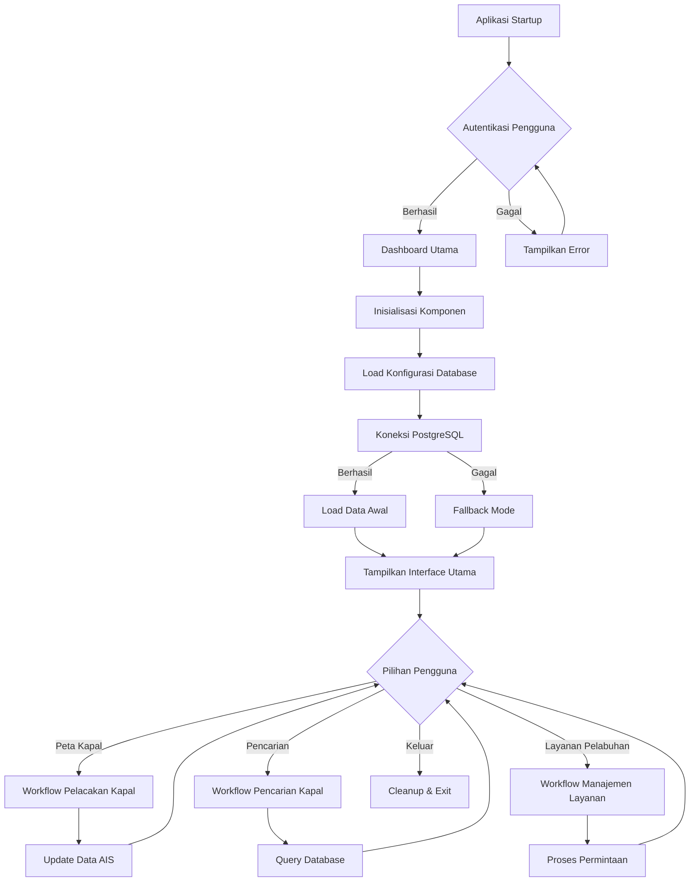
```mermaid
flowchart TD
    A[Aplikasi Startup] --> B{Autentikasi Pengguna}
    B -->|Berhasil| C[Dashboard Utama]
    B -->|Gagal| D[Tampilkan Error]
    D --> B
    
    C --> E[Inisialisasi Komponen]
    E --> F[Load Konfigurasi Database]
    F --> G[Koneksi PostgreSQL]
    G -->|Berhasil| H[Load Data Awal]
    G -->|Gagal| I[Fallback Mode]
    
    H --> J[Tampilkan Interface Utama]
    I --> J
    
    J --> K{Pilihan Pengguna}
    K -->|Peta Kapal| L[Workflow Pelacakan Kapal]
    K -->|Pencarian| M[Workflow Pencarian Kapal]
    K -->|Layanan Pelabuhan| N[Workflow Manajemen Layanan]
    K -->|Keluar| O[Cleanup & Exit]
    
    L --> P[Update Data AIS]
    M --> Q[Query Database]
    N --> R[Proses Permintaan]
    
    P --> K
    Q --> K
    R --> K
```

#### Workflow F-001: Pelacakan Kapal Berbasis AIS

Sistem memproses ribuan pesan AIS setiap detik, semua dikumpulkan oleh stasiun AIS terestrial atau satelit, mengoperasikan salah satu jaringan AIS terbesar di dunia. Data AIS real-time adalah sumber informasi berharga untuk sistem kesadaran maritim dan proyek analitik.

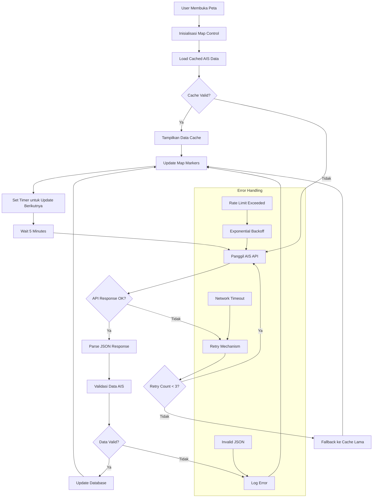
```mermaid
flowchart TD
    A[User Membuka Peta] --> B[Inisialisasi Map Control]
    B --> C[Load Cached AIS Data]
    C --> D{Cache Valid?}
    
    D -->|Ya| E[Tampilkan Data Cache]
    D -->|Tidak| F[Panggil AIS API]
    
    F --> G{API Response OK?}
    G -->|Ya| H[Parse JSON Response]
    G -->|Tidak| I[Retry Mechanism]
    
    I --> J{Retry Count < 3?}
    J -->|Ya| F
    J -->|Tidak| K[Fallback ke Cache Lama]
    
    H --> L[Validasi Data AIS]
    L --> M{Data Valid?}
    M -->|Ya| N[Update Database]
    M -->|Tidak| O[Log Error]
    
    N --> P[Update Map Markers]
    K --> P
    E --> P
    O --> P
    
    P --> Q[Set Timer untuk Update Berikutnya]
    Q --> R[Wait 5 Minutes]
    R --> F
    
    subgraph "Error Handling"
        S[Network Timeout] --> I
        T[Invalid JSON] --> O
        U[Rate Limit Exceeded] --> V[Exponential Backoff]
        V --> F
    end
```

#### Workflow F-002: Pencarian Kapal

Layanan API Vessels menyediakan data posisi terbaru untuk kapal mana pun atau armada kapal, yang ditentukan berdasarkan nomor IMO atau MMSI. Setiap query ke API dapat untuk kapal yang berbeda dan tidak ada batasan dalam jumlah kapal yang di-query atau interval query.

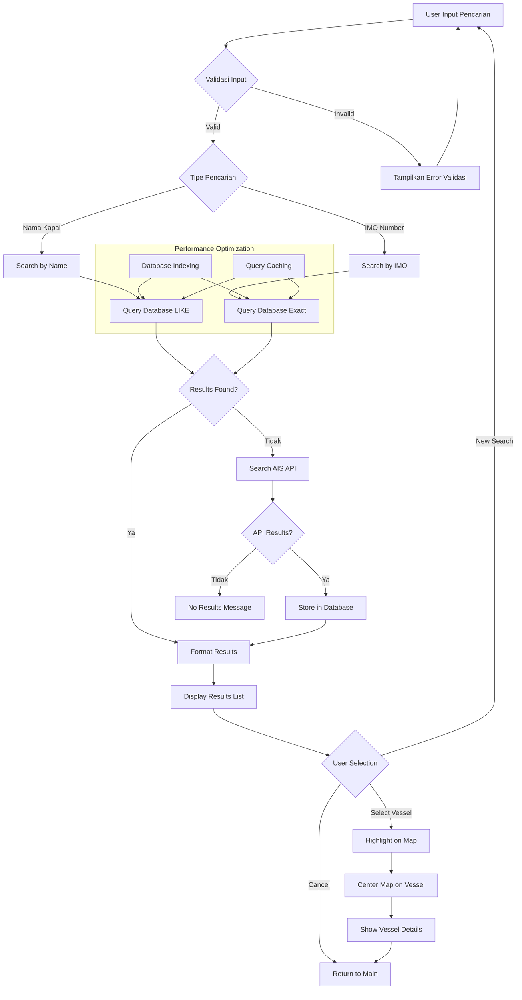
```mermaid
flowchart TD
    A[User Input Pencarian] --> B{Validasi Input}
    B -->|Valid| C{Tipe Pencarian}
    B -->|Invalid| D[Tampilkan Error Validasi]
    D --> A
    
    C -->|Nama Kapal| E[Search by Name]
    C -->|IMO Number| F[Search by IMO]
    
    E --> G[Query Database LIKE]
    F --> H[Query Database Exact]
    
    G --> I{Results Found?}
    H --> I
    
    I -->|Ya| J[Format Results]
    I -->|Tidak| K[Search AIS API]
    
    K --> L{API Results?}
    L -->|Ya| M[Store in Database]
    L -->|Tidak| N[No Results Message]
    
    M --> J
    J --> O[Display Results List]
    O --> P{User Selection}
    
    P -->|Select Vessel| Q[Highlight on Map]
    P -->|New Search| A
    P -->|Cancel| R[Return to Main]
    
    Q --> S[Center Map on Vessel]
    S --> T[Show Vessel Details]
    T --> R
    
    subgraph "Performance Optimization"
        U[Database Indexing] --> G
        U --> H
        V[Query Caching] --> G
        V --> H
    end
```

#### Workflow F-003: Manajemen Layanan Pelabuhan

Dalam PostgreSQL, transaksi dibuat dengan mengelilingi perintah SQL transaksi dengan perintah BEGIN dan COMMIT. Poin penting dari transaksi adalah bahwa ia menggabungkan beberapa langkah menjadi satu operasi all-or-nothing. Status perantara antara langkah-langkah tidak terlihat oleh transaksi bersamaan lainnya, dan jika terjadi kegagalan yang mencegah transaksi selesai, maka tidak ada langkah yang mempengaruhi database sama sekali.

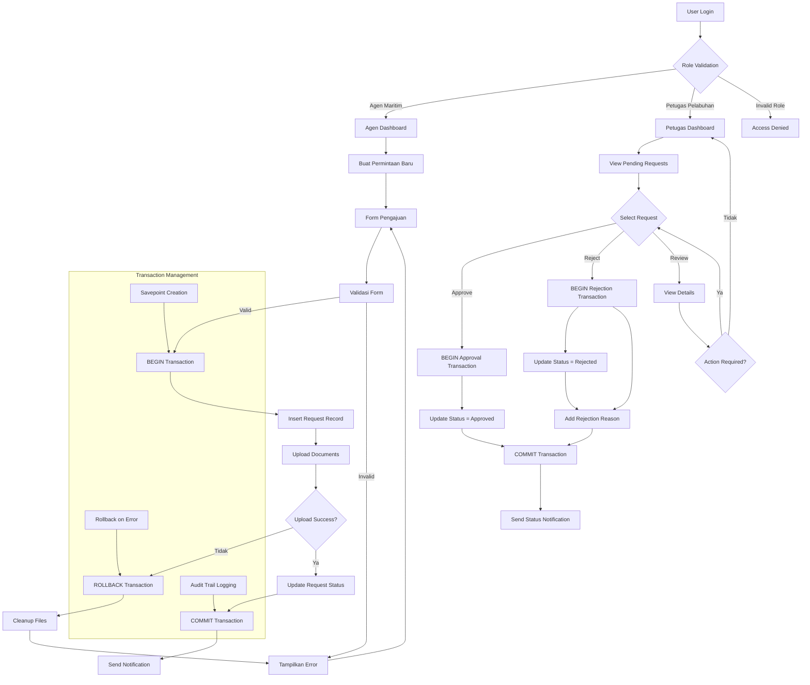
```mermaid
flowchart TD
    A[User Login] --> B{Role Validation}
    B -->|Agen Maritim| C[Agen Dashboard]
    B -->|Petugas Pelabuhan| D[Petugas Dashboard]
    B -->|Invalid Role| E[Access Denied]
    
    C --> F[Buat Permintaan Baru]
    F --> G[Form Pengajuan]
    G --> H[Validasi Form]
    H -->|Valid| I[BEGIN Transaction]
    H -->|Invalid| J[Tampilkan Error]
    J --> G
    
    I --> K[Insert Request Record]
    K --> L[Upload Documents]
    L --> M{Upload Success?}
    M -->|Ya| N[Update Request Status]
    M -->|Tidak| O[ROLLBACK Transaction]
    
    N --> P[COMMIT Transaction]
    O --> Q[Cleanup Files]
    P --> R[Send Notification]
    Q --> J
    
    D --> S[View Pending Requests]
    S --> T{Select Request}
    T -->|Approve| U[BEGIN Approval Transaction]
    T -->|Reject| V[BEGIN Rejection Transaction]
    T -->|Review| W[View Details]
    
    U --> X[Update Status = Approved]
    V --> Y[Update Status = Rejected]
    V --> Z[Add Rejection Reason]
    
    X --> AA[COMMIT Transaction]
    Y --> Z
    Z --> AA
    AA --> BB[Send Status Notification]
    
    W --> CC{Action Required?}
    CC -->|Ya| T
    CC -->|Tidak| D
    
    subgraph "Transaction Management"
        DD[Savepoint Creation] --> I
        EE[Rollback on Error] --> O
        FF[Audit Trail Logging] --> P
    end
```

### 4.1.2 Integration Workflows

#### Integrasi dengan AIS Data Provider

Data AIS langsung disesuaikan dengan kebutuhan pelanggan dan disediakan dalam format berbeda melalui API (dalam format XML atau JSON) atau sebagai stream TCP/UDP langsung yang memastikan latensi minimum. Akses ke data posisi AIS real-time bersama dengan informasi perjalanan, panggilan pelabuhan, perkiraan kedatangan pelabuhan dan detail kapal disediakan dalam format XML dan JSON.

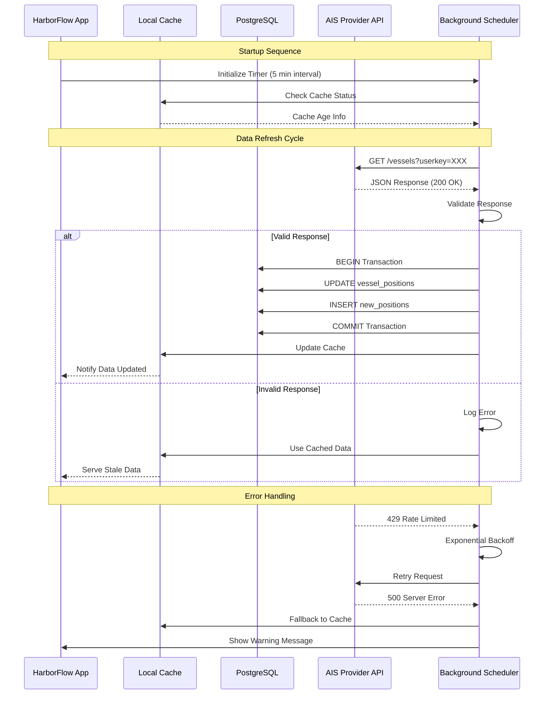
```mermaid
sequenceDiagram
    participant App as HarborFlow App
    participant Cache as Local Cache
    participant DB as PostgreSQL
    participant API as AIS Provider API
    participant Scheduler as Background Scheduler
    
    Note over App,Scheduler: Startup Sequence
    App->>Scheduler: Initialize Timer (5 min interval)
    Scheduler->>Cache: Check Cache Status
    Cache-->>Scheduler: Cache Age Info
    
    Note over App,Scheduler: Data Refresh Cycle
    Scheduler->>API: GET /vessels?userkey=XXX
    API-->>Scheduler: JSON Response (200 OK)
    Scheduler->>Scheduler: Validate Response
    
    alt Valid Response
        Scheduler->>DB: BEGIN Transaction
        Scheduler->>DB: UPDATE vessel_positions
        Scheduler->>DB: INSERT new_positions
        Scheduler->>DB: COMMIT Transaction
        Scheduler->>Cache: Update Cache
        Cache-->>App: Notify Data Updated
    else Invalid Response
        Scheduler->>Scheduler: Log Error
        Scheduler->>Cache: Use Cached Data
        Cache-->>App: Serve Stale Data
    end
    
    Note over App,Scheduler: Error Handling
    API-->>Scheduler: 429 Rate Limited
    Scheduler->>Scheduler: Exponential Backoff
    Scheduler->>API: Retry Request
    
    API-->>Scheduler: 500 Server Error
    Scheduler->>Cache: Fallback to Cache
    Scheduler->>App: Show Warning Message
```

#### Event Processing Flow

Mengikat data Anda secara efisien sangat penting untuk infrastruktur WPF Anda. Pilih mode data binding yang sesuai (OneTime, OneWay, TwoWay) berdasarkan kebutuhan aplikasi Anda.

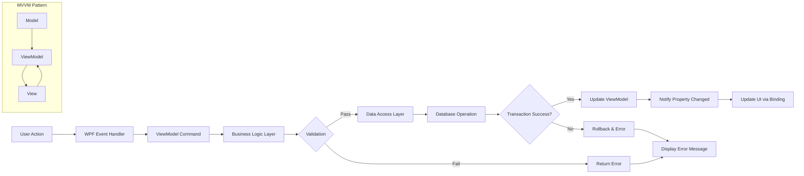
```mermaid
flowchart LR
    A[User Action] --> B[WPF Event Handler]
    B --> C[ViewModel Command]
    C --> D[Business Logic Layer]
    D --> E{Validation}
    
    E -->|Pass| F[Data Access Layer]
    E -->|Fail| G[Return Error]
    
    F --> H[Database Operation]
    H --> I{Transaction Success?}
    
    I -->|Yes| J[Update ViewModel]
    I -->|No| K[Rollback & Error]
    
    J --> L[Notify Property Changed]
    L --> M[Update UI via Binding]
    
    G --> N[Display Error Message]
    K --> N
    
    subgraph "MVVM Pattern"
        O[Model] --> P[ViewModel]
        P --> Q[View]
        Q --> P
    end
```

#### Batch Processing Sequence

Transaksi ini umumnya dimulai dengan BEGIN, diikuti oleh serangkaian operasi (seperti UPDATE atau INSERT), dan kemudian di-commit menggunakan COMMIT. Pola ini membantu menghindari penguncian sumber daya terlalu lama dan memastikan throughput yang tinggi.

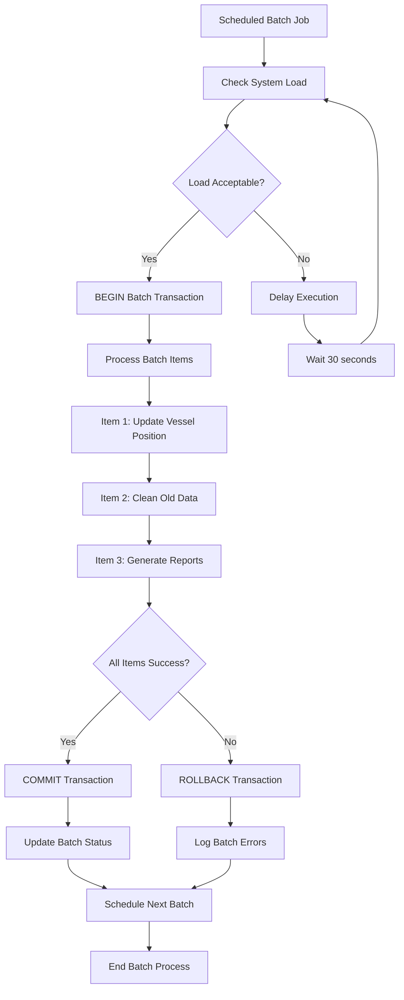
```mermaid
flowchart TD
    A[Scheduled Batch Job] --> B[Check System Load]
    B --> C{Load Acceptable?}
    C -->|Yes| D[BEGIN Batch Transaction]
    C -->|No| E[Delay Execution]
    E --> F[Wait 30 seconds]
    F --> B
    
    D --> G[Process Batch Items]
    G --> H[Item 1: Update Vessel Position]
    H --> I[Item 2: Clean Old Data]
    I --> J[Item 3: Generate Reports]
    
    J --> K{All Items Success?}
    K -->|Yes| L[COMMIT Transaction]
    K -->|No| M[ROLLBACK Transaction]
    
    L --> N[Update Batch Status]
    M --> O[Log Batch Errors]
    
    N --> P[Schedule Next Batch]
    O --> P
    P --> Q[End Batch Process]
```

## 4.2 FLOWCHART REQUIREMENTS

### 4.2.1 Validation Rules

#### Business Rules Implementation

Konsistensi memastikan bahwa database bertransisi dari satu keadaan valid ke keadaan lainnya. Ini memastikan batasan integritas dan aturan database.

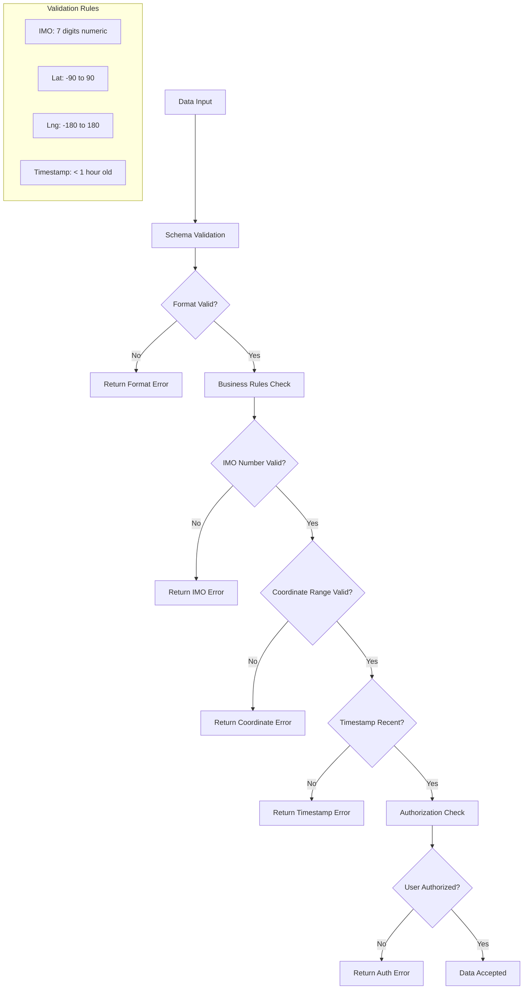
```mermaid
flowchart TD
    A[Data Input] --> B[Schema Validation]
    B --> C{Format Valid?}
    C -->|No| D[Return Format Error]
    C -->|Yes| E[Business Rules Check]
    
    E --> F{IMO Number Valid?}
    F -->|No| G[Return IMO Error]
    F -->|Yes| H{Coordinate Range Valid?}
    
    H -->|No| I[Return Coordinate Error]
    H -->|Yes| J{Timestamp Recent?}
    
    J -->|No| K[Return Timestamp Error]
    J -->|Yes| L[Authorization Check]
    
    L --> M{User Authorized?}
    M -->|No| N[Return Auth Error]
    M -->|Yes| O[Data Accepted]
    
    subgraph "Validation Rules"
        P[IMO: 7 digits numeric]
        Q[Lat: -90 to 90]
        R[Lng: -180 to 180]
        S[Timestamp: < 1 hour old]
    end
```

#### Data Validation Requirements

Isolasi memastikan bahwa transaksi bersamaan tidak saling mengganggu. Ini mencegah interferensi dan memastikan bahwa keadaan transaksi perantara tidak terlihat oleh yang lain sampai di-commit.

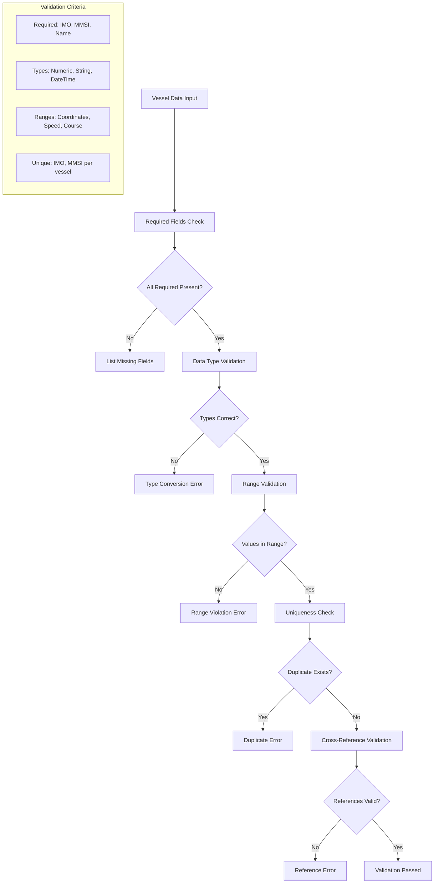
```mermaid
flowchart TD
    A[Vessel Data Input] --> B[Required Fields Check]
    B --> C{All Required Present?}
    C -->|No| D[List Missing Fields]
    C -->|Yes| E[Data Type Validation]
    
    E --> F{Types Correct?}
    F -->|No| G[Type Conversion Error]
    F -->|Yes| H[Range Validation]
    
    H --> I{Values in Range?}
    I -->|No| J[Range Violation Error]
    I -->|Yes| K[Uniqueness Check]
    
    K --> L{Duplicate Exists?}
    L -->|Yes| M[Duplicate Error]
    L -->|No| N[Cross-Reference Validation]
    
    N --> O{References Valid?}
    O -->|No| P[Reference Error]
    O -->|Yes| Q[Validation Passed]
    
    subgraph "Validation Criteria"
        R[Required: IMO, MMSI, Name]
        S[Types: Numeric, String, DateTime]
        T[Ranges: Coordinates, Speed, Course]
        U[Unique: IMO, MMSI per vessel]
    end
```

### 4.2.2 Authorization Checkpoints

#### Role-Based Access Control Flow

MVVM - digunakan sebagai konverter model dan sebagai pengganti code-behind. Meningkatkan testabilitas, jauh lebih mudah untuk menulis unit test untuk ViewModel.

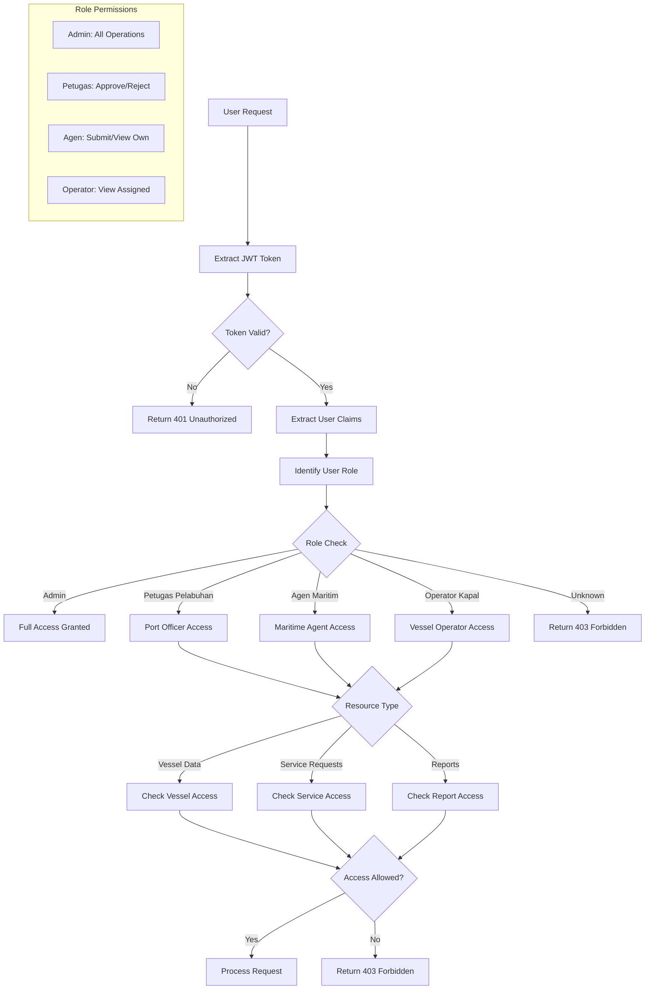
```mermaid
flowchart TD
    A[User Request] --> B[Extract JWT Token]
    B --> C{Token Valid?}
    C -->|No| D[Return 401 Unauthorized]
    C -->|Yes| E[Extract User Claims]
    
    E --> F[Identify User Role]
    F --> G{Role Check}
    
    G -->|Admin| H[Full Access Granted]
    G -->|Petugas Pelabuhan| I[Port Officer Access]
    G -->|Agen Maritim| J[Maritime Agent Access]
    G -->|Operator Kapal| K[Vessel Operator Access]
    G -->|Unknown| L[Return 403 Forbidden]
    
    I --> M{Resource Type}
    J --> M
    K --> M
    
    M -->|Vessel Data| N[Check Vessel Access]
    M -->|Service Requests| O[Check Service Access]
    M -->|Reports| P[Check Report Access]
    
    N --> Q{Access Allowed?}
    O --> Q
    P --> Q
    
    Q -->|Yes| R[Process Request]
    Q -->|No| S[Return 403 Forbidden]
    
    subgraph "Role Permissions"
        T[Admin: All Operations]
        U[Petugas: Approve/Reject]
        V[Agen: Submit/View Own]
        W[Operator: View Assigned]
    end
```

### 4.2.3 Regulatory Compliance Checks

#### Maritime Regulation Compliance

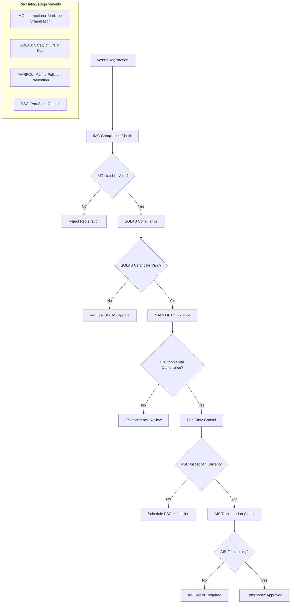
```mermaid
flowchart TD
    A[Vessel Registration] --> B[IMO Compliance Check]
    B --> C{IMO Number Valid?}
    C -->|No| D[Reject Registration]
    C -->|Yes| E[SOLAS Compliance]
    
    E --> F{SOLAS Certificate Valid?}
    F -->|No| G[Request SOLAS Update]
    F -->|Yes| H[MARPOL Compliance]
    
    H --> I{Environmental Compliance?}
    I -->|No| J[Environmental Review]
    I -->|Yes| K[Port State Control]
    
    K --> L{PSC Inspection Current?}
    L -->|No| M[Schedule PSC Inspection]
    L -->|Yes| N[AIS Transmission Check]
    
    N --> O{AIS Functioning?}
    O -->|No| P[AIS Repair Required]
    O -->|Yes| Q[Compliance Approved]
    
    subgraph "Regulatory Requirements"
        R[IMO: International Maritime Organization]
        S[SOLAS: Safety of Life at Sea]
        T[MARPOL: Marine Pollution Prevention]
        U[PSC: Port State Control]
    end
```

## 4.3 TECHNICAL IMPLEMENTATION

### 4.3.1 State Management

#### Application State Transitions

Untuk menerapkan tema Fluent ke aplikasi WPF Anda, atur properti ApplicationTheme di file App.xaml Anda. .NET 9 memperkenalkan beberapa peningkatan performa untuk aplikasi WPF: Pipeline Rendering yang Dioptimalkan: Mengurangi penggunaan CPU dan GPU untuk visual yang lebih halus.

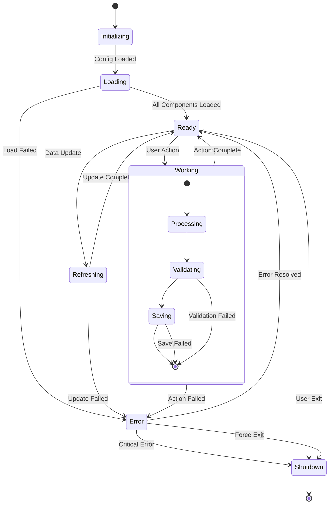
```mermaid
stateDiagram-v2
    [*] --> Initializing
    Initializing --> Loading: Config Loaded
    Loading --> Ready: All Components Loaded
    Loading --> Error: Load Failed
    
    Ready --> Working: User Action
    Working --> Ready: Action Complete
    Working --> Error: Action Failed
    
    Error --> Ready: Error Resolved
    Error --> Shutdown: Critical Error
    
    Ready --> Refreshing: Data Update
    Refreshing --> Ready: Update Complete
    Refreshing --> Error: Update Failed
    
    Ready --> Shutdown: User Exit
    Error --> Shutdown: Force Exit
    Shutdown --> [*]
    
    state Working {
        [*] --> Processing
        Processing --> Validating
        Validating --> Saving
        Saving --> [*]
        
        Validating --> [*]: Validation Failed
        Saving --> [*]: Save Failed
    }
```

#### Data Persistence Points

Database transaksional menjamin bahwa semua pembaruan yang dibuat oleh transaksi dicatat dalam penyimpanan permanen (yaitu, pada disk) sebelum transaksi dilaporkan selesai. Properti penting lain dari database transaksional terkait erat dengan konsep pembaruan atomik: ketika beberapa transaksi berjalan bersamaan, masing-masing tidak boleh dapat melihat perubahan yang tidak lengkap yang dibuat oleh yang lain.

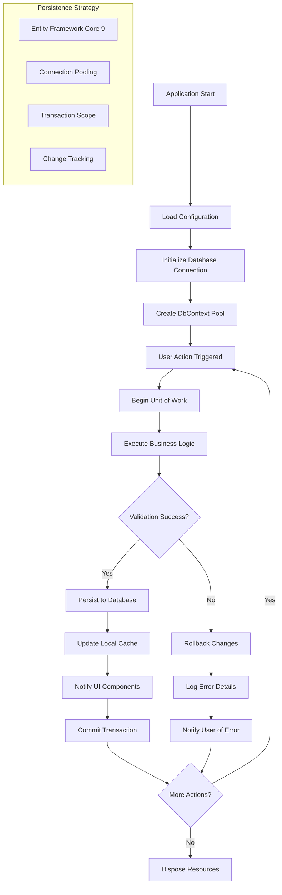
```mermaid
flowchart TD
    A[Application Start] --> B[Load Configuration]
    B --> C[Initialize Database Connection]
    C --> D[Create DbContext Pool]
    
    D --> E[User Action Triggered]
    E --> F[Begin Unit of Work]
    F --> G[Execute Business Logic]
    
    G --> H{Validation Success?}
    H -->|Yes| I[Persist to Database]
    H -->|No| J[Rollback Changes]
    
    I --> K[Update Local Cache]
    K --> L[Notify UI Components]
    L --> M[Commit Transaction]
    
    J --> N[Log Error Details]
    N --> O[Notify User of Error]
    
    M --> P{More Actions?}
    O --> P
    P -->|Yes| E
    P -->|No| Q[Dispose Resources]
    
    subgraph "Persistence Strategy"
        R[Entity Framework Core 9]
        S[Connection Pooling]
        T[Transaction Scope]
        U[Change Tracking]
    end
```

#### Caching Requirements

Waktu Startup yang Diperbaiki: Peluncuran aplikasi yang lebih cepat. Data Binding yang Ditingkatkan: Overhead yang berkurang dalam operasi data binding.

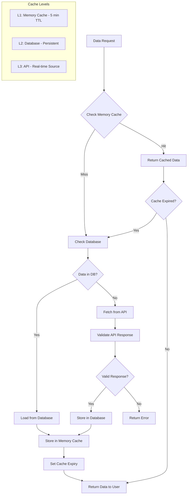
```mermaid
flowchart TD
    A[Data Request] --> B{Check Memory Cache}
    B -->|Hit| C[Return Cached Data]
    B -->|Miss| D[Check Database]
    
    D --> E{Data in DB?}
    E -->|Yes| F[Load from Database]
    E -->|No| G[Fetch from API]
    
    F --> H[Store in Memory Cache]
    G --> I[Validate API Response]
    I --> J{Valid Response?}
    J -->|Yes| K[Store in Database]
    J -->|No| L[Return Error]
    
    K --> H
    H --> M[Set Cache Expiry]
    M --> N[Return Data to User]
    
    C --> O{Cache Expired?}
    O -->|Yes| D
    O -->|No| N
    
    subgraph "Cache Levels"
        P[L1: Memory Cache - 5 min TTL]
        Q[L2: Database - Persistent]
        R[L3: API - Real-time Source]
    end
```

### 4.3.2 Error Handling

#### Retry Mechanisms

Akses ke data API disediakan dengan kredit. Kredit dapat disediakan: Berdasarkan langganan – harga per kredit lebih rendah dan kredit dapat digunakan untuk periode 1 bulan. Berdasarkan permintaan – harga per kredit lebih tinggi dan kredit dapat digunakan untuk periode 12 bulan.

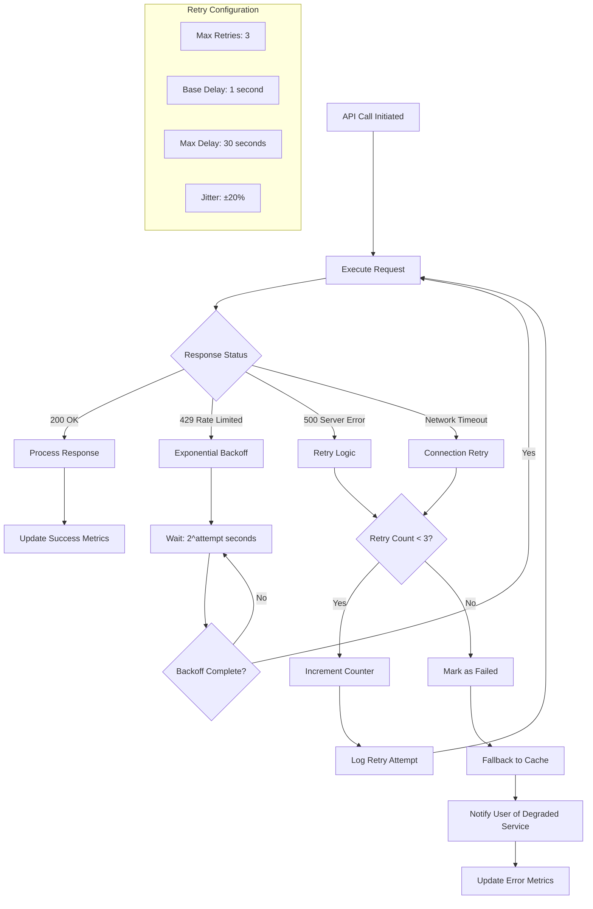
```mermaid
flowchart TD
    A[API Call Initiated] --> B[Execute Request]
    B --> C{Response Status}
    
    C -->|200 OK| D[Process Response]
    C -->|429 Rate Limited| E[Exponential Backoff]
    C -->|500 Server Error| F[Retry Logic]
    C -->|Network Timeout| G[Connection Retry]
    
    E --> H[Wait: 2^attempt seconds]
    F --> I{Retry Count < 3?}
    G --> I
    
    I -->|Yes| J[Increment Counter]
    I -->|No| K[Mark as Failed]
    
    J --> L[Log Retry Attempt]
    L --> B
    
    H --> M{Backoff Complete?}
    M -->|Yes| B
    M -->|No| H
    
    K --> N[Fallback to Cache]
    N --> O[Notify User of Degraded Service]
    
    D --> P[Update Success Metrics]
    O --> Q[Update Error Metrics]
    
    subgraph "Retry Configuration"
        R[Max Retries: 3]
        S[Base Delay: 1 second]
        T[Max Delay: 30 seconds]
        U[Jitter: ±20%]
    end
```

#### Fallback Processes

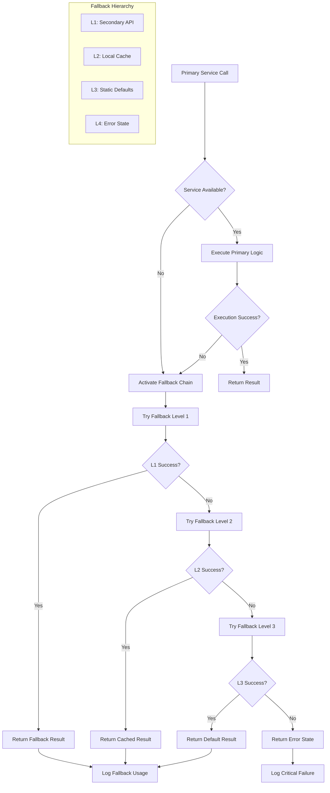
```mermaid
flowchart TD
    A[Primary Service Call] --> B{Service Available?}
    B -->|Yes| C[Execute Primary Logic]
    B -->|No| D[Activate Fallback Chain]
    
    C --> E{Execution Success?}
    E -->|Yes| F[Return Result]
    E -->|No| D
    
    D --> G[Try Fallback Level 1]
    G --> H{L1 Success?}
    H -->|Yes| I[Return Fallback Result]
    H -->|No| J[Try Fallback Level 2]
    
    J --> K{L2 Success?}
    K -->|Yes| L[Return Cached Result]
    K -->|No| M[Try Fallback Level 3]
    
    M --> N{L3 Success?}
    N -->|Yes| O[Return Default Result]
    N -->|No| P[Return Error State]
    
    I --> Q[Log Fallback Usage]
    L --> Q
    O --> Q
    P --> R[Log Critical Failure]
    
    subgraph "Fallback Hierarchy"
        S[L1: Secondary API]
        T[L2: Local Cache]
        U[L3: Static Defaults]
        V[L4: Error State]
    end
```

#### Recovery Procedures

Dimungkinkan untuk mengontrol pernyataan dalam transaksi dengan cara yang lebih granular melalui penggunaan savepoint. Savepoint memungkinkan Anda untuk secara selektif membuang bagian dari transaksi, sambil melakukan commit sisanya.

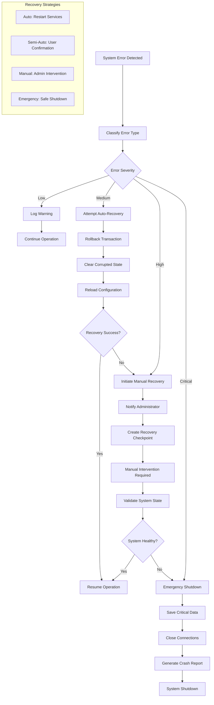
```mermaid
flowchart TD
    A[System Error Detected] --> B[Classify Error Type]
    B --> C{Error Severity}
    
    C -->|Low| D[Log Warning]
    C -->|Medium| E[Attempt Auto-Recovery]
    C -->|High| F[Initiate Manual Recovery]
    C -->|Critical| G[Emergency Shutdown]
    
    D --> H[Continue Operation]
    
    E --> I[Rollback Transaction]
    I --> J[Clear Corrupted State]
    J --> K[Reload Configuration]
    K --> L{Recovery Success?}
    L -->|Yes| M[Resume Operation]
    L -->|No| F
    
    F --> N[Notify Administrator]
    N --> O[Create Recovery Checkpoint]
    O --> P[Manual Intervention Required]
    P --> Q[Validate System State]
    Q --> R{System Healthy?}
    R -->|Yes| M
    R -->|No| G
    
    G --> S[Save Critical Data]
    S --> T[Close Connections]
    T --> U[Generate Crash Report]
    U --> V[System Shutdown]
    
    subgraph "Recovery Strategies"
        W[Auto: Restart Services]
        X[Semi-Auto: User Confirmation]
        Y[Manual: Admin Intervention]
        Z[Emergency: Safe Shutdown]
    end
```

## 4.4 REQUIRED DIAGRAMS

### 4.4.1 High-Level System Workflow

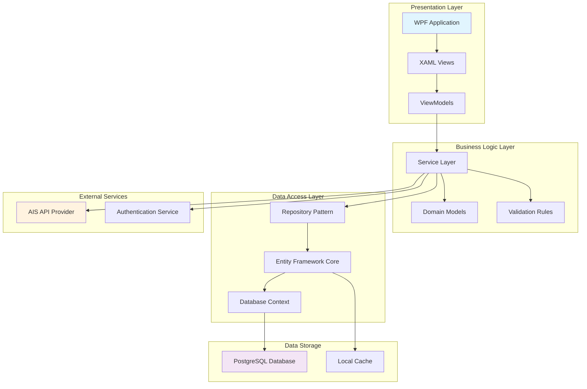
```mermaid
graph TB
    subgraph "Presentation Layer"
        A[WPF Application]
        B[XAML Views]
        C[ViewModels]
    end
    
    subgraph "Business Logic Layer"
        D[Service Layer]
        E[Domain Models]
        F[Validation Rules]
    end
    
    subgraph "Data Access Layer"
        G[Repository Pattern]
        H[Entity Framework Core]
        I[Database Context]
    end
    
    subgraph "External Services"
        J[AIS API Provider]
        K[Authentication Service]
    end
    
    subgraph "Data Storage"
        L[PostgreSQL Database]
        M[Local Cache]
    end
    
    A --> B
    B --> C
    C --> D
    D --> E
    D --> F
    D --> G
    G --> H
    H --> I
    I --> L
    D --> J
    D --> K
    H --> M
    
    style A fill:#e1f5fe
    style L fill:#f3e5f5
    style J fill:#fff3e0
```

### 4.4.2 Detailed Process Flow for Core Features

#### F-001: Peta Dasar dengan Posisi Kapal - Detail Flow

```mermaid
flowchart TD
    A[User Opens Map View] --> B[Initialize Map Component]
    B --> C[Load Map Configuration]
    C --> D[Set Default View Bounds]
    D --> E[Check Cache for Vessel Data]
    
    E --> F{Cache Valid & Fresh?}
    F -->|Yes| G[Render Vessels from Cache]
    F -->|No| H[Initiate AIS Data Fetch]
    
    H --> I[Prepare API Request]
    I --> J[Add Authentication Headers]
    J --> K[Set Geographic Bounds]
    K --> L[Execute HTTP Request]
    
    L --> M{HTTP Status}
    M -->|200| N[Parse JSON Response]
    M -->|429| O[Rate Limit Handler]
    M -->|500| P[Server Error Handler]
    M -->|Timeout| Q[Timeout Handler]
    
    N --> R[Validate Vessel Data]
    R --> S{Data Validation}
    S -->|Pass| T[Transform to Map Objects]
    S -->|Fail| U[Log Data Issues]
    
    T --> V[Update Database]
    V --> W[Update Memory Cache]
    W --> X[Render Vessel Markers]
    
    G --> X
    U --> Y[Use Fallback Data]
    Y --> X
    
    X --> Z[Enable User Interactions]
    Z --> AA[Set Auto-Refresh Timer]
    AA --> AB{Timer Expired?}
    AB -->|Yes| H
    AB -->|No| AC[Wait for User Action]
    
    O --> AD[Exponential Backoff]
    P --> AE[Retry with Delay]
    Q --> AE
    AD --> H
    AE --> H
    
    AC --> AF{User Action}
    AF -->|Zoom| AG[Update View Bounds]
    AF -->|Pan| AG
    AF -->|Click Vessel| AH[Show Vessel Details]
    AF -->|Refresh| H
    
    AG --> AI[Check if New Data Needed]
    AI --> H
    AH --> AC
```

### 4.4.3 Error Handling Flowcharts

#### Comprehensive Error Handling Strategy

```mermaid
flowchart TD
    A[Operation Initiated] --> B[Try Primary Operation]
    B --> C{Operation Result}
    
    C -->|Success| D[Log Success]
    C -->|Business Error| E[Handle Business Logic Error]
    C -->|System Error| F[Handle System Error]
    C -->|Network Error| G[Handle Network Error]
    
    E --> H[Validate Business Rules]
    H --> I{Recoverable?}
    I -->|Yes| J[Apply Business Rule Fix]
    I -->|No| K[Return Business Error]
    
    F --> L[Check System Resources]
    L --> M{Resources Available?}
    M -->|Yes| N[Retry Operation]
    M -->|No| O[Free Resources]
    O --> N
    
    G --> P[Check Network Connectivity]
    P --> Q{Network Available?}
    Q -->|Yes| R[Retry with Backoff]
    Q -->|No| S[Use Offline Mode]
    
    J --> T[Re-execute Operation]
    N --> T
    R --> T
    T --> U{Retry Success?}
    U -->|Yes| D
    U -->|No| V[Escalate Error]
    
    K --> W[Log Business Error]
    S --> X[Log Network Error]
    V --> Y[Log System Error]
    
    W --> Z[Notify User]
    X --> Z
    Y --> AA[Notify Administrator]
    
    D --> BB[Continue Normal Flow]
    Z --> CC[Return to Safe State]
    AA --> CC
    
    subgraph "Error Categories"
        DD[Business: Validation, Rules]
        EE[System: Memory, CPU, Disk]
        FF[Network: Timeout, Unavailable]
        GG[Data: Corruption, Missing]
    end
```

### 4.4.4 Integration Sequence Diagrams

#### AIS Data Integration Sequence

```mermaid
sequenceDiagram
    participant UI as WPF UI
    participant VM as ViewModel
    participant SVC as AIS Service
    participant CACHE as Cache Manager
    participant DB as Database
    participant API as External AIS API
    
    Note over UI,API: Initial Data Load
    UI->>VM: LoadMapData()
    VM->>SVC: GetVesselPositions()
    SVC->>CACHE: CheckCache()
    
    alt Cache Hit
        CACHE-->>SVC: Return Cached Data
        SVC-->>VM: Vessel Data
        VM-->>UI: Update Map
    else Cache Miss
        SVC->>API: GET /vessels
        API-->>SVC: JSON Response
        SVC->>SVC: Validate Data
        SVC->>DB: SaveVesselPositions()
        DB-->>SVC: Success
        SVC->>CACHE: UpdateCache()
        SVC-->>VM: Vessel Data
        VM-->>UI: Update Map
    end
    
    Note over UI,API: Periodic Updates
    loop Every 5 Minutes
        SVC->>API: GET /vessels/updates
        alt API Success
            API-->>SVC: Updated Positions
            SVC->>DB: UpdatePositions()
            SVC->>CACHE: RefreshCache()
            SVC->>VM: NotifyDataChanged()
            VM->>UI: RefreshMap()
        else API Failure
            SVC->>SVC: Log Error
            SVC->>CACHE: Use Stale Data
            SVC->>VM: NotifyDegradedService()
            VM->>UI: Show Warning
        end
    end
```

### 4.4.5 State Transition Diagrams

#### Application State Management

```mermaid
stateDiagram-v2
    [*] --> AppStarting
    AppStarting --> ConfigLoading: Initialize
    ConfigLoading --> DatabaseConnecting: Config OK
    ConfigLoading --> ErrorState: Config Failed
    
    DatabaseConnecting --> ServicesInitializing: DB Connected
    DatabaseConnecting --> OfflineMode: DB Failed
    
    ServicesInitializing --> Ready: All Services OK
    ServicesInitializing --> PartiallyReady: Some Services Failed
    
    OfflineMode --> Ready: Connection Restored
    PartiallyReady --> Ready: Services Recovered
    
    Ready --> DataLoading: User Request
    DataLoading --> Ready: Load Complete
    DataLoading --> ErrorState: Load Failed
    
    Ready --> DataSaving: User Save
    DataSaving --> Ready: Save Complete
    DataSaving --> ErrorState: Save Failed
    
    Ready --> Refreshing: Auto Refresh
    Refreshing --> Ready: Refresh Complete
    Refreshing --> PartiallyReady: Partial Refresh
    
    ErrorState --> Ready: Error Resolved
    ErrorState --> AppShutdown: Critical Error
    
    Ready --> AppShutdown: User Exit
    PartiallyReady --> AppShutdown: User Exit
    OfflineMode --> AppShutdown: User Exit
    
    AppShutdown --> [*]
    
    state Ready {
        [*] --> Idle
        Idle --> Processing: Action Started
        Processing --> Idle: Action Complete
        Processing --> Validating: Validation Required
        Validating --> Processing: Validation OK
        Validating --> Idle: Validation Failed
    }
    
    state ErrorState {
        [*] --> Analyzing
        Analyzing --> Recovering: Auto Recovery
        Analyzing --> WaitingInput: Manual Recovery
        Recovering --> [*]: Recovery Success
        WaitingInput --> Recovering: User Action
        Recovering --> Analyzing: Recovery Failed
    }
```

#### Transaction State Flow

Aktif: Ketika transaksi telah dimulai dan sedang dalam perjalanan memodifikasi database. Sebagian Committed: Ketika semua pernyataan transaksi telah dieksekusi tetapi belum sepenuhnya di-commit.

```mermaid
stateDiagram-v2
    [*] --> TransactionIdle
    TransactionIdle --> TransactionStarted: BEGIN
    
    TransactionStarted --> Active: First Operation
    Active --> Active: Additional Operations
    Active --> Validating: Validation Check
    
    Validating --> Active: Validation Passed
    Validating --> RollingBack: Validation Failed
    
    Active --> Committing: COMMIT Command
    Active --> RollingBack: ROLLBACK Command
    Active --> RollingBack: Error Occurred
    
    Committing --> Committed: Commit Success
    Committing --> RollingBack: Commit Failed
    
    RollingBack --> Aborted: Rollback Complete
    
    Committed --> TransactionIdle: Transaction Complete
    Aborted --> TransactionIdle: Transaction Complete
    
    state Active {
        [*] --> Executing
        Executing --> Waiting: Resource Lock
        Waiting --> Executing: Lock Acquired
        Executing --> [*]: Operation Complete
    }
    
    state Committing {
        [*] --> WritingLog
        WritingLog --> FlushingData
        FlushingData --> ReleasingLocks
        ReleasingLocks --> [*]
    }
```

# 5. SYSTEM ARCHITECTURE

## 5.1 HIGH-LEVEL ARCHITECTURE

### 5.1.1 System Overview

HarborFlow mengadopsi arsitektur 3-lapis (3-Tier Architecture) yang dioptimalkan untuk aplikasi desktop WPF dengan pola Model-View-ViewModel (MVVM) yang membantu memisahkan logika bisnis aplikasi dan presentasi dari antarmuka pengguna (UI). Arsitektur ini dipilih berdasarkan prinsip-prinsip fundamental pemisahan tanggung jawab (Separation of Concerns) dan inversi dependensi (Dependency Inversion) untuk menciptakan sistem yang dapat diuji, dipelihara, dan dikembangkan secara efisien.

MVVM dirancang untuk menghilangkan hampir semua kode GUI ("code-behind") dari lapisan view, dengan menggunakan fungsi data binding di WPF untuk memfasilitasi pemisahan pengembangan lapisan view dari pola lainnya. Pendekatan ini memungkinkan pengembang UX untuk menggunakan markup language framework (XAML) dan membuat data binding ke view model, yang ditulis dan dipelihara oleh pengembang aplikasi.

Sistem ini mengintegrasikan PostgreSQL 17 yang dibangun berdasarkan dekade pengembangan open source, meningkatkan performa dan skalabilitas sambil beradaptasi dengan pola akses dan penyimpanan data yang muncul. Rilis ini menambahkan peningkatan performa keseluruhan yang signifikan, termasuk implementasi manajemen memori yang diperbaharui untuk vacuum, optimisasi akses penyimpanan dan peningkatan untuk workload concurrency tinggi.

Integrasi dengan layanan eksternal dilakukan melalui pola HTTP Client yang robust dengan mekanisme retry dan fallback untuk memastikan keandalan sistem. Pola Unit of Work dan Repository dimaksudkan untuk merangkum lapisan persistensi infrastruktur sehingga terpisah dari lapisan aplikasi dan domain-model, meskipun dalam implementasi ini kami menggunakan Entity Framework Core secara langsung untuk memanfaatkan fitur-fitur canggihnya.

### 5.1.2 Core Components Table

| Component Name | Primary Responsibility | Key Dependencies | Integration Points |
|----------------|------------------------|------------------|-------------------|
| WPF Presentation Layer | Mengelola antarmuka pengguna dan interaksi dengan pengguna melalui XAML dan ViewModels | .NET 9 WPF, MVVM Framework | Business Logic Layer, Configuration Service |
| Business Logic Layer | Mengimplementasikan aturan bisnis, validasi, dan orkestrasi alur kerja aplikasi | Domain Models, Validation Rules | Data Access Layer, External Services |
| Data Access Layer | Mengelola persistensi data dan komunikasi dengan database PostgreSQL | Entity Framework Core 9, Npgsql Provider | PostgreSQL Database, Caching Layer |
| External Integration Layer | Menangani komunikasi dengan API AIS dan layanan pihak ketiga lainnya | HTTP Client, JSON Serialization | AIS Data Providers, Authentication Services |

### 5.1.3 Data Flow Description

Alur data dalam sistem HarborFlow mengikuti pola unidirectional yang dimulai dari lapisan presentasi dan mengalir melalui lapisan bisnis menuju lapisan akses data. Ketika pengguna berinteraksi dengan antarmuka WPF, aksi tersebut ditangkap oleh ViewModel yang kemudian memanggil layanan bisnis yang sesuai.

Lapisan bisnis bertanggung jawab untuk memvalidasi input pengguna, menerapkan aturan bisnis, dan mengoordinasikan operasi yang melibatkan multiple data sources. Data binding adalah landasan dari arsitektur MVVM. Dalam .NET, data binding menghubungkan elemen UI dalam View ke properti dalam ViewModel. Ketika data dalam ViewModel berubah, View secara otomatis terupdate, dan sebaliknya.

Data AIS real-time diperoleh melalui HTTP Client yang mengimplementasikan pola Circuit Breaker dan Retry dengan Exponential Backoff. Data yang diterima dari API eksternal divalidasi, ditransformasi sesuai dengan model domain internal, dan disimpan dalam database PostgreSQL melalui Entity Framework Core. Sistem caching multi-level memastikan performa optimal dengan menyimpan data yang sering diakses di memory cache dengan TTL 5 menit.

Transformasi data terjadi di beberapa titik: dari format JSON API ke domain objects, dari domain objects ke database entities melalui EF Core mapping, dan dari database entities kembali ke ViewModels untuk presentasi. Setiap transformasi dilengkapi dengan validasi dan error handling yang komprehensif.

### 5.1.4 External Integration Points

| System Name | Integration Type | Data Exchange Pattern | Protocol/Format |
|-------------|------------------|----------------------|-----------------|
| VesselFinder AIS API | REST API Consumer | Request-Response dengan Polling | HTTPS/JSON dengan Authentication Headers |
| PostgreSQL Database | Direct Database Connection | Transactional Read/Write Operations | TCP/Binary Protocol via Npgsql |
| Windows Authentication | OS Integration | Single Sign-On dengan Role Mapping | Windows Integrated Security |
| Configuration Management | File-based Configuration | Read-only Configuration Loading | JSON Configuration Files |

## 5.2 COMPONENT DETAILS

### 5.2.1 WPF Presentation Layer

**Purpose and Responsibilities:**
Lapisan presentasi bertanggung jawab untuk menyediakan antarmuka pengguna yang intuitif dan responsif menggunakan teknologi WPF terbaru. Pola MVVM memungkinkan aplikasi untuk menggunakan data templates, commands, data binding, sistem resource, dan pola MVVM untuk menciptakan framework yang sederhana, dapat diuji, dan robust yang dapat digunakan oleh aplikasi WPF mana pun.

**Technologies and Frameworks Used:**
- .NET 9 WPF dengan dukungan tema Windows Fluent
- XAML untuk definisi antarmuka pengguna
- MVVM dengan binder yang mengotomatisasi komunikasi antara view dan properti yang terikat dalam view model
- Data binding dua arah untuk sinkronisasi real-time antara UI dan data

**Key Interfaces and APIs:**
- INotifyPropertyChanged untuk notifikasi perubahan properti
- ICommand interface untuk handling user actions
- Dependency Injection container untuk resolusi dependencies
- Custom UserControls untuk komponen UI yang dapat digunakan kembali

**Data Persistence Requirements:**
Lapisan presentasi tidak menyimpan data secara langsung tetapi mengelola state UI sementara seperti posisi window, preferensi pengguna, dan cache tampilan. State ini disimpan dalam Windows Registry atau file konfigurasi lokal.

**Scaling Considerations:**
UI dirancang untuk mendukung hingga 50 pengguna concurrent dengan optimisasi rendering untuk menampilkan hingga 1000 marker kapal secara bersamaan tanpa degradasi performa yang signifikan.

### 5.2.2 Business Logic Layer

**Purpose and Responsibilities:**
Lapisan ini mengimplementasikan semua aturan bisnis, validasi data, dan orkestrasi alur kerja yang kompleks. Esensi MVVM terletak pada kemampuannya untuk mendorong pemisahan tanggung jawab, sehingga meningkatkan desain perangkat lunak secara keseluruhan. Pemisahan ini memudahkan pengelolaan dan modifikasi komponen individual aplikasi tanpa mempengaruhi yang lain.

**Technologies and Frameworks Used:**
- .NET 9 Class Libraries untuk implementasi layanan bisnis
- FluentValidation untuk validasi data yang kompleks
- AutoMapper untuk transformasi object-to-object
- Microsoft.Extensions.DependencyInjection untuk IoC container

**Key Interfaces and APIs:**
- IVesselTrackingService untuk logika pelacakan kapal
- IPortServiceManager untuk manajemen layanan pelabuhan
- IValidationService untuk validasi aturan bisnis
- INotificationService untuk sistem notifikasi internal

**Data Persistence Requirements:**
Lapisan bisnis tidak berinteraksi langsung dengan database tetapi menggunakan abstraksi repository pattern untuk operasi data. Semua operasi database dibungkus dalam transaction scope untuk memastikan konsistensi data.

**Scaling Considerations:**
Layanan bisnis dirancang stateless untuk mendukung horizontal scaling. Implementasi async/await pattern memastikan non-blocking operations untuk operasi I/O intensif.

### 5.2.3 Data Access Layer

**Purpose and Responsibilities:**
Mengelola semua aspek persistensi data, termasuk operasi CRUD, query optimization, dan transaction management. Kelas Entity Framework DbContext didasarkan pada pola Unit of Work dan Repository dan dapat digunakan langsung dari kode, seperti dari controller ASP.NET Core MVC. Pola Unit of Work dan Repository menghasilkan kode yang paling sederhana.

**Technologies and Frameworks Used:**
- Entity Framework Core 9 yang sudah dirancang berdasarkan pola Unit of Work dan Repository
- PostgreSQL sebagai database relational yang direkomendasikan dengan EF yang mendukung LINQ dan menyediakan strongly typed objects untuk model, serta persistensi yang disederhanakan ke database
- Npgsql.EntityFrameworkCore.PostgreSQL 9.0.4 sebagai database provider
- Connection pooling untuk optimisasi performa

**Key Interfaces and APIs:**
- DbContext sebagai Unit of Work implementation
- DbSet<T> sebagai Repository implementation untuk setiap entity
- IQueryable<T> untuk query composition dan optimization
- Migration API untuk database schema management

**Data Persistence Requirements:**
PostgreSQL 17 memperkenalkan struktur memori internal baru untuk vacuum yang mengonsumsi hingga 20x lebih sedikit memori. Ini meningkatkan kecepatan vacuum dan juga mengurangi penggunaan shared resources, membuat lebih banyak tersedia untuk workload. Database dirancang dengan normalisasi 3NF dan menggunakan indexing strategy yang optimal untuk query performance.

**Scaling Considerations:**
PostgreSQL 17 secara signifikan mengurangi jejak memori dari proses vacuum, memotong penggunaan hingga 20 kali. Upgrade ini mempercepat operasi vacuum, memastikan performa yang lebih baik dalam lingkungan high-concurrency. Dengan menurunkan kebutuhan resource, database dapat mempertahankan efisiensi bahkan di bawah beban berat.

### 5.2.4 External Integration Layer

**Purpose and Responsibilities:**
Menangani semua komunikasi dengan sistem eksternal, termasuk API AIS, layanan autentikasi, dan integrasi pihak ketiga lainnya. Layer ini mengimplementasikan pola resilience seperti Circuit Breaker, Retry, dan Timeout untuk memastikan keandalan sistem.

**Technologies and Frameworks Used:**
- System.Net.Http untuk HTTP client operations
- Polly library untuk resilience patterns
- System.Text.Json untuk JSON serialization/deserialization
- Microsoft.Extensions.Http untuk HTTP client factory

**Key Interfaces and APIs:**
- IHttpClientFactory untuk managed HTTP client instances
- IAisDataProvider untuk abstraksi penyedia data AIS
- IExternalServiceHealthCheck untuk monitoring kesehatan layanan
- IApiRateLimiter untuk rate limiting management

**Data Persistence Requirements:**
Layer ini tidak menyimpan data secara permanen tetapi menggunakan distributed cache untuk menyimpan response API dan metadata untuk optimisasi performa dan mengurangi API calls.

**Scaling Considerations:**
HTTP client pool dikonfigurasi untuk mendukung concurrent requests dengan connection pooling dan keep-alive connections. Rate limiting diimplementasikan untuk menghindari throttling dari API providers.

### 5.2.5 Required Diagrams

#### Component Interaction Diagram

```mermaid
graph TB
    subgraph "Presentation Layer"
        A[MainWindow.xaml]
        B[MapView.xaml]
        C[ServiceRequestView.xaml]
        D[MainViewModel]
        E[MapViewModel]
        F[ServiceRequestViewModel]
    end
    
    subgraph "Business Logic Layer"
        G[VesselTrackingService]
        H[PortServiceManager]
        I[ValidationService]
        J[NotificationService]
    end
    
    subgraph "Data Access Layer"
        K[HarborFlowDbContext]
        L[VesselRepository]
        M[ServiceRequestRepository]
        N[UserRepository]
    end
    
    subgraph "External Integration"
        O[AisDataProvider]
        P[HttpClientService]
        Q[CacheManager]
    end
    
    A --> D
    B --> E
    C --> F
    D --> G
    D --> H
    E --> G
    F --> H
    G --> L
    G --> O
    H --> M
    H --> I
    I --> J
    L --> K
    M --> K
    N --> K
    O --> P
    O --> Q
    
    style A fill:#e3f2fd
    style K fill:#f3e5f5
    style O fill:#fff3e0
```

#### State Transition Diagram for Vessel Tracking

```mermaid
stateDiagram-v2
    [*] --> Initializing
    Initializing --> LoadingCache: Cache Available
    Initializing --> FetchingAPI: No Cache
    
    LoadingCache --> DisplayingData: Cache Valid
    LoadingCache --> FetchingAPI: Cache Expired
    
    FetchingAPI --> ProcessingResponse: API Success
    FetchingAPI --> RetryingAPI: API Failure
    FetchingAPI --> UsingFallback: Max Retries Exceeded
    
    RetryingAPI --> FetchingAPI: Retry Attempt
    RetryingAPI --> UsingFallback: Max Retries
    
    ProcessingResponse --> UpdatingDatabase: Data Valid
    ProcessingResponse --> LoggingError: Data Invalid
    
    UpdatingDatabase --> UpdatingCache: DB Success
    UpdatingDatabase --> LoggingError: DB Failure
    
    UpdatingCache --> DisplayingData: Cache Updated
    UsingFallback --> DisplayingData: Fallback Data
    LoggingError --> DisplayingData: Error Handled
    
    DisplayingData --> SchedulingRefresh: Display Complete
    SchedulingRefresh --> FetchingAPI: Timer Expired
    
    DisplayingData --> [*]: User Exit
```

#### Sequence Diagram for Service Request Processing

```mermaid
sequenceDiagram
    participant U as User
    participant VM as ServiceRequestViewModel
    participant PS as PortServiceManager
    participant VS as ValidationService
    participant DB as Database
    participant NS as NotificationService
    
    U->>VM: Submit Service Request
    VM->>PS: ProcessServiceRequest(request)
    PS->>VS: ValidateRequest(request)
    
    alt Validation Success
        VS-->>PS: Validation Passed
        PS->>DB: BEGIN Transaction
        PS->>DB: INSERT ServiceRequest
        PS->>DB: INSERT Documents
        PS->>DB: COMMIT Transaction
        DB-->>PS: Transaction Success
        PS->>NS: SendNotification(requestCreated)
        PS-->>VM: Request Submitted Successfully
        VM-->>U: Show Success Message
    else Validation Failure
        VS-->>PS: Validation Errors
        PS-->>VM: Validation Failed
        VM-->>U: Show Validation Errors
    else Database Error
        DB-->>PS: Transaction Failed
        PS->>DB: ROLLBACK Transaction
        PS-->>VM: Database Error
        VM-->>U: Show Error Message
    end
```

## 5.3 TECHNICAL DECISIONS

### 5.3.1 Architecture Style Decisions and Tradeoffs

**Decision: 3-Tier Architecture dengan MVVM Pattern**

| Aspek | Keuntungan | Kerugian | Mitigasi |
|-------|------------|----------|----------|
| Pemisahan Tanggung Jawab | MVVM membantu memisahkan logika bisnis aplikasi dan presentasi dari UI. Mempertahankan pemisahan yang bersih antara logika aplikasi dan UI membantu mengatasi berbagai masalah pengembangan dan membuat aplikasi lebih mudah diuji, dipelihara, dan berkembang | Kompleksitas tambahan untuk aplikasi sederhana | Implementasi bertahap dengan dokumentasi yang jelas |
| Testability | Unit test dalam solusi demo menunjukkan betapa mudahnya menguji fungsionalitas antarmuka pengguna aplikasi ketika fungsionalitas tersebut ada dalam set kelas ViewModel | Learning curve untuk developer baru | Training dan code review yang intensif |
| Maintainability | Arsitektur MVVM bertujuan memisahkan logika UI dari logika bisnis, memungkinkan codebase yang bersih yang lebih mudah diuji, dipelihara, dan diperluas. Pendekatan arsitektur ini tidak hanya menyederhanakan proyek kompleks tetapi juga memastikan bahwa developer dapat menskalakan aplikasi mereka dengan mudah | Overhead untuk fitur sederhana | Evaluasi cost-benefit per fitur |

**Decision: Entity Framework Core Direct Usage (No Repository Pattern)**

Berdasarkan analisis mendalam, kami memutuskan untuk tidak mengimplementasikan Repository Pattern tambahan di atas Entity Framework Core. Repository/unit-of-work pattern (Rep/UoW) tidak berguna dengan EF Core. EF Core sudah mengimplementasikan pola Rep/UoW, sehingga melapisi pola Rep/UoW lain di atas EF Core tidak membantu. Solusi yang lebih baik adalah menggunakan EF Core secara langsung, yang memungkinkan penggunaan semua fitur EF Core untuk menghasilkan akses database yang berkinerja tinggi.

| Keputusan | Justifikasi | Implementasi |
|-----------|-------------|--------------|
| Direct DbContext Usage | Entity Framework sudah mengimplementasikan repository pattern. DbContext adalah UoW (Unit of Work) dan setiap DbSet adalah repository. Dengan mengimplementasikan layer lain di atas ini, tidak hanya redundan, tetapi membuat maintenance jauh lebih sulit | Dependency injection DbContext langsung ke services |
| No Generic Repository | Repository generik itu buruk. Tidak ada tujuan dibandingkan ORM. Namun ini adalah detail implementasi dan perlu dikecualikan dari diskusi arsitektur repository | Specific service classes untuk business operations |
| EF Core Features Utilization | Memanfaatkan fitur-fitur canggih EF Core seperti change tracking, lazy loading, dan query optimization | LINQ queries, Include() untuk eager loading, AsNoTracking() untuk read-only queries |

### 5.3.2 Communication Pattern Choices

**HTTP Client Pattern untuk External APIs:**

```mermaid
graph LR
    A[Application] --> B[HTTP Client Factory]
    B --> C[Polly Resilience]
    C --> D[Circuit Breaker]
    C --> E[Retry Policy]
    C --> F[Timeout Policy]
    D --> G[External API]
    E --> G
    F --> G
    
    G --> H[Response Cache]
    H --> I[JSON Deserialization]
    I --> J[Data Validation]
    J --> K[Domain Object Mapping]
```

**Event-Driven Communication untuk Internal Components:**

| Pattern | Use Case | Implementation | Benefits |
|---------|----------|----------------|----------|
| Observer Pattern | UI updates dari data changes | INotifyPropertyChanged, PropertyChanged events | Loose coupling, automatic UI refresh |
| Command Pattern | User actions handling | ICommand implementation dengan RelayCommand | Testable, reusable action handling |
| Mediator Pattern | Cross-cutting concerns | Event aggregator untuk notifications | Decoupled component communication |

### 5.3.3 Data Storage Solution Rationale

**PostgreSQL 17 Selection:**

PostgreSQL 17 dibangun berdasarkan dekade pengembangan open source, meningkatkan performa dan skalabilitas sambil beradaptasi dengan pola akses dan penyimpanan data yang muncul. Rilis ini menambahkan peningkatan performa keseluruhan yang signifikan, termasuk implementasi manajemen memori yang diperbaharui untuk vacuum, optimisasi akses penyimpanan dan peningkatan untuk workload concurrency tinggi.

| Kriteria | PostgreSQL 17 | Alternatif | Justifikasi |
|----------|----------------|------------|-------------|
| Performance | Secara signifikan meningkatkan performa, penanganan query, dan manajemen database, membuatnya lebih efisien untuk sistem high-demand. Peningkatan operasi write: Peningkatan pada pemrosesan write-ahead log (WAL) menggandakan kemampuan PostgreSQL untuk menangani transaksi concurrent | SQL Server, MySQL | Open source, performa superior untuk workload concurrent |
| JSON Support | Fitur yang menguntungkan workload baru dan sistem kritis, seperti penambahan pada pengalaman developer dengan perintah SQL/JSON JSON_TABLE | MongoDB, CouchDB | Relational + NoSQL capabilities dalam satu sistem |
| Backup Features | pg_basebackup, utilitas backup yang disertakan dalam PostgreSQL, sekarang mendukung incremental backups dan menambahkan utilitas pg_combinebackup untuk merekonstruksi backup penuh | Proprietary solutions | Built-in enterprise-grade backup capabilities |

### 5.3.4 Caching Strategy Justification

**Multi-Level Caching Architecture:**

```mermaid
graph TD
    A[Application Request] --> B{L1: Memory Cache}
    B -->|Hit| C[Return Cached Data]
    B -->|Miss| D{L2: Database Cache}
    D -->|Hit| E[Load to Memory Cache]
    D -->|Miss| F[Fetch from API]
    
    E --> C
    F --> G[Validate Response]
    G --> H[Store in Database]
    H --> E
    
    C --> I[Update UI]
    
    subgraph "Cache Levels"
        J[L1: MemoryCache - 5 min TTL]
        K[L2: PostgreSQL - Persistent]
        L[L3: API - Real-time Source]
    end
```

| Level | Technology | TTL | Justifikasi |
|-------|------------|-----|-------------|
| L1 Cache | MemoryCache | 5 menit | Akses tercepat untuk data yang sering digunakan |
| L2 Cache | PostgreSQL | Persistent | Fallback ketika API tidak tersedia |
| L3 Source | AIS API | Real-time | Source of truth untuk data terbaru |

### 5.3.5 Security Mechanism Selection

**Authentication and Authorization Framework:**

| Mekanisme | Implementasi | Justifikasi |
|-----------|--------------|-------------|
| Windows Integrated Authentication | Built-in Windows Security | Seamless SSO experience, enterprise-ready |
| Role-Based Access Control | Custom roles dengan claims | Granular permission management |
| Data Encryption | TLS 1.3 untuk transport, encrypted connection strings | Industry standard security |
| Input Validation | FluentValidation dengan custom rules | Prevent injection attacks, data integrity |

### 5.3.6 Decision Tree Diagrams

#### Technology Stack Decision Process

```mermaid
graph TD
    A[Technology Selection] --> B{Application Type?}
    B -->|Desktop| C[.NET Framework Options]
    B -->|Web| D[ASP.NET Core]
    B -->|Mobile| E[.NET MAUI]
    
    C --> F{UI Framework?}
    F -->|Rich UI| G[WPF]
    F -->|Simple UI| H[WinForms]
    F -->|Cross-platform| I[Avalonia]
    
    G --> J{.NET Version?}
    J -->|LTS| K[.NET 8]
    J -->|Latest Features| L[.NET 9]
    
    L --> M{Database?}
    M -->|Open Source| N[PostgreSQL]
    M -->|Microsoft Stack| O[SQL Server]
    M -->|NoSQL| P[MongoDB]
    
    N --> Q{Version?}
    Q -->|Stable| R[PostgreSQL 16]
    Q -->|Latest Features| S[PostgreSQL 17]
    
    S --> T[Final Stack: .NET 9 + WPF + PostgreSQL 17]
```

## 5.4 CROSS-CUTTING CONCERNS

### 5.4.1 Monitoring and Observability Approach

**Comprehensive Monitoring Strategy:**

Sistem monitoring HarborFlow mengimplementasikan observability pattern dengan three pillars: metrics, logs, dan traces. Monitoring dilakukan pada multiple levels untuk memberikan visibilitas end-to-end terhadap kesehatan dan performa sistem.

| Monitoring Level | Tools/Framework | Metrics Collected | Alert Thresholds |
|------------------|-----------------|-------------------|------------------|
| Application Level | Microsoft.Extensions.Logging, Application Insights | Response times, error rates, user actions | Response time > 2s, Error rate > 5% |
| Database Level | pg_wait_events view baru memberikan wawasan tentang waktu tunggu sesi, membantu administrator mengidentifikasi dan memperbaiki bottleneck | Query performance, connection pool usage, vacuum operations | Query time > 5s, Connection pool > 80% |
| External API Level | HTTP Client metrics, Polly circuit breaker | API response times, success rates, rate limiting | API timeout > 10s, Success rate < 95% |
| System Level | Performance counters, Windows Event Log | CPU usage, memory consumption, disk I/O | CPU > 80%, Memory > 85% |

**Health Check Implementation:**

```mermaid
graph LR
    A[Health Check Service] --> B[Database Health]
    A --> C[API Health]
    A --> D[Cache Health]
    A --> E[File System Health]
    
    B --> F[Connection Test]
    B --> G[Query Performance]
    
    C --> H[Endpoint Availability]
    C --> I[Response Time]
    
    D --> J[Cache Hit Rate]
    D --> K[Memory Usage]
    
    E --> L[Disk Space]
    E --> M[File Permissions]
```

### 5.4.2 Logging and Tracing Strategy

**Structured Logging Architecture:**

Sistem logging menggunakan structured logging dengan JSON format untuk memudahkan parsing dan analysis. Setiap log entry mengandung correlation ID untuk tracing request flow across components.

| Log Level | Use Case | Retention Period | Storage Location |
|-----------|----------|------------------|------------------|
| Trace | Detailed execution flow, debugging | 7 hari | Local files |
| Debug | Development diagnostics | 14 hari | Local files |
| Information | Normal application flow, business events | 30 hari | Local files + Database |
| Warning | Recoverable errors, performance issues | 90 hari | Database + Event Log |
| Error | Application errors, exceptions | 1 tahun | Database + Event Log + Alerts |
| Critical | System failures, security incidents | Permanent | Database + Event Log + Immediate Alerts |

**Correlation and Tracing:**

```mermaid
sequenceDiagram
    participant U as User Action
    participant VM as ViewModel
    participant S as Service
    participant DB as Database
    participant API as External API
    
    Note over U,API: Correlation ID: 12345-ABCDE
    U->>VM: User clicks search (ID: 12345-ABCDE)
    VM->>S: SearchVessels(query, correlationId)
    
    par Database Query
        S->>DB: Query vessels (ID: 12345-ABCDE-DB)
        DB-->>S: Results (ID: 12345-ABCDE-DB)
    and API Call
        S->>API: Fetch latest data (ID: 12345-ABCDE-API)
        API-->>S: AIS data (ID: 12345-ABCDE-API)
    end
    
    S-->>VM: Combined results (ID: 12345-ABCDE)
    VM-->>U: Display results (ID: 12345-ABCDE)
```

### 5.4.3 Error Handling Patterns

**Hierarchical Error Handling Strategy:**

Sistem mengimplementasikan error handling pattern yang konsisten across all layers dengan specific handling untuk different error types.

```mermaid
graph TD
    A[Exception Occurred] --> B{Exception Type}
    
    B -->|Business Logic Error| C[BusinessException]
    B -->|Validation Error| D[ValidationException]
    B -->|Data Access Error| E[DataException]
    B -->|External Service Error| F[ExternalServiceException]
    B -->|System Error| G[SystemException]
    
    C --> H[Log Warning]
    D --> I[Log Information]
    E --> J[Log Error + Retry]
    F --> K[Log Error + Circuit Breaker]
    G --> L[Log Critical + Alert]
    
    H --> M[User-Friendly Message]
    I --> N[Validation Error Display]
    J --> O[Retry or Fallback]
    K --> P[Graceful Degradation]
    L --> Q[System Recovery]
    
    M --> R[Continue Operation]
    N --> R
    O --> S{Retry Success?}
    P --> T[Limited Functionality]
    Q --> U[Safe Mode]
    
    S -->|Yes| R
    S -->|No| T
```

**Error Recovery Mechanisms:**

| Error Category | Recovery Strategy | Fallback Action | User Impact |
|----------------|-------------------|-----------------|-------------|
| Network Timeout | Exponential backoff retry (3 attempts) | Use cached data | Warning message, stale data indicator |
| Database Connection | Connection pool refresh, failover | Read-only mode | Limited functionality notification |
| API Rate Limiting | Respect rate limits, queue requests | Cached data only | Delayed updates notification |
| Validation Errors | Input correction prompts | Block invalid operations | Clear error messages with guidance |

### 5.4.4 Authentication and Authorization Framework

**Role-Based Security Model:**

| Role | Permissions | Data Access | UI Elements |
|------|-------------|-------------|-------------|
| Administrator | Full system access, user management | All data, system configuration | All features, admin panels |
| Port Officer | Approve/reject requests, view all vessels | Port operations data, vessel tracking | Service management, reporting |
| Maritime Agent | Submit requests, view own data | Own requests, assigned vessels | Request forms, status tracking |
| Vessel Operator | View assigned vessels, update status | Own vessel data only | Vessel tracking, status updates |

**Security Implementation:**

```mermaid
graph LR
    A[User Login] --> B[Windows Authentication]
    B --> C[Role Resolution]
    C --> D[Claims Generation]
    D --> E[JWT Token Creation]
    E --> F[Session Management]
    
    F --> G[Request Authorization]
    G --> H{Permission Check}
    H -->|Authorized| I[Execute Action]
    H -->|Denied| J[Access Denied]
    
    I --> K[Audit Log]
    J --> L[Security Log]
```

### 5.4.5 Performance Requirements and SLAs

**System Performance Targets:**

| Metric | Target | Measurement Method | Monitoring Frequency |
|--------|--------|-------------------|---------------------|
| Application Startup | < 3 seconds | Performance counters | Every startup |
| Map Rendering | < 2 seconds for 100 vessels | UI response time measurement | Continuous |
| Database Query Response | < 1 second for standard queries | EF Core query metrics | Per query |
| API Response Time | < 2 seconds | HTTP client telemetry | Per request |
| Memory Usage | < 500MB under normal load | Process memory counters | Every 5 minutes |

**Performance Optimization Strategies:**

Salah satu fitur unggulan dalam PostgreSQL 17 adalah peningkatan yang dibuat untuk meningkatkan sequential scans dan performa analyze. Peningkatan ini dimungkinkan dengan peningkatan dalam Read Buffer API dan pengenalan Read Stream API baru. Sistem memanfaatkan optimisasi ini untuk meningkatkan performa query pada dataset besar.

### 5.4.6 Disaster Recovery Procedures

**Backup and Recovery Strategy:**

Incremental backups dalam PostgreSQL 17 menangkap hanya perubahan yang dibuat sejak backup terakhir, yang mengurangi kebutuhan penyimpanan dan meningkatkan waktu recovery. Metode ini memungkinkan backup dipelihara pada interval yang berbeda dan dieksekusi pada mesin terpisah.

| Recovery Scenario | RTO (Recovery Time Objective) | RPO (Recovery Point Objective) | Recovery Procedure |
|-------------------|--------------------------------|--------------------------------|-------------------|
| Application Crash | < 5 minutes | 0 (no data loss) | Automatic restart, state recovery from database |
| Database Corruption | < 30 minutes | < 15 minutes | Restore from incremental backup, replay transaction logs |
| Complete System Failure | < 2 hours | < 1 hour | Full system restore from backup, data verification |
| Data Center Outage | < 4 hours | < 2 hours | Failover to secondary site, data synchronization |

**Error Handling Flow Diagram:**

```mermaid
flowchart TD
    A[System Error Detected] --> B[Error Classification]
    B --> C{Severity Level}
    
    C -->|Low| D[Log + Continue]
    C -->|Medium| E[Log + Retry]
    C -->|High| F[Log + Fallback]
    C -->|Critical| G[Log + Emergency Shutdown]
    
    E --> H{Retry Success?}
    H -->|Yes| I[Resume Normal Operation]
    H -->|No| F
    
    F --> J[Activate Fallback Systems]
    J --> K[Notify Users of Degraded Service]
    K --> L[Attempt Recovery]
    
    L --> M{Recovery Success?}
    M -->|Yes| I
    M -->|No| N[Escalate to Manual Intervention]
    
    G --> O[Save Critical State]
    O --> P[Graceful Shutdown]
    P --> Q[Generate Incident Report]
    
    D --> I
    I --> R[Monitor for Recurrence]
    N --> S[Administrator Notification]
    Q --> S
```

##### 6. DESAIN KOMPONEN SISTEM

## 6.1 ARSITEKTUR KOMPONEN UTAMA

### 6.1.1 Gambaran Umum Arsitektur

Sistem HarborFlow mengadopsi arsitektur berlapis (layered architecture) yang mengintegrasikan pola Model-View-ViewModel (MVVM) dengan teknologi terdepan .NET 9. Terdapat tiga komponen inti dalam pola MVVM: model, view, dan view model. Pola Model-View-ViewModel (MVVM) membantu memisahkan logika bisnis dan presentasi aplikasi dari antarmuka pengguna (UI) secara bersih. Arsitektur ini dirancang untuk memastikan pemisahan tanggung jawab yang jelas, meningkatkan kemampuan pengujian, dan memfasilitasi pemeliharaan kode yang efisien.

MVVM dirancang untuk menghilangkan hampir semua kode GUI ("code-behind") dari lapisan view, dengan menggunakan fungsi data binding di WPF (Windows Presentation Foundation) untuk memfasilitasi pemisahan pengembangan lapisan view dari pola lainnya. Pendekatan ini memungkinkan pengembang UX menggunakan bahasa markup framework dan membuat data binding ke view model yang ditulis dan dipelihara oleh pengembang aplikasi.

Sistem ini memanfaatkan assembly PresentationFramework.Fluent.dll yang merupakan assembly baru yang diperkenalkan dengan .NET 9, yang menyediakan dukungan tema Windows 11 Fluent untuk menciptakan pengalaman pengguna yang modern dan konsisten.

### 6.1.2 Komponen Arsitektur Berlapis

| Lapisan | Teknologi Utama | Tanggung Jawab | Pola Desain |
|---------|-----------------|----------------|-------------|
| Presentation Layer | WPF .NET 9, XAML, Fluent Theme | Antarmuka pengguna, interaksi pengguna, data binding | MVVM, Observer Pattern |
| Business Logic Layer | .NET 9 Class Libraries, FluentValidation | Aturan bisnis, validasi, orkestrasi alur kerja | Command Pattern, Strategy Pattern |
| Data Access Layer | Entity Framework Core 9, Npgsql | Persistensi data, query optimization, transaction management | Repository Pattern (via EF Core), Unit of Work |
| External Integration Layer | HTTP Client, System.Text.Json | Komunikasi dengan API eksternal, resilience patterns | Circuit Breaker, Retry Pattern |

### 6.1.3 Diagram Arsitektur Komponen

```mermaid
graph TB
    subgraph "Presentation Layer - WPF .NET 9"
        A[MainWindow.xaml]
        B[MapView.xaml]
        C[ServiceRequestView.xaml]
        D[MainViewModel]
        E[MapViewModel]
        F[ServiceRequestViewModel]
    end
    
    subgraph "Business Logic Layer"
        G[VesselTrackingService]
        H[PortServiceManager]
        I[ValidationService]
        J[NotificationService]
        K[ConfigurationService]
    end
    
    subgraph "Data Access Layer"
        L[HarborFlowDbContext]
        M[VesselEntity]
        N[ServiceRequestEntity]
        O[UserEntity]
    end
    
    subgraph "External Integration Layer"
        P[AisDataProvider]
        Q[HttpClientService]
        R[CacheManager]
        S[HealthCheckService]
    end
    
    subgraph "Infrastructure"
        T[PostgreSQL 17 Database]
        U[AIS API Provider]
        V[Configuration Files]
    end
    
    A --> D
    B --> E
    C --> F
    D --> G
    D --> H
    E --> G
    F --> H
    G --> L
    H --> L
    G --> P
    P --> Q
    Q --> U
    L --> T
    K --> V
    R --> T
    
    style A fill:#e3f2fd
    style L fill:#f3e5f5
    style P fill:#fff3e0
    style T fill:#e8f5e8
```

## 6.2 KOMPONEN LAPISAN PRESENTASI

### 6.2.1 Komponen WPF dengan Tema Fluent

Salah satu penambahan paling signifikan dalam .NET 9 untuk WPF adalah pengenalan Tema Fluent. Tema ini membawa tampilan dan nuansa modern dari Fluent Design System ke aplikasi WPF, menyelaraskannya dengan pedoman UI Windows terbaru.

| Komponen UI | Deskripsi | Fitur Fluent | Implementasi |
|-------------|-----------|--------------|--------------|
| MainWindow | Jendela utama aplikasi dengan navigasi | Sudut membulat dan warna aksen: Sejalan dengan pedoman desain Windows 11, kontrol sekarang menampilkan sudut membulat dan merespons warna aksen sistem | ApplicationTheme="Fluent" |
| MapView | Tampilan peta interaktif untuk pelacakan kapal | High DPI Support, Accessibility Enhancements | Custom UserControl dengan data binding |
| ServiceRequestView | Interface manajemen permintaan layanan | Dengan gaya baru, WPF TextBox juga mendapat UX tambahan: Ketika memiliki fokus, menampilkan tanda silang kecil di sisi kanan yang dapat diklik pengguna untuk mengosongkannya | Form controls dengan validasi real-time |
| NavigationPanel | Panel navigasi dengan menu dinamis | Modernized Controls, Consistent Design Language | TreeView dengan custom styling |

### 6.2.2 Implementasi Pola MVVM

MVVM - digunakan sebagai konverter model dan sebagai pengganti code-behind. Meningkatkan testability, jauh lebih mudah untuk menulis unit test untuk ViewModel.

#### ViewModel Base Class

```mermaid
classDiagram
    class ViewModelBase {
        +INotifyPropertyChanged
        +PropertyChanged: PropertyChangedEventHandler
        +OnPropertyChanged(propertyName: string)
        +SetProperty<T>(field: ref T, value: T, propertyName: string): bool
    }
    
    class MainViewModel {
        +CurrentView: ViewModelBase
        +NavigateCommand: ICommand
        +ExitCommand: ICommand
        +IsLoading: bool
        +StatusMessage: string
    }
    
    class MapViewModel {
        +Vessels: ObservableCollection<VesselViewModel>
        +SelectedVessel: VesselViewModel
        +SearchCommand: ICommand
        +RefreshCommand: ICommand
        +ZoomLevel: double
        +CenterPosition: GeoCoordinate
    }
    
    class ServiceRequestViewModel {
        +ServiceRequests: ObservableCollection<ServiceRequestModel>
        +SelectedRequest: ServiceRequestModel
        +SubmitRequestCommand: ICommand
        +ApproveRequestCommand: ICommand
        +RejectRequestCommand: ICommand
        +CurrentUser: UserModel
    }
    
    ViewModelBase <|-- MainViewModel
    ViewModelBase <|-- MapViewModel
    ViewModelBase <|-- ServiceRequestViewModel
```

### 6.2.3 Data Binding dan Command Pattern

Mesin data-binding, yang menggunakan interface IValueConverter untuk mengkonversi nilai binding untuk UI. Sistem mengimplementasikan data binding dua arah untuk sinkronisasi real-time antara UI dan data.

| Pattern | Implementasi | Kegunaan | Contoh |
|---------|--------------|----------|--------|
| Property Binding | INotifyPropertyChanged | Sinkronisasi data otomatis | `{Binding VesselName, Mode=TwoWay}` |
| Command Binding | ICommand, RelayCommand | Handling user actions | `{Binding SearchCommand}` |
| Collection Binding | ObservableCollection<T> | Dynamic list updates | `{Binding Vessels}` |
| Value Conversion | IValueConverter | Data transformation | BooleanToVisibilityConverter |

### 6.2.4 Tema dan Styling

File Fluent.xaml adalah resource dictionary yang berisi gaya tema Windows 11 Fluent. Karena gaya-gaya ini sekarang dimuat ke dalam resource aplikasi WPF, kontrol akan secara otomatis mengambil gaya-gaya ini.

#### Konfigurasi Tema Fluent

```xml
<!-- App.xaml -->
<Application x:Class="HarborFlow.App"
             xmlns="http://schemas.microsoft.com/winfx/2006/xaml/presentation"
             xmlns:x="http://schemas.microsoft.com/winfx/2006/xaml"
             ApplicationTheme="Fluent">
    <Application.Resources>
        <ResourceDictionary>
            <ResourceDictionary.MergedDictionaries>
                <ResourceDictionary Source="pack://application:,,,/PresentationFramework.Fluent;component/Themes/Fluent.xaml" />
            </ResourceDictionary.MergedDictionaries>
        </ResourceDictionary>
    </Application.Resources>
</Application>
```

## 6.3 KOMPONEN LAPISAN LOGIKA BISNIS

### 6.3.1 Service Layer Architecture

Lapisan logika bisnis mengimplementasikan pola Service Layer untuk mengenkapsulasi aturan bisnis dan orkestrasi operasi yang kompleks. Jika implementasi model yang ada mengenkapsulasi logika bisnis yang ada, bisa sulit atau berisiko untuk mengubahnya. Dalam skenario ini, view model bertindak sebagai adapter untuk kelas model dan mencegah Anda membuat perubahan besar pada kode model.

| Service | Tanggung Jawab | Dependencies | Interface |
|---------|----------------|--------------|-----------|
| VesselTrackingService | Pelacakan kapal, integrasi AIS, caching | AisDataProvider, CacheManager, DbContext | IVesselTrackingService |
| PortServiceManager | Manajemen permintaan layanan, workflow approval | ValidationService, NotificationService, DbContext | IPortServiceManager |
| ValidationService | Validasi aturan bisnis, data integrity | FluentValidation rules | IValidationService |
| NotificationService | Sistem notifikasi internal, event handling | Event aggregator pattern | INotificationService |

### 6.3.2 Domain Models dan Business Rules

#### Vessel Domain Model

```mermaid
classDiagram
    class VesselModel {
        +IMO: string
        +MMSI: string
        +Name: string
        +VesselType: VesselType
        +Flag: string
        +Length: double
        +Width: double
        +CurrentPosition: GeoPosition
        +LastUpdate: DateTime
        +Status: VesselStatus
        +ValidateIMO(): bool
        +CalculateDistance(target: GeoPosition): double
    }
    
    class GeoPosition {
        +Latitude: double
        +Longitude: double
        +Timestamp: DateTime
        +Accuracy: double
        +IsValid(): bool
        +DistanceTo(other: GeoPosition): double
    }
    
    class ServiceRequestModel {
        +RequestId: Guid
        +VesselIMO: string
        +ServiceType: ServiceType
        +RequestedBy: string
        +RequestDate: DateTime
        +Status: RequestStatus
        +Documents: List<DocumentModel>
        +ApprovalHistory: List<ApprovalModel>
        +ValidateRequest(): ValidationResult
    }
    
    VesselModel --> GeoPosition
    ServiceRequestModel --> VesselModel
```

### 6.3.3 Validation Framework

Sistem menggunakan FluentValidation untuk implementasi aturan validasi yang kompleks dan dapat diuji.

#### Business Rules Implementation

| Rule Category | Implementation | Validation Logic | Error Handling |
|---------------|----------------|------------------|----------------|
| Vessel Data | VesselValidator | IMO format (7 digits), MMSI uniqueness, coordinate ranges | ValidationException dengan detail errors |
| Service Request | ServiceRequestValidator | Required fields, document validation, user authorization | Business rule violations |
| User Authentication | UserValidator | Role-based permissions, session validation | Security exceptions |
| AIS Data | AisDataValidator | Data freshness, coordinate validity, vessel identification | Data quality warnings |

### 6.3.4 Event-Driven Architecture

Sistem mengimplementasikan event-driven pattern untuk komunikasi antar komponen yang loosely coupled.

```mermaid
sequenceDiagram
    participant UI as View
    participant VM as ViewModel
    participant SVC as Service
    participant EVT as Event Aggregator
    participant DB as Database
    
    UI->>VM: User Action
    VM->>SVC: Business Operation
    SVC->>DB: Data Operation
    DB-->>SVC: Result
    SVC->>EVT: Publish Event
    EVT->>VM: Event Notification
    VM->>UI: Update UI
    
    Note over EVT: Event Types:
    Note over EVT: - VesselPositionUpdated
    Note over EVT: - ServiceRequestStatusChanged
    Note over EVT: - SystemHealthChanged
```

## 6.4 KOMPONEN LAPISAN AKSES DATA

### 6.4.1 Entity Framework Core 9 Configuration

Jika Anda menggunakan EF 9.0 atau di atasnya, UseNpgsql() adalah titik tunggal di mana Anda dapat mengkonfigurasi semua yang terkait dengan Npgsql. Konfigurasi ini menyederhanakan setup dan meningkatkan maintainability.

#### DbContext Configuration

```csharp
// Simplified configuration approach in EF Core 9
builder.Services.AddDbContextPool<HarborFlowDbContext>(opt => 
    opt.UseNpgsql(
        builder.Configuration.GetConnectionString("HarborFlowDb"),
        o => o
            .SetPostgresVersion(17, 0)
            .UseNodaTime()
            .MapEnum<VesselType>("vessel_type")
            .MapEnum<RequestStatus>("request_status")
    ));
```

### 6.4.2 Entity Models dan Database Schema

Selain menyediakan dukungan EF Core umum untuk PostgreSQL, provider juga mengekspos beberapa kemampuan khusus PostgreSQL, memungkinkan Anda untuk query kolom JSON, array atau range, serta banyak fitur lanjutan lainnya.

#### Core Entities

| Entity | Table Name | Key Features | PostgreSQL Features |
|--------|------------|--------------|-------------------|
| VesselEntity | vessels | IMO as natural key, MMSI indexing | JSONB for metadata, GiST index for coordinates |
| VesselPositionEntity | vessel_positions | Time-series data, partitioning | Temporal tables, automatic partitioning |
| ServiceRequestEntity | service_requests | Workflow state, document storage | JSONB for flexible document structure |
| UserEntity | users | Role-based access, audit trail | Row-level security, audit triggers |

#### Entity Relationships Diagram

```mermaid
erDiagram
    VESSEL {
        string IMO PK
        string MMSI UK
        string Name
        enum VesselType
        string Flag
        double Length
        double Width
        datetime CreatedAt
        datetime UpdatedAt
        jsonb Metadata
    }
    
    VESSEL_POSITION {
        guid Id PK
        string VesselIMO FK
        double Latitude
        double Longitude
        datetime Timestamp
        double Speed
        double Course
        enum PositionSource
    }
    
    SERVICE_REQUEST {
        guid RequestId PK
        string VesselIMO FK
        enum ServiceType
        string RequestedBy FK
        datetime RequestDate
        enum Status
        jsonb Documents
        text Notes
    }
    
    USER {
        guid UserId PK
        string Username UK
        string Email
        enum Role
        datetime LastLogin
        bool IsActive
    }
    
    APPROVAL_HISTORY {
        guid ApprovalId PK
        guid RequestId FK
        guid ApprovedBy FK
        enum Action
        datetime ActionDate
        text Reason
    }
    
    VESSEL ||--o{ VESSEL_POSITION : tracks
    VESSEL ||--o{ SERVICE_REQUEST : requests
    USER ||--o{ SERVICE_REQUEST : submits
    USER ||--o{ APPROVAL_HISTORY : approves
    SERVICE_REQUEST ||--o{ APPROVAL_HISTORY : has
```

### 6.4.3 Repository Pattern via EF Core

Provider EF Npgsql dibangun di atas provider ADO.NET Npgsql tingkat yang lebih rendah; kedua komponen terpisah ini mendukung berbagai opsi yang mungkin ingin Anda konfigurasi. Sistem menggunakan EF Core DbContext sebagai implementasi Unit of Work dan Repository pattern.

#### Data Access Patterns

| Pattern | EF Core Implementation | Usage | Benefits |
|---------|----------------------|-------|----------|
| Unit of Work | DbContext | Transaction management, change tracking | ACID compliance, automatic rollback |
| Repository | DbSet<T> | Entity-specific operations | Type safety, LINQ support |
| Query Object | IQueryable<T> | Complex query composition | Deferred execution, optimization |
| Specification | Expression<Func<T, bool>> | Reusable query logic | Testability, maintainability |

### 6.4.4 Database Performance Optimization

#### Indexing Strategy

| Index Type | Usage | Performance Impact | Implementation |
|------------|-------|-------------------|----------------|
| B-tree | Primary keys, foreign keys, unique constraints | Fast equality and range queries | Automatic for PK/FK |
| GiST | Geospatial coordinates, full-text search | Spatial queries, nearest neighbor | Manual for coordinates |
| GIN | JSONB columns, array columns | Fast containment queries | Manual for metadata |
| Partial | Filtered indexes on status columns | Reduced index size, faster updates | Manual for active records |

#### Connection Pooling Configuration

```csharp
// EF Core 9 connection pooling optimization
services.AddDbContextPool<HarborFlowDbContext>(options =>
{
    options.UseNpgsql(connectionString, npgsqlOptions =>
    {
        npgsqlOptions.SetPostgresVersion(17, 0);
        npgsqlOptions.CommandTimeout(30);
    });
}, poolSize: 128); // Optimized for concurrent users
```

## 6.5 KOMPONEN INTEGRASI EKSTERNAL

### 6.5.1 AIS Data Provider Integration

Sistem mengintegrasikan dengan penyedia data AIS eksternal untuk mendapatkan informasi posisi kapal real-time. Integrasi ini mengimplementasikan pola resilience untuk memastikan keandalan sistem.

#### HTTP Client Configuration

| Configuration | Value | Purpose | Implementation |
|---------------|-------|---------|----------------|
| Timeout | 30 seconds | Prevent hanging requests | HttpClient.Timeout |
| Retry Policy | 3 attempts with exponential backoff | Handle transient failures | Polly library |
| Circuit Breaker | 5 failures in 60 seconds | Prevent cascade failures | Polly CircuitBreaker |
| Rate Limiting | 10 requests per minute | Respect API limits | Custom rate limiter |

#### AIS Data Processing Pipeline

```mermaid
flowchart TD
    A[AIS API Call] --> B{Response Status}
    B -->|200 OK| C[Parse JSON Response]
    B -->|429 Rate Limited| D[Exponential Backoff]
    B -->|500 Server Error| E[Circuit Breaker]
    B -->|Timeout| F[Retry Logic]
    
    C --> G[Validate Data Structure]
    G --> H{Data Valid?}
    H -->|Yes| I[Transform to Domain Model]
    H -->|No| J[Log Data Quality Issue]
    
    I --> K[Update Database]
    K --> L[Update Cache]
    L --> M[Notify Subscribers]
    
    D --> N[Wait Period]
    N --> A
    
    E --> O[Use Cached Data]
    F --> P{Retry Count < 3?}
    P -->|Yes| A
    P -->|No| O
    
    J --> Q[Use Previous Valid Data]
    O --> R[Degraded Service Mode]
    Q --> R
    M --> S[Normal Operation]
```

### 6.5.2 Caching Strategy Implementation

Sistem mengimplementasikan multi-level caching untuk optimisasi performa dan mengurangi beban pada API eksternal.

#### Cache Hierarchy

| Cache Level | Technology | TTL | Capacity | Use Case |
|-------------|------------|-----|----------|----------|
| L1 - Memory | MemoryCache | 5 minutes | 1000 vessels | Frequently accessed data |
| L2 - Database | PostgreSQL | Persistent | Unlimited | Fallback when API unavailable |
| L3 - Distributed | Redis (future) | 15 minutes | 10000 vessels | Multi-instance synchronization |

#### Cache Invalidation Strategy

```mermaid
stateDiagram-v2
    [*] --> CacheEmpty
    CacheEmpty --> Loading: Data Request
    Loading --> CacheValid: Data Loaded
    CacheValid --> CacheStale: TTL Expired
    CacheStale --> Refreshing: Background Refresh
    Refreshing --> CacheValid: Refresh Success
    Refreshing --> CacheInvalid: Refresh Failed
    CacheInvalid --> Loading: Force Reload
    CacheValid --> CacheInvalid: Manual Invalidation
```

### 6.5.3 Health Check Implementation

Sistem mengimplementasikan comprehensive health checks untuk monitoring kesehatan komponen eksternal.

#### Health Check Components

| Component | Check Type | Frequency | Threshold | Action |
|-----------|------------|-----------|-----------|--------|
| AIS API | HTTP ping + data validation | 60 seconds | 95% success rate | Switch to fallback |
| Database | Connection + query test | 30 seconds | < 2 second response | Connection pool refresh |
| Cache | Memory usage + hit rate | 15 seconds | < 80% memory usage | Cache cleanup |
| File System | Disk space + permissions | 300 seconds | > 10% free space | Log rotation |

### 6.5.4 Error Handling dan Resilience

#### Resilience Patterns Implementation

```mermaid
graph LR
    A[Request] --> B[Rate Limiter]
    B --> C[Circuit Breaker]
    C --> D[Retry Policy]
    D --> E[Timeout Policy]
    E --> F[External Service]
    
    F --> G{Success?}
    G -->|Yes| H[Response]
    G -->|No| I[Fallback]
    
    I --> J[Cache Lookup]
    J --> K{Cache Hit?}
    K -->|Yes| L[Cached Response]
    K -->|No| M[Default Response]
    
    style B fill:#ffeb3b
    style C fill:#ff9800
    style D fill:#2196f3
    style E fill:#9c27b0
```

## 6.6 KOMPONEN KEAMANAN DAN KONFIGURASI

### 6.6.1 Authentication dan Authorization

Sistem mengimplementasikan role-based access control (RBAC) dengan integrasi Windows Authentication untuk seamless user experience.

#### Security Components

| Component | Implementation | Purpose | Configuration |
|-----------|----------------|---------|---------------|
| Authentication Provider | Windows Integrated Security | Single sign-on experience | Automatic domain integration |
| Authorization Handler | Custom policy-based authorization | Role and resource-based access | Policy configuration |
| Audit Logger | Database audit trail | Security compliance | Automatic logging |
| Session Manager | In-memory session store | User state management | Configurable timeout |

#### Role-Based Access Matrix

| Role | Vessel Tracking | Service Management | User Management | System Configuration |
|------|----------------|-------------------|-----------------|-------------------|
| Administrator | Full Access | Full Access | Full Access | Full Access |
| Port Officer | Read/Write | Approve/Reject | Read Only | Read Only |
| Maritime Agent | Read Only | Submit/View Own | No Access | No Access |
| Vessel Operator | View Assigned | View Assigned | No Access | No Access |

### 6.6.2 Configuration Management

Sistem menggunakan .NET 9 configuration system dengan support untuk multiple configuration sources dan environment-specific settings.

#### Configuration Sources Hierarchy

```mermaid
graph TD
    A["appsettings.json"] --> B["appsettings.{Environment}.json"]
    B --> C["User Secrets"]
    C --> D["Environment Variables"]
    D --> E["Command Line Arguments"]
    
    E --> F["Final Configuration"]
    
    style A fill:#e3f2fd
    style F fill:#c8e6c9
```

#### Configuration Categories

| Category | Source | Scope | Examples |
|----------|--------|-------|----------|
| Database | appsettings.json | Application | Connection strings, timeout settings |
| External APIs | Environment Variables | Deployment | API keys, endpoints, rate limits |
| UI Settings | User Secrets | Development | Theme preferences, window positions |
| Logging | appsettings.{env}.json | Environment | Log levels, output targets |

### 6.6.3 Monitoring dan Observability

#### Telemetry Components

| Component | Technology | Metrics Collected | Storage |
|-----------|------------|-------------------|---------|
| Application Metrics | .NET Metrics API | Response times, error rates, throughput | In-memory + Database |
| Health Checks | ASP.NET Core Health Checks | Component availability, performance | Database |
| Audit Logging | Structured Logging | User actions, data changes, security events | Database + Files |
| Performance Counters | System.Diagnostics | CPU, memory, disk usage | Windows Performance Counters |

#### Monitoring Dashboard Components

```mermaid
graph TB
    subgraph "Monitoring Dashboard"
        A[System Health Overview]
        B[API Performance Metrics]
        C[Database Performance]
        D[User Activity Monitor]
        E[Error Rate Tracking]
    end
    
    subgraph "Data Sources"
        F[Application Logs]
        G[Performance Counters]
        H[Database Metrics]
        I[Health Check Results]
    end
    
    F --> A
    F --> E
    G --> A
    G --> C
    H --> C
    I --> A
    I --> B
```

### 6.6.4 Deployment dan Environment Management

#### Environment Configuration

| Environment | Database | API Endpoints | Logging Level | Features |
|-------------|----------|---------------|---------------|----------|
| Development | Local PostgreSQL | Mock APIs | Debug | All features enabled |
| Testing | Test Database | Staging APIs | Information | Limited external calls |
| Staging | Staging Database | Production APIs | Warning | Production-like setup |
| Production | Production Database | Live APIs | Error | Optimized performance |

#### Deployment Components

```mermaid
flowchart LR
    A[Source Code] --> B[Build Process]
    B --> C[Unit Tests]
    C --> D[Integration Tests]
    D --> E[Package Creation]
    E --> F[Deployment Artifact]
    
    F --> G{Target Environment}
    G -->|Development| H[Local Deployment]
    G -->|Testing| I[Test Environment]
    G -->|Staging| J[Staging Environment]
    G -->|Production| K[Production Environment]
    
    H --> L[Configuration Override]
    I --> L
    J --> L
    K --> L
    
    L --> M[Application Startup]
    M --> N[Health Check Verification]
```

## 6.1 Core Services Architecture

### 6.1.1 Arsitektur Monolitik untuk Aplikasi Desktop

**Core Services Architecture tidak berlaku untuk sistem HarborFlow** karena sistem ini dirancang sebagai aplikasi desktop monolitik menggunakan arsitektur 3-lapis (3-Tier Architecture) dengan pola Model-View-ViewModel (MVVM). Aplikasi monolitik dibangun sebagai satu unit terpadu, sedangkan arsitektur mikroservis adalah kumpulan layanan yang lebih kecil dan dapat digunakan secara independen. Arsitektur monolitik adalah model tradisional dari program perangkat lunak, yang dibangun sebagai unit terpadu yang mandiri dan independen dari aplikasi lain.

### 6.1.2 Justifikasi Pemilihan Arsitektur Monolitik

Berdasarkan karakteristik proyek HarborFlow sebagai Proyek Junior dengan ruang lingkup terbatas, arsitektur monolitik dipilih karena beberapa alasan fundamental:

| Kriteria | Arsitektur Monolitik | Arsitektur Mikroservis | Keputusan |
|----------|---------------------|------------------------|-----------|
| Kompleksitas Tim | Ideal untuk aplikasi yang lebih kecil dan kurang kompleks atau untuk bisnis dengan sumber daya terbatas. Tim kecil dapat dengan cepat berkumpul dan membangun aplikasi yang dapat dieksekusi menggunakan sistem monolitik. Ini membuat arsitektur monolitik ideal untuk startup tanpa anggaran pengembangan perangkat lunak yang besar. | Memerlukan tim berpengalaman dengan container systems | Monolitik |
| Waktu Pengembangan | Keuntungan utama adalah kecepatan pengembangan yang cepat karena kesederhanaan memiliki aplikasi berdasarkan satu basis kode. Ketika aplikasi dibangun dengan satu basis kode, lebih mudah untuk dikembangkan. | Memerlukan perencanaan dan desain yang lebih kompleks | Monolitik |
| Deployment | Deployment mudah - Satu file executable atau direktori membuat deployment lebih mudah. Deploying aplikasi monolitik lebih mudah daripada deploying mikroservis. | Deployment yang kompleks dengan containerization | Monolitik |
| Testing & Debugging | Testing yang disederhanakan - Karena aplikasi monolitik adalah unit tunggal yang terpusat, end-to-end testing dapat dilakukan lebih cepat daripada dengan aplikasi terdistribusi. Debugging mudah - Dengan semua kode berada di satu tempat, lebih mudah untuk mengikuti permintaan dan menemukan masalah. | Testing dan debugging yang lebih menantang | Monolitik |

### 6.1.3 Komponen Layanan Internal

Meskipun menggunakan arsitektur monolitik, sistem HarborFlow tetap menerapkan pemisahan tanggung jawab melalui layanan internal yang terorganisir:

#### Layanan Inti Aplikasi

| Komponen Layanan | Tanggung Jawab | Implementasi | Pola Desain |
|------------------|----------------|--------------|-------------|
| VesselTrackingService | Mengelola pelacakan kapal dan integrasi data AIS | Pola Model-View-ViewModel (MVVM) memisahkan logika bisnis aplikasi dan presentasi dari UI | Service Layer Pattern |
| PortServiceManager | Mengelola alur kerja permintaan layanan pelabuhan | Business Logic Layer dengan validasi | Command Pattern |
| DataAccessService | Mengelola operasi database dan persistensi data | Entity Framework Core 9 dengan PostgreSQL | Repository Pattern (via EF Core) |
| ExternalIntegrationService | Mengelola komunikasi dengan API AIS eksternal | HTTP Client dengan resilience patterns | Circuit Breaker Pattern |

#### Diagram Arsitektur Layanan Internal

```mermaid
graph TB
    subgraph "Presentation Layer - WPF"
        A[MainWindow]
        B[MapView]
        C[ServiceRequestView]
        D[ViewModels]
    end
    
    subgraph "Business Logic Layer - Internal Services"
        E[VesselTrackingService]
        F[PortServiceManager]
        G[ValidationService]
        H[NotificationService]
    end
    
    subgraph "Data Access Layer"
        I[DataAccessService]
        J[CacheManager]
        K[ConfigurationService]
    end
    
    subgraph "External Integration"
        L[AisDataProvider]
        M[HttpClientService]
    end
    
    subgraph "Infrastructure"
        N[PostgreSQL Database]
        O[AIS API Provider]
    end
    
    A --> D
    B --> D
    C --> D
    D --> E
    D --> F
    E --> I
    F --> I
    E --> L
    G --> H
    I --> J
    I --> K
    L --> M
    M --> O
    I --> N
    
    style A fill:#e3f2fd
    style E fill:#fff3e0
    style I fill:#f3e5f5
    style N fill:#e8f5e8
```

### 6.1.4 Komunikasi Antar Komponen

#### Pola Komunikasi Internal

Data binding adalah bagian fundamental dari sistem, dan terintegrasi di setiap lapisan. Dalam WPF, segala sesuatu tentang kontrol, setiap aspek tampilan, dihasilkan oleh beberapa jenis data binding.

| Pola Komunikasi | Implementasi | Kegunaan | Contoh |
|-----------------|--------------|----------|--------|
| Event-Driven | PropertyChanged events, Command binding | UI updates dan user interactions | INotifyPropertyChanged untuk sinkronisasi data |
| Direct Method Calls | Service injection melalui DI container | Business logic orchestration | VesselTrackingService.GetVesselPositions() |
| Observer Pattern | Event aggregator untuk cross-cutting concerns | Loose coupling antar komponen | Notification system untuk status updates |

#### Sequence Diagram Komunikasi Internal

```mermaid
sequenceDiagram
    participant UI as WPF View
    participant VM as ViewModel
    participant VTS as VesselTrackingService
    participant DAS as DataAccessService
    participant AIS as AisDataProvider
    participant DB as PostgreSQL
    
    UI->>VM: User clicks refresh map
    VM->>VTS: RefreshVesselData()
    
    par Database Query
        VTS->>DAS: GetCachedVesselData()
        DAS->>DB: SELECT vessel_positions
        DB-->>DAS: Cached data
        DAS-->>VTS: Vessel data
    and API Call
        VTS->>AIS: FetchLatestPositions()
        AIS-->>VTS: Updated positions
        VTS->>DAS: UpdateVesselPositions()
        DAS->>DB: INSERT/UPDATE positions
    end
    
    VTS-->>VM: Combined vessel data
    VM->>UI: Update map display
```

### 6.1.5 Skalabilitas dalam Konteks Monolitik

#### Strategi Skalabilitas Vertikal

Aplikasi monolitik menghadapi beberapa tantangan saat mereka berkembang. Arsitektur monolitik berisi semua fungsionalitas dalam satu basis kode, sehingga seluruh aplikasi harus diskalakan seiring perubahan kebutuhan. Misalnya, jika performa aplikasi menurun karena fungsi komunikasi mengalami lonjakan lalu lintas, Anda harus meningkatkan sumber daya komputasi untuk mengakomodasi seluruh aplikasi monolitik.

| Aspek Skalabilitas | Pendekatan | Target Kapasitas | Implementasi |
|-------------------|------------|------------------|--------------|
| Concurrent Users | Connection pooling, async operations | 50 pengguna bersamaan | EF Core DbContext pooling |
| Data Volume | Database indexing, query optimization | 10,000 vessel records | PostgreSQL B-tree dan GiST indexes |
| API Calls | Caching, rate limiting | 1,000 calls/hour | Multi-level caching strategy |
| Memory Usage | Efficient object lifecycle management | < 500MB normal operation | Proper disposal patterns |

#### Diagram Strategi Skalabilitas

```mermaid
graph TD
    A[Application Load] --> B{Performance Threshold}
    B -->|Normal Load| C[Standard Operation]
    B -->|High Load| D[Vertical Scaling Triggers]
    
    D --> E[Increase Memory Allocation]
    D --> F[Optimize Database Connections]
    D --> G[Enable Aggressive Caching]
    D --> H[Reduce API Call Frequency]
    
    E --> I[Monitor Performance Metrics]
    F --> I
    G --> I
    H --> I
    
    I --> J{Performance Acceptable?}
    J -->|Yes| C
    J -->|No| K[Manual Intervention Required]
    
    C --> L[Continue Monitoring]
    K --> M[System Administrator Alert]
```

### 6.1.6 Resilience dalam Arsitektur Monolitik

#### Mekanisme Ketahanan Sistem

Aplikasi monolitik juga dapat mengalami kesulitan rekayasa perangkat lunak dan downtime karena ketergantungan yang ketat. Karena fungsi katalog, putar, dan pembelian sangat bergantung satu sama lain, jika satu turun, yang lain akan turun bersamanya. Namun, jika fungsi tersebut rusak, seluruh aplikasi akan menjadi tidak dapat digunakan secara fungsional sampai masalah pembayaran diperbaiki.

| Mekanisme Resilience | Implementasi | Tujuan | Monitoring |
|---------------------|--------------|--------|------------|
| Circuit Breaker | Polly library untuk API calls | Mencegah cascade failures | API success rate < 95% |
| Retry Logic | Exponential backoff untuk transient failures | Mengatasi kegagalan sementara | Retry count dan delay metrics |
| Graceful Degradation | Fallback ke cached data | Mempertahankan fungsionalitas dasar | Cache hit rate monitoring |
| Health Checks | Periodic system component validation | Early problem detection | Component availability status |

#### Diagram Pola Resilience

```mermaid
flowchart TD
    A[System Operation] --> B{Health Check}
    B -->|Healthy| C[Normal Operation]
    B -->|Degraded| D[Activate Resilience Patterns]
    
    D --> E[Circuit Breaker]
    D --> F[Retry Logic]
    D --> G[Fallback Mechanisms]
    
    E --> H{External Service Available?}
    H -->|No| I[Use Cached Data]
    H -->|Yes| J[Resume Normal API Calls]
    
    F --> K{Retry Successful?}
    K -->|Yes| C
    K -->|No| L[Escalate to Fallback]
    
    G --> M[Provide Limited Functionality]
    M --> N[User Notification]
    
    I --> O[Degraded Service Mode]
    J --> C
    L --> O
    N --> P[Continue Monitoring]
    
    C --> Q[Monitor System Health]
    O --> Q
    P --> Q
    Q --> B
```

### 6.1.7 Keunggulan Arsitektur Monolitik untuk HarborFlow

#### Analisis Cost-Benefit

Kasus penggunaan ini menunjukkan bahwa arsitektur monolitik yang lebih sederhana dapat memungkinkan siklus pengembangan yang lebih cepat dan overhead yang lebih sedikit. Meskipun arsitektur mikroservis dapat menjadi alat yang kuat dalam keadaan yang tepat, mereka tidak boleh dilihat sebagai solusi ajaib untuk semua proyek pengembangan perangkat lunak.

| Keunggulan | Dampak untuk HarborFlow | Justifikasi |
|------------|-------------------------|-------------|
| Simplicity | Pengembangan lebih cepat untuk Proyek Junior | Salah satu keunggulan potensial aplikasi monolitik dibandingkan mikroservis dan pendekatan lain adalah tidak sekompleks itu. Memiliki lebih sedikit bagian yang bergerak, sehingga ada lebih sedikit komponen untuk dikelola dan diperbaiki. Sifat mandiri dari aplikasi monolitik membuatnya lebih mudah untuk di-deploy, dikelola, dan dipelihara. |
| Faster Development | Sesuai dengan timeline proyek akademik | Aplikasi monolitik lebih mudah untuk dimulai, karena tidak banyak perencanaan di muka yang diperlukan. Anda dapat memulai dan terus menambahkan modul kode sesuai kebutuhan. |
| Easier Testing | Cocok untuk validasi fungsionalitas | Karena aplikasi dipasang sebagai unit tunggal dan bekerja bersama secara keseluruhan, Anda dapat melakukan testing dan debugging arsitektur monolitik dengan cepat dan mudah dari sistem logging terpusat. |
| Lower Complexity | Sesuai dengan tingkat keahlian tim junior | Arsitektur mikroservis melibatkan lebih banyak bagian yang bergerak daripada desain monolitik, yang meningkatkan kompleksitas di awal. Untuk aplikasi sederhana yang dikelola oleh tim kecil, pendekatan mikroservis mungkin berlebihan. |

### 6.1.8 Kesimpulan Arsitektur

Sistem HarborFlow mengadopsi arsitektur monolitik yang tepat untuk konteks Proyek Junior dengan karakteristik:

- **Aplikasi Desktop Terpadu**: Satu executable dengan semua komponen terintegrasi
- **Layanan Internal Terorganisir**: Pemisahan tanggung jawab melalui service layers
- **Skalabilitas Vertikal**: Optimisasi performa dalam satu instance aplikasi  
- **Resilience Patterns**: Mekanisme ketahanan untuk komponen eksternal
- **Pengembangan Efisien**: Cocok untuk tim kecil dengan timeline terbatas

Pendekatan ini memungkinkan fokus pada implementasi fitur inti tanpa kompleksitas infrastruktur terdistribusi, sambil tetap mempertahankan kualitas arsitektur yang baik melalui pola desain yang proven dan separation of concerns yang jelas.

## 6.2 Database Design

### 6.2.1 Schema Design

#### 6.2.1.1 Entity Relationship Model

Sistem HarborFlow menggunakan PostgreSQL 17 sebagai database utama dengan desain schema yang dioptimalkan untuk aplikasi pelacakan kapal dan manajemen layanan pelabuhan. PostgreSQL 17 builds on decades of open source development, improving its performance and scalability while adapting to emergent data access and storage patterns. This release of PostgreSQL adds significant overall performance gains, including an overhauled memory management implementation for vacuum, optimizations to storage access and improvements for high concurrency workloads, speedups in bulk loading and exports, and query execution improvements for indexes.

#### Core Entities dan Relationships

| Entity | Primary Key | Description | Key Relationships |
|--------|-------------|-------------|-------------------|
| vessels | imo (VARCHAR(7)) | Data master kapal dengan informasi statis | One-to-Many dengan vessel_positions |
| vessel_positions | id (UUID) | Data time-series posisi kapal | Many-to-One dengan vessels |
| service_requests | request_id (UUID) | Permintaan layanan pelabuhan | Many-to-One dengan vessels dan users |
| users | user_id (UUID) | Data pengguna sistem | One-to-Many dengan service_requests |

#### Entity Relationship Diagram

```mermaid
erDiagram
    VESSELS {
        varchar imo PK "IMO Number (7 digits)"
        varchar mmsi UK "Maritime Mobile Service Identity"
        varchar name "Vessel Name"
        vessel_type_enum vessel_type "Type of Vessel"
        varchar flag_state "Flag State"
        decimal length_overall "Length in meters"
        decimal beam "Width in meters"
        decimal gross_tonnage "Gross Tonnage"
        timestamp created_at "Record Creation Time"
        timestamp updated_at "Last Update Time"
        jsonb metadata "Additional vessel information"
    }
    
    VESSEL_POSITIONS {
        uuid id PK "Position Record ID"
        varchar vessel_imo FK "Reference to vessel"
        decimal latitude "Latitude coordinate"
        decimal longitude "Longitude coordinate"
        timestamp position_timestamp "Time of position"
        decimal speed_over_ground "Speed in knots"
        decimal course_over_ground "Course in degrees"
        decimal heading "Vessel heading"
        position_source_enum source "AIS/GPS/Manual"
        decimal accuracy "Position accuracy in meters"
        jsonb additional_data "Extra AIS data"
    }
    
    SERVICE_REQUESTS {
        uuid request_id PK "Service Request ID"
        varchar vessel_imo FK "Requesting vessel"
        uuid requested_by FK "User who submitted"
        service_type_enum service_type "Type of service"
        request_status_enum status "Current status"
        timestamp request_date "Submission date"
        timestamp required_date "Required completion date"
        text description "Service description"
        jsonb documents "Attached documents"
        text notes "Additional notes"
        timestamp created_at "Record creation"
        timestamp updated_at "Last status update"
    }
    
    USERS {
        uuid user_id PK "User ID"
        varchar username UK "Login username"
        varchar email UK "Email address"
        varchar full_name "Full name"
        user_role_enum role "User role"
        varchar organization "Organization/Company"
        boolean is_active "Account status"
        timestamp last_login "Last login time"
        timestamp created_at "Account creation"
        timestamp updated_at "Last profile update"
        jsonb preferences "User preferences"
    }
    
    APPROVAL_HISTORY {
        uuid approval_id PK "Approval Record ID"
        uuid request_id FK "Service request"
        uuid approved_by FK "Approving user"
        approval_action_enum action "Approve/Reject/Pending"
        timestamp action_date "Action timestamp"
        text reason "Approval/rejection reason"
        jsonb metadata "Additional approval data"
    }
    
    SYSTEM_LOGS {
        uuid log_id PK "Log Entry ID"
        log_level_enum level "Log level"
        varchar component "System component"
        varchar event_type "Type of event"
        text message "Log message"
        uuid user_id FK "Associated user"
        timestamp created_at "Log timestamp"
        jsonb context "Additional context"
    }
    
    VESSELS ||--o{ VESSEL_POSITIONS : "tracks positions"
    VESSELS ||--o{ SERVICE_REQUESTS : "requests services"
    USERS ||--o{ SERVICE_REQUESTS : "submits requests"
    USERS ||--o{ APPROVAL_HISTORY : "approves requests"
    SERVICE_REQUESTS ||--o{ APPROVAL_HISTORY : "has approval history"
    USERS ||--o{ SYSTEM_LOGS : "generates logs"
```

#### 6.2.1.2 Data Types dan Constraints

#### PostgreSQL-Specific Data Types

Aside from providing general EF Core support for PostgreSQL, the provider also exposes some PostgreSQL-specific capabilities, allowing you to query JSON, array or range columns, as well as many other advanced features.

| Column | PostgreSQL Type | EF Core Mapping | Constraints |
|--------|-----------------|-----------------|-------------|
| imo | VARCHAR(7) | string | NOT NULL, UNIQUE, CHECK (imo ~ '^[0-9]{7}$') |
| mmsi | VARCHAR(9) | string | UNIQUE, CHECK (mmsi ~ '^[0-9]{9}$') |
| coordinates | POINT | Custom ValueConverter | NOT NULL, CHECK (latitude BETWEEN -90 AND 90) |
| metadata | JSONB | JsonDocument | Default '{}' |
| vessel_type | ENUM | Custom enum mapping | NOT NULL |
| timestamps | TIMESTAMPTZ | DateTime | NOT NULL, DEFAULT CURRENT_TIMESTAMP |

#### Custom Enum Types

```sql
-- Vessel Type Enumeration
CREATE TYPE vessel_type_enum AS ENUM (
    'cargo', 'tanker', 'passenger', 'fishing', 
    'pleasure_craft', 'sailing', 'tug', 'other'
);

-- Service Request Status
CREATE TYPE request_status_enum AS ENUM (
    'submitted', 'under_review', 'approved', 
    'rejected', 'in_progress', 'completed', 'cancelled'
);

-- User Role Enumeration
CREATE TYPE user_role_enum AS ENUM (
    'administrator', 'port_officer', 'maritime_agent', 'vessel_operator'
);
```

#### 6.2.1.3 Indexing Strategy

#### Performance-Optimized Indexes

This release of PostgreSQL adds significant overall performance gains, including query execution improvements for indexes. One of the standout features in PostgreSQL 17 is the improvements made to enhance sequential scans and analyze performance. This enhancement is possible with enhancements in Read Buffer API and introduction of new Read Stream API.

| Index Type | Table | Columns | Purpose | Performance Impact |
|------------|-------|---------|---------|-------------------|
| B-tree | vessels | (imo) | Primary key lookup | O(log n) search |
| B-tree | vessels | (mmsi) | Unique constraint | O(log n) search |
| B-tree | vessel_positions | (vessel_imo, position_timestamp DESC) | Time-series queries | Optimized range scans |
| GiST | vessel_positions | (latitude, longitude) | Spatial queries | Efficient geographic searches |
| GIN | service_requests | (documents) | JSONB document search | Fast containment queries |
| Partial | service_requests | (status) WHERE status IN ('submitted', 'under_review') | Active requests only | Reduced index size |

#### Index Creation Scripts

```sql
-- Spatial index for geographic queries
CREATE INDEX idx_vessel_positions_location 
ON vessel_positions USING GIST (
    ll_to_earth(latitude, longitude)
);

-- Composite index for time-series data
CREATE INDEX idx_vessel_positions_vessel_time 
ON vessel_positions (vessel_imo, position_timestamp DESC);

-- Partial index for active service requests
CREATE INDEX idx_service_requests_active 
ON service_requests (request_date DESC) 
WHERE status IN ('submitted', 'under_review', 'in_progress');

-- GIN index for JSONB document search
CREATE INDEX idx_service_requests_documents 
ON service_requests USING GIN (documents);
```

#### 6.2.1.4 Partitioning Strategy

#### Time-Based Partitioning untuk Vessel Positions

PostgreSQL 17 supports using identity columns and exclusion constraints on partitioned tables.

| Partition Strategy | Implementation | Retention Policy | Benefits |
|-------------------|----------------|------------------|----------|
| Monthly Partitions | RANGE partitioning by position_timestamp | 12 months active, archive older | Query performance, maintenance efficiency |
| Automatic Partition Creation | pg_partman extension | Auto-create monthly partitions | Reduced administrative overhead |
| Partition Pruning | Query planner optimization | Automatic partition elimination | Faster query execution |

#### Partitioning Implementation

```sql
-- Create partitioned table
CREATE TABLE vessel_positions (
    id UUID DEFAULT gen_random_uuid(),
    vessel_imo VARCHAR(7) NOT NULL,
    latitude DECIMAL(10,7) NOT NULL,
    longitude DECIMAL(11,7) NOT NULL,
    position_timestamp TIMESTAMPTZ NOT NULL,
    speed_over_ground DECIMAL(5,2),
    course_over_ground DECIMAL(5,2),
    source position_source_enum NOT NULL DEFAULT 'ais',
    created_at TIMESTAMPTZ DEFAULT CURRENT_TIMESTAMP
) PARTITION BY RANGE (position_timestamp);

-- Create monthly partitions
CREATE TABLE vessel_positions_2024_01 PARTITION OF vessel_positions
FOR VALUES FROM ('2024-01-01') TO ('2024-02-01');

CREATE TABLE vessel_positions_2024_02 PARTITION OF vessel_positions
FOR VALUES FROM ('2024-02-01') TO ('2024-03-01');
```

### 6.2.2 Data Management

#### 6.2.2.1 Migration Procedures

#### Entity Framework Core 9 Migration Strategy

For version 9.0, the configuration experience has been considerably improved. If you're using EF 9.0 or above, the UseNpgsql() is a single point where you can configure everything related to Npgsql. For example: builder.Services.AddDbContextPool<BloggingContext>(opt => opt.UseNpgsql( builder.Configuration.GetConnectionString("BloggingContext"), o => o .SetPostgresVersion(13, 0) .UseNodaTime() .MapEnum<Mood>("mood")));

| Migration Type | Frequency | Automation Level | Rollback Strategy |
|----------------|-----------|------------------|-------------------|
| Schema Changes | Per feature release | Automated via EF Core | Transaction-based rollback |
| Data Migrations | As needed | Semi-automated scripts | Backup-based recovery |
| Index Updates | Performance-driven | Manual with testing | Online index operations |
| Enum Updates | Business requirement changes | Code-first migrations | Version-controlled enums |

#### Migration Configuration

```csharp
// EF Core 9 Configuration with PostgreSQL 17
public class HarborFlowDbContext : DbContext
{
    protected override void OnConfiguring(DbContextOptionsBuilder optionsBuilder)
    {
        optionsBuilder.UseNpgsql(connectionString, options =>
        {
            options.SetPostgresVersion(17, 0);
            options.UseNodaTime();
            options.MapEnum<VesselType>("vessel_type_enum");
            options.MapEnum<RequestStatus>("request_status_enum");
            options.MapEnum<UserRole>("user_role_enum");
        });
    }
}
```

#### 6.2.2.2 Versioning Strategy

#### Database Schema Versioning

| Version Component | Naming Convention | Example | Purpose |
|-------------------|-------------------|---------|---------|
| Major Version | YYYY.MM | 2024.12 | Breaking schema changes |
| Minor Version | .patch | 2024.12.1 | Non-breaking additions |
| Migration Scripts | timestamp_description | 20241201_add_vessel_metadata | Ordered execution |
| Rollback Scripts | rollback_timestamp | rollback_20241201 | Safe rollback procedures |

#### 6.2.2.3 Archival Policies

#### Data Lifecycle Management

| Data Category | Retention Period | Archive Strategy | Purge Policy |
|---------------|------------------|------------------|--------------|
| Vessel Positions | 12 months active | Monthly partition archive | Delete after 5 years |
| Service Requests | 3 years active | Annual archive | Permanent retention |
| System Logs | 90 days active | Compressed archive | Delete after 1 year |
| User Sessions | 30 days | No archive | Auto-purge |

#### 6.2.2.4 Backup Architecture

#### Comprehensive Backup Strategy

pg_basebackup, the backup utility included in PostgreSQL, now supports incremental backups and adds the pg_combinebackup utility to reconstruct a full backup. Incremental backups in PostgreSQL 17 capture only the changes made since the last backup, which reduces storage requirements and enhances recovery times. This method allows backups to be maintained at different intervals and executed on separate machines.

| Backup Type | Frequency | Retention | Storage Location | Recovery Time |
|-------------|-----------|-----------|------------------|---------------|
| Full Backup | Weekly | 4 weeks | Local + Cloud | 2-4 hours |
| Incremental Backup | Daily | 7 days | Local + Cloud | 30 minutes |
| Transaction Log Backup | Every 15 minutes | 24 hours | Local SSD | 5 minutes |
| Point-in-Time Recovery | Continuous | 7 days | Transaction logs | Variable |

#### Backup Implementation

```sql
-- Full backup with compression
pg_basebackup -D /backup/full/$(date +%Y%m%d) -Ft -z -P -v

-- Incremental backup (PostgreSQL 17 feature)
pg_basebackup -D /backup/incremental/$(date +%Y%m%d) -i /backup/manifest -Ft -z -P -v

-- Combine incremental backups
pg_combinebackup /backup/full/20241201 /backup/incremental/20241202 -o /backup/combined/20241202
```

### 6.2.3 Performance Optimization

#### 6.2.3.1 Query Optimization Patterns

#### PostgreSQL 17 Performance Enhancements

PostgreSQL 17 introduces better handling of multi-value searches in B-tree indexes, particularly for IN clause lookups. Multi-value Lookups: During a single scan, PostgreSQL can now consider multiple values and retrieve them together if they fall on the same leaf page. The jump from Postgres 16 to 17 shows a ~30% improvement in throughput (1,238 RPS to 1,575 RPS) and 20% drop (8 ms to 6.3 ms) in average request time.

| Query Pattern | Optimization Technique | Performance Gain | Implementation |
|---------------|------------------------|------------------|----------------|
| Vessel Search by Multiple IMOs | B-tree bulk scans | 30% throughput improvement | IN clause optimization |
| Time-range Position Queries | Partition pruning | 50-80% faster | Automatic partition elimination |
| Geographic Proximity Search | GiST spatial indexes | 10x faster | PostGIS integration |
| JSONB Document Search | GIN indexes | 5-10x faster | Containment operators |

#### Optimized Query Examples

```sql
-- Optimized multi-vessel lookup (PostgreSQL 17 improvement)
SELECT v.imo, v.name, vp.latitude, vp.longitude
FROM vessels v
JOIN vessel_positions vp ON v.imo = vp.vessel_imo
WHERE v.imo IN ('1234567', '2345678', '3456789', '4567890')
  AND vp.position_timestamp >= NOW() - INTERVAL '1 hour';

-- Spatial query with GiST index
SELECT v.name, vp.latitude, vp.longitude,
       earth_distance(ll_to_earth(vp.latitude, vp.longitude), 
                     ll_to_earth(-6.2088, 106.8456)) as distance_meters
FROM vessels v
JOIN vessel_positions vp ON v.imo = vp.vessel_imo
WHERE earth_box(ll_to_earth(-6.2088, 106.8456), 10000) @> ll_to_earth(vp.latitude, vp.longitude)
ORDER BY distance_meters;
```

#### 6.2.3.2 Connection Pooling

#### EF Core 9 Connection Pool Configuration

builder.Services.AddDbContextPool<BloggingContext>(opt => opt.UseNpgsql( builder.Configuration.GetConnectionString("BloggingContext"), o => o .SetPostgresVersion(13, 0) .UseNodaTime() .MapEnum<Mood>("mood")));

| Pool Parameter | Value | Justification | Monitoring Metric |
|----------------|-------|---------------|-------------------|
| Pool Size | 128 connections | Support for 50 concurrent users | Active connections |
| Min Pool Size | 10 connections | Reduce connection startup latency | Pool utilization |
| Max Pool Size | 200 connections | Handle peak loads | Connection wait time |
| Connection Timeout | 30 seconds | Balance responsiveness vs resources | Timeout frequency |

#### 6.2.3.3 Caching Strategy

#### Multi-Level Caching Architecture

| Cache Level | Technology | TTL | Use Case | Hit Rate Target |
|-------------|------------|-----|----------|-----------------|
| Application Cache | MemoryCache | 5 minutes | Frequently accessed vessel data | >80% |
| Query Result Cache | EF Core | Session-based | Compiled LINQ queries | >70% |
| Database Cache | PostgreSQL shared_buffers | Persistent | Hot data pages | >90% |
| External API Cache | HTTP Response Cache | 2 minutes | AIS data responses | >60% |

#### 6.2.3.4 Vacuum and Maintenance Optimization

#### PostgreSQL 17 Vacuum Improvements

PostgreSQL 17 introduces a new internal memory structure for vacuum that consumes up to 20x less memory. This improves vacuum speed and also reduces the use of shared resources, making more available for your workload. PostgreSQL 17 significantly reduces the memory footprint of the vacuum process, cutting usage by up to 20 times. This upgrade speeds up vacuum operations, ensuring better performance in high-concurrency environments.

| Maintenance Operation | Frequency | Optimization | Performance Impact |
|----------------------|-----------|--------------|-------------------|
| VACUUM | Nightly | 20x less memory usage | Faster completion, less resource contention |
| ANALYZE | After bulk operations | Streaming I/O improvements | Better query plans |
| REINDEX | Monthly | Online operations | No downtime |
| Partition Maintenance | Weekly | Automated via pg_partman | Consistent performance |

### 6.2.4 Compliance Considerations

#### 6.2.4.1 Data Retention Rules

#### Regulatory Compliance Matrix

| Data Type | Retention Period | Regulation | Enforcement Method |
|-----------|------------------|------------|-------------------|
| Vessel Movement Data | 5 years | IMO SOLAS requirements | Automated archival |
| Service Request Records | 7 years | Port authority regulations | Legal hold procedures |
| User Activity Logs | 1 year | Data protection laws | Automated purging |
| Financial Transactions | 10 years | Tax regulations | Permanent retention |

#### 6.2.4.2 Privacy Controls

#### Data Protection Implementation

| Privacy Control | Implementation | Compliance Standard | Audit Frequency |
|-----------------|----------------|-------------------|-----------------|
| Data Encryption | TLS 1.3 in transit, AES-256 at rest | GDPR, ISO 27001 | Quarterly |
| Access Logging | All data access logged | SOX, GDPR | Real-time |
| Data Anonymization | PII masking in non-prod | GDPR Article 25 | Per deployment |
| Right to Erasure | Soft delete with purge procedures | GDPR Article 17 | On request |

#### 6.2.4.3 Audit Mechanisms

#### Comprehensive Audit Trail

```mermaid
flowchart TD
    A[Database Operation] --> B{Audit Required?}
    B -->|Yes| C[Capture Audit Data]
    B -->|No| D[Execute Operation]
    
    C --> E[Log to audit_trail Table]
    E --> F[Include User Context]
    F --> G[Record Timestamp]
    G --> H[Capture Before/After Values]
    H --> D
    
    D --> I[Operation Complete]
    
    subgraph "Audit Data"
        J[User ID]
        K[Operation Type]
        L[Table/Column]
        M[Old Values]
        N[New Values]
        O[Timestamp]
        P[IP Address]
    end
```

### 6.2.5 Required Diagrams

#### 6.2.5.1 Database Schema Diagram

```mermaid
erDiagram
    VESSELS {
        varchar imo PK
        varchar mmsi UK
        varchar name
        vessel_type_enum vessel_type
        varchar flag_state
        decimal length_overall
        decimal beam
        decimal gross_tonnage
        timestamptz created_at
        timestamptz updated_at
        jsonb metadata
    }
    
    VESSEL_POSITIONS {
        uuid id PK
        varchar vessel_imo FK
        decimal latitude
        decimal longitude
        timestamptz position_timestamp
        decimal speed_over_ground
        decimal course_over_ground
        position_source_enum source
        jsonb additional_data
    }
    
    SERVICE_REQUESTS {
        uuid request_id PK
        varchar vessel_imo FK
        uuid requested_by FK
        service_type_enum service_type
        request_status_enum status
        timestamptz request_date
        text description
        jsonb documents
    }
    
    USERS {
        uuid user_id PK
        varchar username UK
        varchar email UK
        varchar full_name
        user_role_enum role
        boolean is_active
        timestamptz last_login
    }
    
    APPROVAL_HISTORY {
        uuid approval_id PK
        uuid request_id FK
        uuid approved_by FK
        approval_action_enum action
        timestamptz action_date
        text reason
    }
    
    VESSELS ||--o{ VESSEL_POSITIONS : "has positions"
    VESSELS ||--o{ SERVICE_REQUESTS : "requests services"
    USERS ||--o{ SERVICE_REQUESTS : "submits"
    USERS ||--o{ APPROVAL_HISTORY : "approves"
    SERVICE_REQUESTS ||--o{ APPROVAL_HISTORY : "has history"
```

#### 6.2.5.2 Data Flow Diagram

```mermaid
flowchart TD
    A[AIS Data Provider] --> B[HTTP Client Service]
    B --> C[Data Validation Layer]
    C --> D{Data Valid?}
    
    D -->|Yes| E[Transform to Domain Model]
    D -->|No| F[Log Data Quality Issue]
    
    E --> G[EF Core DbContext]
    G --> H[PostgreSQL 17 Database]
    
    H --> I[vessel_positions Table]
    I --> J[Partitioned by Month]
    
    K[WPF Application] --> L[Query Service]
    L --> G
    G --> M[Query Optimization]
    M --> N[Index Utilization]
    N --> O[Result Set]
    O --> P[Application Cache]
    P --> K
    
    Q[Background Services] --> R[Vacuum Process]
    R --> S[Memory Optimized Vacuum]
    S --> H
    
    T[Backup Service] --> U[Incremental Backup]
    U --> V[Backup Storage]
    
    style H fill:#e8f5e8
    style I fill:#f3e5f5
    style P fill:#fff3e0
```

#### 6.2.5.3 Replication Architecture

```mermaid
graph TB
    subgraph "Primary Database Server"
        A[PostgreSQL 17 Primary]
        B[Write-Ahead Log]
        C[Backup Process]
    end
    
    subgraph "Standby Database Server"
        D[PostgreSQL 17 Standby]
        E[Recovery Process]
        F[Read-Only Queries]
    end
    
    subgraph "Backup Infrastructure"
        G[Full Backup Storage]
        H[Incremental Backup Storage]
        I[WAL Archive Storage]
    end
    
    A --> B
    B --> E
    E --> D
    D --> F
    
    A --> C
    C --> G
    C --> H
    B --> I
    
    J[Application Writes] --> A
    K[Application Reads] --> D
    
    style A fill:#e8f5e8
    style D fill:#e3f2fd
    style G fill:#fff3e0
```

## 6.3 Arsitektur Integrasi

### 6.3.1 Gambaran Umum Integrasi

Sistem HarborFlow mengimplementasikan arsitektur integrasi yang dirancang khusus untuk aplikasi desktop monolitik dengan fokus pada integrasi dengan layanan AIS (Automatic Identification System) eksternal dan database PostgreSQL 17. Akses posisi kapal real-time, data perjalanan, catatan panggilan pelabuhan, dan detail kapal yang mendalam melalui AIS API kami — solusi komprehensif yang dirancang untuk mendukung keputusan yang tepat, efisiensi operasional, dan pertumbahan bisnis.

Arsitektur integrasi ini mengadopsi pola client-server sederhana dengan mekanisme resilience untuk memastikan keandalan sistem dalam menghadapi kegagalan layanan eksternal. Didukung oleh ribuan stasiun AIS terestrial di seluruh dunia, jaringan AIS kami memberikan nilai yang tak tertandingi kepada industri maritim.

#### 6.3.1.1 Komponen Integrasi Utama

| Komponen | Teknologi | Fungsi | Pola Integrasi |
|----------|-----------|--------|----------------|
| HTTP Client Service | System.Net.Http | Komunikasi dengan API AIS eksternal | Request-Response Pattern |
| Database Integration | Entity Framework Core 9 + Npgsql | Persistensi data dan query optimization | Repository Pattern |
| Caching Layer | MemoryCache + PostgreSQL | Optimisasi performa dan fallback | Multi-level Caching |
| Configuration Service | .NET Configuration API | Manajemen pengaturan integrasi | Configuration Pattern |

#### 6.3.1.2 Diagram Arsitektur Integrasi

```mermaid
graph TB
    subgraph "HarborFlow Desktop Application"
        A[WPF Presentation Layer]
        B[Business Logic Layer]
        C[Integration Services]
    end
    
    subgraph "External Integration Layer"
        D[HTTP Client Service]
        E[AIS Data Provider]
        F[Cache Manager]
        G[Configuration Service]
    end
    
    subgraph "Data Layer"
        H[Entity Framework Core 9]
        I[PostgreSQL 17 Database]
    end
    
    subgraph "External Services"
        J[VesselFinder AIS API]
        K[Alternative AIS Provider]
    end
    
    A --> B
    B --> C
    C --> D
    C --> F
    D --> J
    D --> K
    C --> H
    H --> I
    F --> I
    G --> C
    
    style J fill:#fff3e0
    style I fill:#e8f5e8
    style C fill:#e3f2fd
```

### 6.3.2 Desain API

#### 6.3.2.1 Spesifikasi Protokol

Sistem HarborFlow menggunakan protokol HTTP/HTTPS untuk komunikasi dengan layanan AIS eksternal. Respons disediakan dalam format JSON secara default, dengan dukungan opsional untuk XML.

| Aspek Protokol | Spesifikasi | Implementasi | Justifikasi |
|----------------|-------------|--------------|-------------|
| Protocol | HTTPS 1.1/2.0 | System.Net.Http.HttpClient | Keamanan dan kompatibilitas |
| Data Format | JSON (primary), XML (fallback) | System.Text.Json | Performa parsing yang optimal |
| Encoding | UTF-8 | Default .NET encoding | Dukungan karakter internasional |
| Compression | gzip, deflate | Automatic decompression | Optimisasi bandwidth |

#### 6.3.2.2 Metode Autentikasi

Anda dapat menemukan kunci API pribadi Anda di bagian "Container Tracking" dari halaman Profil VesselFinder Anda. Sistem menggunakan API key-based authentication untuk mengakses layanan AIS eksternal.

| Provider | Metode Autentikasi | Format | Lokasi |
|----------|-------------------|--------|--------|
| VesselFinder | API Key | userkey=AABBCCDD | Query Parameter |
| Alternative Provider | Bearer Token | Authorization: Bearer {token} | HTTP Header |
| Database | Connection String | Integrated Security | Configuration |

#### Implementasi Autentikasi

```mermaid
sequenceDiagram
    participant App as HarborFlow App
    participant Config as Configuration Service
    participant HTTP as HTTP Client Service
    participant API as AIS API Provider
    
    App->>Config: GetApiConfiguration()
    Config-->>App: API Key & Endpoint
    App->>HTTP: CreateAuthenticatedRequest()
    HTTP->>HTTP: AddApiKeyToRequest()
    HTTP->>API: HTTPS Request with API Key
    API-->>HTTP: Authenticated Response
    HTTP-->>App: Processed Data
```

#### 6.3.2.3 Framework Otorisasi

Sistem mengimplementasikan role-based authorization untuk mengontrol akses ke fitur integrasi berdasarkan peran pengguna.

| Peran Pengguna | Akses AIS Data | Akses Database | Konfigurasi Integrasi |
|----------------|----------------|----------------|----------------------|
| Administrator | Full Access | Read/Write | Full Configuration |
| Port Officer | Read Access | Read/Write | Limited Configuration |
| Maritime Agent | Limited Access | Read Own Data | No Configuration |
| Vessel Operator | Vessel-specific | Read Own Data | No Configuration |

#### 6.3.2.4 Strategi Rate Limiting

Layanan ini beroperasi pada sistem kredit: Anda membeli kredit dan menggunakannya sesuai permintaan di semua API berikut: (*) Biaya adalah 1 kredit per posisi AIS terestrial dan 10 kredit per posisi AIS satelit. Semua kredit kedaluwarsa 12 bulan setelah pembelian.

| Parameter | Nilai | Implementasi | Monitoring |
|-----------|-------|--------------|------------|
| Request Rate | 10 requests/minute | Custom rate limiter | Request counter |
| Credit Usage | 1 credit/terrestrial position | API response tracking | Credit balance monitoring |
| Burst Limit | 5 requests/burst | Token bucket algorithm | Burst detection |
| Cooldown Period | 60 seconds | Exponential backoff | Retry scheduling |

#### 6.3.2.5 Pendekatan Versioning

Sistem menggunakan URL-based versioning untuk kompatibilitas dengan berbagai versi API eksternal.

| Aspek Versioning | Strategi | Contoh | Fallback |
|------------------|----------|--------|----------|
| API Versioning | URL Path | /api/v1/vessels | Automatic downgrade |
| Schema Versioning | Content negotiation | Accept: application/vnd.api+json;version=1 | Default version |
| Backward Compatibility | Version mapping | v2 → v1 transformation | Legacy support |

#### 6.3.2.6 Standar Dokumentasi

| Jenis Dokumentasi | Format | Lokasi | Update Frequency |
|-------------------|--------|--------|------------------|
| API Integration Guide | Markdown | /docs/integration/ | Per release |
| Configuration Reference | XML Comments | Source code | Continuous |
| Error Code Reference | JSON Schema | /docs/errors/ | As needed |
| Performance Metrics | Dashboard | Application logs | Real-time |

### 6.3.3 Pemrosesan Pesan

#### 6.3.3.1 Pola Pemrosesan Event

Sistem HarborFlow mengimplementasikan event-driven architecture untuk menangani pemrosesan data AIS dan notifikasi sistem.

| Event Type | Trigger | Handler | Processing Pattern |
|------------|---------|---------|-------------------|
| VesselPositionUpdated | AIS data received | VesselTrackingService | Asynchronous processing |
| ServiceRequestSubmitted | User action | PortServiceManager | Synchronous validation |
| SystemHealthChanged | Health check | HealthMonitorService | Event broadcasting |
| CacheExpired | Timer event | CacheManager | Background refresh |

#### Event Processing Flow

```mermaid
flowchart TD
    A[External Event Source] --> B[Event Receiver]
    B --> C{Event Type}
    
    C -->|AIS Data| D[Vessel Position Handler]
    C -->|Service Request| E[Service Request Handler]
    C -->|System Event| F[System Event Handler]
    
    D --> G[Data Validation]
    E --> H[Business Rule Validation]
    F --> I[Health Check Validation]
    
    G --> J[Database Update]
    H --> K[Workflow Processing]
    I --> L[System Notification]
    
    J --> M[Cache Update]
    K --> N[Status Notification]
    L --> O[Alert Generation]
    
    M --> P[UI Refresh Event]
    N --> P
    O --> P
```

#### 6.3.3.2 Arsitektur Message Queue

Untuk aplikasi desktop monolitik, sistem menggunakan in-memory message queue dengan persistent fallback ke database.

| Queue Type | Technology | Capacity | Persistence |
|------------|------------|----------|-------------|
| In-Memory Queue | ConcurrentQueue<T> | 1000 messages | Volatile |
| Persistent Queue | PostgreSQL LISTEN/NOTIFY | Unlimited | Durable |
| Priority Queue | Custom implementation | 500 messages | Configurable |
| Dead Letter Queue | Database table | Unlimited | Permanent |

#### Message Queue Architecture

```mermaid
graph LR
    A[Message Producer] --> B[In-Memory Queue]
    B --> C[Message Processor]
    C --> D{Processing Success?}
    
    D -->|Yes| E[Acknowledge Message]
    D -->|No| F[Retry Logic]
    
    F --> G{Retry Count < 3?}
    G -->|Yes| B
    G -->|No| H[Dead Letter Queue]
    
    B --> I[Persistent Backup]
    I --> J[PostgreSQL NOTIFY]
    
    style B fill:#e3f2fd
    style H fill:#ffebee
    style I fill:#e8f5e8
```

#### 6.3.3.3 Desain Stream Processing

Sistem mengimplementasikan stream processing sederhana untuk menangani data AIS real-time.

| Stream Component | Implementation | Buffer Size | Processing Mode |
|------------------|----------------|-------------|-----------------|
| Data Ingestion | HTTP polling | 100 records | Batch processing |
| Data Transformation | LINQ operations | Memory-based | Synchronous |
| Data Validation | FluentValidation | Real-time | Asynchronous |
| Data Persistence | EF Core batch | 50 records | Transactional |

#### 6.3.3.4 Alur Batch Processing

Anda memerlukan pembaruan posisi reguler dari 10 kapal sekali setiap enam jam. Anda perlu melakukan satu panggilan API setiap enam jam dan server akan mengembalikan data AIS terbaru dari semua 10 kapal dalam format JSON. Anda akan dikenakan biaya 10 kredit untuk setiap dataset AIS, dan akan menghabiskan biaya 1200 kredit/bulan (10 kapal x 1 kredit x 4 permintaan/hari x 30 hari).

| Batch Operation | Schedule | Batch Size | Processing Time |
|-----------------|----------|------------|-----------------|
| AIS Data Refresh | Every 6 hours | 10 vessels | < 30 seconds |
| Database Cleanup | Daily at 2 AM | 1000 records | < 5 minutes |
| Cache Warming | Every 4 hours | All active vessels | < 2 minutes |
| Health Check | Every 5 minutes | All services | < 10 seconds |

#### Batch Processing Sequence

```mermaid
sequenceDiagram
    participant Scheduler as Task Scheduler
    participant Batch as Batch Processor
    participant API as AIS API
    participant DB as Database
    participant Cache as Cache Manager
    
    Note over Scheduler,Cache: Every 6 Hours Batch Process
    Scheduler->>Batch: TriggerBatchProcess()
    Batch->>API: GetVesselUpdates(vesselList)
    API-->>Batch: BatchResponse(10 vessels)
    
    Batch->>Batch: ValidateBatchData()
    Batch->>DB: BeginTransaction()
    
    loop For Each Vessel
        Batch->>DB: UpdateVesselPosition(vessel)
    end
    
    Batch->>DB: CommitTransaction()
    Batch->>Cache: RefreshCache(updatedVessels)
    Batch-->>Scheduler: BatchCompleted(success)
```

#### 6.3.3.5 Strategi Error Handling

| Error Category | Handling Strategy | Recovery Action | Notification |
|----------------|-------------------|-----------------|--------------|
| Network Timeout | Exponential backoff retry | Use cached data | Warning log |
| API Rate Limit | Respect rate limits | Queue requests | Info log |
| Data Validation | Skip invalid records | Continue processing | Error log |
| Database Error | Transaction rollback | Retry operation | Critical alert |

### 6.3.4 Sistem Eksternal

#### 6.3.4.1 Pola Integrasi Pihak Ketiga

Sistem HarborFlow mengintegrasikan dengan penyedia data AIS eksternal menggunakan pola yang terbukti untuk aplikasi desktop.

| Integration Pattern | Use Case | Implementation | Benefits |
|-------------------|----------|----------------|----------|
| Polling Pattern | AIS data retrieval | Scheduled HTTP requests | Simple, reliable |
| Circuit Breaker | API failure handling | Polly library | Fault tolerance |
| Adapter Pattern | Multiple API providers | Provider abstraction | Flexibility |
| Facade Pattern | Complex API operations | Simplified interface | Maintainability |

#### Third-Party Integration Flow

```mermaid
graph TD
    A[HarborFlow Application] --> B[Integration Facade]
    B --> C[Provider Adapter]
    C --> D{Select Provider}
    
    D -->|Primary| E[VesselFinder API]
    D -->|Fallback| F[Alternative Provider]
    
    E --> G[Circuit Breaker]
    F --> G
    G --> H{Circuit State}
    
    H -->|Closed| I[Execute Request]
    H -->|Open| J[Use Cached Data]
    H -->|Half-Open| K[Test Request]
    
    I --> L[Process Response]
    J --> M[Degraded Service Mode]
    K --> N{Test Success?}
    
    N -->|Yes| I
    N -->|No| J
    
    L --> O[Update Application State]
    M --> O
```

#### 6.3.4.2 Interface Sistem Legacy

Sistem HarborFlow dirancang sebagai aplikasi baru tanpa ketergantungan pada sistem legacy, namun menyediakan extensibility untuk integrasi masa depan.

| Legacy System Type | Integration Method | Data Format | Frequency |
|-------------------|-------------------|-------------|-----------|
| Port Management System | File-based export | CSV/XML | Daily |
| Maritime Authority DB | Database link | SQL queries | On-demand |
| Vessel Traffic Service | API gateway | JSON/XML | Real-time |
| Harbor Pilot System | Message queue | Custom format | Event-driven |

#### 6.3.4.3 Konfigurasi API Gateway

Meskipun sistem tidak menggunakan API gateway tradisional, implementasi HTTP client service berfungsi sebagai gateway sederhana.

| Gateway Function | Implementation | Configuration | Monitoring |
|------------------|----------------|---------------|------------|
| Request Routing | Provider selection logic | appsettings.json | Request logs |
| Load Balancing | Round-robin algorithm | Provider weights | Response times |
| Authentication | API key management | Secure configuration | Auth failures |
| Rate Limiting | Token bucket algorithm | Request quotas | Usage metrics |

#### 6.3.4.4 Kontrak Layanan Eksternal

Metode Vessels menyediakan data posisi AIS terbaru, panggilan pelabuhan, perjalanan dan data master untuk kapal mana pun dalam format XML atau JSON melalui layanan API. https://api.vesselfinder.com/vessels?userkey=AABBCCDD&param1=value1&param2=value2

| Service Contract | Provider | SLA | Data Format |
|------------------|----------|-----|-------------|
| Vessel Positions | VesselFinder | 99.5% uptime | JSON/XML |
| Port Calls | VesselFinder | < 2 sec response | JSON |
| Vessel Master Data | VesselFinder | 95% accuracy | JSON/XML |
| Weather Data | Alternative Provider | 99% uptime | JSON |

#### Service Contract Specifications

```mermaid
classDiagram
    class VesselFinderContract {
        +string BaseUrl
        +string ApiKey
        +int TimeoutSeconds
        +GetVesselPositions(imo: string[]) VesselResponse
        +GetPortCalls(imo: string) PortCallResponse
        +GetMasterData(imo: string) MasterDataResponse
    }
    
    class VesselResponse {
        +string Status
        +VesselData[] Vessels
        +DateTime Timestamp
        +int CreditsUsed
    }
    
    class VesselData {
        +string IMO
        +string MMSI
        +string Name
        +double Latitude
        +double Longitude
        +DateTime LastUpdate
        +string Status
    }
    
    VesselFinderContract --> VesselResponse
    VesselResponse --> VesselData
```

### 6.3.5 Diagram yang Diperlukan

#### 6.3.5.1 Diagram Alur Integrasi

```mermaid
flowchart TD
    A[User Request] --> B[WPF Application]
    B --> C[Business Logic Layer]
    C --> D{Data Source}
    
    D -->|Fresh Data Needed| E[HTTP Client Service]
    D -->|Cached Data Available| F[Cache Manager]
    
    E --> G[API Authentication]
    G --> H[External AIS API]
    H --> I{API Response}
    
    I -->|Success| J[Data Validation]
    I -->|Failure| K[Error Handler]
    
    J --> L[Data Transformation]
    L --> M[Database Update]
    M --> N[Cache Update]
    
    F --> O[Serve Cached Data]
    K --> P[Fallback Strategy]
    P --> F
    
    N --> Q[UI Update]
    O --> Q
    
    Q --> R[User Response]
    
    style H fill:#fff3e0
    style M fill:#e8f5e8
    style K fill:#ffebee
```

#### 6.3.5.2 Diagram Arsitektur API

```mermaid
graph TB
    subgraph "Client Layer"
        A[WPF Desktop Application]
    end
    
    subgraph "Integration Layer"
        B[HTTP Client Factory]
        C[Authentication Handler]
        D[Rate Limiter]
        E[Circuit Breaker]
        F[Response Cache]
    end
    
    subgraph "Business Layer"
        G[Vessel Tracking Service]
        H[Port Service Manager]
        I[Data Validation Service]
    end
    
    subgraph "Data Layer"
        J[Entity Framework Core]
        K[PostgreSQL Database]
        L[Memory Cache]
    end
    
    subgraph "External APIs"
        M[VesselFinder API]
        N[Alternative AIS Provider]
    end
    
    A --> B
    B --> C
    C --> D
    D --> E
    E --> F
    F --> M
    F --> N
    
    A --> G
    G --> H
    H --> I
    I --> J
    J --> K
    
    G --> L
    H --> L
    
    style M fill:#fff3e0
    style K fill:#e8f5e8
    style E fill:#e3f2fd
```

#### 6.3.5.3 Diagram Alur Pesan

```mermaid
sequenceDiagram
    participant User as User Interface
    participant App as Application Core
    participant Int as Integration Service
    participant Cache as Cache Manager
    participant API as External API
    participant DB as Database
    
    User->>App: Request Vessel Data
    App->>Int: GetVesselPositions()
    
    Int->>Cache: CheckCache(vesselIds)
    Cache-->>Int: CacheStatus
    
    alt Cache Miss or Expired
        Int->>API: HTTP GET /vessels
        API-->>Int: JSON Response
        Int->>Int: ValidateResponse()
        Int->>DB: SaveVesselData()
        Int->>Cache: UpdateCache()
    else Cache Hit
        Int->>Cache: GetCachedData()
        Cache-->>Int: Cached Vessel Data
    end
    
    Int-->>App: Vessel Data
    App-->>User: Display Updated Map
    
    Note over User,DB: Background Process
    loop Every 6 Hours
        Int->>API: Batch Update Request
        API-->>Int: Batch Response
        Int->>DB: Bulk Update
        Int->>Cache: Refresh Cache
    end
```

#### 6.3.5.4 Diagram Resilience Pattern

```mermaid
stateDiagram-v2
    [*] --> Healthy
    Healthy --> Degraded: API Failure
    Healthy --> Healthy: Successful Request
    
    Degraded --> CircuitOpen: Multiple Failures
    Degraded --> Healthy: Recovery Detected
    Degraded --> Degraded: Intermittent Failures
    
    CircuitOpen --> CircuitHalfOpen: Timeout Expired
    CircuitOpen --> CircuitOpen: Request Blocked
    
    CircuitHalfOpen --> Healthy: Test Request Success
    CircuitHalfOpen --> CircuitOpen: Test Request Failed
    
    state Healthy {
        [*] --> NormalOperation
        NormalOperation --> CacheUpdate
        CacheUpdate --> NormalOperation
    }
    
    state Degraded {
        [*] --> UsingCache
        UsingCache --> RetryAttempt
        RetryAttempt --> UsingCache
    }
    
    state CircuitOpen {
        [*] --> BlockingRequests
        BlockingRequests --> ServingStaleData
        ServingStaleData --> BlockingRequests
    }
```

#### 6.3.5.5 Diagram Monitoring dan Observability

```mermaid
graph TD
    subgraph "Application Monitoring"
        A[Performance Counters]
        B[Application Logs]
        C[Health Checks]
    end
    
    subgraph "Integration Monitoring"
        D[API Response Times]
        E[Error Rates]
        F[Circuit Breaker Status]
        G[Cache Hit Rates]
    end
    
    subgraph "Database Monitoring"
        H[Query Performance]
        I[Connection Pool Status]
        J[Transaction Metrics]
    end
    
    subgraph "External Service Monitoring"
        K[API Availability]
        L[Credit Usage]
        M[Rate Limit Status]
    end
    
    subgraph "Alerting System"
        N[Log Aggregation]
        O[Metric Collection]
        P[Alert Generation]
        Q[Notification Service]
    end
    
    A --> N
    B --> N
    C --> O
    D --> O
    E --> O
    F --> O
    G --> O
    H --> O
    I --> O
    J --> O
    K --> O
    L --> O
    M --> O
    
    N --> P
    O --> P
    P --> Q
    
    style K fill:#fff3e0
    style H fill:#e8f5e8
    style P fill:#ffebee
```

## 6.4 Arsitektur Keamanan

### 6.4.1 Gambaran Umum Keamanan

Sistem HarborFlow mengimplementasikan arsitektur keamanan yang disesuaikan dengan karakteristik aplikasi desktop monolitik untuk lingkungan intranet pelabuhan. Integrated Windows authentication enables users to log in with their Windows credentials, using Kerberos or NTLM. Windows authentication is best suited for an intranet environment. Pendekatan keamanan ini memanfaatkan infrastruktur Windows yang sudah ada untuk menyediakan pengalaman single sign-on yang seamless bagi pengguna.

Arsitektur keamanan HarborFlow dibangun berdasarkan prinsip defense-in-depth dengan multiple layers of security yang mencakup autentikasi, otorisasi, enkripsi data, dan audit logging. PostgreSQL offers encryption at several levels, and provides flexibility in protecting data from disclosure due to database server theft, unscrupulous administrators, and insecure networks.

#### 6.4.1.1 Komponen Keamanan Utama

| Komponen Keamanan | Teknologi | Fungsi | Implementasi |
|-------------------|-----------|--------|--------------|
| Authentication Framework | Windows Integrated Authentication | Single sign-on dengan kredensial Windows | Call WindowsIdentity.GetCurrent() to get the Windows user identity. If you specifically want to set the thread principal the way the VB Windows Authentication option does, call Thread.CurrentPrincipal = new WindowsPrincipal(WindowsIdentity.GetCurrent()) |
| Authorization System | Role-Based Access Control (RBAC) | Kontrol akses berdasarkan peran pengguna | Custom authorization policies dengan Active Directory groups |
| Data Protection | TLS/SSL + PostgreSQL Encryption | Enkripsi data in-transit dan at-rest | SSL connections encrypt all data sent across the network: the password, the queries, and the data returned. The pg_hba.conf file allows administrators to specify which hosts can use non-encrypted connections (host) and which require SSL-encrypted connections (hostssl). |
| Audit System | Structured Logging + Database Audit | Pelacakan aktivitas pengguna dan sistem | Comprehensive audit trail untuk compliance |

#### 6.4.1.2 Diagram Arsitektur Keamanan

```mermaid
graph TB
    subgraph "Client Security Layer"
        A[Windows Authentication]
        B[WPF Application Security Context]
        C[Local Security Policies]
    end
    
    subgraph "Application Security Layer"
        D[Authentication Service]
        E[Authorization Manager]
        F[Security Context Provider]
        G[Audit Logger]
    end
    
    subgraph "Data Security Layer"
        H[TLS/SSL Encryption]
        I[Database Connection Security]
        J[Data Access Control]
    end
    
    subgraph "Infrastructure Security"
        K[Active Directory]
        L[PostgreSQL Security]
        M[Network Security]
    end
    
    A --> D
    B --> E
    C --> F
    D --> K
    E --> K
    F --> G
    H --> I
    I --> J
    J --> L
    M --> H
    
    style A fill:#e3f2fd
    style L fill:#e8f5e8
    style G fill:#fff3e0
```

### 6.4.2 Framework Autentikasi

#### 6.4.2.1 Identity Management

Sistem HarborFlow menggunakan Windows Integrated Authentication sebagai mekanisme autentikasi utama. First, add a call to SetPrincipalPolicy in the WPF app.xaml.cs: protected override void OnStartup(StartupEventArgs e) { base.OnStartup(e); AppDomain.CurrentDomain.SetPrincipalPolicy(PrincipalPolicy.WindowsPrincipal); } And then you can add some code to check if the Thread.CurrentPrincipal IsAuthenticated and IsInRole.

#### Konfigurasi Identity Management

| Aspek Identity | Implementasi | Konfigurasi | Validasi |
|----------------|--------------|-------------|----------|
| User Identity | WindowsIdentity.GetCurrent() | Automatic domain integration | IsAuthenticated property check |
| Principal Context | WindowsPrincipal | Thread.CurrentPrincipal assignment | Role membership validation |
| Domain Integration | Active Directory | Automatic via Windows logon | Group membership queries |
| Session Management | Application-level session store | In-memory with timeout | Periodic validation |

#### Identity Validation Flow

```mermaid
sequenceDiagram
    participant User as Windows User
    participant App as WPF Application
    participant WinAuth as Windows Authentication
    participant AD as Active Directory
    participant AppSec as Application Security
    
    User->>App: Launch Application
    App->>WinAuth: GetCurrentUser()
    WinAuth->>AD: Validate User Identity
    AD-->>WinAuth: User Identity + Groups
    WinAuth-->>App: WindowsPrincipal
    
    App->>AppSec: ValidateUserAccess()
    AppSec->>AD: Check Group Membership
    AD-->>AppSec: Group Information
    
    alt User Authorized
        AppSec-->>App: Access Granted
        App->>User: Show Main Interface
    else User Not Authorized
        AppSec-->>App: Access Denied
        App->>User: Show Access Denied Message
        App->>App: Application.Shutdown()
    end
```

#### 6.4.2.2 Session Management

Sistem mengimplementasikan session management yang sederhana namun efektif untuk aplikasi desktop.

#### Session Configuration

| Parameter Session | Nilai | Justifikasi | Monitoring |
|-------------------|-------|-------------|------------|
| Session Timeout | 8 jam | Sesuai dengan shift kerja pelabuhan | Idle time tracking |
| Refresh Interval | 30 menit | Balance security vs usability | Activity monitoring |
| Concurrent Sessions | 1 per user | Desktop application limitation | Session conflict detection |
| Session Storage | In-memory | Desktop application scope | Memory usage monitoring |

#### 6.4.2.3 Token Handling

Meskipun menggunakan Windows Authentication, sistem tetap mengimplementasikan internal token untuk session management.

#### Internal Token Structure

```mermaid
classDiagram
    class SecurityToken {
        +string UserId
        +string Username
        +string[] Roles
        +DateTime IssuedAt
        +DateTime ExpiresAt
        +string SessionId
        +bool IsValid()
        +bool IsExpired()
        +void Refresh()
    }
    
    class SessionManager {
        +SecurityToken CurrentToken
        +bool ValidateToken(token)
        +void RefreshToken()
        +void InvalidateSession()
        +bool IsUserAuthorized(resource)
    }
    
    SecurityToken --> SessionManager
```

### 6.4.3 Sistem Otorisasi

#### 6.4.3.1 Role-Based Access Control

Sistem mengimplementasikan RBAC yang terintegrasi dengan Active Directory groups untuk mengelola akses pengguna.

#### Definisi Peran dan Hak Akses

| Peran | Active Directory Group | Hak Akses Aplikasi | Hak Akses Data |
|-------|------------------------|-------------------|----------------|
| Administrator | HarborFlow-Admins | Full system access, user management | All data, system configuration |
| Port Officer | HarborFlow-Officers | Approve/reject requests, vessel tracking | Port operations data, all vessels |
| Maritime Agent | HarborFlow-Agents | Submit requests, view own data | Own requests, assigned vessels |
| Vessel Operator | HarborFlow-Operators | View assigned vessels, update status | Own vessel data only |

#### Authorization Matrix

```mermaid
graph TD
    A[User Request] --> B[Extract User Identity]
    B --> C[Get User Roles from AD]
    C --> D{Role Check}
    
    D -->|Administrator| E[Grant Full Access]
    D -->|Port Officer| F[Grant Officer Access]
    D -->|Maritime Agent| G[Grant Agent Access]
    D -->|Vessel Operator| H[Grant Operator Access]
    D -->|Unknown/Unauthorized| I[Deny Access]
    
    E --> J[Execute Requested Action]
    F --> K{Resource Type Check}
    G --> L{Own Data Check}
    H --> M{Assigned Vessel Check}
    
    K -->|Vessel Data| J
    K -->|Service Requests| J
    K -->|System Config| N[Check Admin Rights]
    
    L -->|Own Requests| J
    L -->|Other Data| I
    
    M -->|Assigned Vessel| J
    M -->|Other Vessels| I
    
    N -->|Has Rights| J
    N -->|No Rights| I
    
    I --> O[Log Security Violation]
    J --> P[Log Successful Access]
```

#### 6.4.3.2 Permission Management

#### Granular Permission System

| Resource Type | Permission Levels | Implementation | Validation Method |
|---------------|-------------------|----------------|-------------------|
| Vessel Data | Read, Write, Delete | Attribute-based authorization | [PrincipalPermission(SecurityAction.Demand, Role = "SomeDomain\\MyApplication-Administrator")] private void SomeAdminFunction() { // something that only an admin user should be able to do } |
| Service Requests | Create, Read, Update, Approve | Role-based with ownership checks | Custom authorization handlers |
| System Configuration | Read, Write | Administrator-only access | Role membership validation |
| Reports | Generate, View, Export | Role-based with data filtering | Query-level security |

#### 6.4.3.3 Policy Enforcement Points

#### Security Policy Implementation

```mermaid
flowchart TD
    A[User Action Request] --> B[Policy Enforcement Point]
    B --> C[Extract Security Context]
    C --> D[Policy Decision Point]
    
    D --> E{Policy Evaluation}
    E -->|Allow| F[Policy Information Point]
    E -->|Deny| G[Access Denied Response]
    E -->|Conditional| H[Additional Checks Required]
    
    F --> I[Resource Access Granted]
    H --> J[Evaluate Conditions]
    J --> K{Conditions Met?}
    K -->|Yes| I
    K -->|No| G
    
    I --> L[Log Successful Access]
    G --> M[Log Access Denial]
    
    L --> N[Execute Business Logic]
    M --> O[Return Error Response]
```

### 6.4.4 Perlindungan Data

#### 6.4.4.1 Standar Enkripsi

Sistem mengimplementasikan enkripsi berlapis untuk melindungi data baik in-transit maupun at-rest.

#### Enkripsi Data In-Transit

| Protokol | Versi | Cipher Suite | Implementasi |
|----------|-------|--------------|--------------|
| TLS | 1.3 | AES-256-GCM | By default PostgreSQL connections are unencrypted, but you can turn on SSL/TLS encryption if you wish. Once that's done, specify SSL Mode in your connection string as detailed below. |
| HTTPS | 1.1/2.0 | ChaCha20-Poly1305 | HTTP Client untuk API eksternal |
| Database Connection | SSL/TLS | AES-256 | Npgsql connection string dengan SSL Mode |

#### Konfigurasi Enkripsi Database

```csharp
// PostgreSQL Connection dengan SSL/TLS
var connectionString = "Host=localhost;Database=harborflow;Username=app_user;SSL Mode=Require;Trust Server Certificate=false;";

// Npgsql SSL Configuration
services.AddDbContext<HarborFlowDbContext>(options =>
    options.UseNpgsql(connectionString, npgsqlOptions =>
    {
        npgsqlOptions.SetPostgresVersion(17, 0);
        npgsqlOptions.CommandTimeout(30);
    }));
```

#### 6.4.4.2 Key Management

#### Strategi Manajemen Kunci

| Jenis Kunci | Storage Location | Rotation Policy | Access Control |
|-------------|------------------|-----------------|----------------|
| Database Connection | Windows Credential Store | Manual/On-demand | Application service account |
| API Keys | Encrypted configuration | 90 days | Configuration encryption |
| Session Keys | In-memory | Per session | Application memory space |
| Audit Signing Keys | Certificate store | Annual | Administrator access only |

#### 6.4.4.3 Data Masking Rules

#### Sensitive Data Protection

| Data Type | Masking Rule | Implementation | Access Level |
|-----------|--------------|----------------|--------------|
| User Credentials | Full masking | Never logged or displayed | System only |
| Vessel MMSI | Partial masking (***1234) | UI display masking | Role-based |
| Personal Information | Redaction | Data access layer filtering | Need-to-know basis |
| API Keys | Full masking | Configuration encryption | Administrator only |

#### 6.4.4.4 Secure Communication

#### Communication Security Matrix

```mermaid
graph LR
    subgraph "Client-Server Communication"
        A[WPF Client] -->|TLS 1.3| B[PostgreSQL Server]
        A -->|HTTPS| C[External AIS API]
    end
    
    subgraph "Internal Communication"
        D[Business Layer] -->|Encrypted| E[Data Layer]
        F[Authentication Service] -->|Secure Context| G[Authorization Manager]
    end
    
    subgraph "External Communication"
        H[API Client] -->|HTTPS + API Key| I[VesselFinder API]
        H -->|Certificate Auth| J[Alternative Providers]
    end
    
    style B fill:#e8f5e8
    style C fill:#fff3e0
    style I fill:#ffebee
```

### 6.4.5 Kontrol Compliance

#### 6.4.5.1 Regulatory Compliance

#### Maritime Industry Compliance

| Regulation | Requirement | Implementation | Monitoring |
|------------|-------------|----------------|------------|
| IMO SOLAS | Vessel tracking data retention | 5-year data retention policy | Automated archival system |
| Port Authority Regulations | Service request audit trail | Complete transaction logging | Real-time audit monitoring |
| Data Protection Laws | Personal data protection | Data minimization and encryption | Privacy impact assessments |
| ISO 27001 | Information security management | Security controls implementation | Regular security audits |

#### 6.4.5.2 Audit Requirements

#### Comprehensive Audit Framework

| Audit Category | Events Logged | Retention Period | Access Control |
|----------------|---------------|------------------|----------------|
| Authentication Events | Login/logout, failed attempts | 1 year | Security administrators |
| Authorization Events | Access grants/denials, role changes | 2 years | Compliance officers |
| Data Access Events | CRUD operations, query executions | 3 years | Database administrators |
| System Events | Configuration changes, errors | 1 year | System administrators |

#### Audit Log Structure

```mermaid
classDiagram
    class AuditLogEntry {
        +Guid LogId
        +DateTime Timestamp
        +string UserId
        +string UserName
        +string EventType
        +string ResourceType
        +string Action
        +string Result
        +string Details
        +string IPAddress
        +string SessionId
    }
    
    class AuditLogger {
        +void LogAuthentication(user, result)
        +void LogAuthorization(user, resource, action, result)
        +void LogDataAccess(user, table, operation, recordId)
        +void LogSystemEvent(component, event, details)
        +List<AuditLogEntry> QueryAuditLog(criteria)
    }
    
    AuditLogger --> AuditLogEntry
```

### 6.4.6 Diagram yang Diperlukan

#### 6.4.6.1 Authentication Flow Diagram

```mermaid
sequenceDiagram
    participant User as User
    participant WPF as WPF Application
    participant WinAuth as Windows Auth
    participant AD as Active Directory
    participant DB as PostgreSQL
    participant Audit as Audit System
    
    Note over User,Audit: Application Startup Authentication
    User->>WPF: Launch Application
    WPF->>WinAuth: Initialize Windows Principal
    WinAuth->>AD: Get Current User Identity
    AD-->>WinAuth: User Identity + Groups
    WinAuth-->>WPF: WindowsPrincipal Object
    
    WPF->>WPF: Validate User Authorization
    WPF->>AD: Check Group Membership
    AD-->>WPF: Group Information
    
    alt User Authorized
        WPF->>DB: Establish Secure Connection
        DB-->>WPF: Connection Established
        WPF->>Audit: Log Successful Login
        WPF->>User: Show Main Interface
    else User Not Authorized
        WPF->>Audit: Log Access Denial
        WPF->>User: Access Denied Message
        WPF->>WPF: Application Shutdown
    end
    
    Note over User,Audit: Session Management
    loop Every 30 minutes
        WPF->>WinAuth: Validate Session
        WinAuth->>AD: Check User Status
        AD-->>WinAuth: Status Response
        WinAuth-->>WPF: Session Valid/Invalid
    end
```

#### 6.4.6.2 Authorization Flow Diagram

```mermaid
flowchart TD
    A[User Request] --> B[Extract Security Context]
    B --> C[Get User Roles]
    C --> D{Resource Type}
    
    D -->|Vessel Data| E[Check Vessel Access Rights]
    D -->|Service Request| F[Check Service Request Rights]
    D -->|System Config| G[Check Admin Rights]
    D -->|Reports| H[Check Report Access Rights]
    
    E --> I{User Role}
    F --> I
    G --> I
    H --> I
    
    I -->|Administrator| J[Grant Full Access]
    I -->|Port Officer| K[Grant Officer Level Access]
    I -->|Maritime Agent| L[Check Data Ownership]
    I -->|Vessel Operator| M[Check Vessel Assignment]
    I -->|Unknown| N[Deny Access]
    
    L --> O{Owns Data?}
    M --> P{Assigned Vessel?}
    
    O -->|Yes| Q[Grant Limited Access]
    O -->|No| N
    P -->|Yes| Q
    P -->|No| N
    
    J --> R[Execute Request]
    K --> S[Execute with Officer Privileges]
    Q --> T[Execute with Limited Privileges]
    N --> U[Log Security Violation]
    
    R --> V[Log Successful Access]
    S --> V
    T --> V
    U --> W[Return Access Denied]
    V --> X[Return Requested Data]
```

#### 6.4.6.3 Security Zone Diagram

```mermaid
graph TB
    subgraph "DMZ Zone"
        A[External AIS APIs]
        B[Internet Gateway]
    end
    
    subgraph "Application Zone"
        C[WPF Desktop Application]
        D[Authentication Service]
        E[Authorization Manager]
        F[Business Logic Layer]
    end
    
    subgraph "Data Zone"
        G[PostgreSQL Database]
        H[Configuration Files]
        I[Audit Logs]
    end
    
    subgraph "Management Zone"
        J[Active Directory]
        K[Certificate Authority]
        L[Monitoring Systems]
    end
    
    subgraph "Security Controls"
        M[Firewall Rules]
        N[TLS/SSL Encryption]
        O[Access Control Lists]
        P[Audit Logging]
    end
    
    B -->|HTTPS| C
    A -->|API Calls| C
    C --> D
    D --> J
    E --> J
    F --> G
    G --> I
    
    M --> B
    N --> G
    O --> D
    P --> I
    
    style A fill:#ffebee
    style G fill:#e8f5e8
    style J fill:#e3f2fd
    style M fill:#fff3e0
```

#### 6.4.6.4 Data Protection Flow

```mermaid
flowchart LR
    subgraph "Data at Rest Protection"
        A[Database Files] --> B[File System Encryption]
        B --> C[PostgreSQL TDE]
        C --> D[Encrypted Storage]
    end
    
    subgraph "Data in Transit Protection"
        E[Application Data] --> F[TLS 1.3 Encryption]
        F --> G[Secure Channel]
        G --> H[Database Server]
    end
    
    subgraph "Data in Use Protection"
        I[Memory Data] --> J[Process Isolation]
        J --> K[Secure Memory Management]
        K --> L[Data Masking]
    end
    
    subgraph "Key Management"
        M[Encryption Keys] --> N[Windows Certificate Store]
        N --> O[Key Rotation Policy]
        O --> P[Access Control]
    end
    
    D --> Q[Audit Trail]
    H --> Q
    L --> Q
    P --> Q
    
    style D fill:#e8f5e8
    style G fill:#e3f2fd
    style K fill:#fff3e0
    style Q fill:#ffebee
```

#### 6.4.6.5 Incident Response Flow

```mermaid
stateDiagram-v2
    [*] --> Normal_Operation
    Normal_Operation --> Security_Event_Detected: Threat Detected
    
    Security_Event_Detected --> Event_Classification: Analyze Event
    Event_Classification --> Low_Risk: Minor Issue
    Event_Classification --> Medium_Risk: Moderate Threat
    Event_Classification --> High_Risk: Critical Threat
    
    Low_Risk --> Log_Event: Record Event
    Medium_Risk --> Alert_Administrator: Notify Admin
    High_Risk --> Emergency_Response: Immediate Action
    
    Log_Event --> Monitor_Situation: Continue Monitoring
    Alert_Administrator --> Investigate_Threat: Admin Investigation
    Emergency_Response --> Isolate_System: Containment
    
    Monitor_Situation --> Normal_Operation: No Further Action
    Investigate_Threat --> Remediate_Issue: Apply Fix
    Isolate_System --> Forensic_Analysis: Collect Evidence
    
    Remediate_Issue --> Verify_Fix: Test Solution
    Forensic_Analysis --> Recovery_Planning: Plan Recovery
    
    Verify_Fix --> Normal_Operation: Issue Resolved
    Recovery_Planning --> System_Recovery: Restore Operations
    System_Recovery --> Post_Incident_Review: Lessons Learned
    Post_Incident_Review --> Normal_Operation: Update Procedures
    
    state Emergency_Response {
        [*] --> Disconnect_Network
        Disconnect_Network --> Preserve_Evidence
        Preserve_Evidence --> Notify_Stakeholders
        Notify_Stakeholders --> [*]
    }
```

## 6.5 Monitoring dan Observabilitas

### 6.5.1 Pendekatan Monitoring untuk Aplikasi Desktop

**Arsitektur Monitoring Terbatas untuk Aplikasi Desktop Monolitik**

Sistem HarborFlow sebagai aplikasi desktop monolitik memiliki karakteristik monitoring yang berbeda dari aplikasi web atau cloud-native. Unlike debugging, which is invasive and can affect the operation of the application, observability is intended to be transparent to the primary operation and have a small enough performance impact that it can be used continuously. Pendekatan monitoring untuk aplikasi desktop fokus pada kesehatan aplikasi lokal, performa sistem, dan integrasi dengan layanan eksternal.

Observability refers to the ability to understand the internal state of an application by examining its outputs. It goes beyond simple monitoring, allowing developers to gain deep insights into application behavior, performance, and potential issues. Untuk aplikasi desktop seperti HarborFlow, observability diimplementasikan melalui structured logging, performance counters, dan health checks yang disesuaikan dengan konteks desktop environment.

#### 6.5.1.1 Komponen Monitoring Utama

| Komponen | Teknologi | Fungsi | Implementasi |
|----------|-----------|--------|--------------|
| Application Logging | Microsoft.Extensions.Logging | Structured logging untuk debugging dan audit | The .NET OTel implementation uses these platform APIs for instrumentation: Microsoft.Extensions.Logging.ILogger<TCategoryName> for logging |
| Performance Monitoring | System.Diagnostics.PerformanceCounter | Monitoring resource usage aplikasi | CPU, memory, dan disk I/O tracking |
| Health Checks | Custom health check implementation | In a distributed system, health checks are periodic assessments of the status, availability, and performance of individual nodes or services. These checks ensure that the system functions correctly and efficiently. Health checks are essential for system reliability, and they are typically performed at regular intervals with the results analyzed for decision-making and corrective actions. | Database connectivity, API availability |
| Error Tracking | Exception logging dan crash reporting | Pelacakan dan analisis error aplikasi | Structured exception logging |

#### 6.5.1.2 Diagram Arsitektur Monitoring

```mermaid
graph TB
    subgraph "HarborFlow Desktop Application"
        A[WPF Application Layer]
        B[Business Logic Layer]
        C[Data Access Layer]
        D[External Integration Layer]
    end
    
    subgraph "Monitoring Components"
        E[Application Logger]
        F[Performance Monitor]
        G[Health Check Service]
        H[Error Tracker]
    end
    
    subgraph "Local Storage"
        I[Log Files]
        J[Performance Data]
        K[Health Check Results]
        L[Error Reports]
    end
    
    subgraph "External Monitoring"
        M[Database Health]
        N[API Health]
        O[Network Connectivity]
    end
    
    A --> E
    B --> E
    C --> E
    D --> E
    
    A --> F
    B --> F
    C --> F
    D --> F
    
    G --> M
    G --> N
    G --> O
    
    E --> I
    F --> J
    G --> K
    H --> L
    
    style E fill:#e3f2fd
    style I fill:#f3e5f5
    style M fill:#fff3e0
```

### 6.5.2 Infrastruktur Monitoring

#### 6.5.2.1 Koleksi Metrics

**Metrics Collection untuk Desktop Application**

Sistem HarborFlow mengimplementasikan metrics collection yang disesuaikan dengan karakteristik aplikasi desktop. Metrics: Quantitative data about an application's performance and behavior over time. Metrics dikumpulkan secara lokal dan disimpan dalam format yang dapat dianalisis untuk troubleshooting dan optimisasi performa.

#### Kategori Metrics Utama

| Kategori Metrics | Deskripsi | Frekuensi Koleksi | Storage |
|------------------|-----------|-------------------|---------|
| Application Performance | Response time, throughput, error rate | Real-time | In-memory + Local files |
| System Resources | CPU usage, memory consumption, disk I/O | Every 30 seconds | Performance counters |
| Database Operations | Query execution time, connection pool usage | Per operation | Application logs |
| External API Calls | Response time, success rate, error count | Per request | Structured logs |

#### Implementation Metrics Collection

```mermaid
flowchart TD
    A[Application Events] --> B[Metrics Collector]
    B --> C{Metric Type}
    
    C -->|Performance| D[Performance Counter]
    C -->|Business| E[Custom Metrics]
    C -->|System| F[Resource Monitor]
    C -->|Error| G[Error Counter]
    
    D --> H[Local Storage]
    E --> H
    F --> I[Windows Performance Counters]
    G --> H
    
    H --> J[Metrics Aggregator]
    I --> J
    J --> K[Dashboard/Reports]
    
    style B fill:#e3f2fd
    style H fill:#f3e5f5
    style K fill:#fff3e0
```

#### 6.5.2.2 Agregasi Log

**Structured Logging Strategy**

This guide explores logging, metrics, and distributed tracing with ILogger, OpenTelemetry, and built-in .NET tools. Sistem menggunakan Microsoft.Extensions.Logging untuk structured logging dengan format JSON yang memudahkan parsing dan analysis.

#### Konfigurasi Logging

| Log Level | Use Case | Retention | Format |
|-----------|----------|-----------|--------|
| Trace | Detailed debugging information | 7 days | JSON structured |
| Debug | Development diagnostics | 14 days | JSON structured |
| Information | Normal application flow | 30 days | JSON structured |
| Warning | Recoverable errors | 90 days | JSON structured + Alert |
| Error | Application errors | 1 year | JSON structured + Alert |
| Critical | System failures | Permanent | JSON structured + Immediate alert |

#### Log Aggregation Architecture

```mermaid
sequenceDiagram
    participant App as Application Components
    participant Logger as ILogger Service
    participant Sink as Log Sinks
    participant Storage as Local Storage
    participant Monitor as Monitoring Service
    
    App->>Logger: Log Event
    Logger->>Logger: Add Context & Correlation ID
    Logger->>Sink: Structured Log Entry
    
    par File Sink
        Sink->>Storage: Write to Log File
    and Console Sink
        Sink->>Monitor: Display in Console
    and Event Log Sink
        Sink->>Monitor: Write to Windows Event Log
    end
    
    Storage->>Monitor: Log Rotation & Cleanup
    Monitor->>Monitor: Parse & Analyze Logs
```

#### 6.5.2.3 Health Checks Implementation

**Desktop Application Health Checks**

Health checks are diagnostic tools that monitor the status of an application and its dependencies such as databases, external APIs, or message queues. Their purpose is to determine whether each component is functioning correctly and ready to handle incoming requests. They provide a quick snapshot of the application's health, allowing monitoring tools and orchestration platforms to make informed decisions, such as restarting an unhealthy container or redirecting traffic away from a failing instance.

#### Health Check Components

| Component | Check Type | Frequency | Threshold |
|-----------|------------|-----------|-----------|
| Database Connectivity | Connection test + simple query | Every 60 seconds | < 2 seconds response |
| AIS API Availability | HTTP ping + authentication test | Every 120 seconds | < 5 seconds response |
| Memory Usage | Available memory check | Every 30 seconds | < 80% usage |
| Disk Space | Available disk space | Every 300 seconds | > 10% free space |

#### Health Check Implementation

```mermaid
stateDiagram-v2
    [*] --> Healthy
    Healthy --> Checking: Scheduled Check
    Checking --> Healthy: All Checks Pass
    Checking --> Degraded: Minor Issues
    Checking --> Unhealthy: Critical Issues
    
    Degraded --> Checking: Retry Check
    Degraded --> Healthy: Issues Resolved
    Degraded --> Unhealthy: Issues Escalated
    
    Unhealthy --> Checking: Recovery Attempt
    Unhealthy --> Healthy: Full Recovery
    Unhealthy --> [*]: System Shutdown
    
    state Checking {
        [*] --> DatabaseCheck
        DatabaseCheck --> APICheck
        APICheck --> ResourceCheck
        ResourceCheck --> [*]
    }
```

#### 6.5.2.4 Alert Management

**Alert System untuk Desktop Application**

Sistem alert untuk aplikasi desktop difokuskan pada notifikasi lokal dan logging yang dapat dimonitor oleh administrator sistem.

#### Alert Configuration

| Alert Type | Trigger Condition | Notification Method | Escalation |
|------------|-------------------|-------------------|------------|
| Critical Error | Application crash, database unavailable | Windows Event Log + Toast notification | Immediate |
| Performance Warning | High memory usage (>80%) | Application log + UI indicator | 5 minutes |
| API Failure | External API unavailable | Application log | 15 minutes |
| Data Quality Issue | Invalid AIS data received | Application log | 30 minutes |

### 6.5.3 Pola Observabilitas

#### 6.5.3.1 Health Checks

**Comprehensive Health Check Strategy**

Health checks play a crucial role in maintaining the stability and reliability of your .NET application. They allow you to proactively monitor the health of various components, such as databases, external services, or even custom functionality. By regularly running health checks, you can catch problems before they escalate and impact your users' experience. Implementing robust health checks helps ensure that your application is available and reliable at all times.

#### Health Check Implementation Matrix

| Health Check | Implementation | Success Criteria | Failure Action |
|--------------|----------------|------------------|----------------|
| Database Health | PostgreSQL connection + SELECT 1 | Response < 2 seconds | Switch to offline mode |
| AIS API Health | HTTP GET + authentication | HTTP 200 + valid JSON | Use cached data |
| Memory Health | Available memory check | < 80% usage | Trigger garbage collection |
| Disk Health | Free disk space check | > 10% available | Log rotation + cleanup |

#### Health Check Flow

```mermaid
flowchart TD
    A[Health Check Scheduler] --> B[Execute Health Checks]
    B --> C{Database Check}
    C -->|Pass| D{API Check}
    C -->|Fail| E[Database Failure Handler]
    
    D -->|Pass| F{Memory Check}
    D -->|Fail| G[API Failure Handler]
    
    F -->|Pass| H{Disk Check}
    F -->|Fail| I[Memory Warning Handler]
    
    H -->|Pass| J[All Healthy]
    H -->|Fail| K[Disk Warning Handler]
    
    E --> L[Update Health Status]
    G --> L
    I --> L
    K --> L
    J --> L
    
    L --> M[Log Health Results]
    M --> N[Update UI Indicators]
    N --> O[Schedule Next Check]
```

#### 6.5.3.2 Performance Metrics

**Application Performance Monitoring**

When you run an application, you want to know how well the app is performing and to detect potential problems before they become larger. You can do this by emitting telemetry data such as logs or metrics from your app, then monitoring and analyzing that data.

#### Key Performance Indicators

| Metric Category | Specific Metrics | Target Value | Monitoring Method |
|-----------------|------------------|--------------|-------------------|
| Application Startup | Cold start time | < 3 seconds | Performance counter |
| UI Responsiveness | UI thread blocking time | < 100ms | Custom metrics |
| Database Operations | Query execution time | < 1 second | EF Core logging |
| API Calls | External API response time | < 2 seconds | HTTP client metrics |

#### 6.5.3.3 Business Metrics

**Business-Level Monitoring**

Sistem HarborFlow mengimplementasikan business metrics untuk memantau efektivitas operasional pelabuhan.

#### Business Metrics Definition

| Business Metric | Calculation | Business Value | Alert Threshold |
|-----------------|-------------|----------------|-----------------|
| Vessel Tracking Accuracy | Valid positions / Total positions | Data quality assurance | < 95% accuracy |
| Service Request Processing Time | Average time from submission to approval | Operational efficiency | > 24 hours |
| System Availability | Uptime / Total time | Service reliability | < 99% uptime |
| User Activity | Active sessions / Total users | System utilization | Trend analysis |

#### 6.5.3.4 SLA Monitoring

**Service Level Agreement Tracking**

#### SLA Definitions untuk HarborFlow

| SLA Metric | Target | Measurement Period | Consequence |
|------------|--------|-------------------|-------------|
| Application Availability | 99.5% | Monthly | Performance review |
| Data Freshness | AIS data < 5 minutes old | Real-time | Data quality alert |
| Response Time | UI operations < 2 seconds | Per operation | User experience impact |
| Error Rate | < 1% of operations | Daily | System stability concern |

### 6.5.4 Incident Response

#### 6.5.4.1 Alert Routing

**Alert Management System**

Sistem alert routing untuk aplikasi desktop menggunakan kombinasi local notifications dan logging untuk memastikan visibility terhadap issues.

#### Alert Routing Matrix

| Alert Severity | Routing Destination | Response Time | Escalation |
|----------------|-------------------|---------------|------------|
| Critical | Windows Event Log + Toast Notification | Immediate | Administrator notification |
| High | Application Log + UI Warning | 5 minutes | Supervisor notification |
| Medium | Application Log | 15 minutes | Team notification |
| Low | Debug Log | 1 hour | Monitoring only |

#### Alert Flow Diagram

```mermaid
flowchart TD
    A[System Event] --> B[Event Classifier]
    B --> C{Severity Level}
    
    C -->|Critical| D[Immediate Alert]
    C -->|High| E[Priority Alert]
    C -->|Medium| F[Standard Alert]
    C -->|Low| G[Log Only]
    
    D --> H[Windows Event Log]
    D --> I[Toast Notification]
    D --> J[UI Status Update]
    
    E --> K[Application Log]
    E --> J
    
    F --> K
    G --> L[Debug Log]
    
    H --> M[System Administrator]
    I --> N[Current User]
    J --> N
    K --> O[Application Monitor]
    L --> O
```

#### 6.5.4.2 Prosedur Eskalasi

**Incident Escalation Procedures**

#### Escalation Matrix

| Incident Type | Level 1 Response | Level 2 Escalation | Level 3 Escalation |
|---------------|-------------------|-------------------|-------------------|
| Application Crash | Automatic restart attempt | Manual intervention required | System administrator contact |
| Database Connection Loss | Switch to offline mode | Database administrator contact | Emergency maintenance |
| API Service Unavailable | Use cached data | Service provider contact | Alternative service activation |
| Performance Degradation | Resource optimization | Performance analysis | Hardware upgrade consideration |

#### 6.5.4.3 Runbooks

**Operational Runbooks**

#### Standard Operating Procedures

| Scenario | Detection Method | Response Steps | Recovery Time |
|----------|------------------|----------------|---------------|
| High Memory Usage | Performance counter > 80% | 1. Trigger GC 2. Clear caches 3. Restart if needed | 2-5 minutes |
| Database Timeout | Connection timeout > 30s | 1. Check network 2. Verify DB status 3. Switch to offline | 1-3 minutes |
| API Rate Limiting | HTTP 429 response | 1. Implement backoff 2. Use cached data 3. Notify user | Immediate |
| Disk Space Low | Free space < 10% | 1. Log rotation 2. Temp file cleanup 3. Archive old data | 5-10 minutes |

#### 6.5.4.4 Post-Mortem Process

**Incident Analysis Framework**

#### Post-Incident Review Process

| Phase | Activities | Participants | Deliverables |
|-------|------------|--------------|--------------|
| Immediate Response | Incident containment and resolution | Technical team | Incident resolution log |
| Investigation | Root cause analysis | Development team + QA | Technical analysis report |
| Documentation | Lessons learned documentation | All stakeholders | Post-mortem report |
| Improvement | Process and system improvements | Management + Technical | Action item list |

### 6.5.5 Required Diagrams

#### 6.5.5.1 Monitoring Architecture

```mermaid
graph TB
    subgraph "Application Layer"
        A[WPF UI Components]
        B[Business Logic Services]
        C[Data Access Layer]
        D[External Integration]
    end
    
    subgraph "Monitoring Infrastructure"
        E[Logging Service]
        F[Performance Monitor]
        G[Health Check Service]
        H[Metrics Collector]
    end
    
    subgraph "Data Collection"
        I[Structured Logs]
        J[Performance Counters]
        K[Health Check Results]
        L[Custom Metrics]
    end
    
    subgraph "Storage & Analysis"
        M[Local Log Files]
        N[Windows Event Log]
        O[Performance Database]
        P[Health Status Cache]
    end
    
    subgraph "Alerting & Notification"
        Q[Toast Notifications]
        R[UI Status Indicators]
        S[Email Alerts]
        T[System Tray Notifications]
    end
    
    A --> E
    B --> E
    C --> E
    D --> E
    
    A --> F
    B --> F
    C --> F
    D --> F
    
    G --> K
    H --> L
    
    E --> I
    F --> J
    G --> K
    H --> L
    
    I --> M
    I --> N
    J --> O
    K --> P
    L --> O
    
    M --> Q
    N --> R
    O --> S
    P --> T
    
    style E fill:#e3f2fd
    style M fill:#f3e5f5
    style Q fill:#fff3e0
```

#### 6.5.5.2 Alert Flow Diagram

```mermaid
sequenceDiagram
    participant App as Application
    participant Monitor as Monitoring Service
    participant Logger as Logging Service
    participant Alert as Alert Manager
    participant User as End User
    participant Admin as Administrator
    
    Note over App,Admin: Normal Operation Monitoring
    App->>Monitor: Performance Metrics
    Monitor->>Logger: Log Normal Operations
    
    Note over App,Admin: Issue Detection
    App->>Monitor: Error/Warning Event
    Monitor->>Monitor: Evaluate Severity
    
    alt Critical Issue
        Monitor->>Alert: Critical Alert
        Alert->>User: Toast Notification
        Alert->>Admin: Email/SMS Alert
        Alert->>Logger: Log Critical Event
    else Warning Issue
        Monitor->>Alert: Warning Alert
        Alert->>User: UI Status Update
        Alert->>Logger: Log Warning Event
    else Info Issue
        Monitor->>Logger: Log Info Event
    end
    
    Note over App,Admin: Issue Resolution
    Admin->>App: Investigate Issue
    App->>Monitor: Resolution Actions
    Monitor->>Alert: Clear Alert Status
    Alert->>User: Status Update
    Alert->>Logger: Log Resolution
```

#### 6.5.5.3 Dashboard Layout

```mermaid
graph TB
    subgraph "HarborFlow Monitoring Dashboard"
        subgraph "System Health Panel"
            A[Overall Status Indicator]
            B[Component Health Grid]
            C[Last Check Timestamp]
        end
        
        subgraph "Performance Metrics Panel"
            D[CPU Usage Chart]
            E[Memory Usage Chart]
            F[Response Time Graph]
        end
        
        subgraph "Application Metrics Panel"
            G[Active Vessels Count]
            H[API Call Success Rate]
            I[Database Query Performance]
        end
        
        subgraph "Recent Events Panel"
            J[Error Log Summary]
            K[Warning Messages]
            L[System Events Timeline]
        end
        
        subgraph "External Services Panel"
            M[AIS API Status]
            N[Database Connection Status]
            O[Network Connectivity Status]
        end
        
        subgraph "Alert Management Panel"
            P[Active Alerts Count]
            Q[Alert History]
            R[Notification Settings]
        end
    end
    
    style A fill:#4caf50
    style B fill:#e3f2fd
    style D fill:#2196f3
    style G fill:#ff9800
    style J fill:#f44336
    style M fill:#9c27b0
```

#### 6.5.5.4 Health Check Flow

```mermaid
flowchart TD
    A[Health Check Timer] --> B[Start Health Check Cycle]
    B --> C[Database Health Check]
    
    C --> D{DB Connection OK?}
    D -->|Yes| E[Execute Test Query]
    D -->|No| F[Log DB Connection Error]
    
    E --> G{Query Response < 2s?}
    G -->|Yes| H[DB Status: Healthy]
    G -->|No| I[DB Status: Degraded]
    
    F --> J[DB Status: Unhealthy]
    
    H --> K[AIS API Health Check]
    I --> K
    J --> K
    
    K --> L{API Endpoint Reachable?}
    L -->|Yes| M[Test Authentication]
    L -->|No| N[API Status: Unhealthy]
    
    M --> O{Auth Successful?}
    O -->|Yes| P[API Status: Healthy]
    O -->|No| Q[API Status: Degraded]
    
    P --> R[System Resource Check]
    Q --> R
    N --> R
    
    R --> S{Memory Usage < 80%?}
    S -->|Yes| T{Disk Space > 10%?}
    S -->|No| U[Memory Status: Warning]
    
    T -->|Yes| V[System Status: Healthy]
    T -->|No| W[Disk Status: Warning]
    
    U --> X[Aggregate Health Status]
    V --> X
    W --> X
    
    X --> Y[Update Health Dashboard]
    Y --> Z[Log Health Check Results]
    Z --> AA[Schedule Next Check]
    
    style H fill:#4caf50
    style P fill:#4caf50
    style V fill:#4caf50
    style I fill:#ff9800
    style Q fill:#ff9800
    style U fill:#ff9800
    style W fill:#ff9800
    style J fill:#f44336
    style N fill:#f44336
```

#### 6.5.5.5 Performance Monitoring Flow

```mermaid
sequenceDiagram
    participant Timer as Performance Timer
    participant Collector as Metrics Collector
    participant Counters as Performance Counters
    participant Storage as Local Storage
    participant Dashboard as Monitoring Dashboard
    participant Alerts as Alert System
    
    Note over Timer,Alerts: Every 30 Seconds
    Timer->>Collector: Trigger Collection
    
    par CPU Metrics
        Collector->>Counters: Get CPU Usage
        Counters-->>Collector: CPU Percentage
    and Memory Metrics
        Collector->>Counters: Get Memory Usage
        Counters-->>Collector: Memory Usage MB
    and Disk Metrics
        Collector->>Counters: Get Disk I/O
        Counters-->>Collector: Disk Read/Write
    end
    
    Collector->>Storage: Store Metrics
    Storage-->>Collector: Storage Confirmed
    
    Collector->>Dashboard: Update Display
    Dashboard-->>Collector: Display Updated
    
    alt Performance Threshold Exceeded
        Collector->>Alerts: Performance Alert
        Alerts->>Dashboard: Show Alert
        Alerts->>Storage: Log Alert Event
    else Normal Performance
        Collector->>Storage: Log Normal Metrics
    end
    
    Note over Timer,Alerts: Continuous Monitoring
    Timer->>Timer: Wait 30 Seconds
```

## 6.6 Strategi Pengujian

### 6.6.1 Pendekatan Pengujian

#### 6.6.1.1 Gambaran Umum Strategi Pengujian

Sistem HarborFlow mengimplementasikan strategi pengujian komprehensif yang disesuaikan dengan karakteristik aplikasi desktop WPF dengan arsitektur 3-lapis. Memilih framework pengujian unit yang tepat untuk proyek .NET Anda sangat penting. Pada bagian selanjutnya, kita akan melihat tiga framework pengujian .NET populer: NUnit, xUnit, dan MSTest. Strategi pengujian ini mencakup unit testing, integration testing, dan end-to-end testing dengan fokus pada kualitas kode, maintainability, dan reliability sistem.

Berdasarkan analisis framework pengujian yang tersedia, xUnit menjalankan tes paling cepat karena dibangun untuk ringan dan cepat. xUnit adalah yang tercepat dan menggunakan resource paling sedikit. Oleh karena itu, sistem HarborFlow akan menggunakan xUnit sebagai framework pengujian utama dengan dukungan dari Microsoft.Testing.Platform yang baru.

#### Framework Pengujian Terpilih

| Framework | Versi | Fungsi | Justifikasi Pemilihan |
|-----------|-------|--------|----------------------|
| xUnit.net | 2.9.0+ | Unit testing framework utama | Proyek .NET Core/ASP.NET Core: xUnit adalah framework pengujian default untuk aplikasi .NET Core karena desain modern dan integrasi yang erat. Proyek Cross-Platform: Kesederhanaan dan performa xUnit membuatnya ideal untuk aplikasi cross-platform yang berjalan di .NET Core atau .NET 6+ |
| Microsoft.Testing.Platform | Latest | Modern testing platform | Semua framework pengujian .NET utama sekarang mendukung Microsoft.Testing.Platform. Baik Anda menggunakan Expecto, MSTest, NUnit, TUnit, atau xUnit.net, Anda sekarang dapat memanfaatkan platform pengujian baru untuk menjalankan tes Anda |
| Moq | 4.20+ | Mocking framework | Integrasi yang baik dengan xUnit untuk dependency mocking |
| FluentAssertions | 6.12+ | Assertion library | Sintaks yang lebih readable untuk assertions |

#### 6.6.1.2 Hierarki Pengujian

```mermaid
graph TD
    A[Strategi Pengujian HarborFlow] --> B[Unit Testing]
    A --> C[Integration Testing]
    A --> D[End-to-End Testing]
    
    B --> E[Business Logic Tests]
    B --> F[Data Access Tests]
    B --> G[Service Layer Tests]
    
    C --> H[Database Integration]
    C --> I[API Integration]
    C --> J[Component Integration]
    
    D --> K[UI Automation Tests]
    D --> L[Workflow Tests]
    D --> M[System Tests]
    
    style B fill:#e3f2fd
    style C fill:#f3e5f5
    style D fill:#fff3e0
```

### 6.6.2 Unit Testing

#### 6.6.2.1 Framework dan Tools

#### Konfigurasi xUnit untuk .NET 9

EnableMSTestRunner mengaktifkan dukungan MTP saat menjalankan tes melalui dotnet run, di Test Explorer atau dengan memanggil exe secara langsung. Baik Anda menggunakan Expecto, MSTest, NUnit, TUnit, atau xUnit.net, Anda sekarang dapat memanfaatkan platform pengujian baru untuk menjalankan tes Anda.

| Tool | Package | Versi | Fungsi |
|------|---------|-------|--------|
| xUnit Core | xunit | 2.9.0 | Framework pengujian utama |
| xUnit Runner | xunit.runner.visualstudio | 2.8.2 | Test runner untuk Visual Studio |
| Microsoft Testing Platform | Microsoft.Testing.Platform | Latest | Platform pengujian modern |
| Moq | Moq | 4.20.70 | Mocking dependencies |

#### Struktur Organisasi Test

```
HarborFlow.Tests/
├── Unit/
│   ├── BusinessLogic/
│   │   ├── VesselTrackingServiceTests.cs
│   │   ├── PortServiceManagerTests.cs
│   │   └── ValidationServiceTests.cs
│   ├── DataAccess/
│   │   ├── VesselRepositoryTests.cs
│   │   └── ServiceRequestRepositoryTests.cs
│   └── ViewModels/
│       ├── MainViewModelTests.cs
│       └── MapViewModelTests.cs
├── Integration/
│   ├── Database/
│   └── ExternalServices/
└── EndToEnd/
    └── UI/
```

#### 6.6.2.2 Strategi Mocking

#### Dependency Injection dan Mocking

| Komponen | Mock Strategy | Implementation | Justifikasi |
|----------|---------------|----------------|-------------|
| Database Context | Mock DbContext dengan In-Memory provider | Mock<HarborFlowDbContext> | Isolasi dari database untuk unit tests |
| HTTP Client | Mock HttpClient responses | Mock<IHttpClientFactory> | Kontrol response dari external APIs |
| Configuration | Mock IConfiguration | Mock<IConfiguration> | Pengujian dengan berbagai konfigurasi |
| Logger | Mock ILogger | Mock<ILogger<T>> | Verifikasi logging behavior |

#### Contoh Implementasi Mock

```csharp
public class VesselTrackingServiceTests
{
    private readonly Mock<HarborFlowDbContext> _mockContext;
    private readonly Mock<IHttpClientFactory> _mockHttpClientFactory;
    private readonly Mock<ILogger<VesselTrackingService>> _mockLogger;
    private readonly VesselTrackingService _service;

    public VesselTrackingServiceTests()
    {
        _mockContext = new Mock<HarborFlowDbContext>();
        _mockHttpClientFactory = new Mock<IHttpClientFactory>();
        _mockLogger = new Mock<ILogger<VesselTrackingService>>();
        
        _service = new VesselTrackingService(
            _mockContext.Object,
            _mockHttpClientFactory.Object,
            _mockLogger.Object);
    }

    [Fact]
    public async Task GetVesselPositions_ShouldReturnValidData_WhenApiResponseIsSuccessful()
    {
        // Arrange
        var expectedVessels = new List<VesselPosition>
        {
            new VesselPosition { IMO = "1234567", Latitude = -6.2088, Longitude = 106.8456 }
        };

        // Act & Assert
        var result = await _service.GetVesselPositionsAsync();
        
        result.Should().NotBeNull();
        result.Should().HaveCount(1);
    }
}
```

#### 6.6.2.3 Code Coverage Requirements

#### Target Coverage

| Layer | Target Coverage | Measurement Method | Quality Gate |
|-------|-----------------|-------------------|--------------|
| Business Logic | 90% | Line coverage | Minimum 85% untuk pass |
| Data Access | 80% | Branch coverage | Minimum 75% untuk pass |
| ViewModels | 85% | Line coverage | Minimum 80% untuk pass |
| Overall | 85% | Combined coverage | Minimum 80% untuk pass |

#### 6.6.2.4 Test Naming Conventions

#### Naming Pattern

```
[MethodUnderTest]_Should[ExpectedBehavior]_When[StateUnderTest]
```

#### Contoh Naming Conventions

| Test Scenario | Test Method Name | Kategori |
|---------------|------------------|----------|
| Successful vessel search | `SearchVessels_ShouldReturnResults_WhenValidIMOProvided` | Happy path |
| Invalid input handling | `SearchVessels_ShouldThrowException_WhenIMOIsInvalid` | Error handling |
| Empty result handling | `SearchVessels_ShouldReturnEmpty_WhenNoVesselsFound` | Edge case |

#### 6.6.2.5 Test Data Management

#### Test Data Strategy

| Data Type | Strategy | Implementation | Maintenance |
|-----------|----------|----------------|-------------|
| Static Test Data | Object Mother pattern | TestDataBuilder classes | Version controlled |
| Dynamic Test Data | Builder pattern | Fluent builders | Generated per test |
| External Data | Mock responses | JSON fixtures | Separate test data files |

### 6.6.3 Integration Testing

#### 6.6.3.1 Service Integration Testing

#### Database Integration dengan PostgreSQL

Artikel ini menjelaskan cara menguji aplikasi yang menggunakan Entity Framework Core (disingkat EF Core) yang mengakses database PostgreSQL. Saya menjelaskan berbagai metode yang membantu Anda menulis tes xUnit yang harus mengakses database PostgreSQL.

| Integration Type | Technology | Implementation | Test Isolation |
|------------------|------------|----------------|----------------|
| Database Tests | Untuk membuat DbContextOptions<TestDbContext> untuk tes xUnit Anda, Anda perlu menginstal paket NuGet bernama Npgsql.EntityFrameworkCore.PostgreSQL dan membangun opsi untuk diteruskan ke DbContext Anda. Kode di bawah ini menunjukkan contoh bagaimana Anda akan membuat opsi secara manual, tetapi EfCore.TestSupport menyediakan metode yang akan melakukan ini untuk Anda | TestContainers dengan PostgreSQL | Per-test database |
| API Integration | HTTP Client testing | Mock HTTP responses | Isolated mock server |
| Component Integration | Service-to-service | Real implementations | Shared test context |

#### PostgreSQL Integration Testing Setup

```csharp
public class DatabaseIntegrationTests : IAsyncLifetime
{
    private readonly PostgreSqlContainer _postgreSqlContainer;
    private HarborFlowDbContext _context;

    public DatabaseIntegrationTests()
    {
        _postgreSqlContainer = new PostgreSqlBuilder()
            .WithImage("postgres:17")
            .WithDatabase("harborflow_test")
            .WithUsername("test_user")
            .WithPassword("test_password")
            .WithCleanUp(true)
            .Build();
    }

    public async Task InitializeAsync()
    {
        await _postgreSqlContainer.StartAsync();
        
        var connectionString = _postgreSqlContainer.GetConnectionString();
        var options = new DbContextOptionsBuilder<HarborFlowDbContext>()
            .UseNpgsql(connectionString)
            .Options;
            
        _context = new HarborFlowDbContext(options);
        await _context.Database.EnsureCreatedAsync();
    }

    [Fact]
    public async Task SaveVesselPosition_ShouldPersistToDatabase()
    {
        // Arrange
        var vessel = new VesselPosition
        {
            IMO = "1234567",
            Latitude = -6.2088,
            Longitude = 106.8456,
            Timestamp = DateTime.UtcNow
        };

        // Act
        _context.VesselPositions.Add(vessel);
        await _context.SaveChangesAsync();

        // Assert
        var savedVessel = await _context.VesselPositions
            .FirstOrDefaultAsync(v => v.IMO == "1234567");
        
        savedVessel.Should().NotBeNull();
        savedVessel.Latitude.Should().Be(-6.2088);
    }

    public async Task DisposeAsync()
    {
        await _context.DisposeAsync();
        await _postgreSqlContainer.DisposeAsync();
    }
}
```

#### 6.6.3.2 API Testing Strategy

#### External Service Integration

| Service | Testing Approach | Mock Strategy | Validation |
|---------|------------------|---------------|------------|
| AIS Data Provider | HTTP mock responses | WireMock.NET | Response format validation |
| Database Queries | Real PostgreSQL | TestContainers | Data integrity checks |
| Configuration | Test configurations | appsettings.test.json | Environment isolation |

#### 6.6.3.3 Test Environment Management

#### Environment Configuration

```mermaid
graph LR
    A[Test Environment] --> B[Local Development]
    A --> C[CI/CD Pipeline]
    A --> D[Staging Tests]
    
    B --> E[Docker Compose]
    C --> F[GitHub Actions]
    D --> G[Test Database]
    
    E --> H[PostgreSQL Container]
    F --> I[Test Containers]
    G --> J[Isolated Schema]
```

### 6.6.4 End-to-End Testing

#### 6.6.4.1 UI Automation Approach

#### WPF UI Testing Strategy

Pada kolom bulan ini, saya menunjukkan cara menulis otomasi tes UI untuk aplikasi Windows Presentation Foundation (WPF). Untungnya, pustaka Microsoft UI Automation (MUIA) dirancang dengan otomasi UI aplikasi WPF dalam pikiran.

| Testing Tool | Purpose | Implementation | Scope |
|--------------|---------|----------------|-------|
| Microsoft UI Automation | Anda juga dapat menggunakan pustaka Microsoft UI Automation untuk menguji aplikasi Win32 klasik dan aplikasi .NET berbasis WinForm pada mesin host yang menjalankan sistem operasi yang mendukung Microsoft .NET 3.0 Framework. Dibandingkan dengan alternatif lama untuk otomasi UI, pustaka Microsoft UI Automation lebih kuat dan lebih konsisten | UI element interaction | Full application testing |
| Gu.Wpf.UiAutomation | Gu.Wpf.UiAutomation adalah pustaka .NET yang membantu dengan pengujian UI otomatis aplikasi WPF. Pustaka ini membungkus UIAutomationClient dan mencoba menyediakan API yang bagus untuk WPF | WPF-specific automation | Component-level testing |
| Custom Test Helpers | Application-specific helpers | Domain-specific actions | Business workflow testing |

#### 6.6.4.2 E2E Test Scenarios

#### Critical User Workflows

| Scenario | Test Steps | Expected Outcome | Priority |
|----------|------------|------------------|----------|
| Vessel Search Workflow | 1. Launch app<br>2. Enter vessel IMO<br>3. Click search<br>4. Verify results | Vessel displayed on map | Critical |
| Service Request Submission | 1. Login as agent<br>2. Create new request<br>3. Fill form<br>4. Submit | Request saved with pending status | Critical |
| Map Navigation | 1. Open map view<br>2. Zoom in/out<br>3. Pan around<br>4. Click vessel marker | Smooth navigation and vessel details | High |

#### 6.6.4.3 UI Test Implementation

#### WPF Automation Test Example

```csharp
public class VesselSearchE2ETests : IDisposable
{
    private Application _application;
    private Window _mainWindow;

    public VesselSearchE2ETests()
    {
        _application = Application.Launch("HarborFlow.exe");
        _mainWindow = _application.MainWindow;
    }

    [Fact]
    public void SearchVessel_ShouldDisplayResults_WhenValidIMOEntered()
    {
        // Arrange
        var searchBox = _mainWindow.FindTextBox("VesselSearchBox");
        var searchButton = _mainWindow.FindButton("SearchButton");
        var resultsGrid = _mainWindow.FindDataGrid("SearchResultsGrid");

        // Act
        searchBox.Text = "1234567";
        searchButton.Click();

        // Wait for results
        Wait.UntilInputIsProcessed();

        // Assert
        resultsGrid.Rows.Should().HaveCountGreaterThan(0);
        resultsGrid.Rows[0].Cells["IMO"].Value.Should().Be("1234567");
    }

    public void Dispose()
    {
        _application?.Close();
    }
}
```

#### 6.6.4.4 Performance Testing Requirements

#### Performance Test Metrics

| Metric | Target | Measurement Method | Test Frequency |
|--------|--------|-------------------|----------------|
| Application Startup | < 3 seconds | Stopwatch measurement | Every build |
| Map Rendering | < 2 seconds for 100 vessels | UI response time | Daily |
| Search Response | < 2 seconds | End-to-end timing | Every commit |
| Memory Usage | < 500MB normal operation | Performance counters | Weekly |

### 6.6.5 Test Automation

#### 6.6.5.1 CI/CD Integration

#### GitHub Actions Workflow

```yaml
name: HarborFlow Test Suite

on:
  push:
    branches: [ main, develop ]
  pull_request:
    branches: [ main ]

jobs:
  test:
    runs-on: windows-latest
    
    services:
      postgres:
        image: postgres:17
        env:
          POSTGRES_PASSWORD: test_password
          POSTGRES_DB: harborflow_test
        options: >-
          --health-cmd pg_isready
          --health-interval 10s
          --health-timeout 5s
          --health-retries 5

    steps:
    - uses: actions/checkout@v4
    
    - name: Setup .NET 9
      uses: actions/setup-dotnet@v4
      with:
        dotnet-version: '9.0.x'
    
    - name: Restore dependencies
      run: dotnet restore
    
    - name: Build
      run: dotnet build --no-restore
    
    - name: Run Unit Tests
      run: dotnet test --no-build --verbosity normal --filter Category=Unit
    
    - name: Run Integration Tests
      run: dotnet test --no-build --verbosity normal --filter Category=Integration
      env:
        ConnectionStrings__TestDatabase: "Host=localhost;Database=harborflow_test;Username=postgres;Password=test_password"
    
    - name: Generate Coverage Report
      run: dotnet test --collect:"XPlat Code Coverage"
    
    - name: Upload Coverage to Codecov
      uses: codecov/codecov-action@v3
```

#### 6.6.5.2 Automated Test Triggers

#### Test Execution Strategy

| Trigger | Test Types | Frequency | Environment |
|---------|------------|-----------|-------------|
| Code Commit | Unit Tests | Every commit | Local + CI |
| Pull Request | Unit + Integration | Per PR | CI Environment |
| Nightly Build | Full Test Suite | Daily | Staging Environment |
| Release | E2E + Performance | Per release | Production-like |

#### 6.6.5.3 Parallel Test Execution

#### xUnit Parallel Configuration

```csharp
[assembly: CollectionBehavior(DisableTestParallelization = false, MaxParallelThreads = 4)]

[Collection("Database")]
public class DatabaseTests
{
    // Tests that require database isolation
}

[Collection("API")]
public class ApiTests
{
    // Tests that can run in parallel
}
```

#### 6.6.5.4 Test Reporting Requirements

#### Report Generation

| Report Type | Tool | Format | Audience |
|-------------|------|--------|----------|
| Coverage Report | Coverlet | HTML + XML | Developers |
| Test Results | xUnit | TRX + JUnit XML | CI/CD Pipeline |
| Performance Report | Custom | JSON + Charts | QA Team |
| Quality Gates | SonarQube | Dashboard | Management |

### 6.6.6 Quality Metrics

#### 6.6.6.1 Code Coverage Targets

#### Coverage Requirements by Layer

| Component | Line Coverage | Branch Coverage | Quality Gate |
|-----------|---------------|-----------------|--------------|
| Business Logic | 90% | 85% | Must pass |
| Data Access | 80% | 75% | Must pass |
| ViewModels | 85% | 80% | Must pass |
| Integration | 70% | 65% | Should pass |
| Overall Project | 85% | 80% | Must pass |

#### 6.6.6.2 Test Success Rate Requirements

#### Success Rate Targets

| Test Category | Target Success Rate | Measurement Period | Action Threshold |
|---------------|-------------------|-------------------|------------------|
| Unit Tests | 100% | Per commit | Immediate fix required |
| Integration Tests | 98% | Daily | Investigation required |
| E2E Tests | 95% | Weekly | Review and fix |
| Performance Tests | 90% | Monthly | Performance optimization |

#### 6.6.6.3 Performance Test Thresholds

#### Performance Benchmarks

```mermaid
graph TD
    A[Performance Testing] --> B[Response Time Tests]
    A --> C[Load Tests]
    A --> D[Memory Tests]
    
    B --> E[UI Response < 2s]
    B --> F[Database Query < 1s]
    B --> G[API Call < 5s]
    
    C --> H[50 Concurrent Users]
    C --> I[1000 Vessels on Map]
    C --> J[100 Requests/minute]
    
    D --> K[Memory < 500MB]
    D --> L[No Memory Leaks]
    D --> M[GC Pressure < 10%]
```

#### 6.6.6.4 Quality Gates

#### Automated Quality Checks

| Quality Gate | Criteria | Tool | Action on Failure |
|--------------|----------|------|-------------------|
| Code Coverage | > 80% overall | Coverlet | Block merge |
| Test Success | 100% unit tests | xUnit | Block deployment |
| Code Quality | Grade A | SonarQube | Review required |
| Security Scan | No high vulnerabilities | SAST tools | Security review |

#### 6.6.6.5 Documentation Requirements

#### Test Documentation Standards

| Document Type | Content | Maintenance | Audience |
|---------------|---------|-------------|----------|
| Test Plan | Strategy, scope, approach | Per release | QA Team |
| Test Cases | Detailed test scenarios | Per feature | Developers |
| Test Reports | Results, coverage, metrics | Per build | Stakeholders |
| Troubleshooting Guide | Common issues, solutions | As needed | Support Team |

### 6.6.7 Required Diagrams

#### 6.6.7.1 Test Execution Flow

```mermaid
flowchart TD
    A[Code Commit] --> B[Trigger CI Pipeline]
    B --> C[Build Application]
    C --> D{Build Success?}
    
    D -->|No| E[Notify Developer]
    D -->|Yes| F[Run Unit Tests]
    
    F --> G{Unit Tests Pass?}
    G -->|No| H[Generate Test Report]
    G -->|Yes| I[Run Integration Tests]
    
    I --> J{Integration Tests Pass?}
    J -->|No| H
    J -->|Yes| K[Generate Coverage Report]
    
    K --> L{Coverage > 80%?}
    L -->|No| M[Coverage Warning]
    L -->|Yes| N[Run E2E Tests]
    
    N --> O{E2E Tests Pass?}
    O -->|No| H
    O -->|Yes| P[All Tests Passed]
    
    H --> Q[Block Merge/Deployment]
    M --> R[Allow with Warning]
    P --> S[Allow Merge/Deployment]
    
    style F fill:#e3f2fd
    style I fill:#f3e5f5
    style N fill:#fff3e0
    style P fill:#c8e6c9
    style Q fill:#ffcdd2
```

#### 6.6.7.2 Test Environment Architecture

```mermaid
graph TB
    subgraph "Development Environment"
        A[Developer Machine]
        B[Local PostgreSQL]
        C[Mock Services]
    end
    
    subgraph "CI/CD Environment"
        D[GitHub Actions Runner]
        E[PostgreSQL Container]
        F[Test Containers]
    end
    
    subgraph "Staging Environment"
        G[Staging Server]
        H[Staging Database]
        I[External API Mocks]
    end
    
    subgraph "Test Data Management"
        J[Test Data Builder]
        K[Database Seeding]
        L[Mock Data Generator]
    end
    
    A --> B
    A --> C
    D --> E
    D --> F
    G --> H
    G --> I
    
    J --> K
    K --> B
    K --> E
    K --> H
    
    L --> C
    L --> F
    L --> I
    
    style A fill:#e3f2fd
    style D fill:#f3e5f5
    style G fill:#fff3e0
```

#### 6.6.7.3 Test Data Flow Diagram

```mermaid
sequenceDiagram
    participant Dev as Developer
    participant CI as CI Pipeline
    participant DB as Test Database
    participant API as Mock API
    participant Report as Test Reports
    
    Note over Dev,Report: Test Execution Cycle
    
    Dev->>CI: Push Code
    CI->>DB: Setup Test Database
    DB-->>CI: Database Ready
    
    CI->>API: Setup Mock Services
    API-->>CI: Mocks Ready
    
    CI->>CI: Run Unit Tests
    CI->>DB: Run Integration Tests
    CI->>API: Test API Integration
    
    par Unit Test Results
        CI->>Report: Unit Test Results
    and Integration Test Results
        CI->>Report: Integration Results
    and Coverage Data
        CI->>Report: Coverage Report
    end
    
    Report->>Dev: Consolidated Report
    
    alt Tests Failed
        CI->>Dev: Block Merge
    else Tests Passed
        CI->>Dev: Allow Merge
    end
    
    Note over Dev,Report: Cleanup
    CI->>DB: Cleanup Test Data
    CI->>API: Shutdown Mocks
```

# 7. User Interface Design

## 7.1 Teknologi UI Inti

### 7.1.1 Framework dan Platform

Sistem HarborFlow menggunakan teknologi UI terdepan yang tersedia dalam .NET 9 untuk menciptakan pengalaman pengguna yang modern dan konsisten dengan standar Windows 11.

| Teknologi | Versi | Fungsi | Implementasi |
|-----------|-------|--------|--------------|
| Windows Presentation Foundation (WPF) | .NET 9 | Framework UI utama | A new styling API has been added to WPF, which is exposed through the ThemeMode property. By using this property, you can apply the Fluent style without having to reference a styling resource dictionary directly. |
| Fluent Design System | Windows 11 | Sistem desain modern | That Fluent.xaml file is a resource dictionary that contains the Windows 11 Fluent theme styles. As these styles are loaded now into the application-wide resources of our WPF app, the controls will automatically pick up these styles. |
| XAML | 2006/2009 | Markup language untuk UI | In the Microsoft solution stack, the binder is a markup language called XAML. The binder frees the developer from being obliged to write boiler-plate logic to synchronize the view model and view. |

### 7.1.2 Konfigurasi Tema Fluent

Implementasi tema Fluent dalam HarborFlow menggunakan pendekatan konfigurasi yang disederhanakan:

```xml
<!-- App.xaml -->
<Application x:Class="HarborFlow.App"
             xmlns="http://schemas.microsoft.com/winfx/2006/xaml/presentation"
             xmlns:x="http://schemas.microsoft.com/winfx/2006/xaml"
             ThemeMode="System">
    <Application.Resources>
        <ResourceDictionary>
            <ResourceDictionary.MergedDictionaries>
                <ResourceDictionary Source="pack://application:,,,/PresentationFramework.Fluent;component/Themes/Fluent.xaml" />
            </ResourceDictionary.MergedDictionaries>
        </ResourceDictionary>
    </Application.Resources>
</Application>
```

### 7.1.3 Fitur Tema Modern

| Fitur | Implementasi | Manfaat |
|-------|--------------|---------|
| Mode Gelap/Terang | Light—Applies the light Fluent theme. Dark—Applies the dark Fluent theme. System—Applies either the light or dark Fluent theme, based on the user's current Windows setting. | Adaptasi otomatis dengan preferensi sistem |
| Warna Aksen Windows | WPF now supports the user-selected accent color. The visual color is available as a System.Windows.Media.Color, System.Windows.Media.SolidColorBrush, or System.Windows.ResourceKey. | Konsistensi dengan tema sistem Windows |
| Kontrol Modern | With the new styles, the WPF TextBox got also some additional UX: When it has the focus, it shows a little cross on the right side that a user can click to empty it. | Pengalaman pengguna yang ditingkatkan |

## 7.2 Pola Arsitektur UI

### 7.2.1 Model-View-ViewModel (MVVM)

HarborFlow mengimplementasikan pola MVVM untuk memisahkan logika bisnis dari antarmuka pengguna:

| Komponen | Tanggung Jawab | Implementasi |
|----------|----------------|--------------|
| Model | Representasi data dan logika bisnis | Entity classes, domain models |
| View | Antarmuka pengguna dan interaksi visual | XAML files, UserControls |
| ViewModel | The view model is an abstraction of the view exposing public properties and commands. Instead of the controller of the MVC pattern, or the presenter of the MVP pattern, MVVM has a binder, which automates communication between the view and its bound properties in the view model. | C# classes dengan INotifyPropertyChanged |

### 7.2.2 Data Binding dan Command Pattern

#### Data Binding Strategy

The single most important aspect of WPF that makes MVVM a great pattern to use is the data binding infrastructure. By binding properties of a view to a ViewModel, you get loose coupling between the two and entirely remove the need for writing code in a ViewModel that directly updates a view.

| Jenis Binding | Penggunaan | Contoh Implementasi |
|---------------|------------|-------------------|
| OneWay | Data dari ViewModel ke View | `{Binding VesselCount, Mode=OneWay}` |
| TwoWay | Sinkronisasi bidirectional | `{Binding SearchText, Mode=TwoWay}` |
| OneTime | Data statis saat inisialisasi | `{Binding ApplicationTitle, Mode=OneTime}` |

#### Command Implementation

The MVVM pattern exposes a property implementing the ICommand interface on the ViewModel. Creating this command property is now a simple matter of binding its Execute and CanExecute methods to the state machine's Fire and CanFire methods

```csharp
public class MainViewModel : ViewModelBase
{
    private RelayCommand _searchCommand;
    
    public ICommand SearchCommand
    {
        get
        {
            return _searchCommand ?? (_searchCommand = new RelayCommand(
                param => ExecuteSearch(),
                param => CanExecuteSearch()));
        }
    }
    
    private void ExecuteSearch()
    {
        // Implementasi pencarian kapal
    }
    
    private bool CanExecuteSearch()
    {
        return !string.IsNullOrEmpty(SearchText);
    }
}
```

## 7.3 Use Cases UI

### 7.3.1 UC-001: Pelacakan Kapal Real-time

#### Deskripsi Use Case
Pengguna dapat melihat posisi kapal secara real-time pada peta interaktif dengan informasi detail kapal.

#### Aktor
- Petugas Pelabuhan
- Agen Maritim
- Operator Kapal

#### Flow Interaksi
1. Pengguna membuka aplikasi HarborFlow
2. Sistem menampilkan peta dengan posisi kapal terkini
3. Pengguna dapat melakukan zoom in/out pada peta
4. Pengguna mengklik marker kapal untuk melihat detail
5. Sistem menampilkan popup dengan informasi kapal

#### Komponen UI Terlibat
- MapView (UserControl utama)
- VesselMarker (Custom control untuk marker kapal)
- VesselDetailPopup (Popup control untuk detail kapal)

### 7.3.2 UC-002: Pencarian Kapal

#### Deskripsi Use Case
Pengguna dapat mencari kapal berdasarkan nama atau nomor IMO dengan hasil yang ditampilkan pada peta.

#### Aktor
- Semua pengguna sistem

#### Flow Interaksi
1. Pengguna memasukkan kriteria pencarian di search box
2. Sistem melakukan validasi input
3. Sistem menampilkan hasil pencarian dalam daftar
4. Pengguna memilih kapal dari hasil pencarian
5. Sistem mengarahkan peta ke lokasi kapal yang dipilih

#### Komponen UI Terlibat
- SearchBox (TextBox dengan auto-complete)
- SearchResultsList (ListBox dengan custom template)
- MapNavigationControl (Control untuk navigasi peta)

### 7.3.3 UC-003: Manajemen Permintaan Layanan

#### Deskripsi Use Case
Agen maritim dapat mengajukan permintaan layanan pelabuhan dan memantau statusnya.

#### Aktor
- Agen Maritim (pengajuan)
- Petugas Pelabuhan (persetujuan)

#### Flow Interaksi
1. Agen maritim membuka form permintaan layanan
2. Agen mengisi data permintaan dan mengunggah dokumen
3. Sistem memvalidasi data dan menyimpan permintaan
4. Petugas pelabuhan mereview permintaan
5. Petugas memberikan persetujuan atau penolakan
6. Sistem memperbarui status dan memberikan notifikasi

#### Komponen UI Terlibat
- ServiceRequestForm (Form dengan validasi)
- DocumentUploadControl (Control untuk upload file)
- RequestStatusTracker (Control untuk tracking status)
- ApprovalWorkflowPanel (Panel untuk workflow persetujuan)

## 7.4 Batas Interaksi UI/Backend

### 7.4.1 Separation of Concerns

Sistem HarborFlow mengimplementasikan pemisahan yang jelas antara UI dan backend melalui pola MVVM:

```mermaid
graph TB
    subgraph "UI Layer (View)"
        A[XAML Views]
        B[UserControls]
        C[Custom Controls]
    end
    
    subgraph "Presentation Layer (ViewModel)"
        D[ViewModels]
        E[Commands]
        F[Data Binding Properties]
    end
    
    subgraph "Business Layer (Model)"
        G[Business Services]
        H[Domain Models]
        I[Validation Rules]
    end
    
    subgraph "Data Layer"
        J[Repositories]
        K[Entity Framework]
        L[Database]
    end
    
    A --> D
    B --> D
    C --> D
    D --> G
    E --> G
    F --> H
    G --> J
    J --> K
    K --> L
```

### 7.4.2 Data Flow Boundaries

| Boundary | Teknologi | Tanggung Jawab | Validasi |
|----------|-----------|----------------|----------|
| View → ViewModel | Data Binding | User input capture, display updates | Input validation, format validation |
| ViewModel → Business Layer | Method calls | Business logic execution | Business rule validation |
| Business Layer → Data Layer | Repository pattern | Data persistence, retrieval | Data integrity validation |

### 7.4.3 Error Handling Boundaries

```mermaid
sequenceDiagram
    participant V as View
    participant VM as ViewModel
    participant BL as Business Layer
    participant DL as Data Layer
    
    V->>VM: User Action
    VM->>BL: Execute Business Logic
    BL->>DL: Data Operation
    
    alt Success
        DL-->>BL: Success Result
        BL-->>VM: Business Result
        VM-->>V: Update UI
    else Business Error
        BL-->>VM: Business Exception
        VM-->>V: Display Business Error
    else Data Error
        DL-->>BL: Data Exception
        BL-->>VM: Wrapped Exception
        VM-->>V: Display System Error
    end
```

## 7.5 Skema UI

### 7.5.1 Hierarki Komponen UI

```mermaid
graph TD
    A[MainWindow] --> B[NavigationPanel]
    A --> C[ContentArea]
    A --> D[StatusBar]
    
    B --> E[MenuItems]
    B --> F[UserProfile]
    
    C --> G[MapView]
    C --> H[ServiceRequestView]
    C --> I[ReportsView]
    
    G --> J[MapControl]
    G --> K[SearchPanel]
    G --> L[VesselInfoPanel]
    
    H --> M[RequestForm]
    H --> N[RequestList]
    H --> O[DocumentUpload]
    
    I --> P[ReportFilters]
    I --> Q[ReportGrid]
    I --> R[ExportOptions]
```

### 7.5.2 Layout Structure

#### MainWindow Layout
```xml
<Window x:Class="HarborFlow.Views.MainWindow"
        ThemeMode="System">
    <Grid>
        <Grid.RowDefinitions>
            <RowDefinition Height="Auto"/>
            <RowDefinition Height="*"/>
            <RowDefinition Height="Auto"/>
        </Grid.RowDefinitions>
        
        <!-- Navigation Bar -->
        <Border Grid.Row="0" Background="{DynamicResource SystemControlBackgroundChromeMediumBrush}">
            <StackPanel Orientation="Horizontal" Margin="10">
                <Button Content="Peta Kapal" Command="{Binding ShowMapCommand}"/>
                <Button Content="Layanan Pelabuhan" Command="{Binding ShowServicesCommand}"/>
                <Button Content="Laporan" Command="{Binding ShowReportsCommand}"/>
            </StackPanel>
        </Border>
        
        <!-- Content Area -->
        <ContentPresenter Grid.Row="1" Content="{Binding CurrentView}"/>
        
        <!-- Status Bar -->
        <StatusBar Grid.Row="2">
            <StatusBarItem Content="{Binding StatusMessage}"/>
            <StatusBarItem Content="{Binding ConnectedVesselsCount, StringFormat='Kapal Terhubung: {0}'}"/>
        </StatusBar>
    </Grid>
</Window>
```

### 7.5.3 Control Templates

#### Vessel Marker Template
```xml
<ControlTemplate x:Key="VesselMarkerTemplate" TargetType="ContentControl">
    <Grid>
        <Ellipse Width="12" Height="12" 
                 Fill="{Binding VesselStatus, Converter={StaticResource StatusToBrushConverter}}"
                 Stroke="White" StrokeThickness="2"/>
        <TextBlock Text="{Binding VesselName}" 
                   FontSize="10" 
                   Foreground="Black"
                   HorizontalAlignment="Center"
                   VerticalAlignment="Bottom"
                   Margin="0,15,0,0"/>
    </Grid>
</ControlTemplate>
```

## 7.6 Layar yang Diperlukan

### 7.6.1 Layar Utama (Main Dashboard)

#### Spesifikasi Layar
- **Nama**: MainWindow
- **Ukuran**: Minimum 1024x768, Optimal 1920x1080
- **Layout**: Grid dengan 3 baris (Navigation, Content, Status)

#### Komponen Utama
| Komponen | Lokasi | Fungsi |
|----------|--------|--------|
| Navigation Bar | Row 0 | Menu navigasi utama |
| Map View | Row 1 (default) | Tampilan peta dengan vessel markers |
| Status Bar | Row 2 | Informasi status sistem |

#### State Management
- CurrentView: Menentukan view yang aktif
- IsLoading: Status loading data
- StatusMessage: Pesan status untuk pengguna

### 7.6.2 Layar Peta Kapal (Vessel Tracking)

#### Spesifikasi Layar
- **Nama**: MapView
- **Komponen**: UserControl
- **Map Provider**: A set of controls for WPF, WinUI and Avalonia UI for rendering raster maps from different providers and various types of map overlays. Map providers can easily be added by specifying a template string for their map tile URLs.

#### Layout Structure
```xml
<UserControl x:Class="HarborFlow.Views.MapView">
    <Grid>
        <Grid.ColumnDefinitions>
            <ColumnDefinition Width="300"/>
            <ColumnDefinition Width="*"/>
        </Grid.ColumnDefinitions>
        
        <!-- Search and Filter Panel -->
        <Border Grid.Column="0" Background="{DynamicResource SystemControlBackgroundChromeMediumLowBrush}">
            <StackPanel Margin="10">
                <TextBox x:Name="SearchBox" 
                         Text="{Binding SearchText, UpdateSourceTrigger=PropertyChanged}"
                         PlaceholderText="Cari kapal (nama/IMO)"/>
                <ListBox ItemsSource="{Binding SearchResults}"
                         SelectedItem="{Binding SelectedVessel}"/>
            </StackPanel>
        </Border>
        
        <!-- Map Control -->
        <Border Grid.Column="1">
            <local:MapControl x:Name="VesselMap"
                             Vessels="{Binding Vessels}"
                             SelectedVessel="{Binding SelectedVessel, Mode=TwoWay}"/>
        </Border>
    </Grid>
</UserControl>
```

#### Fitur Interaktif
- Zoom in/out dengan mouse wheel
- Pan dengan drag mouse
- Click vessel marker untuk detail
- Search dengan auto-complete
- Filter berdasarkan tipe kapal

### 7.6.3 Layar Manajemen Layanan (Service Management)

#### Spesifikasi Layar
- **Nama**: ServiceRequestView
- **Layout**: Tab-based interface
- **Tabs**: Permintaan Baru, Daftar Permintaan, Riwayat

#### Tab 1: Form Permintaan Baru
```xml
<TabItem Header="Permintaan Baru">
    <ScrollViewer>
        <StackPanel Margin="20">
            <TextBlock Text="Informasi Kapal" Style="{StaticResource SubtitleTextBlockStyle}"/>
            <ComboBox ItemsSource="{Binding Vessels}"
                     SelectedItem="{Binding SelectedVessel}"
                     DisplayMemberPath="Name"/>
            
            <TextBlock Text="Jenis Layanan" Style="{StaticResource SubtitleTextBlockStyle}"/>
            <ComboBox ItemsSource="{Binding ServiceTypes}"
                     SelectedItem="{Binding SelectedServiceType}"/>
            
            <TextBlock Text="Deskripsi" Style="{StaticResource SubtitleTextBlockStyle}"/>
            <TextBox Text="{Binding Description}"
                    AcceptsReturn="True"
                    Height="100"/>
            
            <TextBlock Text="Dokumen Pendukung" Style="{StaticResource SubtitleTextBlockStyle}"/>
            <local:DocumentUploadControl Documents="{Binding Documents}"/>
            
            <Button Content="Ajukan Permintaan"
                   Command="{Binding SubmitRequestCommand}"
                   Style="{StaticResource AccentButtonStyle}"/>
        </StackPanel>
    </ScrollViewer>
</TabItem>
```

#### Tab 2: Daftar Permintaan
- DataGrid dengan kolom: ID, Kapal, Layanan, Status, Tanggal
- Filter berdasarkan status dan tanggal
- Action buttons untuk approve/reject (role-based)

### 7.6.4 Dialog dan Popup

#### Vessel Detail Popup
```xml
<Popup x:Name="VesselDetailPopup" 
       PlacementTarget="{Binding ElementName=VesselMap}"
       Placement="Mouse">
    <Border Background="{DynamicResource SystemControlBackgroundChromeMediumBrush}"
            BorderBrush="{DynamicResource SystemControlForegroundBaseMediumBrush}"
            BorderThickness="1"
            CornerRadius="4"
            Padding="15">
        <StackPanel>
            <TextBlock Text="{Binding SelectedVessel.Name}" 
                      Style="{StaticResource TitleTextBlockStyle}"/>
            <TextBlock Text="{Binding SelectedVessel.IMO, StringFormat='IMO: {0}'}"/>
            <TextBlock Text="{Binding SelectedVessel.MMSI, StringFormat='MMSI: {0}'}"/>
            <TextBlock Text="{Binding SelectedVessel.LastPosition.Timestamp, StringFormat='Last Update: {0:HH:mm}'}"/>
            <Button Content="Lihat Detail" 
                   Command="{Binding ShowVesselDetailsCommand}"/>
        </StackPanel>
    </Border>
</Popup>
```

## 7.7 Interaksi Pengguna

### 7.7.1 Pola Interaksi Utama

#### Mouse Interactions
| Aksi | Target | Hasil |
|------|--------|-------|
| Click | Vessel Marker | Tampilkan popup detail kapal |
| Double-click | Vessel Marker | Buka dialog detail lengkap |
| Right-click | Map Area | Context menu dengan opsi navigasi |
| Wheel Scroll | Map Area | Zoom in/out |
| Drag | Map Area | Pan peta |

#### Keyboard Shortcuts
| Shortcut | Fungsi |
|----------|--------|
| Ctrl+F | Focus ke search box |
| Ctrl+R | Refresh data kapal |
| Ctrl+N | Permintaan layanan baru |
| F5 | Refresh seluruh aplikasi |
| Esc | Tutup dialog/popup aktif |

### 7.7.2 Form Validation

#### Real-time Validation
```csharp
public class ServiceRequestViewModel : ViewModelBase, IDataErrorInfo
{
    private string _vesselName;
    public string VesselName
    {
        get => _vesselName;
        set
        {
            _vesselName = value;
            OnPropertyChanged();
            SubmitCommand.RaiseCanExecuteChanged();
        }
    }
    
    public string this[string columnName]
    {
        get
        {
            switch (columnName)
            {
                case nameof(VesselName):
                    return string.IsNullOrEmpty(VesselName) ? "Nama kapal harus diisi" : null;
                default:
                    return null;
            }
        }
    }
}
```

#### Validation Rules
| Field | Rule | Error Message |
|-------|------|---------------|
| Vessel Name | Required, Min 3 chars | "Nama kapal minimal 3 karakter" |
| IMO Number | 7 digits, numeric | "IMO harus 7 digit angka" |
| Service Type | Required selection | "Pilih jenis layanan" |
| Description | Required, Max 500 chars | "Deskripsi maksimal 500 karakter" |

### 7.7.3 Feedback dan Notifikasi

#### Toast Notifications
```xml
<Border x:Name="ToastNotification" 
        Background="{DynamicResource SystemControlBackgroundAccentBrush}"
        CornerRadius="4"
        Padding="15,10"
        HorizontalAlignment="Right"
        VerticalAlignment="Top"
        Margin="20">
    <StackPanel Orientation="Horizontal">
        <TextBlock Text="{Binding NotificationIcon}" 
                  FontFamily="Segoe MDL2 Assets"
                  FontSize="16"
                  Margin="0,0,10,0"/>
        <TextBlock Text="{Binding NotificationMessage}"
                  Foreground="White"/>
    </StackPanel>
</Border>
```

#### Progress Indicators
- Loading spinner untuk operasi async
- Progress bar untuk upload dokumen
- Skeleton loading untuk data grid

## 7.8 Pertimbangan Desain Visual

### 7.8.1 Color Scheme

#### Fluent Design Colors
| Elemen | Light Theme | Dark Theme | Penggunaan |
|--------|-------------|------------|------------|
| Primary Background | #FFFFFF | #1E1E1E | Background utama |
| Secondary Background | #F3F3F3 | #2D2D2D | Panel dan card |
| Accent Color | System Accent | System Accent | Button dan highlight |
| Text Primary | #000000 | #FFFFFF | Teks utama |
| Text Secondary | #666666 | #CCCCCC | Teks sekunder |

#### Vessel Status Colors
| Status | Color | Hex Code |
|--------|-------|---------|
| Active | Green | #00AA00 |
| Inactive | Gray | #808080 |
| Alert | Orange | #FF8800 |
| Emergency | Red | #FF0000 |

### 7.8.2 Typography

#### Font Hierarchy
| Level | Font Family | Size | Weight | Penggunaan |
|-------|-------------|------|--------|------------|
| Title | Segoe UI | 24px | SemiBold | Judul halaman |
| Subtitle | Segoe UI | 18px | SemiBold | Subjudul section |
| Body | Segoe UI | 14px | Regular | Teks konten |
| Caption | Segoe UI | 12px | Regular | Label dan keterangan |

### 7.8.3 Spacing dan Layout

#### Grid System
- Base unit: 8px
- Margin standar: 16px
- Padding standar: 12px
- Gap antar elemen: 8px

#### Responsive Breakpoints
| Breakpoint | Width | Layout Adjustment |
|------------|-------|-------------------|
| Small | < 1024px | Single column, collapsed navigation |
| Medium | 1024-1440px | Standard layout |
| Large | > 1440px | Extended sidebar, larger map area |

### 7.8.4 Iconography

#### Icon System
- **Icon Font**: Segoe MDL2 Assets
- **Size**: 16px (small), 20px (medium), 24px (large)
- **Style**: Fluent Design System icons

#### Common Icons
| Fungsi | Icon Code | Unicode |
|--------|-----------|---------|
| Search | &#xE721; | E721 |
| Refresh | &#xE72C; | E72C |
| Settings | &#xE713; | E713 |
| Map | &#xE707; | E707 |
| Ship | &#xE7C2; | E7C2 |

### 7.8.5 Animation dan Transitions

#### Micro-interactions
- Button hover: Scale 1.05, duration 150ms
- Card hover: Elevation shadow, duration 200ms
- Page transition: Slide animation, duration 300ms
- Loading states: Fade in/out, duration 250ms

#### Performance Considerations
- Hardware acceleration untuk animasi transform
- Reduced motion support untuk accessibility
- 60fps target untuk smooth animations

## 7.9 Accessibility dan Usability

### 7.9.1 Accessibility Features

#### WCAG 2.1 Compliance
| Kriteria | Implementasi | Level |
|----------|--------------|-------|
| Keyboard Navigation | Tab order, focus indicators | AA |
| Screen Reader Support | AutomationProperties.Name | AA |
| Color Contrast | 4.5:1 minimum ratio | AA |
| Text Scaling | Support up to 200% zoom | AA |

#### Implementation Example
```xml
<Button Content="Cari Kapal"
        AutomationProperties.Name="Tombol pencarian kapal"
        AutomationProperties.HelpText="Klik untuk mencari kapal berdasarkan nama atau IMO"
        Command="{Binding SearchCommand}"/>
```

### 7.9.2 Usability Guidelines

#### Error Prevention
- Input validation dengan immediate feedback
- Confirmation dialogs untuk destructive actions
- Auto-save untuk form data
- Undo functionality untuk critical operations

#### Help System
- Contextual tooltips
- Inline help text
- Keyboard shortcut hints
- Progressive disclosure untuk advanced features

### 7.9.3 Performance Optimization

#### UI Virtualization
- Virtual scrolling untuk large datasets
- Lazy loading untuk images dan maps
- Background data loading
- Efficient data binding dengan change notifications

#### Memory Management
- Proper disposal of resources
- Weak event patterns untuk event subscriptions
- Image caching dengan size limits
- Regular garbage collection monitoring

##### 8. INFRASTRUKTUR

## 8.1 Arsitektur Infrastruktur Terbatas untuk Aplikasi Desktop

**Detailed Infrastructure Architecture is not applicable for this system** karena HarborFlow dirancang sebagai aplikasi desktop monolitik yang berjalan secara lokal pada mesin pengguna. Sistem ini tidak memerlukan infrastruktur deployment yang kompleks seperti cloud services, containerization, atau orchestration platforms yang umumnya dibutuhkan oleh aplikasi web atau distributed systems.

### 8.1.1 Justifikasi Pendekatan Infrastruktur Minimal

| Aspek | Karakteristik Aplikasi Desktop | Implikasi Infrastruktur |
|-------|--------------------------------|-------------------------|
| Deployment Model | The .NET Desktop Runtime enables you to run existing Windows desktop applications | Tidak memerlukan server deployment |
| Execution Environment | Single-user, local machine execution | Tidak memerlukan load balancing atau scaling |
| Data Storage | Local PostgreSQL instance atau connection ke database server | Minimal database infrastructure |
| User Access | Direct executable launch | Tidak memerlukan web server atau API gateway |

### 8.1.2 Minimal Infrastructure Requirements

Meskipun tidak memerlukan infrastruktur deployment yang kompleks, sistem HarborFlow tetap memiliki beberapa persyaratan infrastruktur minimal:

#### Build dan Distribution Requirements

| Komponen | Teknologi | Fungsi | Justifikasi |
|----------|-----------|--------|-------------|
| Build Environment | The software development kit (SDK) includes everything you need to build and run .NET applications, using command-line tools and any editor (like Visual Studio) | Kompilasi aplikasi dan dependency management | Diperlukan untuk menghasilkan executable |
| Version Control | Git dengan GitHub | Source code management dan collaboration | Standard practice untuk development |
| CI/CD Pipeline | GitHub Actions | Automated build, test, dan release | Otomasi proses development |
| Distribution | GitHub Releases | Binary distribution ke end users | Delivery mechanism untuk aplikasi |

## 8.2 Build dan Distribution Environment

### 8.2.1 Development Environment Requirements

#### Local Development Setup

| Requirement | Spesifikasi | Instalasi | Verifikasi |
|-------------|-------------|-----------|------------|
| Operating System | Windows 10/11 (x64) | Pre-installed | `winver` command |
| .NET 9 SDK | If you're a Windows user and you use Visual Studio 2022, you'll need to update it to version 17.12 or above. Updating Visual Studio should automatically install the .NET 9 SDK so there shouldn't be any further steps | Via Visual Studio atau manual download | `dotnet --version` |
| Visual Studio 2022 | Version 17.12+ | 9.0.100 requires version 17.11 to target net8.0 and earlier frameworks. 9.0.100 requires version 17.12 or later to target net9.0 | IDE version check |
| PostgreSQL | Version 17 | Manual installation atau Docker | `psql --version` |

#### Development Dependencies

```mermaid
graph TD
    A[Developer Workstation] --> B[Visual Studio 2022 17.12+]
    A --> C[.NET 9 SDK]
    A --> D[Git Client]
    A --> E[PostgreSQL 17]
    
    B --> F[WPF Project Templates]
    B --> G[NuGet Package Manager]
    C --> H[dotnet CLI Tools]
    D --> I[GitHub Integration]
    E --> J[pgAdmin/Database Tools]
    
    style A fill:#e3f2fd
    style B fill:#f3e5f5
    style C fill:#fff3e0
```

### 8.2.2 Build Configuration

#### Project Build Settings

Publish self-contained This mode produces a publishing folder that includes a platform-specific executable used to start the app, a compiled binary containing app code, any app dependencies, and the .NET runtime required to run the app. Publish framework-dependent This mode produces a publishing folder that includes a platform-specific executable used to start the app, a compiled binary containing app code, and any app dependencies

| Configuration | Target Framework | Output Type | Deployment Mode |
|---------------|------------------|-------------|-----------------|
| Debug | net9.0-windows | WinExe | Framework-dependent |
| Release | net9.0-windows | WinExe | Framework-dependent |
| Distribution | net9.0-windows | WinExe | Self-contained (optional) |

#### MSBuild Configuration

```xml
<Project Sdk="Microsoft.NET.Sdk">
  <PropertyGroup>
    <OutputType>WinExe</OutputType>
    <TargetFramework>net9.0-windows</TargetFramework>
    <UseWPF>true</UseWPF>
    <ApplicationTheme>Fluent</ApplicationTheme>
    <PublishSingleFile>true</PublishSingleFile>
    <SelfContained>false</SelfContained>
    <RuntimeIdentifier>win-x64</RuntimeIdentifier>
  </PropertyGroup>
</Project>
```

### 8.2.3 Distribution Strategy

#### Application Packaging Options

After we have the output files you can deploy them in any way to the target machine – zip them, simply use the copy command or... with the new MSIX format

| Method | Technology | Use Case | Pros | Cons |
|--------|------------|----------|------|------|
| XCopy Deployment | XCopy deployment refers to the use of the XCopy command-line program to copy files from one location to another. XCopy deployment is suitable under the following circumstances: The application is self-contained. It does not need to update the client to run | Simple distribution | Mudah, tidak perlu installer | Tidak ada uninstaller, tidak ada shortcuts |
| ClickOnce | Online install mode, which always launches an application from the deployment location. Automatic updating when new versions are released | Auto-update scenarios | Automatic updates, easy deployment | Memerlukan trust level, kompleks setup |
| Windows Installer (MSI) | If you don't want ClickOnce, then you'll probably need to create your own MSI. In that case, you can use: The built-in Setup project type in Visual Studio. It does a decent job but has limitations | Enterprise deployment | Professional installer, registry integration | Kompleks untuk maintain |
| MSIX | It is a new app packaging format for Windows applications that supports Win32, WPF, and WinForm apps | Modern Windows deployment | Modern packaging, Microsoft Store ready | Memerlukan signing certificate |

#### Recommended Distribution Approach

Untuk Proyek Junior HarborFlow, pendekatan distribusi yang direkomendasikan adalah:

1. **Primary**: XCopy deployment dengan ZIP archive
2. **Secondary**: GitHub Releases untuk version management
3. **Future**: MSIX packaging untuk deployment yang lebih professional

## 8.3 CI/CD Pipeline

### 8.3.1 GitHub Actions Workflow

#### Continuous Integration Pipeline

This repo contains a sample application to demonstrate how to create CI/CD pipelines using GitHub Actions. With GitHub Actions, you can quickly and easily automate your software workflows with CI/CD. Integrate code changes directly into GitHub to speed up development cycles

```yaml
name: HarborFlow CI/CD

on:
  push:
    branches: [ main, develop ]
  pull_request:
    branches: [ main ]
  release:
    types: [ published ]

env:
  DOTNET_VERSION: '9.0.x'
  PROJECT_PATH: 'src/HarborFlow'
  SOLUTION_PATH: 'HarborFlow.sln'

jobs:
  build-and-test:
    name: Build and Test
    runs-on: windows-latest
    
    steps:
    - name: Checkout code
      uses: actions/checkout@v4
      
    - name: Setup .NET 9
      uses: actions/setup-dotnet@v4
      with:
        dotnet-version: ${{ env.DOTNET_VERSION }}
        
    - name: Restore dependencies
      run: dotnet restore ${{ env.SOLUTION_PATH }}
      
    - name: Build solution
      run: dotnet build ${{ env.SOLUTION_PATH }} --configuration Release --no-restore
      
    - name: Run unit tests
      run: dotnet test ${{ env.SOLUTION_PATH }} --configuration Release --no-build --verbosity normal
      
    - name: Publish application
      run: dotnet publish ${{ env.PROJECT_PATH }} --configuration Release --output ./publish --no-build
      
    - name: Upload build artifacts
      uses: actions/upload-artifact@v4
      with:
        name: harborflow-build
        path: ./publish/
```

#### Release Pipeline

On every push to the repo with a tag matching the pattern *, the workflow will build the solution, create a release and upload the release asset. For more information on how to configure a workflow to run on specific branches or tags, see GitHub Workflow syntax for GitHub Actions

```yaml
  release:
    name: Create Release
    needs: build-and-test
    runs-on: windows-latest
    if: github.event_name == 'release'
    
    steps:
    - name: Download build artifacts
      uses: actions/download-artifact@v4
      with:
        name: harborflow-build
        path: ./release/
        
    - name: Create ZIP package
      run: |
        Compress-Archive -Path ./release/* -DestinationPath ./HarborFlow-${{ github.event.release.tag_name }}.zip
        
    - name: Upload release asset
      uses: actions/upload-release-asset@v1
      env:
        GITHUB_TOKEN: ${{ secrets.GITHUB_TOKEN }}
      with:
        upload_url: ${{ github.event.release.upload_url }}
        asset_path: ./HarborFlow-${{ github.event.release.tag_name }}.zip
        asset_name: HarborFlow-${{ github.event.release.tag_name }}.zip
        asset_content_type: application/zip
```

### 8.3.2 Build Matrix Strategy

#### Multi-Configuration Builds

Channels and environment variables used during the run are defined in the build matrix and will build and create app packages for development (Dev), production sideload (Prod_Sideload), and also production for the Microsoft Store (Prod_Store). In this example, each channel is built for two configurations: x86 and x64

| Configuration | Platform | Use Case | Distribution |
|---------------|----------|----------|--------------|
| Debug | x64 | Development testing | Internal use only |
| Release | x64 | Production deployment | Public release |
| Release | x86 | Legacy system support | Optional distribution |

### 8.3.3 Quality Gates

#### Automated Quality Checks

| Gate | Criteria | Tool | Action on Failure |
|------|----------|------|-------------------|
| Build Success | Compilation without errors | MSBuild | Block merge to main |
| Unit Tests | 100% test pass rate | xUnit | Block merge to main |
| Code Coverage | > 80% coverage | Coverlet | Warning, allow merge |
| Static Analysis | No critical issues | SonarQube (future) | Review required |

## 8.4 Infrastructure Monitoring

### 8.4.1 Build Pipeline Monitoring

#### CI/CD Metrics

| Metric | Target | Measurement | Alert Threshold |
|--------|--------|-------------|-----------------|
| Build Time | < 5 minutes | GitHub Actions duration | > 10 minutes |
| Test Execution Time | < 2 minutes | Test runner metrics | > 5 minutes |
| Artifact Size | < 100MB | Published package size | > 200MB |
| Build Success Rate | > 95% | Weekly success percentage | < 90% |

#### Monitoring Dashboard

```mermaid
graph LR
    A[GitHub Actions] --> B[Build Metrics]
    A --> C[Test Results]
    A --> D[Deployment Status]
    
    B --> E[Build Duration]
    B --> F[Success Rate]
    
    C --> G[Test Coverage]
    C --> H[Test Pass Rate]
    
    D --> I[Release Frequency]
    D --> J[Deployment Success]
    
    style A fill:#e3f2fd
    style E fill:#c8e6c9
    style G fill:#fff3e0
```

### 8.4.2 Cost Monitoring

#### GitHub Actions Usage

| Resource | Allocation | Usage Pattern | Cost Optimization |
|----------|------------|---------------|-------------------|
| Build Minutes | 2000 minutes/month (free tier) | ~50 minutes/week estimated | Use efficient runners, cache dependencies |
| Storage | 500MB (free tier) | Artifacts retention 90 days | Automatic cleanup old artifacts |
| Bandwidth | Unlimited for public repos | Release downloads | Optimize package size |

## 8.5 Security dan Compliance

### 8.5.1 Build Security

#### Secrets Management

Best-practices for securely storing passwords and other secrets in GitHub, ensuring you protect your valuable assets

| Secret Type | Storage Method | Usage | Rotation Policy |
|-------------|----------------|-------|-----------------|
| Code Signing Certificate | GitHub Secrets | Release signing | Annual renewal |
| Database Connection String | GitHub Secrets | Integration tests | Per environment |
| API Keys | GitHub Secrets | External service integration | Quarterly rotation |

#### Security Scanning

| Scan Type | Tool | Frequency | Action on Issues |
|-----------|------|-----------|------------------|
| Dependency Vulnerabilities | GitHub Dependabot | Automatic | Create security PRs |
| Code Quality | CodeQL (future) | Per commit | Review and fix |
| Container Scanning | N/A | Not applicable | Desktop application |

### 8.5.2 Compliance Requirements

#### Academic Project Compliance

| Requirement | Implementation | Verification |
|-------------|----------------|--------------|
| Open Source Licensing | MIT License | License file in repository |
| Code Documentation | README.md, inline comments | Documentation review |
| Version Control | Git history preservation | Commit history audit |
| Reproducible Builds | Deterministic build process | Build artifact verification |

## 8.6 Disaster Recovery

### 8.6.1 Source Code Protection

#### Backup Strategy

| Asset | Primary Location | Backup Method | Recovery Time |
|-------|------------------|---------------|---------------|
| Source Code | GitHub Repository | Git distributed nature | Immediate |
| Build Artifacts | GitHub Actions | Multiple runner copies | < 1 hour |
| Documentation | GitHub Wiki/README | Repository backup | Immediate |
| Configuration | Repository files | Version controlled | Immediate |

### 8.6.2 Recovery Procedures

#### Development Environment Recovery

```mermaid
flowchart TD
    A[Development Environment Loss] --> B[Assess Damage]
    B --> C{Data Recovery Needed?}
    
    C -->|Yes| D[Clone Repository]
    C -->|No| E[Reinstall Tools]
    
    D --> F[Restore Local Database]
    E --> G[Configure Development Environment]
    F --> G
    
    G --> H[Verify Build Process]
    H --> I[Resume Development]
    
    style A fill:#ffcdd2
    style I fill:#c8e6c9
```

## 8.7 Required Diagrams

### 8.7.1 Infrastructure Architecture Diagram

```mermaid
graph TB
    subgraph "Developer Environment"
        A[Developer Workstation]
        B[Visual Studio 2022]
        C[.NET 9 SDK]
        D[PostgreSQL 17]
        E[Git Client]
    end
    
    subgraph "Source Control"
        F[GitHub Repository]
        G[GitHub Actions]
        H[GitHub Releases]
    end
    
    subgraph "Build Pipeline"
        I[CI Workflow]
        J[Build & Test]
        K[Package Creation]
        L[Release Deployment]
    end
    
    subgraph "End User Environment"
        M[Windows 10/11]
        N[.NET 9 Runtime]
        O[PostgreSQL Client]
        P[HarborFlow.exe]
    end
    
    A --> F
    B --> A
    C --> A
    D --> A
    E --> A
    
    F --> G
    G --> I
    I --> J
    J --> K
    K --> L
    L --> H
    
    H --> M
    N --> M
    O --> M
    P --> M
    
    style A fill:#e3f2fd
    style F fill:#f3e5f5
    style I fill:#fff3e0
    style M fill:#c8e6c9
```

### 8.7.2 Deployment Workflow Diagram

```mermaid
sequenceDiagram
    participant Dev as Developer
    participant Git as GitHub Repo
    participant Actions as GitHub Actions
    participant Release as GitHub Releases
    participant User as End User
    
    Note over Dev,User: Development Cycle
    Dev->>Git: Push code changes
    Git->>Actions: Trigger CI workflow
    Actions->>Actions: Build & Test
    
    alt Tests Pass
        Actions->>Actions: Create artifacts
        Actions->>Git: Update status (success)
    else Tests Fail
        Actions->>Git: Update status (failed)
        Git->>Dev: Notification
    end
    
    Note over Dev,User: Release Process
    Dev->>Git: Create release tag
    Git->>Actions: Trigger release workflow
    Actions->>Actions: Build release package
    Actions->>Release: Upload release assets
    
    Note over Dev,User: User Installation
    User->>Release: Download application
    User->>User: Extract and run
```

### 8.7.3 Environment Promotion Flow

```mermaid
flowchart LR
    A[Development] --> B[Feature Branch]
    B --> C[Pull Request]
    C --> D[CI Validation]
    
    D --> E{Tests Pass?}
    E -->|Yes| F[Merge to Main]
    E -->|No| G[Fix Issues]
    G --> B
    
    F --> H[Main Branch Build]
    H --> I[Create Release]
    I --> J[Tag Version]
    J --> K[Release Build]
    K --> L[GitHub Release]
    L --> M[User Download]
    
    style A fill:#e3f2fd
    style F fill:#c8e6c9
    style L fill:#fff3e0
    style M fill:#ffeb3b
```

### 8.7.4 Network Architecture

```mermaid
graph TD
    subgraph "Internet"
        A[GitHub.com]
        B[NuGet.org]
        C[AIS API Provider]
    end
    
    subgraph "Corporate Network"
        D[Developer Workstation]
        E[Local PostgreSQL]
        F[Corporate Firewall]
    end
    
    subgraph "End User Network"
        G[User Workstation]
        H[Local/Remote PostgreSQL]
        I[Internet Connection]
    end
    
    D --> F
    F --> A
    F --> B
    
    G --> I
    I --> A
    I --> C
    
    D --> E
    G --> H
    
    style F fill:#ffcdd2
    style I fill:#c8e6c9
```

## 8.8 Kesimpulan Infrastruktur

Sistem HarborFlow sebagai aplikasi desktop monolitik memerlukan infrastruktur yang minimal namun efektif. Pendekatan ini dipilih karena:

### 8.8.1 Keunggulan Pendekatan Minimal

| Aspek | Keuntungan | Implementasi |
|-------|------------|--------------|
| Simplicity | Tidak ada kompleksitas cloud infrastructure | Local development dan distribution |
| Cost Effectiveness | Minimal operational costs | GitHub free tier untuk CI/CD |
| Maintenance | Reduced infrastructure maintenance overhead | Focus pada application development |
| Academic Suitability | Sesuai dengan scope Proyek Junior | Pembelajaran focused pada software development |

### 8.8.2 Skalabilitas Masa Depan

Meskipun menggunakan pendekatan minimal saat ini, arsitektur ini dapat dikembangkan untuk:

- **Cloud Deployment**: Migrasi ke Azure App Service atau AWS
- **Containerization**: Docker packaging untuk consistent deployment
- **Microservices**: Decomposition untuk scalability yang lebih besar
- **Enterprise Features**: Advanced monitoring dan security features

Pendekatan infrastruktur minimal ini memungkinkan fokus pada pengembangan fitur aplikasi sambil tetap mempertahankan praktik DevOps yang baik melalui CI/CD pipeline yang automated.

# 9. Appendices

## 9.1 Informasi Teknis Tambahan

### 9.1.1 Konfigurasi .NET 9 WPF dengan Tema Fluent

Tema Fluent dalam .NET 9 WPF dirancang untuk menghormati pengaturan yang ditetapkan oleh Fluent Dictionary, memungkinkan kustomisasi tema Fluent. File Fluent.xaml adalah resource dictionary yang berisi gaya tema Windows 11 Fluent. Karena gaya-gaya ini sekarang dimuat ke dalam resource aplikasi WPF, kontrol akan secara otomatis mengambil gaya-gaya ini.

#### Implementasi Tema Fluent

| Metode Konfigurasi | Implementasi | Kegunaan |
|-------------------|--------------|----------|
| Resource Dictionary | `<ResourceDictionary Source="pack://application:,,,/PresentationFramework.Fluent;component/Themes/Fluent.xaml" />` | Konfigurasi manual tema |
| ThemeMode Property | `Application.ThemeMode = ThemeMode.System` | Konfigurasi programatis |
| Assembly Reference | `PresentationFramework.Fluent.dll` | Assembly baru .NET 9 |

#### Fitur Tema Modern

Warna aksen tersedia dengan atau tanpa tema Fluent. Ketika pengguna mengubah warna aksen saat aplikasi terbuka, warna akan diperbarui secara otomatis dalam aplikasi.

Dengan gaya baru, WPF TextBox juga mendapat UX tambahan: Ketika memiliki fokus, menampilkan tanda silang kecil di sisi kanan yang dapat diklik pengguna untuk mengosongkannya.

### 9.1.2 PostgreSQL 17 Fitur Incremental Backup

PostgreSQL 17 memperkenalkan fitur yang sangat dinanti-nantikan untuk DBA — incremental backups dengan pg_basebackup. Penambahan baru ini secara dramatis menyederhanakan strategi backup, terutama untuk database besar di mana full backup dapat memakan waktu lama.

#### Komponen Incremental Backup

| Komponen | Fungsi | Implementasi |
|----------|--------|--------------|
| WAL Summarizer | Proses baru yang ditambahkan, yang membantu incremental backup dalam menentukan bagian mana dari direktori data yang telah berubah dibandingkan dengan terakhir kali backup dijalankan. | `summarize_wal = on` |
| pg_basebackup | Incremental backup dapat dibuat menggunakan opsi --incremental baru pg_basebackup. | `--incremental` option |
| pg_combinebackup | Aplikasi baru pg_combinebackup memungkinkan manipulasi base dan incremental file system backup. | Utility untuk menggabungkan backup |

#### Keuntungan Incremental Backup

Peningkatan ini menjanjikan untuk secara signifikan meningkatkan efisiensi backup dengan memungkinkan backup yang lebih cepat dan lebih kecil dibandingkan dengan full backup tradisional saja, tergantung pada jumlah data yang berubah antar backup.

### 9.1.3 Entity Framework Core 9 dengan PostgreSQL

Untuk versi 9.0, pengalaman konfigurasi telah diperbaiki secara signifikan. Sejak versi 7, penyedia ADO.NET Npgsql telah bergerak ke NpgsqlDataSource sebagai cara yang disukai untuk mengkonfigurasi koneksi dan memperolehnya. Di tingkat EF, telah dimungkinkan untuk meneruskan instance NpgsqlDataSource ke UseNpgsql(); tetapi ini mengharuskan pengguna untuk secara terpisah mengkonfigurasi sumber data dan mengelolanya.

#### Konfigurasi Terpadu EF Core 9

Jika Anda menggunakan EF 9.0 atau di atasnya, UseNpgsql() adalah titik tunggal di mana Anda dapat mengkonfigurasi semua yang terkait dengan Npgsql. Kode di atas mengkonfigurasi penyedia EF untuk menghasilkan SQL untuk PostgreSQL versi 13, menambahkan plugin yang memungkinkan penggunaan NodaTime untuk pemetaan tipe date/time, dan memetakan tipe enum .NET.

#### Fitur PostgreSQL-Specific

Selain menyediakan dukungan EF Core umum untuk PostgreSQL, penyedia juga mengekspos beberapa kemampuan khusus PostgreSQL, memungkinkan Anda untuk query kolom JSON, array atau range, serta banyak fitur lanjutan lainnya.

### 9.1.4 Arsitektur Testing dengan xUnit

Berdasarkan analisis framework pengujian yang tersedia, xUnit dipilih sebagai framework testing utama karena performanya yang superior dan integrasi yang baik dengan .NET 9.

#### Keunggulan xUnit

| Aspek | Keunggulan | Implementasi |
|-------|------------|--------------|
| Performance | Framework tercepat dengan resource usage minimal | Built-in parallelization |
| .NET Core Integration | Framework default untuk aplikasi .NET Core | Native support untuk .NET 9 |
| Modern Design | Desain modern dan integrasi yang erat | Microsoft.Testing.Platform support |

### 9.1.5 Pola MVVM dalam WPF

MVVM (Model-View-ViewModel) merupakan pola arsitektur fundamental dalam pengembangan aplikasi WPF yang memisahkan logika bisnis dari antarmuka pengguna.

#### Komponen MVVM

| Komponen | Tanggung Jawab | Implementasi |
|----------|----------------|--------------|
| Model | Representasi data dan logika bisnis | Entity classes, domain models |
| View | Antarmuka pengguna dan interaksi visual | XAML files, UserControls |
| ViewModel | Abstraksi view yang mengekspos properti dan command publik | INotifyPropertyChanged, ICommand |

## 9.2 Glossary

#### A
**AIS (Automatic Identification System)**: Sistem identifikasi otomatis yang digunakan kapal untuk menyiarkan informasi posisi, identitas, dan navigasi kepada kapal lain dan stasiun pantai.

**API (Application Programming Interface)**: Antarmuka pemrograman aplikasi yang memungkinkan komunikasi antar sistem perangkat lunak.

**Arsitektur 3-Lapis**: Pola arsitektur yang memisahkan aplikasi menjadi tiga lapisan: presentasi, logika bisnis, dan akses data.

#### B
**Business Logic Layer**: Lapisan dalam arsitektur aplikasi yang berisi aturan bisnis, validasi, dan logika pemrosesan data.

#### C
**Circuit Breaker Pattern**: Pola desain yang mencegah aplikasi dari melakukan panggilan berulang ke layanan yang gagal.

**Connection Pooling**: Teknik optimisasi yang mempertahankan kumpulan koneksi database yang dapat digunakan kembali.

#### D
**Data Access Layer**: Lapisan yang bertanggung jawab untuk komunikasi dengan database dan penyimpanan data.

**Dependency Injection**: Pola desain yang memungkinkan objek menerima dependensi dari sumber eksternal daripada membuatnya sendiri.

#### E
**Entity Framework Core**: Object-Relational Mapping (ORM) framework dari Microsoft untuk .NET.

#### F
**Fluent Design System**: Sistem desain Microsoft yang menekankan kedalaman, gerakan, material, dan skala.

**Framework-dependent Deployment**: Model deployment yang memerlukan .NET runtime terinstal di mesin target.

#### G
**GitHub Actions**: Platform CI/CD terintegrasi dengan GitHub untuk otomasi workflow pengembangan.

#### H
**Health Check**: Mekanisme untuk memantau status dan ketersediaan komponen sistem.

**HTTP Client**: Komponen untuk melakukan komunikasi HTTP dengan layanan eksternal.

#### I
**IMO (International Maritime Organization)**: Organisasi maritim internasional yang menetapkan standar keselamatan dan keamanan pelayaran.

**Incremental Backup**: Jenis backup yang hanya menyimpan perubahan data sejak backup terakhir.

#### J
**JSON (JavaScript Object Notation)**: Format pertukaran data yang ringan dan mudah dibaca.

#### L
**LINQ (Language Integrated Query)**: Fitur .NET yang memungkinkan query data menggunakan sintaks bahasa pemrograman.

#### M
**MMSI (Maritime Mobile Service Identity)**: Nomor identifikasi unik untuk stasiun radio maritim.

**MVVM (Model-View-ViewModel)**: Pola arsitektur yang memisahkan logika bisnis dari antarmuka pengguna.

#### N
**Npgsql**: Provider ADO.NET untuk PostgreSQL dalam ekosistem .NET.

#### P
**PostgreSQL**: Sistem manajemen database relasional open source yang canggih.

**Presentation Layer**: Lapisan yang menangani antarmuka pengguna dan interaksi dengan pengguna.

#### R
**Repository Pattern**: Pola desain yang mengenkapsulasi logika akses data.

**REST API**: Architectural style untuk layanan web yang menggunakan HTTP methods.

#### S
**STS (Standard Term Support)**: Jenis dukungan .NET yang menyediakan support selama 18 bulan.

#### T
**Three-Tier Architecture**: Arsitektur aplikasi yang terdiri dari tiga lapisan terpisah.

#### U
**Unit of Work**: Pola yang mempertahankan daftar objek yang terpengaruh oleh transaksi bisnis.

#### V
**VTMS (Vessel Traffic Management System)**: Sistem manajemen lalu lintas kapal untuk mengatur pergerakan kapal di pelabuhan.

#### W
**WPF (Windows Presentation Foundation)**: Framework UI untuk membangun aplikasi desktop Windows.

#### X
**XAML (eXtensible Application Markup Language)**: Bahasa markup untuk mendefinisikan antarmuka pengguna dalam aplikasi .NET.

**xUnit**: Framework testing unit untuk .NET yang modern dan extensible.

## 9.3 Acronyms

| Acronym | Expanded Form | Context |
|---------|---------------|---------|
| AIS | Automatic Identification System | Maritime vessel tracking |
| API | Application Programming Interface | External service integration |
| CI/CD | Continuous Integration/Continuous Deployment | Development workflow |
| CRUD | Create, Read, Update, Delete | Database operations |
| DI | Dependency Injection | Software design pattern |
| EF | Entity Framework | Object-relational mapping |
| HTTP | HyperText Transfer Protocol | Web communication |
| IMO | International Maritime Organization | Maritime standards |
| JSON | JavaScript Object Notation | Data interchange format |
| LINQ | Language Integrated Query | .NET query syntax |
| MMSI | Maritime Mobile Service Identity | Vessel identification |
| MVVM | Model-View-ViewModel | Architectural pattern |
| ORM | Object-Relational Mapping | Database abstraction |
| RBAC | Role-Based Access Control | Security model |
| REST | Representational State Transfer | Web service architecture |
| SDK | Software Development Kit | Development tools |
| SQL | Structured Query Language | Database query language |
| STS | Standard Term Support | .NET support model |
| TLS | Transport Layer Security | Encryption protocol |
| TTL | Time To Live | Cache expiration |
| UI | User Interface | Application presentation |
| UX | User Experience | User interaction design |
| VTMS | Vessel Traffic Management System | Maritime traffic control |
| WAL | Write-Ahead Logging | Database transaction log |
| WPF | Windows Presentation Foundation | Desktop UI framework |
| XAML | eXtensible Application Markup Language | UI markup language |