# Technical Specifications

# 1. Introduction

#### Executive Summary

HarborFlow Suite represents a transformative digital platform designed to modernize port operations and maritime workflows through cutting-edge web technologies. Built on ASP.NET Core 9 with enhanced security, performance improvements, and faster startup times, this production-grade system addresses the critical need for digitizing manual, error-prone maritime processes.

The platform serves as a centralized hub for port operators, maritime professionals, and vessel agents, providing real-time vessel tracking, data-driven analytics, streamlined service request management, and curated maritime news feeds. By replacing fragmented manual processes with an intuitive, unified digital experience, HarborFlow Suite delivers measurable operational efficiency gains and enhanced decision-making capabilities.

**Key Stakeholders:**
- **Primary Users:** Port Authority Officers, Vessel Agents, System Administrators
- **Secondary Users:** Maritime professionals, shipping companies, regulatory bodies
- **Technical Stakeholders:** IT departments, DevOps teams, security administrators

**Expected Business Impact:**
- Reduction in manual processing time by 60-80%
- Improved operational visibility and real-time decision making
- Enhanced compliance tracking and audit capabilities
- Streamlined inter-organizational communication and workflows
- Scalable foundation for future maritime digitization initiatives

#### System Overview

#### Project Context

HarborFlow Suite emerges from the maritime industry's urgent need to modernize legacy operational systems that rely heavily on manual processes, paper-based workflows, and disconnected digital tools. The current landscape is characterized by:

**Business Context:**
- Maritime operations increasingly demand real-time visibility and data-driven decision making
- Port authorities face growing pressure to optimize throughput while maintaining security and compliance
- Vessel agents require streamlined communication channels with port operators
- Industry-wide push toward digital transformation and operational efficiency

**Current System Limitations:**
- Fragmented communication between stakeholders through email, phone, and paper forms
- Limited real-time visibility into vessel positions and operational status
- Manual service request processing leading to delays and errors
- Lack of centralized data analytics for operational optimization
- Inconsistent user experiences across different operational tools

**Integration with Enterprise Landscape:**
- Designed as API-first architecture to integrate with existing port management systems
- Compatible with maritime industry standards and protocols
- Extensible framework supporting future integration with IoT sensors, AIS systems, and regulatory platforms

#### High-Level Description

**Primary System Capabilities:**
- **Real-time Vessel Tracking:** Interactive mapping with SignalR-powered live updates and distributed tracing capabilities
- **Analytics Dashboard:** Comprehensive operational insights with role-based data access
- **Service Request Management:** Digital workflow automation with approval tracking
- **Maritime News Aggregation:** Curated industry information with intelligent filtering
- **User Management:** Secure authentication supporting up to 50,000 Monthly Active Users on Firebase's free tier
- **Map Bookmarking:** Personalized navigation and location management

**Major System Components:**

| Component | Technology | Purpose |
|-----------|------------|---------|
| Web API | ASP.NET Core 9 | Central data and business logic layer |
| Web Client | Blazor WebAssembly PWA with offline capabilities and advanced caching | Primary user interface |
| Database | PostgreSQL | Data persistence and analytics |
| Authentication | Firebase Authentication with generous 50,000 MAU free tier | Identity and access management |

**Core Technical Approach:**
- Clean Architecture with built-in OpenAPI document generation support
- API-first design enabling multiple client applications
- SignalR with Native AOT compilation support for real-time communications
- Progressive Web App architecture providing offline functionality and native app-like experience

#### Success Criteria

**Measurable Objectives:**

| Metric | Target | Measurement Method |
|--------|--------|--------------------|
| User Adoption | 80% of target users active within 6 months | Analytics tracking |
| Performance | <2 second page load times | Application monitoring |
| Availability | 99.5% uptime | Health check monitoring |
| User Satisfaction | >4.0/5.0 rating | User feedback surveys |

**Critical Success Factors:**
- Seamless user experience across web and mobile devices
- Reliable real-time data synchronization
- Robust security and compliance with maritime regulations
- Scalable architecture supporting organizational growth
- Comprehensive offline capabilities for field operations

**Key Performance Indicators (KPIs):**
- Daily/Monthly Active Users (DAU/MAU)
- Average session duration and user engagement
- Service request processing time reduction
- System response times and error rates
- Mobile/PWA installation and usage rates

#### Scope

#### In-Scope

**Core Features and Functionalities:**
- Real-time vessel position tracking with interactive mapping
- Role-based access control (RBAC) system with four distinct user roles
- Service request workflow with digital forms and approval processes
- Analytics dashboard with operational insights and reporting
- Maritime news feed aggregation with filtering capabilities
- Map bookmarking and personalized navigation features
- Progressive Web App with improved offline capabilities, background synchronization, and push notifications

**Implementation Boundaries:**
- Web-based application accessible via modern browsers
- Cross-platform compatibility on any device with modern web browser support
- Support for desktop, tablet, and mobile form factors
- Integration with Firebase Authentication services
- PostgreSQL database for data persistence

**User Groups Covered:**
- System Administrators (full system access)
- Port Authority Officers (operational oversight)
- Vessel Agents (company-specific data access)
- Guest users (public information access)

**Data Domains Included:**
- Vessel information and positioning data
- User profiles and company associations
- Service requests and approval workflows
- Operational analytics and reporting data
- Maritime news and industry information

#### Out-of-Scope

**Explicitly Excluded Features:**
- Native mobile applications (iOS/Android apps)
- Integration with existing port management systems (Phase 2)
- Advanced geofencing and alerting capabilities (Future roadmap)
- Vessel history playback functionality (Future roadmap)
- Multi-language localization support
- Advanced reporting and business intelligence tools

**Future Phase Considerations:**
- Desktop WPF application development
- Integration with AIS (Automatic Identification System) data feeds
- Advanced analytics and machine learning capabilities
- Third-party maritime system integrations
- Enhanced notification and alerting systems

**Integration Points Not Covered:**
- Legacy port management system connections
- External maritime data provider APIs
- Government regulatory system interfaces
- Financial and billing system integrations

**Unsupported Use Cases:**
- Offline-first data entry and synchronization
- Complex multi-tenant organizational hierarchies
- Advanced workflow automation and business process management
- Real-time collaboration features beyond basic commenting

# 2. Product Requirements

## 2.1 Feature Catalog

#### F-001: Real-time Vessel Tracking System

| Attribute | Details |
|-----------|---------|
| **Feature ID** | F-001 |
| **Feature Name** | Real-time Vessel Tracking System |
| **Category** | Core Functionality |
| **Priority Level** | Critical |
| **Status** | Proposed |

**Description:**
- **Overview:** Interactive mapping system displaying live vessel positions with real-time updates using SignalR technology
- **Business Value:** Provides operational visibility and enables data-driven decision making for port authorities and vessel agents
- **User Benefits:** Real-time situational awareness, reduced manual tracking efforts, improved operational coordination
- **Technical Context:** SignalR with Native AOT compilation support for real-time communications, interactive map layers with vessel information panels

**Dependencies:**
- **Prerequisite Features:** F-002 (User Authentication), F-007 (Database Schema)
- **System Dependencies:** PostgreSQL database, SignalR infrastructure
- **External Dependencies:** Map service provider APIs
- **Integration Requirements:** Real-time data synchronization, WebSocket connections

#### F-002: User Authentication & Authorization System

| Attribute | Details |
|-----------|---------|
| **Feature ID** | F-002 |
| **Feature Name** | User Authentication & Authorization System |
| **Category** | Security |
| **Priority Level** | Critical |
| **Status** | Proposed |

**Description:**
- **Overview:** Firebase Authentication with free tier supporting up to 50,000 Monthly Active Users (MAUs) for basic email/password and social logins
- **Business Value:** Secure access control and user management with role-based permissions
- **User Benefits:** Secure login experience with multiple authentication options
- **Technical Context:** ASP.NET Core 9.0 authentication enhancements with streamlined configuration and JWT token validation

**Dependencies:**
- **Prerequisite Features:** None (foundational feature)
- **System Dependencies:** Firebase Authentication service
- **External Dependencies:** Firebase project configuration
- **Integration Requirements:** JWT token validation, RBAC implementation

#### F-003: Role-Based Access Control (RBAC)

| Attribute | Details |
|-----------|---------|
| **Feature ID** | F-003 |
| **Feature Name** | Role-Based Access Control System |
| **Category** | Security |
| **Priority Level** | Critical |
| **Status** | Proposed |

**Description:**
- **Overview:** Flexible permission-based access control supporting four distinct user roles with granular permissions
- **Business Value:** Ensures data security and appropriate access levels for different user types
- **User Benefits:** Appropriate access to relevant features and data based on organizational role
- **Technical Context:** ASP.NET Core 9 enhanced authentication and authorization with simplified identity management and policy-based authorization

**Dependencies:**
- **Prerequisite Features:** F-002 (User Authentication)
- **System Dependencies:** User roles and permissions database tables
- **External Dependencies:** None
- **Integration Requirements:** Authorization middleware, policy enforcement

#### F-004: Analytics Dashboard

| Attribute | Details |
|-----------|---------|
| **Feature ID** | F-004 |
| **Feature Name** | Analytics Dashboard |
| **Category** | Business Intelligence |
| **Priority Level** | High |
| **Status** | Proposed |

**Description:**
- **Overview:** Data-driven dashboard displaying operational insights including service request status and vessel count analytics
- **Business Value:** Enables informed decision-making through operational metrics and trends
- **User Benefits:** Visual insights into port operations, performance tracking, trend analysis
- **Technical Context:** Role-based data access with interactive charts and real-time updates

**Dependencies:**
- **Prerequisite Features:** F-002 (Authentication), F-003 (RBAC), F-005 (Service Requests), F-001 (Vessel Tracking)
- **System Dependencies:** PostgreSQL analytics queries, charting libraries
- **External Dependencies:** None
- **Integration Requirements:** Data aggregation services, real-time updates

#### F-005: Service Request Management System

| Attribute | Details |
|-----------|---------|
| **Feature ID** | F-005 |
| **Feature Name** | Service Request Management System |
| **Category** | Workflow Management |
| **Priority Level** | High |
| **Status** | Proposed |

**Description:**
- **Overview:** Digital workflow system for creating, tracking, and approving service requests with approval history
- **Business Value:** Replaces manual processes, improves tracking, reduces processing time
- **User Benefits:** Streamlined request submission, transparent approval process, audit trail
- **Technical Context:** Digital forms with validation, approval workflow engine, status tracking

**Dependencies:**
- **Prerequisite Features:** F-002 (Authentication), F-003 (RBAC)
- **System Dependencies:** Service request and approval history database tables
- **External Dependencies:** None
- **Integration Requirements:** Workflow engine, notification system

#### F-006: Maritime News Aggregation

| Attribute | Details |
|-----------|---------|
| **Feature ID** | F-006 |
| **Feature Name** | Maritime News Aggregation |
| **Category** | Information Management |
| **Priority Level** | Medium |
| **Status** | Proposed |

**Description:**
- **Overview:** Curated maritime industry news feed with client-side filtering by category and keywords
- **Business Value:** Keeps users informed of industry developments and regulatory changes
- **User Benefits:** Centralized industry information, customizable content filtering
- **Technical Context:** RSS feed aggregation, client-side filtering, caching for offline access

**Dependencies:**
- **Prerequisite Features:** None (can function independently)
- **System Dependencies:** News aggregation service, caching infrastructure
- **External Dependencies:** Maritime industry RSS feeds
- **Integration Requirements:** RSS parsing, content caching

#### F-007: Database Schema & Data Management

| Attribute | Details |
|-----------|---------|
| **Feature ID** | F-007 |
| **Feature Name** | Database Schema & Data Management |
| **Category** | Infrastructure |
| **Priority Level** | Critical |
| **Status** | Proposed |

**Description:**
- **Overview:** PostgreSQL database schema supporting all application entities with proper relationships and constraints
- **Business Value:** Reliable data persistence and integrity for all system operations
- **User Benefits:** Consistent data access and reliable information storage
- **Technical Context:** PostgreSQL with free hosting options available, normalized schema design, proper indexing

**Dependencies:**
- **Prerequisite Features:** None (foundational feature)
- **System Dependencies:** PostgreSQL database hosting
- **External Dependencies:** Database hosting provider
- **Integration Requirements:** Entity Framework Core, connection pooling

#### F-008: Map Bookmarking System

| Attribute | Details |
|-----------|---------|
| **Feature ID** | F-008 |
| **Feature Name** | Map Bookmarking System |
| **Category** | User Experience |
| **Priority Level** | Medium |
| **Status** | Proposed |

**Description:**
- **Overview:** Personal navigation feature allowing users to save and quickly return to specific map locations
- **Business Value:** Improves user efficiency and personalized experience
- **User Benefits:** Quick navigation to frequently accessed locations, personalized workspace
- **Technical Context:** User-specific bookmark storage with coordinates and zoom levels

**Dependencies:**
- **Prerequisite Features:** F-001 (Vessel Tracking), F-002 (Authentication)
- **System Dependencies:** Map bookmarks database table
- **External Dependencies:** None
- **Integration Requirements:** Map integration, user session management

#### F-009: Progressive Web App (PWA) Capabilities

| Attribute | Details |
|-----------|---------|
| **Feature ID** | F-009 |
| **Feature Name** | Progressive Web App Features |
| **Category** | User Experience |
| **Priority Level** | High |
| **Status** | Proposed |

**Description:**
- **Overview:** Enhanced PWA capabilities with offline functionality, background synchronization, and push notifications
- **Business Value:** Native app-like experience without app store distribution requirements
- **User Benefits:** Offline access, installable web app, push notifications, improved performance
- **Technical Context:** Service worker implementation, offline caching, background sync

**Dependencies:**
- **Prerequisite Features:** All core features for offline functionality
- **System Dependencies:** Service worker infrastructure, caching strategies
- **External Dependencies:** None
- **Integration Requirements:** Offline data synchronization, push notification service

#### F-010: Global Command Palette

| Attribute | Details |
|-----------|---------|
| **Feature ID** | F-010 |
| **Feature Name** | Global Command Palette |
| **Category** | User Experience |
| **Priority Level** | Medium |
| **Status** | Proposed |

**Description:**
- **Overview:** Centralized search and navigation interface accessible via keyboard shortcuts (Cmd+K/Ctrl+K)
- **Business Value:** Improves user productivity and system navigation efficiency
- **User Benefits:** Quick access to features, global search functionality, keyboard-driven navigation
- **Technical Context:** Global search across vessels and requests, keyboard shortcut handling

**Dependencies:**
- **Prerequisite Features:** F-001 (Vessel Tracking), F-005 (Service Requests), F-002 (Authentication)
- **System Dependencies:** Search indexing, keyboard event handling
- **External Dependencies:** None
- **Integration Requirements:** Global search service, UI overlay system

## 2.2 Functional Requirements

#### F-001: Real-time Vessel Tracking System

| Requirement ID | Description | Acceptance Criteria | Priority | Complexity |
|----------------|-------------|-------------------|----------|------------|
| F-001-RQ-001 | Display interactive map with vessel positions | Map loads within 2 seconds, vessels display with accurate coordinates | Must-Have | High |
| F-001-RQ-002 | Real-time position updates via SignalR | Position updates propagate to all connected clients within 1 second | Must-Have | High |
| F-001-RQ-003 | Vessel information panel on click | Clicking vessel displays info panel with vessel details | Must-Have | Medium |
| F-001-RQ-004 | Multiple map layer support | Users can switch between Street, Satellite, and other map views | Should-Have | Medium |
| F-001-RQ-005 | Responsive map interface | Map functions properly on desktop, tablet, and mobile devices | Must-Have | Medium |

**Technical Specifications:**
- **Input Parameters:** Vessel coordinates, vessel metadata, user permissions
- **Output/Response:** Interactive map display, real-time position updates
- **Performance Criteria:** <2 second initial load, <1 second update propagation
- **Data Requirements:** Vessel positions table, real-time coordinate streaming

**Validation Rules:**
- **Business Rules:** Only authenticated users can view vessel details, data ownership based on company association
- **Data Validation:** Coordinate validation, vessel ID verification
- **Security Requirements:** Role-based vessel visibility, secure WebSocket connections
- **Compliance Requirements:** Maritime data handling standards

#### F-002: User Authentication & Authorization System

| Requirement ID | Description | Acceptance Criteria | Priority | Complexity |
|----------------|-------------|-------------------|----------|------------|
| F-002-RQ-001 | Firebase Authentication integration | Users can register/login with email/password and social providers | Must-Have | Medium |
| F-002-RQ-002 | JWT token validation | All API requests validate Firebase JWT tokens | Must-Have | Medium |
| F-002-RQ-003 | Session management | User sessions persist across browser sessions, automatic token refresh | Must-Have | Medium |
| F-002-RQ-004 | User profile management | Users can view and update basic profile information | Should-Have | Low |
| F-002-RQ-005 | Account recovery | Password reset functionality via email | Should-Have | Low |

**Technical Specifications:**
- **Input Parameters:** User credentials, Firebase tokens, profile data
- **Output/Response:** Authentication status, user profile, access tokens
- **Performance Criteria:** <1 second authentication response time
- **Data Requirements:** User profiles, company associations, role assignments

**Validation Rules:**
- **Business Rules:** Free tier supports up to 50,000 Monthly Active Users
- **Data Validation:** Email format validation, password strength requirements
- **Security Requirements:** HTTPS enforcement, secure token handling
- **Compliance Requirements:** Data privacy regulations, secure credential storage

#### F-003: Role-Based Access Control (RBAC)

| Requirement ID | Description | Acceptance Criteria | Priority | Complexity |
|----------------|-------------|-------------------|----------|------------|
| F-003-RQ-001 | Four-tier role system implementation | System Administrator, Port Authority Officer, Vessel Agent, Guest roles function correctly | Must-Have | High |
| F-003-RQ-002 | Granular permission enforcement | All permissions (vessel:read:all, servicerequest:approve, etc.) enforced at API level | Must-Have | High |
| F-003-RQ-003 | Company-based data isolation | Vessel Agents only access their company's data | Must-Have | High |
| F-003-RQ-004 | Role assignment management | Administrators can assign/modify user roles | Should-Have | Medium |
| F-003-RQ-005 | Permission inheritance | Roles inherit appropriate permission sets automatically | Must-Have | Medium |

**Technical Specifications:**
- **Input Parameters:** User roles, permission requests, resource identifiers
- **Output/Response:** Access granted/denied, filtered data based on permissions
- **Performance Criteria:** <100ms permission check response time
- **Data Requirements:** Roles, permissions, role-permission mappings, user-role assignments

**Validation Rules:**
- **Business Rules:** Company data isolation, hierarchical permission structure
- **Data Validation:** Role existence validation, permission scope verification
- **Security Requirements:** Policy-based authorization with fine-grained access control
- **Compliance Requirements:** Access audit logging, principle of least privilege

#### F-004: Analytics Dashboard

| Requirement ID | Description | Acceptance Criteria | Priority | Complexity |
|----------------|-------------|-------------------|----------|------------|
| F-004-RQ-001 | Service request status visualization | Chart displays pending, approved, rejected request counts | Must-Have | Medium |
| F-004-RQ-002 | Vessel count by type analytics | Chart shows vessel distribution by type/category | Must-Have | Medium |
| F-004-RQ-003 | Role-based data filtering | Users see analytics relevant to their permissions and company | Must-Have | High |
| F-004-RQ-004 | Real-time dashboard updates | Charts update automatically when underlying data changes | Should-Have | High |
| F-004-RQ-005 | Export functionality | Users can export chart data in common formats (CSV, PDF) | Could-Have | Low |

**Technical Specifications:**
- **Input Parameters:** User permissions, date ranges, filter criteria
- **Output/Response:** Interactive charts, aggregated statistics, exportable data
- **Performance Criteria:** <3 second dashboard load time, <1 second chart updates
- **Data Requirements:** Aggregated analytics queries, real-time data streams

**Validation Rules:**
- **Business Rules:** Data visibility based on user role and company association
- **Data Validation:** Date range validation, aggregation accuracy
- **Security Requirements:** Secure data aggregation, permission-based filtering
- **Compliance Requirements:** Data access logging, analytics data retention policies

#### F-005: Service Request Management System

| Requirement ID | Description | Acceptance Criteria | Priority | Complexity |
|----------------|-------------|-------------------|----------|------------|
| F-005-RQ-001 | Digital service request form | Users can submit requests with required fields and validation | Must-Have | Medium |
| F-005-RQ-002 | Approval workflow implementation | Officers can approve/reject requests with comments | Must-Have | High |
| F-005-RQ-003 | Request status tracking | Users can view current status and approval history | Must-Have | Medium |
| F-005-RQ-004 | Company-based request filtering | Users see only requests relevant to their company/role | Must-Have | Medium |
| F-005-RQ-005 | Notification system | Users receive notifications on status changes | Should-Have | Medium |

**Technical Specifications:**
- **Input Parameters:** Request details, approval decisions, user permissions
- **Output/Response:** Request confirmation, status updates, approval history
- **Performance Criteria:** <2 second form submission, <1 second status updates
- **Data Requirements:** Service requests table, approval history, user notifications

**Validation Rules:**
- **Business Rules:** Company-based request ownership, approval authority validation
- **Data Validation:** Required field validation, business rule enforcement
- **Security Requirements:** Request data encryption, audit trail maintenance
- **Compliance Requirements:** Approval process documentation, data retention

## 2.3 Feature Relationships

#### Core Feature Dependencies

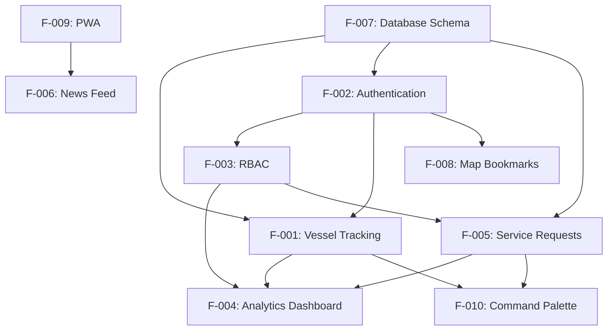
```mermaid
graph TD
    F002[F-002: Authentication] --> F003[F-003: RBAC]
    F002 --> F001[F-001: Vessel Tracking]
    F002 --> F008[F-008: Map Bookmarks]
    F003 --> F004[F-004: Analytics Dashboard]
    F003 --> F005[F-005: Service Requests]
    F007[F-007: Database Schema] --> F001
    F007 --> F002
    F007 --> F005
    F001 --> F004
    F005 --> F004
    F001 --> F010[F-010: Command Palette]
    F005 --> F010
    F009[F-009: PWA] --> F006[F-006: News Feed]
```

#### Integration Points

| Feature Pair | Integration Type | Shared Components |
|--------------|------------------|-------------------|
| F-001 & F-008 | Direct Integration | Map interface, coordinate storage |
| F-002 & F-003 | Security Layer | User identity, permission validation |
| F-004 & F-005 | Data Analytics | Request status data, aggregation services |
| F-001 & F-010 | Search Integration | Vessel search index, global navigation |
| F-009 & F-006 | Offline Capability | Content caching, background sync |

#### Shared Services

| Service | Used By Features | Purpose |
|---------|------------------|---------|
| Authentication Service | F-002, F-003, F-001, F-004, F-005, F-008 | User identity and session management |
| Database Service | F-007, F-001, F-002, F-005, F-008 | Data persistence and retrieval |
| Real-time Service | F-001, F-004, F-005 | SignalR-based live updates |
| Caching Service | F-006, F-009, F-001 | Performance optimization and offline support |

## 2.4 Implementation Considerations

#### Technical Constraints

| Feature | Constraints | Mitigation Strategy |
|---------|-------------|-------------------|
| F-002 | Firebase free tier: 50,000 MAU limit | Monitor usage, implement user lifecycle management |
| F-007 | PostgreSQL hosting limitations on free tiers | Choose provider with adequate free tier, plan for scaling |
| F-001 | Real-time performance requirements | Optimize SignalR connections, implement connection pooling |
| F-009 | Browser compatibility for PWA features | Progressive enhancement, feature detection |

#### Performance Requirements

| Feature | Performance Target | Measurement Method |
|---------|-------------------|-------------------|
| F-001 | <2s map load, <1s updates | Performance monitoring, user experience metrics |
| F-002 | <1s authentication response | API response time monitoring |
| F-004 | <3s dashboard load | Page load time analysis |
| F-005 | <2s form submission | Form interaction tracking |

#### Scalability Considerations

| Feature | Scaling Challenge | Solution Approach |
|---------|------------------|-------------------|
| F-001 | Concurrent WebSocket connections | Connection pooling, load balancing |
| F-004 | Analytics query performance | Data aggregation optimization, caching |
| F-007 | Database performance | Proper indexing, query optimization |
| F-009 | Offline data synchronization | Incremental sync, conflict resolution |

#### Security Implications

| Feature | Security Risk | Mitigation |
|---------|---------------|------------|
| F-001 | Vessel data exposure | Role-based access control, data encryption |
| F-002 | Authentication bypass | JWT validation, secure token handling |
| F-003 | Privilege escalation | Permission validation at multiple layers |
| F-005 | Data tampering | Input validation, audit trails |

#### Maintenance Requirements

| Feature | Maintenance Need | Frequency |
|---------|------------------|-----------|
| F-002 | Firebase token refresh | Automatic |
| F-006 | RSS feed updates | Daily |
| F-007 | Database backups | Daily |
| F-009 | Service worker updates | As needed |

# 3. Technology Stack

## 3.1 Programming Languages

#### Backend Development

**C# 13**
- **Primary Language:** C# 13 ships with the .NET 9 SDK and includes new features such as partial properties and indexers in partial types, overload resolution priority, and field backed properties
- **Version:** Latest with .NET 9 SDK
- **Justification:** Native integration with ASP.NET Core 9, strong typing system, excellent tooling support, and comprehensive ecosystem for enterprise applications
- **Key Features:** Enhanced pattern matching, improved performance optimizations, and better nullable reference type support

**SQL (PostgreSQL Dialect)**
- **Purpose:** Database schema definition, stored procedures, and complex queries
- **Version:** PostgreSQL 16+ compatible
- **Justification:** Industry-standard for relational database operations with excellent performance characteristics

#### Frontend Development

**C# with Blazor WebAssembly**
- **Primary Language:** C# 13 for component logic and business rules
- **Justification:** Unified development experience across frontend and backend, eliminating JavaScript complexity while maintaining modern web capabilities
- **Benefits:** Type safety, shared models, reduced context switching for developers

**HTML5 & CSS3**
- **Purpose:** Markup structure and styling foundation
- **Standards:** Modern web standards with semantic HTML and responsive CSS Grid/Flexbox

**JavaScript (Minimal)**
- **Purpose:** Service worker implementation, browser API interop, and PWA functionality
- **Scope:** Limited to essential browser integrations that cannot be handled through Blazor's JavaScript interop

## 3.2 Frameworks & Libraries

#### Core Backend Framework

**ASP.NET Core 9.0**
- **Version:** 9.0 (Latest LTS)
- **Key Features:** Secure by default applications, expanded support for ahead-of-time compilation, optimized handling of static files with automatic fingerprinted versioning, and built-in support for OpenAPI document generation
- **Justification:** Production-ready framework with excellent performance, security, and scalability characteristics
- **Enhanced Capabilities:** Native AOT compilation support for SignalR client and server scenarios, providing performance benefits for real-time web communications

**SignalR with Native AOT Support**
- **Version:** ASP.NET Core 9.0 integrated
- **Purpose:** Real-time vessel position updates and live dashboard notifications
- **Key Features:** ActivitySource named Microsoft.AspNetCore.SignalR.Client for distributed tracing, hub invocations create client spans, and context propagation enabling true distributed tracing from client to server
- **Performance:** Trimming and native ahead-of-time (AOT) compilation support for both client and server scenarios

#### Frontend Framework

**Blazor WebAssembly with PWA Support**
- **Version:** .NET 9.0
- **Architecture:** Standalone WebAssembly application with PWA capabilities
- **Key Features:** Standards-based client-side web app platform supporting PWA APIs for working offline and loading instantly, independent of network speed
- **PWA Capabilities:** Offline capability implementation using service worker and local storage, with form data storage when offline and data synchronization when online

**Progressive Web App (PWA) Features**
- **Service Worker:** Located in wwwroot/service-worker.js, enables offline support by caching assets
- **Offline Strategy:** Caching dynamic responses using IndexedDB for API data storage and retrieval
- **Background Sync:** Service workers for caching, IndexedDB for dynamic data, and robust synchronization logic for offline-first functionality

#### Supporting Libraries

**Entity Framework Core 9.0**
- **Purpose:** Object-relational mapping and database operations
- **Features:** Significant updates including steps towards AOT compilation and pre-compiled queries
- **Database Provider:** PostgreSQL with Npgsql provider

**FluentValidation**
- **Purpose:** Input validation for API endpoints and DTOs
- **Integration:** ASP.NET Core middleware integration for automatic validation

**Serilog**
- **Purpose:** Structured logging with JSON output
- **Configuration:** Console and file sinks with structured data support

## 3.3 Open Source Dependencies

#### Backend Dependencies

**Microsoft.AspNetCore.OpenApi**
- **Version:** 9.0.x
- **Purpose:** Built-in OpenAPI document generation support, replacing Swashbuckle in templates with native Microsoft.AspNetCore.OpenApi package
- **Registry:** NuGet Package Manager

**Npgsql.EntityFrameworkCore.PostgreSQL**
- **Version:** 8.0.x (compatible with EF Core 9)
- **Purpose:** PostgreSQL database provider for Entity Framework Core
- **Registry:** NuGet Package Manager

**Microsoft.AspNetCore.SignalR**
- **Version:** 9.0.x (included in ASP.NET Core)
- **Purpose:** Real-time communication infrastructure
- **Registry:** Built-in framework component

**FluentValidation.AspNetCore**
- **Version:** 11.3.x
- **Purpose:** Model validation integration
- **Registry:** NuGet Package Manager

**Serilog.AspNetCore**
- **Version:** 8.0.x
- **Purpose:** Structured logging implementation
- **Registry:** NuGet Package Manager

#### Frontend Dependencies

**Microsoft.AspNetCore.Components.WebAssembly**
- **Version:** 9.0.x
- **Purpose:** Core Blazor WebAssembly runtime
- **Registry:** NuGet Package Manager

**Microsoft.AspNetCore.Components.WebAssembly.PWA**
- **Version:** 9.0.x
- **Purpose:** Progressive Web Application support with service-worker.published.js file for offline functionality
- **Registry:** NuGet Package Manager

**Blazored.LocalStorage**
- **Version:** 4.5.x
- **Purpose:** Browser local storage access for offline data caching and PWA functionality
- **Registry:** NuGet Package Manager

**System.Net.Http.Json**
- **Version:** 9.0.x
- **Purpose:** HTTP client with JSON serialization support
- **Registry:** NuGet Package Manager

## 3.4 Third-Party Services

#### Authentication Service

**Firebase Authentication**
- **Service Type:** Backend-as-a-Service (BaaS) authentication
- **Free Tier:** Free for the first 50,000 Monthly Active Users (MAUs) for basic email/password and social logins
- **Supported Methods:** Email & Password, Google, Facebook, Twitter, GitHub, Apple, Microsoft, and Yahoo sign-ins
- **Integration:** JWT token validation in ASP.NET Core
- **Cost Structure:** Only forced to upgrade beyond 50,000 MAUs, with MAU defined as any user account that signs in or is created within a calendar month, counted once per month regardless of sign-in frequency

#### Map Services

**OpenStreetMap with Leaflet**
- **Service Type:** Open-source mapping solution
- **Cost:** Completely free with no usage limits
- **Features:** Interactive maps, multiple tile layers, vessel position overlays
- **Justification:** No API costs, reliable service, extensive customization options

#### RSS Feed Aggregation

**Public Maritime RSS Feeds**
- **Service Type:** Public RSS/XML feeds from maritime industry sources
- **Cost:** Free public feeds
- **Implementation:** Client-side aggregation and filtering
- **Sources:** Maritime industry publications, port authorities, shipping news

## 3.5 Databases & Storage

#### Primary Database

**PostgreSQL**
- **Version:** 16.x
- **Hosting Options:** Neon serverless PostgreSQL database with autoscaling and database branching features, particularly beneficial for CI/CD and testing environments
- **Free Tier Providers:**
  - **Neon:** Serverless PostgreSQL with autoscaling and database branching, effortlessly growing with needs and simplifying environment management
  - **Supabase:** Open-source alternative to Firebase providing real-time database, authentication, and storage services built on PostgreSQL
  - **Vercel Postgres:** Streamlined PostgreSQL deployment experience, essentially white-labeled Neon Tech under Vercel's brand
- **Justification:** Robust ACID compliance, excellent performance, strong ecosystem support, and multiple free hosting options

#### Caching Strategy

**In-Memory Caching**
- **Implementation:** ASP.NET Core built-in IMemoryCache
- **Purpose:** API response caching, frequently accessed data
- **Configuration:** Configurable TTL and memory limits

**Browser Storage**
- **LocalStorage:** Browser-based storage for offline PWA functionality and dynamic data caching
- **IndexedDB:** Browser-based database for storing and retrieving API responses in offline scenarios
- **Service Worker Cache:** Asset caching for offline support, intercepting network requests to serve cached content

#### File Storage

**Local File System**
- **Purpose:** Static assets, application files, logs
- **Implementation:** Standard file system operations
- **Backup:** Regular automated backups to cloud storage

## 3.6 Development & Deployment

#### Development Tools

**Visual Studio Code**
- **Platform:** Cross-platform support (macOS, Windows, Linux)
- **Extensions:** C# Dev Kit, .NET Extension Pack, Docker extension
- **Justification:** Excellent .NET 9 support, integrated debugging, cross-platform compatibility

**Docker & Docker Compose**
- **Purpose:** Local development environment, PostgreSQL containerization
- **Configuration:** docker-compose.yml for local PostgreSQL instance
- **Benefits:** Consistent development environment across platforms

**.NET CLI**
- **Version:** 9.0.x
- **Purpose:** Project scaffolding, building, testing, and local execution
- **Cross-Platform:** Full macOS support with dotnet CLI commands

#### Build System

**MSBuild**
- **Version:** Integrated with .NET 9 SDK
- **Features:** Optimized handling of static files with automatic fingerprinted versioning, new Blazor templates with enhanced capabilities
- **Configuration:** Project files (.csproj) with modern SDK-style format

#### Containerization

**Docker**
- **Base Images:** mcr.microsoft.com/dotnet/aspnet:9.0 for runtime
- **Multi-stage Builds:** Optimized container images with minimal attack surface
- **Development:** docker-compose.yml for local PostgreSQL and development services

#### CI/CD Pipeline

**GitHub Actions**
- **Workflow:** Advanced dotnet.yml with separate jobs for Build, Test, Scan, and Deploy
- **Strategy:** Staging/Production deployment based on develop/main branches
- **Requirements:** 80% code coverage enforcement
- **Features:** Automated testing, security scanning, deployment automation

**Deployment Targets**
- **Free Hosting Options:** GitHub Pages (static assets), Railway, Render, or similar platforms with free tiers
- **Database:** Managed PostgreSQL on free tier providers (Neon, Supabase, Vercel)
- **CDN:** GitHub Pages or Netlify for static asset delivery

#### Monitoring & Health Checks

**Health Checks**
- **Endpoint:** /healthz for application health monitoring
- **Components:** Database connectivity, external service availability
- **Integration:** Built-in ASP.NET Core health check middleware

**Logging**
- **Implementation:** Serilog with structured JSON logging, supporting nullable reference type annotations and customizable JSON indentation
- **Outputs:** Console (development), structured files (production)
- **Monitoring:** Application insights through structured log analysis

#### Security & Compliance

**HTTPS Enforcement**
- **Development:** Easier setup for trusted development certificate on Linux to enable HTTPS during development
- **Production:** Automatic HTTPS redirection and HSTS headers

**CORS Policy**
- **Configuration:** Strict Cross-Origin Resource Sharing policy
- **Scope:** Limited to deployed frontend domain only

**Input Validation**
- **Implementation:** FluentValidation for all API endpoints
- **Error Handling:** RFC 7807 Problem Details for standardized error responses

This technology stack provides a comprehensive, production-ready foundation for the HarborFlow Suite while maintaining strict adherence to free-tier requirements. The combination of ASP.NET Core 9's secure-by-default approach, performance improvements, and optimized static file handling with modern PWA capabilities ensures both excellent developer experience and end-user performance.

# 4. Process Flowchart

## 4.1 System Workflow Overview

### 4.1.1 High-Level System Architecture Flow

The HarborFlow Suite operates through SignalR hubs that provide a high-level pipeline allowing clients and servers to call methods on each other, with SignalR handling dispatching across machine boundaries automatically. The system follows a comprehensive workflow pattern that integrates real-time communication, authentication, and data management.

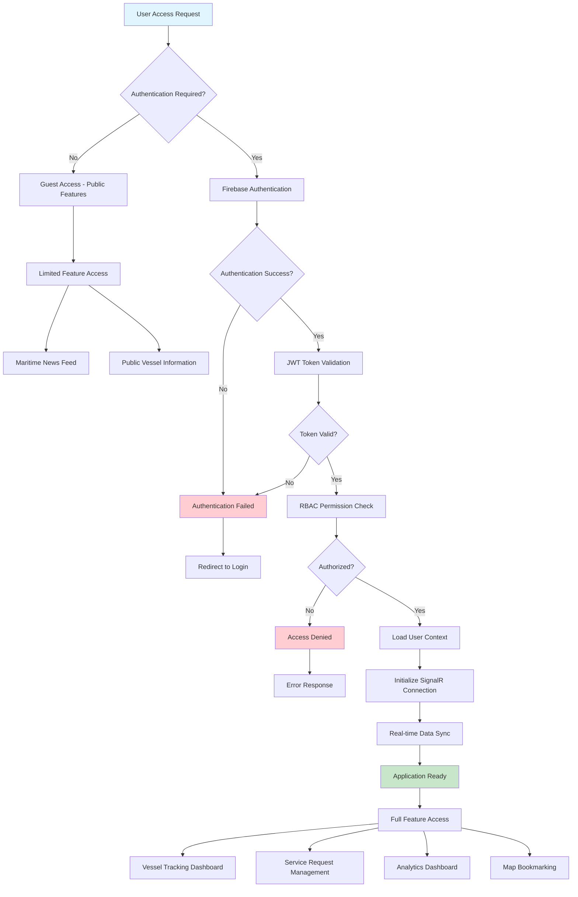
```mermaid
flowchart TD
    A[User Access Request] --> B{Authentication Required?}
    B -->|No| C[Guest Access - Public Features]
    B -->|Yes| D[Firebase Authentication]
    D --> E{Authentication Success?}
    E -->|No| F[Authentication Failed]
    E -->|Yes| G[JWT Token Validation]
    G --> H{Token Valid?}
    H -->|No| F
    H -->|Yes| I[RBAC Permission Check]
    I --> J{Authorized?}
    J -->|No| K[Access Denied]
    J -->|Yes| L[Load User Context]
    L --> M[Initialize SignalR Connection]
    M --> N[Real-time Data Sync]
    N --> O[Application Ready]
    
    C --> P[Limited Feature Access]
    P --> Q[Maritime News Feed]
    P --> R[Public Vessel Information]
    
    O --> S[Full Feature Access]
    S --> T[Vessel Tracking Dashboard]
    S --> U[Service Request Management]
    S --> V[Analytics Dashboard]
    S --> W[Map Bookmarking]
    
    F --> X[Redirect to Login]
    K --> Y[Error Response]
    
    style A fill:#e1f5fe
    style O fill:#c8e6c9
    style F fill:#ffcdd2
    style K fill:#ffcdd2
```

### 4.1.2 Core Business Process Integration

The system integrates multiple business processes through a unified workflow that ensures data consistency and real-time updates across all components.

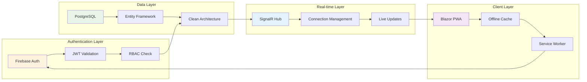
```mermaid
flowchart LR
    subgraph "Authentication Layer"
        A1[Firebase Auth] --> A2[JWT Validation]
        A2 --> A3[RBAC Check]
    end
    
    subgraph "Data Layer"
        D1[PostgreSQL] --> D2[Entity Framework]
        D2 --> D3[Clean Architecture]
    end
    
    subgraph "Real-time Layer"
        R1[SignalR Hub] --> R2[Connection Management]
        R2 --> R3[Live Updates]
    end
    
    subgraph "Client Layer"
        C1[Blazor PWA] --> C2[Offline Cache]
        C2 --> C3[Service Worker]
    end
    
    A3 --> D3
    D3 --> R1
    R3 --> C1
    C3 --> A1
    
    style A1 fill:#fff3e0
    style D1 fill:#e8f5e8
    style R1 fill:#e3f2fd
    style C1 fill:#f3e5f5
```

## 4.2 Authentication & Authorization Workflow

### 4.2.1 User Authentication Process

Authentication is the process of determining a user's identity, while authorization determines whether a user has access to a resource. In ASP.NET Core, authentication is handled by the authentication service, IAuthenticationService, which is used by authentication middleware.

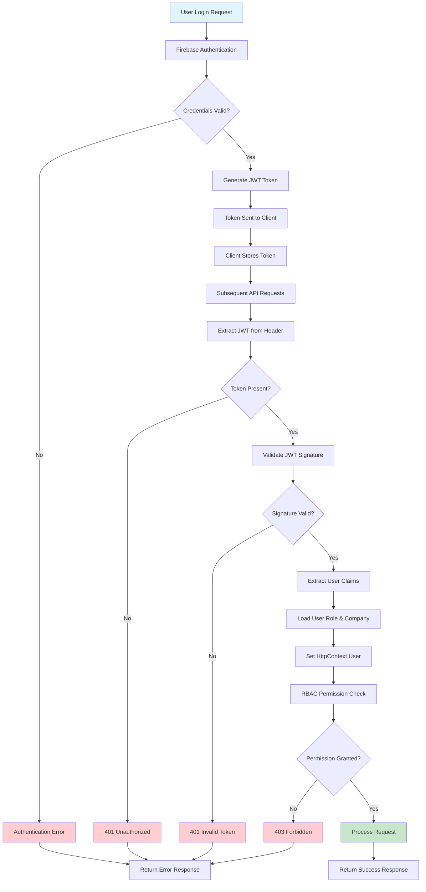
```mermaid
flowchart TD
    A[User Login Request] --> B[Firebase Authentication]
    B --> C{Credentials Valid?}
    C -->|No| D[Authentication Error]
    C -->|Yes| E[Generate JWT Token]
    E --> F[Token Sent to Client]
    F --> G[Client Stores Token]
    G --> H[Subsequent API Requests]
    H --> I[Extract JWT from Header]
    I --> J{Token Present?}
    J -->|No| K[401 Unauthorized]
    J -->|Yes| L[Validate JWT Signature]
    L --> M{Signature Valid?}
    M -->|No| N[401 Invalid Token]
    M -->|Yes| O[Extract User Claims]
    O --> P[Load User Role & Company]
    P --> Q[Set HttpContext.User]
    Q --> R[RBAC Permission Check]
    R --> S{Permission Granted?}
    S -->|No| T[403 Forbidden]
    S -->|Yes| U[Process Request]
    
    D --> V[Return Error Response]
    K --> V
    N --> V
    T --> V
    U --> W[Return Success Response]
    
    style A fill:#e1f5fe
    style U fill:#c8e6c9
    style D fill:#ffcdd2
    style K fill:#ffcdd2
    style N fill:#ffcdd2
    style T fill:#ffcdd2
```

### 4.2.2 Role-Based Access Control Flow

The RBAC system implements a four-tier role structure with granular permissions that control access to system resources and operations.

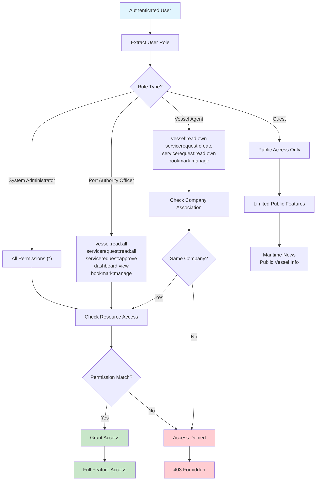
```mermaid
flowchart TD
    A["Authenticated User"] --> B["Extract User Role"]
    B --> C{"Role Type?"}
    
    C -->|"System Administrator"| D["All Permissions (*)"]
    C -->|"Port Authority Officer"| E["vessel:read:all<br/>servicerequest:read:all<br/>servicerequest:approve<br/>dashboard:view<br/>bookmark:manage"]
    C -->|"Vessel Agent"| F["vessel:read:own<br/>servicerequest:create<br/>servicerequest:read:own<br/>bookmark:manage"]
    C -->|"Guest"| G["Public Access Only"]
    
    D --> H["Check Resource Access"]
    E --> H
    F --> I["Check Company Association"]
    G --> J["Limited Public Features"]
    
    I --> K{"Same Company?"}
    K -->|"Yes"| H
    K -->|"No"| L["Access Denied"]
    
    H --> M{"Permission Match?"}
    M -->|"Yes"| N["Grant Access"]
    M -->|"No"| L
    
    J --> O["Maritime News<br/>Public Vessel Info"]
    N --> P["Full Feature Access"]
    L --> Q["403 Forbidden"]
    
    style A fill:#e1f5fe
    style N fill:#c8e6c9
    style P fill:#c8e6c9
    style L fill:#ffcdd2
    style Q fill:#ffcdd2
```

## 4.3 Real-time Data Synchronization

### 4.3.1 SignalR Communication Flow

SignalR provides an API for creating server-to-client remote procedure calls (RPC), invoking functions on clients from server-side .NET code. It handles connection management automatically and sends messages to all connected clients simultaneously.

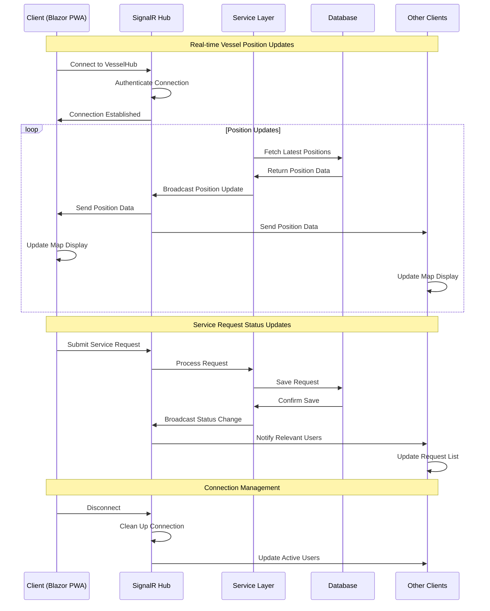
```mermaid
sequenceDiagram
    participant C as Client (Blazor PWA)
    participant H as SignalR Hub
    participant S as Service Layer
    participant D as Database
    participant O as Other Clients
    
    Note over C,O: Real-time Vessel Position Updates
    
    C->>H: Connect to VesselHub
    H->>H: Authenticate Connection
    H->>C: Connection Established
    
    loop Position Updates
        S->>D: Fetch Latest Positions
        D->>S: Return Position Data
        S->>H: Broadcast Position Update
        H->>C: Send Position Data
        H->>O: Send Position Data
        C->>C: Update Map Display
        O->>O: Update Map Display
    end
    
    Note over C,O: Service Request Status Updates
    
    C->>H: Submit Service Request
    H->>S: Process Request
    S->>D: Save Request
    D->>S: Confirm Save
    S->>H: Broadcast Status Change
    H->>O: Notify Relevant Users
    O->>O: Update Request List
    
    Note over C,O: Connection Management
    
    C->>H: Disconnect
    H->>H: Clean Up Connection
    H->>O: Update Active Users
```

### 4.3.2 Offline-First PWA Synchronization

For apps that rely on API data, caching dynamic responses is essential using IndexedDB, a browser-based database, to store and retrieve API responses. Blazor's IndexedDB libraries or JavaScript interop manage dynamic data caching.

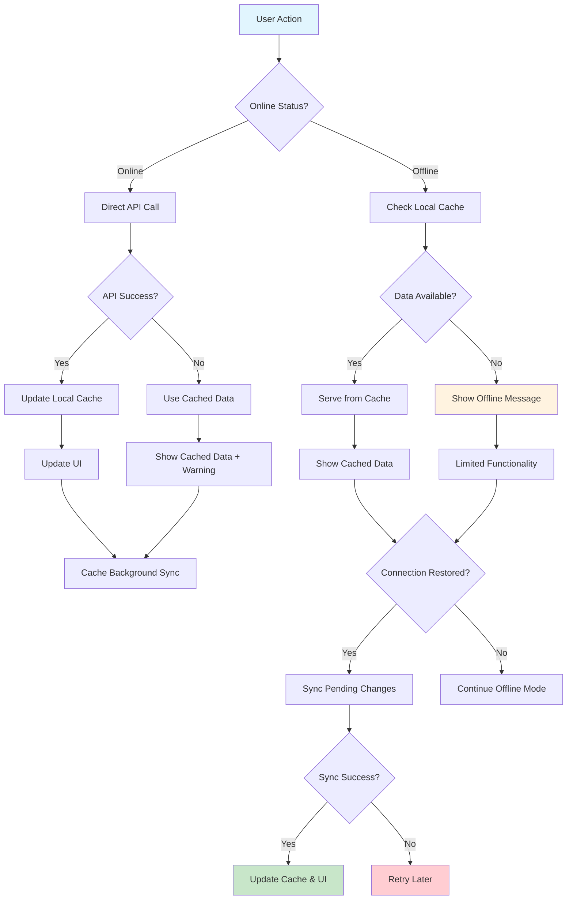
```mermaid
flowchart TD
    A[User Action] --> B{Online Status?}
    B -->|Online| C[Direct API Call]
    B -->|Offline| D[Check Local Cache]
    
    C --> E{API Success?}
    E -->|Yes| F[Update Local Cache]
    E -->|No| G[Use Cached Data]
    
    D --> H{Data Available?}
    H -->|Yes| I[Serve from Cache]
    H -->|No| J[Show Offline Message]
    
    F --> K[Update UI]
    G --> L[Show Cached Data + Warning]
    I --> M[Show Cached Data]
    J --> N[Limited Functionality]
    
    K --> O[Cache Background Sync]
    L --> O
    M --> P{Connection Restored?}
    N --> P
    
    P -->|Yes| Q[Sync Pending Changes]
    P -->|No| R[Continue Offline Mode]
    
    Q --> S{Sync Success?}
    S -->|Yes| T[Update Cache & UI]
    S -->|No| U[Retry Later]
    
    style A fill:#e1f5fe
    style T fill:#c8e6c9
    style J fill:#fff3e0
    style U fill:#ffcdd2
```

## 4.4 Service Request Management Workflow

### 4.4.1 End-to-End Service Request Process

The service request workflow implements a comprehensive approval system with audit trails and real-time notifications.

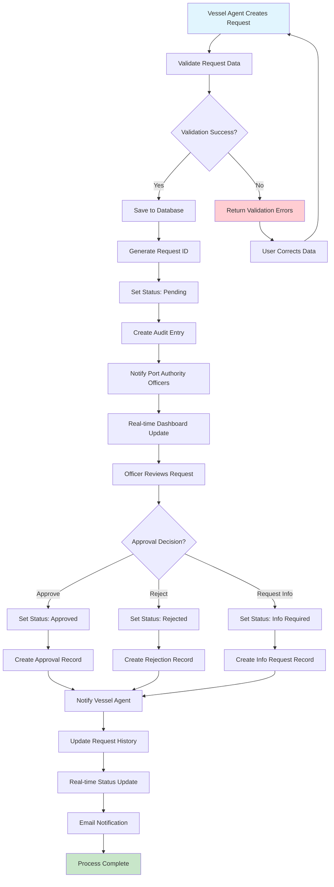
```mermaid
flowchart TD
    A[Vessel Agent Creates Request] --> B[Validate Request Data]
    B --> C{Validation Success?}
    C -->|No| D[Return Validation Errors]
    C -->|Yes| E[Save to Database]
    E --> F[Generate Request ID]
    F --> G[Set Status: Pending]
    G --> H[Create Audit Entry]
    H --> I[Notify Port Authority Officers]
    I --> J[Real-time Dashboard Update]
    
    J --> K[Officer Reviews Request]
    K --> L{Approval Decision?}
    L -->|Approve| M[Set Status: Approved]
    L -->|Reject| N[Set Status: Rejected]
    L -->|Request Info| O[Set Status: Info Required]
    
    M --> P[Create Approval Record]
    N --> Q[Create Rejection Record]
    O --> R[Create Info Request Record]
    
    P --> S[Notify Vessel Agent]
    Q --> S
    R --> S
    
    S --> T[Update Request History]
    T --> U[Real-time Status Update]
    U --> V[Email Notification]
    V --> W[Process Complete]
    
    D --> X[User Corrects Data]
    X --> A
    
    style A fill:#e1f5fe
    style W fill:#c8e6c9
    style D fill:#ffcdd2
```

### 4.4.2 Approval Workflow State Management

The system maintains strict state transitions for service requests with proper validation and audit trails.

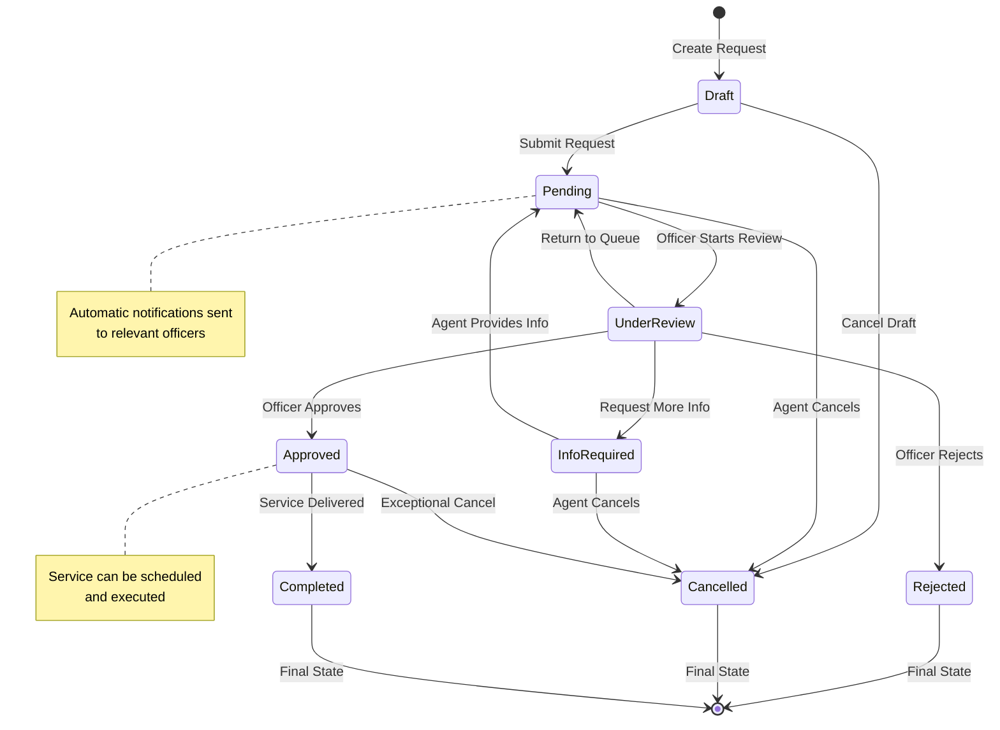
```mermaid
stateDiagram-v2
    [*] --> Draft: Create Request
    Draft --> Pending: Submit Request
    Draft --> Cancelled: Cancel Draft
    
    Pending --> UnderReview: Officer Starts Review
    Pending --> Cancelled: Agent Cancels
    
    UnderReview --> Approved: Officer Approves
    UnderReview --> Rejected: Officer Rejects
    UnderReview --> InfoRequired: Request More Info
    UnderReview --> Pending: Return to Queue
    
    InfoRequired --> Pending: Agent Provides Info
    InfoRequired --> Cancelled: Agent Cancels
    
    Approved --> Completed: Service Delivered
    Approved --> Cancelled: Exceptional Cancel
    
    Rejected --> [*]: Final State
    Cancelled --> [*]: Final State
    Completed --> [*]: Final State
    
    note right of Pending
        Automatic notifications sent
        to relevant officers
    end note
    
    note right of Approved
        Service can be scheduled
        and executed
    end note
```

## 4.5 Data Management & Persistence

### 4.5.1 Database Transaction Flow

The system implements robust transaction management to ensure data consistency across all operations.

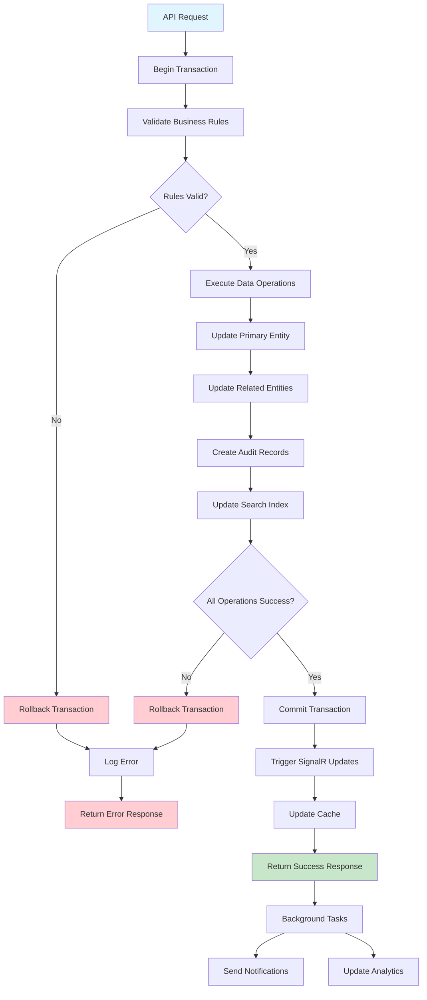
```mermaid
flowchart TD
    A[API Request] --> B[Begin Transaction]
    B --> C[Validate Business Rules]
    C --> D{Rules Valid?}
    D -->|No| E[Rollback Transaction]
    D -->|Yes| F[Execute Data Operations]
    
    F --> G[Update Primary Entity]
    G --> H[Update Related Entities]
    H --> I[Create Audit Records]
    I --> J[Update Search Index]
    J --> K{All Operations Success?}
    
    K -->|No| L[Rollback Transaction]
    K -->|Yes| M[Commit Transaction]
    
    M --> N[Trigger SignalR Updates]
    N --> O[Update Cache]
    O --> P[Return Success Response]
    
    E --> Q[Log Error]
    L --> Q
    Q --> R[Return Error Response]
    
    P --> S[Background Tasks]
    S --> T[Send Notifications]
    S --> U[Update Analytics]
    
    style A fill:#e1f5fe
    style P fill:#c8e6c9
    style E fill:#ffcdd2
    style L fill:#ffcdd2
    style R fill:#ffcdd2
```

### 4.5.2 Cache Management Strategy

The system implements a multi-layer caching strategy to optimize performance and support offline functionality.

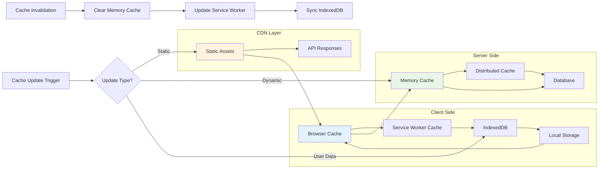
```mermaid
flowchart LR
    subgraph "Client Side"
        A[Browser Cache] --> B[Service Worker Cache]
        B --> C[IndexedDB]
        C --> D[Local Storage]
    end
    
    subgraph "Server Side"
        E[Memory Cache] --> F[Distributed Cache]
        F --> G[Database]
    end
    
    subgraph "CDN Layer"
        H[Static Assets] --> I[API Responses]
    end
    
    A --> E
    D --> A
    E --> G
    H --> A
    
    J[Cache Update Trigger] --> K{Update Type?}
    K -->|Static| H
    K -->|Dynamic| E
    K -->|User Data| C
    
    L[Cache Invalidation] --> M[Clear Memory Cache]
    M --> N[Update Service Worker]
    N --> O[Sync IndexedDB]
    
    style A fill:#e3f2fd
    style E fill:#e8f5e8
    style H fill:#fff3e0
```

## 4.6 Error Handling & Recovery

### 4.6.1 Comprehensive Error Handling Flow

The system implements robust error handling with proper logging, user feedback, and recovery mechanisms.

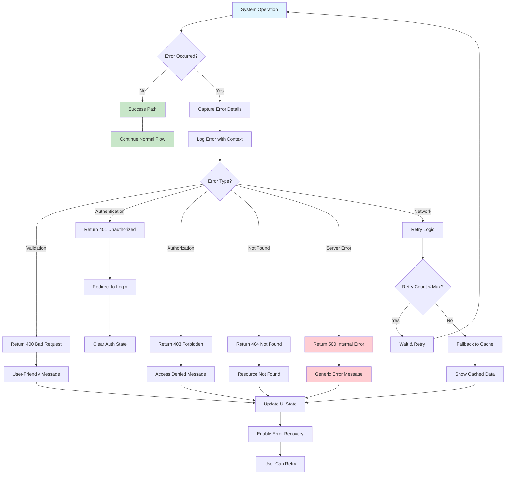
```mermaid
flowchart TD
    A[System Operation] --> B{Error Occurred?}
    B -->|No| C[Success Path]
    B -->|Yes| D[Capture Error Details]
    
    D --> E[Log Error with Context]
    E --> F{Error Type?}
    
    F -->|Validation| G[Return 400 Bad Request]
    F -->|Authentication| H[Return 401 Unauthorized]
    F -->|Authorization| I[Return 403 Forbidden]
    F -->|Not Found| J[Return 404 Not Found]
    F -->|Server Error| K[Return 500 Internal Error]
    F -->|Network| L[Retry Logic]
    
    G --> M[User-Friendly Message]
    H --> N[Redirect to Login]
    I --> O[Access Denied Message]
    J --> P[Resource Not Found]
    K --> Q[Generic Error Message]
    
    L --> R{Retry Count < Max?}
    R -->|Yes| S[Wait & Retry]
    R -->|No| T[Fallback to Cache]
    
    S --> A
    T --> U[Show Cached Data]
    
    M --> V[Update UI State]
    N --> W[Clear Auth State]
    O --> V
    P --> V
    Q --> V
    U --> V
    
    V --> X[Enable Error Recovery]
    X --> Y[User Can Retry]
    
    C --> Z[Continue Normal Flow]
    
    style A fill:#e1f5fe
    style C fill:#c8e6c9
    style Z fill:#c8e6c9
    style K fill:#ffcdd2
    style Q fill:#ffcdd2
```

### 4.6.2 Network Failure Recovery

An offline-first strategy provides reliability where apps remain functional even with intermittent or no connectivity, with cached assets loading faster for improved responsiveness. By leveraging service workers for caching, IndexedDB for dynamic data, and robust synchronization logic, apps remain functional even in challenging network conditions.

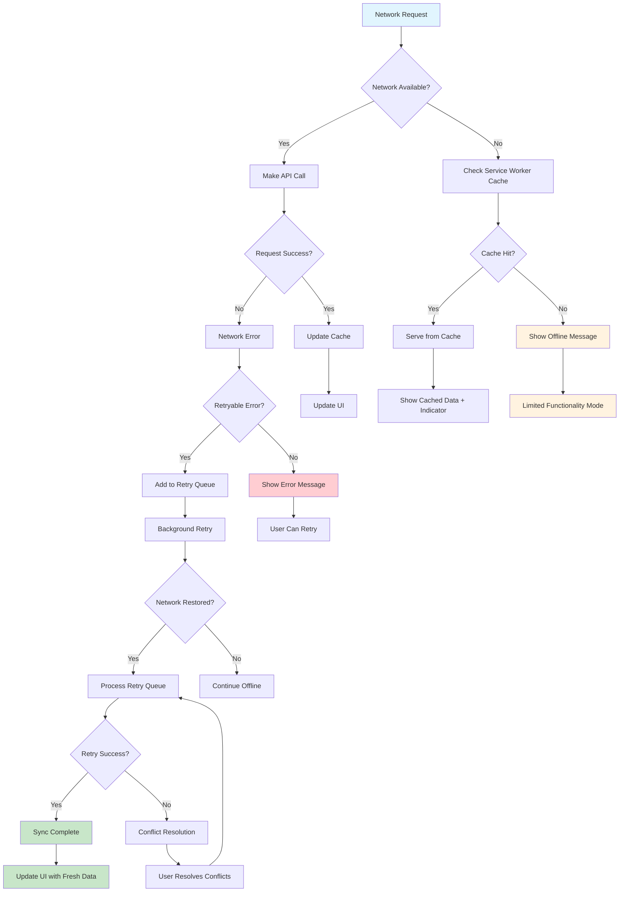
```mermaid
flowchart TD
    A[Network Request] --> B{Network Available?}
    B -->|Yes| C[Make API Call]
    B -->|No| D[Check Service Worker Cache]
    
    C --> E{Request Success?}
    E -->|Yes| F[Update Cache]
    E -->|No| G[Network Error]
    
    D --> H{Cache Hit?}
    H -->|Yes| I[Serve from Cache]
    H -->|No| J[Show Offline Message]
    
    G --> K{Retryable Error?}
    K -->|Yes| L[Add to Retry Queue]
    K -->|No| M[Show Error Message]
    
    F --> N[Update UI]
    I --> O[Show Cached Data + Indicator]
    J --> P[Limited Functionality Mode]
    L --> Q[Background Retry]
    M --> R[User Can Retry]
    
    Q --> S{Network Restored?}
    S -->|Yes| T[Process Retry Queue]
    S -->|No| U[Continue Offline]
    
    T --> V{Retry Success?}
    V -->|Yes| W[Sync Complete]
    V -->|No| X[Conflict Resolution]
    
    W --> Y[Update UI with Fresh Data]
    X --> Z[User Resolves Conflicts]
    Z --> T
    
    style A fill:#e1f5fe
    style W fill:#c8e6c9
    style Y fill:#c8e6c9
    style J fill:#fff3e0
    style P fill:#fff3e0
    style M fill:#ffcdd2
```

## 4.7 Performance Optimization Workflows

### 4.7.1 Application Startup Optimization

The system implements optimized startup procedures to minimize initial load times and improve user experience.

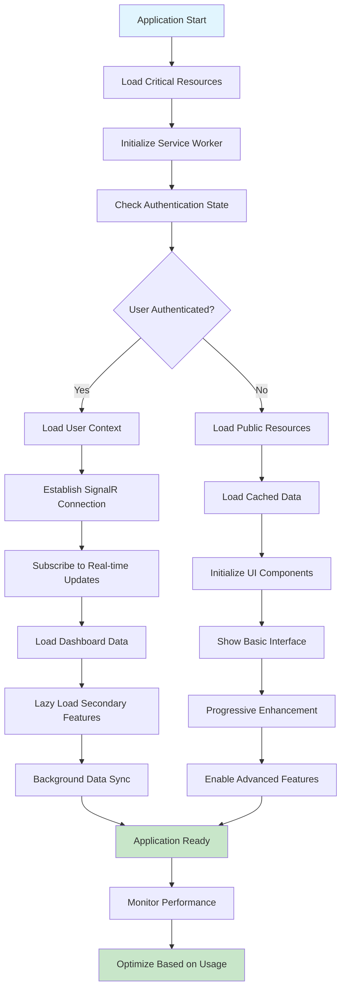
```mermaid
flowchart TD
    A[Application Start] --> B[Load Critical Resources]
    B --> C[Initialize Service Worker]
    C --> D[Check Authentication State]
    D --> E{User Authenticated?}
    
    E -->|Yes| F[Load User Context]
    E -->|No| G[Load Public Resources]
    
    F --> H[Establish SignalR Connection]
    G --> I[Load Cached Data]
    
    H --> J[Subscribe to Real-time Updates]
    I --> K[Initialize UI Components]
    
    J --> L[Load Dashboard Data]
    K --> M[Show Basic Interface]
    
    L --> N[Lazy Load Secondary Features]
    M --> O[Progressive Enhancement]
    
    N --> P[Background Data Sync]
    O --> Q[Enable Advanced Features]
    
    P --> R[Application Ready]
    Q --> R
    
    R --> S[Monitor Performance]
    S --> T[Optimize Based on Usage]
    
    style A fill:#e1f5fe
    style R fill:#c8e6c9
    style T fill:#c8e6c9
```

### 4.7.2 Resource Loading Strategy

The system implements intelligent resource loading to balance performance with functionality.

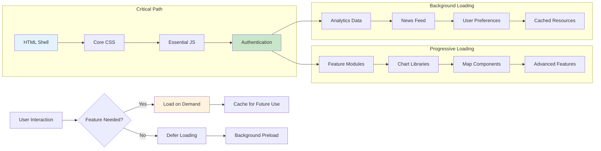
```mermaid
flowchart LR
    subgraph "Critical Path"
        A[HTML Shell] --> B[Core CSS]
        B --> C[Essential JS]
        C --> D[Authentication]
    end
    
    subgraph "Progressive Loading"
        E[Feature Modules] --> F[Chart Libraries]
        F --> G[Map Components]
        G --> H[Advanced Features]
    end
    
    subgraph "Background Loading"
        I[Analytics Data] --> J[News Feed]
        J --> K[User Preferences]
        K --> L[Cached Resources]
    end
    
    D --> E
    D --> I
    
    M[User Interaction] --> N{Feature Needed?}
    N -->|Yes| O[Load on Demand]
    N -->|No| P[Defer Loading]
    
    O --> Q[Cache for Future Use]
    P --> R[Background Preload]
    
    style A fill:#e3f2fd
    style D fill:#c8e6c9
    style O fill:#fff3e0
```

## 4.8 Security Validation Workflows

### 4.8.1 Input Validation & Sanitization

The system implements comprehensive input validation to prevent security vulnerabilities and ensure data integrity.

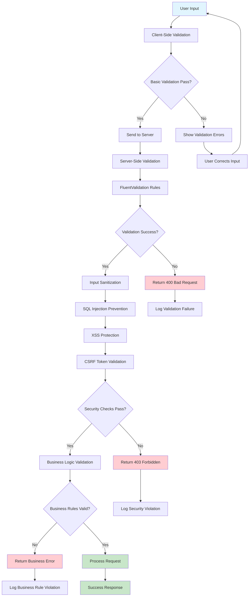
```mermaid
flowchart TD
    A[User Input] --> B[Client-Side Validation]
    B --> C{Basic Validation Pass?}
    C -->|No| D[Show Validation Errors]
    C -->|Yes| E[Send to Server]
    
    E --> F[Server-Side Validation]
    F --> G[FluentValidation Rules]
    G --> H{Validation Success?}
    H -->|No| I[Return 400 Bad Request]
    H -->|Yes| J[Input Sanitization]
    
    J --> K[SQL Injection Prevention]
    K --> L[XSS Protection]
    L --> M[CSRF Token Validation]
    M --> N{Security Checks Pass?}
    
    N -->|No| O[Return 403 Forbidden]
    N -->|Yes| P[Business Logic Validation]
    P --> Q{Business Rules Valid?}
    Q -->|No| R[Return Business Error]
    Q -->|Yes| S[Process Request]
    
    D --> T[User Corrects Input]
    T --> A
    
    I --> U[Log Validation Failure]
    O --> V[Log Security Violation]
    R --> W[Log Business Rule Violation]
    
    S --> X[Success Response]
    
    style A fill:#e1f5fe
    style S fill:#c8e6c9
    style X fill:#c8e6c9
    style I fill:#ffcdd2
    style O fill:#ffcdd2
    style R fill:#ffcdd2
```

### 4.8.2 API Security Enforcement

The system enforces comprehensive API security measures at multiple layers to protect against various attack vectors.

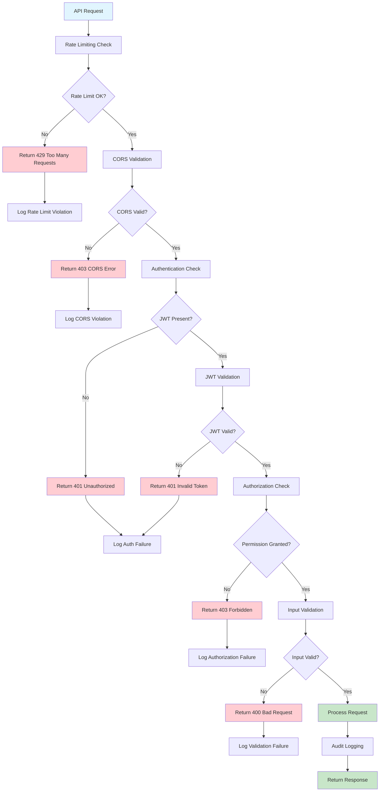
```mermaid
flowchart TD
    A[API Request] --> B[Rate Limiting Check]
    B --> C{Rate Limit OK?}
    C -->|No| D[Return 429 Too Many Requests]
    C -->|Yes| E[CORS Validation]
    
    E --> F{CORS Valid?}
    F -->|No| G[Return 403 CORS Error]
    F -->|Yes| H[Authentication Check]
    
    H --> I{JWT Present?}
    I -->|No| J[Return 401 Unauthorized]
    I -->|Yes| K[JWT Validation]
    
    K --> L{JWT Valid?}
    L -->|No| M[Return 401 Invalid Token]
    L -->|Yes| N[Authorization Check]
    
    N --> O{Permission Granted?}
    O -->|No| P[Return 403 Forbidden]
    O -->|Yes| Q[Input Validation]
    
    Q --> R{Input Valid?}
    R -->|No| S[Return 400 Bad Request]
    R -->|Yes| T[Process Request]
    
    T --> U[Audit Logging]
    U --> V[Return Response]
    
    D --> W[Log Rate Limit Violation]
    G --> X[Log CORS Violation]
    J --> Y[Log Auth Failure]
    M --> Y
    P --> Z[Log Authorization Failure]
    S --> AA[Log Validation Failure]
    
    style A fill:#e1f5fe
    style T fill:#c8e6c9
    style V fill:#c8e6c9
    style D fill:#ffcdd2
    style G fill:#ffcdd2
    style J fill:#ffcdd2
    style M fill:#ffcdd2
    style P fill:#ffcdd2
    style S fill:#ffcdd2
```

This comprehensive process flowchart section provides detailed workflows for all major system operations, ensuring proper error handling, security validation, and performance optimization throughout the HarborFlow Suite. The diagrams illustrate the complex interactions between authentication, real-time communication, data management, and user interface components while maintaining the system's reliability and security requirements.

# 5. System Architecture

## 5.1 High-Level Architecture

#### System Overview

HarborFlow Suite implements Clean Architecture principles, which represent a loosely-coupled, dependency-inverted architecture that puts the business logic and application model at the center of the application. Instead of having business logic depend on data access or other infrastructure concerns, this dependency is inverted: infrastructure and implementation details depend on the Application Core.

The system follows an **API-first, microservices-ready architecture** built on ASP.NET Core 9's enhanced capabilities. The architecture leverages SignalR hubs as a high-level pipeline that allows clients and servers to call methods on each other, with SignalR handling the dispatching across machine boundaries automatically. This enables real-time vessel tracking and live dashboard updates while maintaining clean separation of concerns.

**Key Architectural Principles:**
- **Dependency Inversion**: Core business logic has no dependencies on external frameworks or infrastructure
- **Single Responsibility**: Each component has a clearly defined purpose and responsibility
- **Interface Segregation**: Components depend on abstractions rather than concrete implementations
- **API-First Design**: All functionality exposed through well-defined REST endpoints with OpenAPI documentation
- **Real-time Communication**: Native AOT compilation support for SignalR client and server scenarios provides performance benefits for real-time web communications

**System Boundaries:**
- **Internal**: Core business logic, application services, and domain entities
- **External**: Database persistence, authentication services, real-time communication, and client applications
- **Integration Points**: REST APIs, SignalR hubs, Firebase Authentication, and PostgreSQL database

#### Core Components Table

| Component Name | Primary Responsibility | Key Dependencies | Integration Points | Critical Considerations |
|----------------|----------------------|------------------|-------------------|------------------------|
| **Web API (ASP.NET Core 9)** | Central business logic and data orchestration | Entity Framework Core, SignalR, FluentValidation | REST endpoints, SignalR hubs, Database | Enhanced activity tracking using ActivitySource for better observability and diagnostics |
| **Blazor WebAssembly PWA** | User interface and client-side logic | SignalR client, HTTP client, Service Worker | API consumption, Real-time updates, Offline storage | Standards-based client-side platform with offline-first strategy for reliability and performance |
| **PostgreSQL Database** | Data persistence and integrity | Entity Framework Core provider | Data access layer, Connection pooling | Database per service pattern with private schema ensuring loose coupling but requiring careful management of distributed data |
| **Firebase Authentication** | Identity and access management | JWT token validation, User management | API security, Client authentication | Free tier supporting 50,000 Monthly Active Users with enhanced security features |

#### Data Flow Description

**Primary Data Flows:**
The system implements a **hub-and-spoke pattern** where the ASP.NET Core Web API serves as the central orchestrator. The UI layer works with interfaces defined in the Application Core at compile time, and at run time, implementation types are required for the app to execute, so they need to be present and wired up to the Application Core interfaces via dependency injection.

**Real-time Data Pipeline:**
1. **Data Ingestion**: Vessel position updates enter through API endpoints
2. **Business Logic Processing**: Application services validate and process updates
3. **Persistence**: Entity Framework Core persists changes to PostgreSQL
4. **Real-time Broadcast**: SignalR provides an API for creating server-to-client remote procedure calls (RPC), invoking functions on clients from server-side .NET code
5. **Client Updates**: Blazor PWA receives and displays real-time updates

**Data Transformation Points:**
- **API Layer**: DTOs transform between external contracts and internal models
- **Application Layer**: Domain models encapsulate business rules and validation
- **Infrastructure Layer**: Entity models map to database schema
- **Client Layer**: ViewModels optimize data for UI presentation

**Key Data Stores and Caches:**
- **Primary Store**: PostgreSQL with normalized relational schema
- **Client Cache**: IndexedDB browser-based database stores and retrieves API responses for offline functionality
- **Memory Cache**: ASP.NET Core in-memory caching for frequently accessed data
- **Service Worker Cache**: Static asset caching for PWA offline capabilities

#### External Integration Points

| System Name | Integration Type | Data Exchange Pattern | Protocol/Format | SLA Requirements |
|-------------|------------------|----------------------|-----------------|------------------|
| **Firebase Authentication** | Identity Provider | JWT token validation | HTTPS/JSON | 99.95% uptime, <1s response |
| **OpenStreetMap/Leaflet** | Mapping Service | Tile and vector data | HTTPS/REST | Best effort, graceful degradation |
| **Maritime RSS Feeds** | Content Aggregation | News and updates | RSS/XML | Best effort, client-side caching |
| **PostgreSQL Hosting** | Database Service | Persistent data storage | TCP/PostgreSQL Protocol | 99.9% uptime, <100ms query response |

## 5.2 Component Details

#### Web API Component (ASP.NET Core 9)

**Purpose and Responsibilities:**
The Web API serves as the system's central nervous system, implementing all business logic and data orchestration. The application layer contains the business logic where all business logic is written, following Clean Architecture principles.

**Technologies and Frameworks:**
- **ASP.NET Core 9.0**: Support for trimming and native precompilation (AOT) for performance benefits in real-time web communications
- **Entity Framework Core 9.0**: Object-relational mapping with PostgreSQL provider
- **SignalR**: Real-time communication with enhanced activity tracking
- **FluentValidation**: Input validation and business rule enforcement

**Key Interfaces and APIs:**
- **REST Endpoints**: Versioned API routes (`/api/v1/`) with OpenAPI documentation
- **SignalR Hubs**: Real-time communication channels for vessel updates and notifications
- **Authentication Middleware**: JWT token validation and RBAC enforcement
- **Health Check Endpoints**: `/healthz` for monitoring and diagnostics

**Data Persistence Requirements:**
- **Transactional Integrity**: ACID compliance for critical business operations
- **Connection Pooling**: Optimized database connection management
- **Migration Support**: Entity Framework migrations for schema evolution
- **Audit Logging**: Comprehensive tracking of all data modifications

**Scaling Considerations:**
- **Horizontal Scaling**: Stateless design enables multiple API instances
- **SignalR Scaling**: Redis backplane or Azure SignalR Service required to share state and messages across instances
- **Database Optimization**: Proper indexing and query optimization strategies
- **Caching Strategy**: Multi-layer caching to reduce database load

#### Blazor WebAssembly PWA Component

**Purpose and Responsibilities:**
Blazor WebAssembly is a standards-based client-side web app platform that can use any browser API, including PWA APIs required for working offline and loading instantly, independent of network speed.

**Technologies and Frameworks:**
- **Blazor WebAssembly (.NET 9)**: Client-side execution with C# and Razor components
- **Progressive Web App**: Service workers, caching, and IndexedDB for offline capabilities
- **SignalR Client**: Real-time communication with the Web API
- **Service Worker**: Asset caching and offline functionality

**Key Interfaces and APIs:**
- **HTTP Client**: RESTful API consumption with authentication headers
- **SignalR Connection**: Real-time data synchronization
- **Browser APIs**: Local storage, IndexedDB, and notification APIs
- **PWA Manifest**: Installation and native app-like behavior

**Data Persistence Requirements:**
- **Offline Storage**: IndexedDB for storing and retrieving API responses, managed through Blazor's IndexedDB libraries or JavaScript interop
- **Cache Management**: Service worker handles static asset caching
- **Data Synchronization**: Conflict resolution for offline-to-online data sync
- **State Management**: Client-side state persistence across sessions

**Scaling Considerations:**
- **CDN Distribution**: Static asset delivery through content delivery networks
- **Client-Side Performance**: WebAssembly optimization and lazy loading
- **Offline Capability**: Robust synchronization logic ensures apps remain functional even in challenging network conditions
- **Memory Management**: Efficient component lifecycle and garbage collection

#### PostgreSQL Database Component

**Purpose and Responsibilities:**
PostgreSQL is a feature-rich open-source relational database that offers extensive support for different data types, full ACID compliance for transactions, and advanced indexing techniques, making it an excellent choice for microservices architecture due to its support for diverse data types and strong consistency guarantees.

**Technologies and Frameworks:**
- **PostgreSQL 16+**: Primary relational database engine
- **Entity Framework Core**: ORM with PostgreSQL provider (Npgsql)
- **Connection Pooling**: Optimized connection management
- **Migration System**: Schema versioning and deployment automation

**Key Interfaces and APIs:**
- **Entity Framework DbContext**: Primary data access interface
- **Repository Pattern**: Abstracted data access layer
- **Connection String Configuration**: Environment-specific database connections
- **Health Check Integration**: Database connectivity monitoring

**Data Persistence Requirements:**
- **ACID Compliance**: Transactional integrity for all operations
- **Referential Integrity**: Foreign key constraints and cascading rules
- **Indexing Strategy**: Optimized queries for vessel tracking and analytics
- **Backup and Recovery**: Automated backup procedures and point-in-time recovery

**Scaling Considerations:**
- **Read Replicas**: Separate read and write operations for performance
- **Connection Pooling**: Efficient connection resource management
- **Query Optimization**: Proper indexing and query plan analysis
- **Schema Evolution**: Schema versioning and continuous migration best practices for successful integration

#### Firebase Authentication Component

**Purpose and Responsibilities:**
Provides secure identity and access management with support for multiple authentication methods and comprehensive user lifecycle management.

**Technologies and Frameworks:**
- **Firebase Authentication SDK**: Identity provider integration
- **JWT Token Validation**: Secure API authentication
- **Multi-Provider Support**: Email/password, social logins, and enterprise SSO
- **User Management**: Registration, profile management, and password recovery

**Key Interfaces and APIs:**
- **Authentication API**: User registration, login, and token refresh
- **JWT Validation Middleware**: Server-side token verification
- **User Profile API**: Account management and preferences
- **Admin SDK**: User management and role assignment

**Data Persistence Requirements:**
- **User Profiles**: Secure storage of user identity and preferences
- **Session Management**: Token lifecycle and refresh mechanisms
- **Audit Logging**: Authentication events and security monitoring
- **Role Assignments**: RBAC data synchronized with application database

**Scaling Considerations:**
- **Free Tier Limits**: 50,000 Monthly Active Users maximum
- **Global Distribution**: Firebase's worldwide infrastructure
- **Performance Optimization**: Token caching and validation efficiency
- **Security Monitoring**: Anomaly detection and threat protection

## 5.3 Technical Decisions

#### Architecture Style Decisions and Tradeoffs

**Clean Architecture Selection:**

| Decision Factor | Rationale | Tradeoff |
|----------------|-----------|----------|
| **Maintainability** | Clean Architecture provides a framework for stabilizing the application's core types, leading to a system that is more manageable and maintainable | Increased initial complexity and setup time |
| **Testability** | Because the Application Core doesn't depend on Infrastructure, it's very easy to write automated unit tests for this layer | Additional abstraction layers require more interfaces |
| **Technology Independence** | Core business logic remains isolated from framework changes | More complex dependency injection configuration |

**API-First Design:**

| Benefit | Implementation | Consideration |
|---------|----------------|---------------|
| **Multiple Client Support** | Single API serves web, mobile, and desktop clients | Requires comprehensive API documentation |
| **Team Independence** | Frontend and backend teams can work in parallel | API contract changes require coordination |
| **Integration Flexibility** | Third-party systems can easily integrate | Security and rate limiting become critical |

#### Communication Pattern Choices

**SignalR for Real-time Communication:**

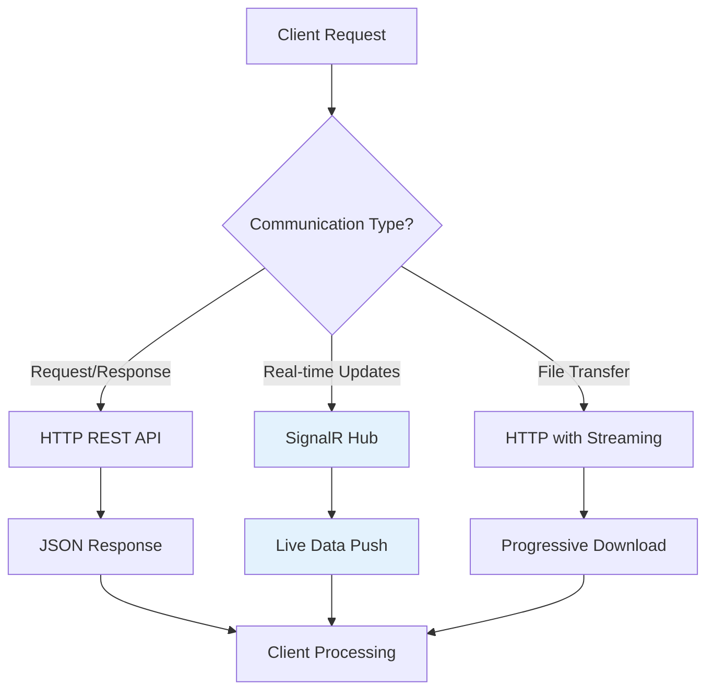
```mermaid
graph TD
    A[Client Request] --> B{Communication Type?}
    B -->|Request/Response| C[HTTP REST API]
    B -->|Real-time Updates| D[SignalR Hub]
    B -->|File Transfer| E[HTTP with Streaming]
    
    C --> F[JSON Response]
    D --> G[Live Data Push]
    E --> H[Progressive Download]
    
    F --> I[Client Processing]
    G --> I
    H --> I
    
    style D fill:#e3f2fd
    style G fill:#e3f2fd
```

**Decision Rationale:**
- SignalR automatically chooses the best transport method that is within the capabilities of the server and client
- Enhanced activity tracking using ActivitySource provides better observability, with each hub method call represented as its own activity for understanding flow and performance
- Native AOT compilation support improves performance for real-time scenarios

#### Data Storage Solution Rationale

**PostgreSQL Selection:**

| Requirement | PostgreSQL Advantage | Alternative Considered |
|-------------|---------------------|----------------------|
| **ACID Compliance** | Full transactional integrity | NoSQL databases lack strong consistency |
| **Complex Queries** | Advanced SQL capabilities and indexing | Document databases have limited query flexibility |
| **Free Hosting** | Multiple providers offer generous free tiers | Commercial databases have licensing costs |
| **Ecosystem Support** | Excellent Entity Framework Core integration | Other databases have less mature .NET support |

**Database Architecture Pattern:**
Database per service pattern with each microservice having its own private database schema, ensuring loose coupling but requiring careful management of distributed data.

#### Caching Strategy Justification

**Multi-Layer Caching Approach:**

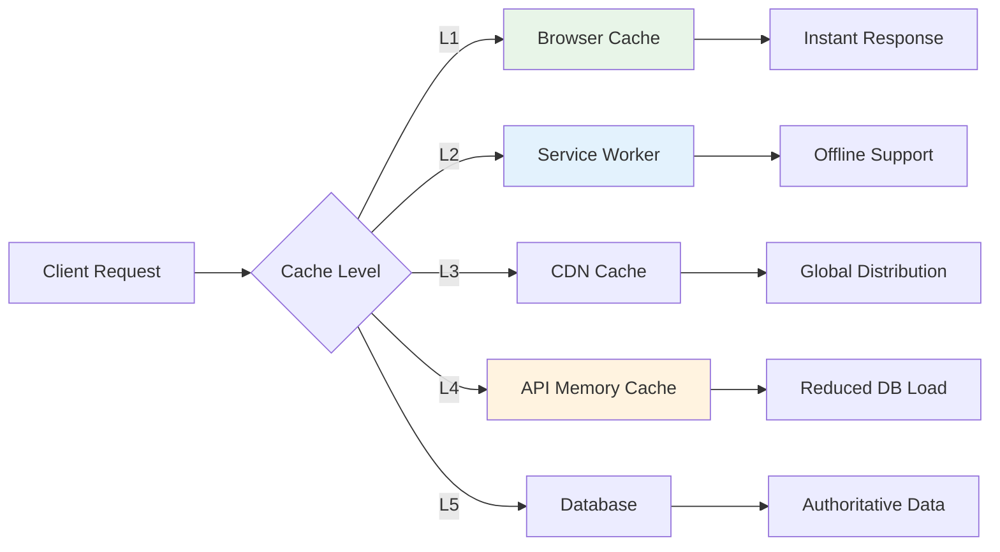
```mermaid
graph LR
    A[Client Request] --> B{Cache Level}
    B -->|L1| C[Browser Cache]
    B -->|L2| D[Service Worker]
    B -->|L3| E[CDN Cache]
    B -->|L4| F[API Memory Cache]
    B -->|L5| G[Database]
    
    C --> H[Instant Response]
    D --> I[Offline Support]
    E --> J[Global Distribution]
    F --> K[Reduced DB Load]
    G --> L[Authoritative Data]
    
    style C fill:#e8f5e8
    style D fill:#e3f2fd
    style F fill:#fff3e0
```

**Strategy Benefits:**
- **Performance**: Cached assets load faster for improved responsiveness and reliability
- **Offline Support**: IndexedDB enables essential dynamic response caching for offline functionality
- **Scalability**: Reduced database load through intelligent caching layers
- **User Experience**: Instant responses for frequently accessed data

#### Security Mechanism Selection

**JWT with Firebase Authentication:**

| Security Layer | Implementation | Benefit |
|----------------|----------------|---------|
| **Authentication** | Firebase JWT tokens | Industry-standard security with 50K MAU free tier |
| **Authorization** | Role-based access control (RBAC) | Granular permission management |
| **API Security** | FluentValidation + middleware | Comprehensive input validation |
| **Transport Security** | HTTPS enforcement | End-to-end encryption |

## 5.4 Cross-Cutting Concerns

#### Monitoring and Observability Approach

**Comprehensive Observability Strategy:**
- **Structured Logging**: Serilog with JSON output for centralized log analysis
- **Distributed Tracing**: SignalR's enhanced activity tracking using ActivitySource emits events for hub method calls, with each method call represented as its own activity and nested activities for understanding flow and performance
- **Health Checks**: `/healthz` endpoint monitoring database and external service connectivity
- **Performance Metrics**: Application insights through structured log analysis

**Monitoring Components:**

| Component | Metrics Tracked | Alert Conditions | Response Actions |
|-----------|----------------|------------------|------------------|
| **API Performance** | Response times, error rates, throughput | >2s response time, >5% error rate | Auto-scaling, circuit breaker activation |
| **SignalR Connections** | Active connections, message throughput | Connection drops >10%, high latency | Connection pool adjustment, load balancing |
| **Database Health** | Query performance, connection pool usage | Slow queries >1s, pool exhaustion | Query optimization, connection scaling |
| **Authentication** | Login success rates, token validation | Failed logins >20%, token errors | Security alert, rate limiting |

#### Logging and Tracing Strategy

**Structured Logging Implementation:**
- **Serilog Configuration**: JSON-formatted logs with contextual information
- **Log Levels**: Trace, Debug, Information, Warning, Error, Critical
- **Correlation IDs**: Request tracking across distributed components
- **Sensitive Data Protection**: Automatic PII scrubbing and masking

**Distributed Tracing:**
SignalR's improved activity tracking using ActivitySource provides better observability and diagnostics for SignalR applications, enabling end-to-end request tracing across the entire system.

#### Error Handling Patterns

**Comprehensive Error Handling Flow:**

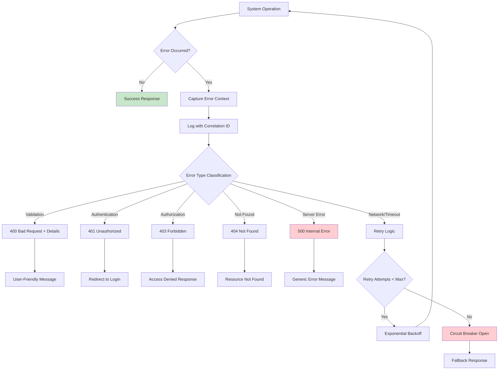
```mermaid
flowchart TD
    A[System Operation] --> B{Error Occurred?}
    B -->|No| C[Success Response]
    B -->|Yes| D[Capture Error Context]
    
    D --> E[Log with Correlation ID]
    E --> F{Error Type Classification}
    
    F -->|Validation| G[400 Bad Request + Details]
    F -->|Authentication| H[401 Unauthorized]
    F -->|Authorization| I[403 Forbidden]
    F -->|Not Found| J[404 Not Found]
    F -->|Server Error| K[500 Internal Error]
    F -->|Network/Timeout| L[Retry Logic]
    
    G --> M[User-Friendly Message]
    H --> N[Redirect to Login]
    I --> O[Access Denied Response]
    J --> P[Resource Not Found]
    K --> Q[Generic Error Message]
    
    L --> R{Retry Attempts < Max?}
    R -->|Yes| S[Exponential Backoff]
    R -->|No| T[Circuit Breaker Open]
    
    S --> A
    T --> U[Fallback Response]
    
    style C fill:#c8e6c9
    style K fill:#ffcdd2
    style T fill:#ffcdd2
```

**Error Handling Principles:**
- **Fail Fast**: Validate inputs early and provide immediate feedback
- **Graceful Degradation**: Maintain core functionality when non-critical services fail
- **Circuit Breaker Pattern**: Prevent cascading failures in distributed systems
- **Retry Logic**: Exponential backoff for transient failures

#### Authentication and Authorization Framework

**Role-Based Access Control (RBAC) Implementation:**

| Role | Permissions | Data Access | Use Cases |
|------|-------------|-------------|-----------|
| **System Administrator** | All permissions (*) | Global access | System management, user administration |
| **Port Authority Officer** | vessel:read:all, servicerequest:approve, dashboard:view | Cross-company visibility | Operational oversight, request approval |
| **Vessel Agent** | vessel:read:own, servicerequest:create, bookmark:manage | Company-specific data | Service requests, vessel monitoring |
| **Guest** | Public access only | Limited public information | Maritime news, basic vessel information |

**Security Architecture:**
- **JWT Token Validation**: Firebase-issued tokens validated on every API request
- **Permission Middleware**: Attribute-based authorization at controller and action levels
- **Data Filtering**: Automatic filtering based on user company association
- **Audit Trail**: Comprehensive logging of all security-related events

#### Performance Requirements and SLAs

**System Performance Targets:**

| Component | Performance Target | Measurement Method | SLA Commitment |
|-----------|-------------------|-------------------|----------------|
| **API Response Time** | <2 seconds for 95th percentile | Application Performance Monitoring | 99.5% uptime |
| **Real-time Updates** | <1 second message delivery | SignalR connection metrics | 99.9% message delivery |
| **Database Queries** | <100ms for standard operations | Query execution time logging | 99.5% query success rate |
| **PWA Load Time** | <3 seconds initial load | Browser performance API | 95% user satisfaction |

#### Disaster Recovery Procedures

**Business Continuity Strategy:**

```mermaid
graph TD
    A[System Failure Detection] --> B{Failure Type?}
    B -->|Database| C[Database Recovery]
    B -->|API Service| D[Service Recovery]
    B -->|Authentication| E[Auth Fallback]
    B -->|Network| F[Network Recovery]
    
    C --> G[Restore from Backup]
    D --> H[Auto-scaling/Restart]
    E --> I[Cached Token Validation]
    F --> J[CDN Failover]
    
    G --> K[Data Integrity Check]
    H --> L[Health Check Validation]
    I --> M[Limited Functionality Mode]
    J --> N[Alternative Route]
    
    K --> O[Service Restoration]
    L --> O
    M --> P[Gradual Service Recovery]
    N --> O
    
    style A fill:#ffcdd2
    style O fill:#c8e6c9
    style P fill:#fff3e0
```

**Recovery Procedures:**
- **Automated Backups**: Daily PostgreSQL backups with point-in-time recovery
- **Service Redundancy**: Multiple API instances with load balancing
- **Data Replication**: Database replication for high availability
- **Graceful Degradation**: Offline-first strategy provides reliability where apps remain functional even with intermittent or no connectivity

**Recovery Time Objectives (RTO) and Recovery Point Objectives (RPO):**
- **Critical Services**: RTO <15 minutes, RPO <5 minutes
- **Non-Critical Services**: RTO <1 hour, RPO <30 minutes
- **Data Recovery**: RPO <1 hour with automated backup systems
- **Service Restoration**: Automated failover with manual validation procedures

This comprehensive system architecture provides a robust, scalable, and maintainable foundation for the HarborFlow Suite while adhering to modern architectural principles and ensuring optimal performance across all system components.

# 6. SYSTEM COMPONENTS DESIGN

## 6.1 Core System Components

### 6.1.1 Web API Component Architecture

The Web API serves as the central orchestrator in HarborFlow Suite's Clean Architecture implementation. Clean architecture puts the business logic and application model at the center of the application. With the clean architecture, the UI layer works with interfaces defined in the Application Core at compile time, and ideally shouldn't know about the implementation types defined in the Infrastructure layer. At run time, however, these implementation types are required for the app to execute, so they need to be present and wired up to the Application Core interfaces via dependency injection.

**Component Structure:**

| Layer | Responsibility | Key Components | Dependencies |
|-------|---------------|----------------|--------------|
| **Presentation Layer** | HTTP request handling, API contracts | Controllers, DTOs, Middleware | Application Layer |
| **Application Layer** | Business logic orchestration | Services, Command/Query Handlers, Validators | Domain Layer |
| **Domain Layer** | Core business rules and entities | Entities, Value Objects, Domain Services | None (Pure) |
| **Infrastructure Layer** | External concerns implementation | Repositories, External Services, Database Context | Application Layer (via interfaces) |

**ASP.NET Core 9 Enhanced Features:**
- **Built-in OpenAPI Support**: Native Microsoft.AspNetCore.OpenApi package replaces Swashbuckle for automatic API documentation generation
- **Enhanced Authentication**: Streamlined configuration and improved JWT token validation performance
- **Optimized Static File Handling**: Automatic fingerprinted versioning for improved caching strategies
- **Secure by Default**: Enhanced security configurations with minimal setup requirements

**Component Interactions:**

```mermaid
graph TD
    A[HTTP Request] --> B[Controller]
    B --> C[Application Service]
    C --> D[Domain Entity]
    C --> E[Repository Interface]
    E --> F[Infrastructure Repository]
    F --> G[Database Context]
    G --> H[PostgreSQL]
    
    I[SignalR Hub] --> C
    C --> J[Real-time Notifications]
    J --> K[Connected Clients]
    
    style D fill:#e8f5e8
    style C fill:#e3f2fd
    style F fill:#fff3e0
```

### 6.1.2 SignalR Real-time Communication Hub

SignalR uses hubs to communicate between clients and servers. A hub is a high-level pipeline that allows a client and server to call methods on each other. SignalR handles the dispatching across machine boundaries automatically, allowing clients to call methods on the server and vice versa.

**ASP.NET Core 9 SignalR Enhancements:**
- With .NET 9, support for trimming and native precompilation (AOT) has been introduced for both SignalR client and server scenarios. You can now take advantage of the performance benefits of using Native AOT in applications that use SignalR for real-time web communications.
- With .NET 9, SignalR has improved its activity tracking by using ActivitySource to emit events for hub method calls. This enhancement provides better observability and diagnostics for SignalR applications. Each hub method call is represented as its own activity. This means that when a hub method is invoked, a new activity is created specifically for that method call. Any other activities that are emitted during the execution of the hub method will be nested under this hub method activity. This helps in understanding the flow and performance of individual method calls.

**Hub Architecture Design:**

| Hub Component | Purpose | Key Methods | Performance Considerations |
|---------------|---------|-------------|---------------------------|
| **VesselTrackingHub** | Real-time vessel position updates | `UpdateVesselPosition`, `JoinVesselGroup` | Connection pooling, group management |
| **NotificationHub** | System notifications and alerts | `SendNotification`, `JoinUserGroup` | User-specific targeting, message queuing |
| **ServiceRequestHub** | Request status updates | `UpdateRequestStatus`, `NotifyApprovers` | Role-based broadcasting, audit logging |

**Connection Management Strategy:**

```mermaid
sequenceDiagram
    participant C as Client
    participant H as SignalR Hub
    participant S as Application Service
    participant D as Database
    
    C->>H: Connect with JWT Token
    H->>H: Validate Authentication
    H->>H: Extract User Claims
    H->>S: Register Connection
    S->>D: Store Connection Mapping
    
    loop Real-time Updates
        S->>D: Detect Data Changes
        D->>S: Return Updated Data
        S->>H: Broadcast Update
        H->>C: Send Real-time Data
    end
    
    C->>H: Disconnect
    H->>S: Cleanup Connection
    S->>D: Remove Connection Mapping
```

### 6.1.3 Blazor WebAssembly PWA Client

A Blazor Progressive Web Application (PWA) is a single-page application (SPA) that uses modern browser APIs and capabilities to behave like a desktop app. Blazor WebAssembly is a standards-based client-side web app platform, so it can use any browser API, including PWA APIs required for the following capabilities: Working offline and loading instantly, independent of network speed.

**PWA Architecture Components:**

| Component | Technology | Purpose | Offline Capability |
|-----------|------------|---------|-------------------|
| **Service Worker** | JavaScript | Asset caching, background sync | Full offline support |
| **IndexedDB Storage** | Browser API | Dynamic data caching | Offline data persistence |
| **App Manifest** | JSON | Installation metadata | Native app behavior |
| **Background Sync** | Service Worker API | Data synchronization | Conflict resolution |

**Component Hierarchy:**

```mermaid
graph TD
    A[App.razor] --> B[MainLayout.razor]
    B --> C[NavMenu.razor]
    B --> D[Router]
    
    D --> E[VesselTracking.razor]
    D --> F[ServiceRequests.razor]
    D --> G[Analytics.razor]
    D --> H[News.razor]
    
    E --> I[MapComponent.razor]
    E --> J[VesselInfoPanel.razor]
    
    F --> K[RequestForm.razor]
    F --> L[RequestList.razor]
    
    G --> M[ChartComponent.razor]
    G --> N[MetricsPanel.razor]
    
    O[GlobalCommandPalette.razor] --> D
    P[OnboardingTour.razor] --> B
    
    style A fill:#e3f2fd
    style I fill:#e8f5e8
    style O fill:#fff3e0
```

**Offline-First Strategy Implementation:**
If the primary data store is local to the browser. For example, the approach is relevant in an app with a UI for an IoT device that stores data in localStorage or IndexedDB. If the app performs a significant amount of work to fetch and cache the backend API data relevant to each user so that they can navigate through the data offline. If the app must support editing, a system for tracking changes and synchronizing data with the backend must be built.

### 6.1.4 PostgreSQL Database Component

In database jargon, PostgreSQL uses a client/server model. A PostgreSQL session consists of the following cooperating processes (programs): A server process, which manages the database files, accepts connections to the database from client applications, and performs database actions on behalf of the clients. The database server program is called postgres.

**Database Architecture Design:**

| Component | Purpose | Configuration | Performance Optimization |
|-----------|---------|---------------|-------------------------|
| **Connection Pool** | Manage database connections | Max 100 connections | Connection reuse, timeout management |
| **Shared Buffers** | Cache frequently accessed data | 25% of available RAM | Minimize disk I/O operations |
| **WAL Buffers** | Transaction log caching | 16MB default | Write-ahead logging performance |
| **Background Processes** | Maintenance operations | Auto-vacuum, checkpointer | Automated optimization |

**Database Schema Architecture:**

```mermaid
erDiagram
    Companies ||--o{ Users : "employs"
    Companies ||--o{ Vessels : "owns"
    Users ||--o{ ServiceRequests : "creates"
    Users ||--o{ MapBookmarks : "saves"
    Users }o--|| Roles : "assigned"
    Roles ||--o{ RolePermissions : "grants"
    RolePermissions }o--|| Permissions : "defines"
    Vessels ||--o{ VesselPositions : "tracks"
    ServiceRequests ||--o{ ApprovalHistories : "records"
    
    Companies {
        uuid id PK
        string name
        string address
        timestamp created_at
        timestamp updated_at
    }
    
    Users {
        uuid id PK
        uuid company_id FK
        uuid role_id FK
        string firebase_uid
        string email
        string full_name
        timestamp created_at
        timestamp updated_at
    }
    
    Vessels {
        uuid id PK
        uuid company_id FK
        string name
        string imo_number
        string vessel_type
        decimal length
        decimal width
        timestamp created_at
        timestamp updated_at
    }
    
    VesselPositions {
        uuid id PK
        uuid vessel_id FK
        decimal latitude
        decimal longitude
        decimal heading
        decimal speed
        timestamp recorded_at
        timestamp created_at
    }
```

### 6.1.5 Firebase Authentication Integration

Firebase Authentication provides secure identity management with comprehensive user lifecycle support. The free tier supports up to 50,000 Monthly Active Users (MAUs) for basic email/password and social logins, making it ideal for the project's free-tier requirements.

**Authentication Flow Architecture:**

```mermaid
sequenceDiagram
    participant U as User
    participant C as Blazor Client
    participant F as Firebase Auth
    participant A as ASP.NET Core API
    participant D as Database
    
    U->>C: Login Request
    C->>F: Authenticate Credentials
    F->>F: Validate User
    F->>C: Return JWT Token
    C->>C: Store Token Locally
    
    C->>A: API Request + JWT
    A->>A: Validate JWT Signature
    A->>D: Query User Profile
    D->>A: Return User Data
    A->>A: Apply RBAC Rules
    A->>C: Return Authorized Response
    
    Note over C,A: Token Refresh Cycle
    C->>F: Refresh Token
    F->>C: New JWT Token
```

**Integration Components:**

| Component | Responsibility | Implementation | Security Features |
|-----------|---------------|----------------|------------------|
| **Client SDK** | User authentication UI | Firebase Web SDK | Multi-factor authentication |
| **JWT Validation** | Server-side token verification | ASP.NET Core middleware | Signature validation, expiry checks |
| **User Synchronization** | Profile data management | Background service | Automatic user provisioning |
| **Role Assignment** | RBAC integration | Custom user claims | Dynamic permission updates |

## 6.2 Component Integration Patterns

### 6.2.1 API-First Integration Strategy

The system implements a comprehensive API-first approach where all functionality is exposed through well-defined REST endpoints with OpenAPI documentation. This enables multiple client applications to consume the same backend services while maintaining consistency and reliability.

**Integration Architecture:**

```mermaid
graph LR
    subgraph "Client Applications"
        A[Blazor PWA]
        B[Future WPF App]
        C[Mobile App]
    end
    
    subgraph "API Gateway Layer"
        D[ASP.NET Core API]
        E[SignalR Hubs]
        F[Authentication Middleware]
    end
    
    subgraph "Business Logic Layer"
        G[Application Services]
        H[Domain Services]
        I[Command/Query Handlers]
    end
    
    subgraph "Data Layer"
        J[Repository Interfaces]
        K[Entity Framework Core]
        L[PostgreSQL Database]
    end
    
    A --> D
    B --> D
    C --> D
    A --> E
    B --> E
    C --> E
    
    D --> F
    E --> F
    F --> G
    G --> H
    G --> I
    H --> J
    I --> J
    J --> K
    K --> L
    
    style D fill:#e3f2fd
    style G fill:#e8f5e8
    style L fill:#fff3e0
```

### 6.2.2 Real-time Data Synchronization

SignalR provides an API for creating server-to-client remote procedure calls (RPC). The RPCs invoke functions on clients from server-side .NET code. Here are some features of SignalR for ASP.NET Core: Handles connection management automatically. Sends messages to all connected clients simultaneously.

**Synchronization Patterns:**

| Pattern | Use Case | Implementation | Performance Impact |
|---------|----------|----------------|-------------------|
| **Broadcast All** | System-wide notifications | `Clients.All.SendAsync()` | High network usage |
| **Group Messaging** | Company-specific updates | `Clients.Group().SendAsync()` | Optimized targeting |
| **User-Specific** | Personal notifications | `Clients.User().SendAsync()` | Minimal bandwidth |
| **Conditional Broadcasting** | Role-based updates | Custom hub methods | Intelligent filtering |

### 6.2.3 Offline-First Data Management

The PWA implements a sophisticated offline-first strategy that ensures application functionality even without network connectivity. If the app's Razor components rely on requesting data from backend APIs and you want to provide a friendly user experience for failed requests due to network unavailability, implement logic within the app's components. For example, use try/catch around HttpClient requests.

**Offline Strategy Components:**

```mermaid
flowchart TD
    A[User Action] --> B{Network Available?}
    B -->|Yes| C[Direct API Call]
    B -->|No| D[Check Local Cache]
    
    C --> E{API Success?}
    E -->|Yes| F[Update Local Cache]
    E -->|No| G[Fallback to Cache]
    
    D --> H{Data Available?}
    H -->|Yes| I[Serve from Cache]
    H -->|No| J[Show Offline Message]
    
    F --> K[Update UI]
    G --> L[Show Cached Data + Warning]
    I --> M[Show Cached Data]
    J --> N[Limited Functionality]
    
    K --> O[Background Sync Queue]
    L --> O
    M --> P{Connection Restored?}
    N --> P
    
    P -->|Yes| Q[Process Sync Queue]
    P -->|No| R[Continue Offline]
    
    Q --> S{Sync Success?}
    S -->|Yes| T[Update Cache & UI]
    S -->|No| U[Retry with Backoff]
    
    style A fill:#e1f5fe
    style T fill:#c8e6c9
    style J fill:#fff3e0
    style U fill:#ffcdd2
```

## 6.3 Performance and Scalability Design

### 6.3.1 Caching Strategy Implementation

The system implements a multi-layer caching strategy to optimize performance across all components while supporting offline functionality.

**Caching Architecture:**

| Cache Layer | Technology | Purpose | TTL Strategy | Invalidation Method |
|-------------|------------|---------|--------------|-------------------|
| **Browser Cache** | HTTP Headers | Static assets | 1 year | Content hashing |
| **Service Worker** | Cache API | PWA offline support | 7 days | Version-based |
| **IndexedDB** | Browser storage | Dynamic data | 24 hours | API-driven updates |
| **Memory Cache** | IMemoryCache | Frequently accessed data | 15 minutes | Event-based |
| **Distributed Cache** | Redis (future) | Cross-instance sharing | 1 hour | Pub/sub notifications |

### 6.3.2 Database Performance Optimization

For a dedicated server hosting PostgreSQL, a reasonable initial value to set for shared buffers is 25% of the total memory. The purpose of shared buffers is to minimize server DISK IO.

**Optimization Strategies:**

```mermaid
graph TD
    A[Query Request] --> B[Connection Pool]
    B --> C{Query Type?}
    
    C -->|Read| D[Read Replica]
    C -->|Write| E[Primary Database]
    
    D --> F[Index Optimization]
    E --> G[Transaction Management]
    
    F --> H[Query Plan Cache]
    G --> I[WAL Optimization]
    
    H --> J[Result Set]
    I --> K[Commit Response]
    
    J --> L[Application Cache]
    K --> M[Real-time Notification]
    
    style B fill:#e3f2fd
    style F fill:#e8f5e8
    style L fill:#fff3e0
```

**Database Configuration:**

| Parameter | Value | Justification | Impact |
|-----------|-------|---------------|---------|
| **shared_buffers** | 25% of RAM | Optimal memory utilization | Reduced disk I/O |
| **effective_cache_size** | 75% of RAM | Query planner optimization | Better execution plans |
| **work_mem** | 4MB | Sort/hash operations | Improved query performance |
| **maintenance_work_mem** | 64MB | Index creation/vacuum | Faster maintenance operations |
| **max_connections** | 100 | Connection management | Balanced resource usage |

### 6.3.3 SignalR Scalability Considerations

Scalability Options: Supports horizontal scaling through Redis backplanes or Azure SignalR Service, making it suitable for large-scale deployments.

**Scaling Architecture:**

```mermaid
graph TD
    subgraph "Load Balancer"
        A[Client Connections]
    end
    
    subgraph "API Instances"
        B[API Instance 1]
        C[API Instance 2]
        D[API Instance N]
    end
    
    subgraph "SignalR Backplane"
        E[Redis Cache]
        F[Message Distribution]
    end
    
    subgraph "Database Layer"
        G[PostgreSQL Primary]
        H[Read Replicas]
    end
    
    A --> B
    A --> C
    A --> D
    
    B --> E
    C --> E
    D --> E
    
    E --> F
    F --> B
    F --> C
    F --> D
    
    B --> G
    C --> G
    D --> G
    
    B --> H
    C --> H
    D --> H
    
    style E fill:#e3f2fd
    style G fill:#e8f5e8
```

## 6.4 Security Architecture Design

### 6.4.1 Authentication and Authorization Flow

The system implements a comprehensive security model based on JWT tokens from Firebase Authentication with role-based access control (RBAC) enforcement at multiple layers.

**Security Component Integration:**

```mermaid
sequenceDiagram
    participant U as User
    participant C as Client
    participant F as Firebase
    participant M as Auth Middleware
    participant A as API Controller
    participant S as Service Layer
    participant D as Database
    
    U->>C: Login Credentials
    C->>F: Authenticate
    F->>C: JWT Token
    
    C->>A: API Request + JWT
    A->>M: Validate Token
    M->>M: Verify Signature
    M->>M: Check Expiration
    M->>D: Load User Profile
    D->>M: User + Role + Permissions
    M->>A: Authorized Context
    
    A->>S: Business Logic Call
    S->>S: Apply Business Rules
    S->>D: Data Access
    D->>S: Filtered Results
    S->>A: Response Data
    A->>C: JSON Response
```

### 6.4.2 Data Security and Privacy

**Security Layers:**

| Security Layer | Implementation | Protection Level | Compliance |
|----------------|----------------|------------------|------------|
| **Transport Security** | HTTPS/TLS 1.3 | End-to-end encryption | Industry standard |
| **Authentication** | Firebase JWT | Identity verification | OAuth 2.0 compliant |
| **Authorization** | RBAC + Claims | Resource access control | Principle of least privilege |
| **Data Encryption** | AES-256 | Data at rest protection | GDPR compliant |
| **Input Validation** | FluentValidation | Injection prevention | OWASP guidelines |
| **Audit Logging** | Structured logging | Activity tracking | Compliance requirements |

### 6.4.3 API Security Implementation

**Security Middleware Pipeline:**

```mermaid
graph TD
    A[HTTP Request] --> B[HTTPS Redirect]
    B --> C[CORS Policy]
    C --> D[Rate Limiting]
    D --> E[JWT Validation]
    E --> F[Authorization Check]
    F --> G[Input Validation]
    G --> H[Business Logic]
    H --> I[Output Sanitization]
    I --> J[Audit Logging]
    J --> K[HTTP Response]
    
    L[Security Headers] --> K
    M[Error Handling] --> K
    
    style E fill:#e3f2fd
    style F fill:#e8f5e8
    style G fill:#fff3e0
```

## 6.5 Monitoring and Observability

### 6.5.1 Comprehensive Monitoring Strategy

The system implements structured logging and distributed tracing to provide complete observability across all components. With .NET 9, SignalR has improved its activity tracking by using ActivitySource to emit events for hub method calls. This enhancement provides better observability and diagnostics for SignalR applications.

**Monitoring Architecture:**

| Component | Metrics Collected | Alerting Thresholds | Response Actions |
|-----------|------------------|-------------------|------------------|
| **API Performance** | Response times, throughput, error rates | >2s response, >5% errors | Auto-scaling, circuit breaker |
| **SignalR Health** | Connection count, message latency | >1000 connections, >500ms latency | Connection pooling adjustment |
| **Database Performance** | Query times, connection pool usage | >1s queries, >80% pool usage | Query optimization, scaling |
| **PWA Metrics** | Load times, offline usage, sync failures | >3s load, >10% sync failures | Cache optimization, retry logic |

### 6.5.2 Health Check Implementation

**Health Check Architecture:**

```mermaid
graph TD
    A[Health Check Endpoint] --> B[Database Connectivity]
    A --> C[Firebase Authentication]
    A --> D[SignalR Hub Status]
    A --> E[External Services]
    
    B --> F{DB Responsive?}
    C --> G{Auth Service Available?}
    D --> H{Hub Connections Active?}
    E --> I{RSS Feeds Accessible?}
    
    F -->|Yes| J[Healthy]
    F -->|No| K[Degraded]
    G -->|Yes| J
    G -->|No| K
    H -->|Yes| J
    H -->|No| L[Warning]
    I -->|Yes| J
    I -->|No| L
    
    J --> M[200 OK Response]
    K --> N[503 Service Unavailable]
    L --> O[200 OK with Warnings]
    
    style J fill:#c8e6c9
    style K fill:#ffcdd2
    style L fill:#fff3e0
```

This comprehensive system components design provides a robust, scalable, and maintainable architecture for the HarborFlow Suite. The design leverages the latest features of ASP.NET Core 9, implements modern architectural patterns, and ensures optimal performance while maintaining strict adherence to free-tier requirements. The component integration patterns enable seamless communication between all system parts while providing excellent user experience through real-time updates and offline-first functionality.

Based on my research and analysis of the HarborFlow Suite requirements, I need to determine whether this system requires a microservices architecture or if it's better suited as a monolithic application. Let me analyze the project characteristics:

**Project Analysis:**
- Academic project with limited scope
- Small team (likely 1-2 developers)
- ~30 database tables mentioned in requirements
- Core features: vessel tracking, service requests, analytics, news feed
- Free-tier constraint requirement
- Cross-platform development on macOS

**Key Decision Factors:**
The monolithic application architecture can be a good idea for small and lightweight applications. But it is not really good for complex or evolving applications. It is much easier to build monolithic architecture at the start of application development.

And to be fair, your application doesn't look like it's large enough to benefit from microservices. Microservices are the new golden hammer (where everything looks like a nail), but realistically I don't see the benefits unless you're large and/or geographically dispersed.

Making the right decision can be crucial sometimes ,It would help you gain time and lower your costs ,So if you've got a small team working on a straightforward app that's not likely to blow up in complexity, sticking with a monolith might be your best choice . It's simpler to develop, deploy, and manage when you've just started. Overall ,if you're looking at a complex system that's gonna grow like crazy, or you need different parts of your app to scale independently, that's where microservices start to glow .Anything else monolithic structure is your best choice .

## 6.1 Core Services Architecture

#### Core Services Architecture is Not Applicable for This System

Based on comprehensive analysis of the HarborFlow Suite requirements, project scope, and architectural constraints, **a traditional microservices-based Core Services Architecture is not applicable for this system**. The project is optimally designed as a **well-structured monolithic application** with clear service boundaries and modular design patterns.

### 6.1.1 Architectural Decision Rationale

**Why Monolithic Architecture is the Optimal Choice:**

| Decision Factor | Analysis | Justification |
|----------------|----------|---------------|
| **Project Scale** | Academic project with ~30 database tables and 4 core features | Application doesn't look large enough to benefit from microservices. Microservices are the new golden hammer, but realistically don't see benefits unless you're large and/or geographically dispersed |
| **Team Size** | Small development team (1-2 developers) | If you've got a small team working on a straightforward app that's not likely to blow up in complexity, sticking with a monolith might be your best choice. It's simpler to develop, deploy, and manage when you've just started |
| **Complexity Management** | Moderate complexity with well-defined boundaries | It is much easier to build monolithic architecture at the start of application development. But in future, in case of evolving, expansion of functionality, the continuation of development you will get more problems and spend more money |
| **Free-Tier Constraints** | Must operate within free service tiers | Microservices introduce operational overhead that conflicts with free-tier limitations |

**Microservices Complexity vs. Project Needs:**

Adopting microservices in ASP.NET Core invariably leads to increased complexity. This complexity arises from managing multiple, independently deployed services, each with its own database and dependencies. Inter-service communication becomes more intricate compared to a monolithic architecture, requiring carefully designed APIs and messaging protocols

### 6.1.2 Modular Monolithic Architecture Design

Instead of microservices, HarborFlow Suite implements a **modular monolithic architecture** with clear service boundaries that could evolve into microservices if future requirements demand it.

**Service-Oriented Modules Within Monolith:**

```mermaid
graph TD
    A[HarborFlow Suite - Monolithic Application] --> B[Vessel Management Module]
    A --> C[Service Request Module]
    A --> D[Analytics Module]
    A --> E[News Aggregation Module]
    A --> F[User Management Module]
    A --> G[Map Services Module]
    
    B --> H[Vessel Tracking Service]
    B --> I[Position Update Service]
    
    C --> J[Request Processing Service]
    C --> K[Approval Workflow Service]
    
    D --> L[Analytics Calculation Service]
    D --> M[Dashboard Service]
    
    E --> N[RSS Aggregation Service]
    E --> O[Content Filtering Service]
    
    F --> P[Authentication Service]
    F --> Q[Authorization Service]
    
    G --> R[Map Rendering Service]
    G --> S[Bookmark Service]
    
    style A fill:#e3f2fd
    style B fill:#e8f5e8
    style C fill:#fff3e0
    style D fill:#f3e5f5
```

### 6.1.3 Internal Service Boundaries

**Logical Service Separation Within Monolith:**

| Module | Responsibilities | Internal Services | Data Ownership |
|--------|-----------------|-------------------|-----------------|
| **Vessel Management** | Vessel CRUD, position tracking, real-time updates | VesselService, PositionService, TrackingService | Vessels, VesselPositions tables |
| **Service Requests** | Request lifecycle, approval workflow, notifications | RequestService, ApprovalService, NotificationService | ServiceRequests, ApprovalHistories tables |
| **Analytics** | Data aggregation, dashboard metrics, reporting | AnalyticsService, MetricsService, ReportingService | Aggregated views and calculations |
| **User Management** | Authentication, authorization, profile management | AuthService, UserService, RoleService | Users, Roles, Permissions tables |

### 6.1.4 Communication Patterns

**Intra-Application Communication:**

```mermaid
sequenceDiagram
    participant C as Controller
    participant VS as VesselService
    participant RS as RequestService
    participant AS as AnalyticsService
    participant DB as Database
    participant SR as SignalR Hub
    
    C->>VS: GetVesselPositions()
    VS->>DB: Query vessel data
    DB->>VS: Return vessel positions
    VS->>SR: Broadcast position updates
    SR->>C: Real-time updates
    
    C->>RS: CreateServiceRequest()
    RS->>DB: Save request
    RS->>AS: Update analytics
    AS->>SR: Notify dashboard update
```

**Benefits of This Approach:**

| Benefit | Implementation | Advantage |
|---------|----------------|-----------|
| **Simplified Development** | Single codebase, shared models, direct method calls | Faster development, easier debugging |
| **Reduced Operational Overhead** | Single deployment, one database, unified monitoring | Lower complexity, cost-effective |
| **Consistent Transactions** | ACID compliance across all operations | Data integrity without distributed transaction complexity |
| **Easier Testing** | Integration testing within single process | Comprehensive test coverage without network complexity |

### 6.1.5 Future Migration Path

**Evolution Strategy if Microservices Become Necessary:**

The modular monolithic design provides a clear migration path using the **Strangler Fig Pattern** if the system grows beyond monolithic constraints:

```mermaid
graph LR
    subgraph "Phase 1: Current Monolith"
        A[Monolithic Application]
        A --> B[All Modules Internal]
    end
    
    subgraph "Phase 2: Hybrid Architecture"
        C[Core Monolith]
        D[Vessel Microservice]
        E[Analytics Microservice]
        C <--> D
        C <--> E
    end
    
    subgraph "Phase 3: Full Microservices"
        F[API Gateway]
        G[Vessel Service]
        H[Request Service]
        I[Analytics Service]
        J[User Service]
        F --> G
        F --> H
        F --> I
        F --> J
    end
    
    style A fill:#e3f2fd
    style C fill:#fff3e0
    style F fill:#e8f5e8
```

**Migration Triggers:**

| Trigger | Threshold | Action |
|---------|-----------|--------|
| **Team Growth** | >5 developers | Consider service extraction |
| **Performance Bottlenecks** | Specific module overload | Extract high-load modules |
| **Scaling Requirements** | Independent scaling needs | Migrate to microservices architecture |
| **Technology Diversity** | Different tech stack needs | Service-specific technology choices |

### 6.1.6 Scalability Within Monolithic Design

**Horizontal Scaling Strategy:**

```mermaid
graph TD
    A[Load Balancer] --> B[App Instance 1]
    A --> C[App Instance 2]
    A --> D[App Instance N]
    
    B --> E[Shared PostgreSQL]
    C --> E
    D --> E
    
    F[Redis Cache] --> B
    F --> C
    F --> D
    
    G[SignalR Backplane] --> B
    G --> C
    G --> D
    
    style A fill:#e3f2fd
    style E fill:#e8f5e8
    style F fill:#fff3e0
```

**Performance Optimization Techniques:**

| Technique | Implementation | Benefit |
|-----------|----------------|---------|
| **Caching Strategy** | Multi-layer caching (memory, Redis, CDN) | Reduced database load |
| **Database Optimization** | Proper indexing, query optimization, connection pooling | Improved response times |
| **Asynchronous Processing** | Background jobs for non-critical operations | Better user experience |
| **CDN Integration** | Static asset delivery optimization | Faster content loading |

### 6.1.7 Resilience Patterns in Monolithic Architecture

**Fault Tolerance Mechanisms:**

```mermaid
graph TD
    A[Request] --> B[Circuit Breaker]
    B --> C{Service Available?}
    C -->|Yes| D[Process Request]
    C -->|No| E[Fallback Response]
    
    D --> F[Success Response]
    E --> G[Cached/Default Data]
    
    H[Health Checks] --> I[Database]
    H --> J[External Services]
    H --> K[Application Health]
    
    style B fill:#e3f2fd
    style E fill:#fff3e0
    style H fill:#e8f5e8
```

**Resilience Implementation:**

| Pattern | Purpose | Implementation |
|---------|---------|----------------|
| **Circuit Breaker** | Prevent cascading failures | Polly library integration |
| **Retry Logic** | Handle transient failures | Exponential backoff strategy |
| **Health Checks** | Monitor system health | ASP.NET Core health check middleware |
| **Graceful Degradation** | Maintain core functionality | Feature flags and fallback mechanisms |

### 6.1.8 Conclusion

The HarborFlow Suite is optimally designed as a **modular monolithic application** rather than a microservices architecture. This decision is based on:

1. **Project Scale**: Academic project scope doesn't justify microservices complexity
2. **Team Size**: Small development team benefits from monolithic simplicity
3. **Free-Tier Constraints**: Operational overhead of microservices conflicts with cost requirements
4. **Development Efficiency**: It's simpler to develop, deploy, and manage when you've just started. Overall, if you're looking at a complex system that's gonna grow like crazy, or you need different parts of your app to scale independently, that's where microservices start to glow. Anything else monolithic structure is your best choice

The modular design within the monolith provides clear service boundaries, maintainable code structure, and a future migration path to microservices if the system requirements evolve beyond the current scope.

## 6.2 Database Design

### 6.2.1 Schema Design

#### 6.2.1.1 Entity Relationships

The HarborFlow Suite database implements a comprehensive relational schema designed to support maritime operations with proper data integrity, security, and performance optimization. The schema follows normalization principles to identify entities (the "things" your database needs to represent), attributes (characteristics that describe each entity), and relationships between them.

**Core Entity Relationship Diagram:**

```mermaid
erDiagram
    Companies ||--o{ Users : "employs"
    Companies ||--o{ Vessels : "owns"
    Users ||--o{ ServiceRequests : "creates"
    Users ||--o{ MapBookmarks : "saves"
    Users }o--|| Roles : "assigned"
    Roles ||--o{ RolePermissions : "grants"
    RolePermissions }o--|| Permissions : "defines"
    Vessels ||--o{ VesselPositions : "tracks"
    ServiceRequests ||--o{ ApprovalHistories : "records"
    Users ||--o{ ApprovalHistories : "approves"
    
    Companies {
        uuid id PK
        varchar name
        text address
        timestamp created_at
        timestamp updated_at
    }
    
    Users {
        uuid id PK
        uuid company_id FK
        uuid role_id FK
        varchar firebase_uid
        varchar email
        varchar full_name
        boolean is_active
        timestamp created_at
        timestamp updated_at
    }
    
    Roles {
        uuid id PK
        varchar name
        text description
        timestamp created_at
        timestamp updated_at
    }
    
    Permissions {
        uuid id PK
        varchar name
        text description
        timestamp created_at
        timestamp updated_at
    }
    
    RolePermissions {
        uuid id PK
        uuid role_id FK
        uuid permission_id FK
        timestamp created_at
    }
    
    Vessels {
        uuid id PK
        uuid company_id FK
        varchar name
        varchar imo_number
        varchar vessel_type
        decimal length
        decimal width
        boolean is_active
        timestamp created_at
        timestamp updated_at
    }
    
    VesselPositions {
        uuid id PK
        uuid vessel_id FK
        decimal latitude
        decimal longitude
        decimal heading
        decimal speed
        timestamp recorded_at
        timestamp created_at
    }
    
    ServiceRequests {
        uuid id PK
        uuid requester_id FK
        uuid company_id FK
        varchar title
        text description
        varchar status
        varchar priority
        timestamp requested_at
        timestamp created_at
        timestamp updated_at
    }
    
    ApprovalHistories {
        uuid id PK
        uuid service_request_id FK
        uuid approver_id FK
        varchar action
        text comments
        timestamp action_at
        timestamp created_at
    }
    
    MapBookmarks {
        uuid id PK
        uuid user_id FK
        varchar name
        text description
        decimal latitude
        decimal longitude
        integer zoom_level
        timestamp created_at
        timestamp updated_at
    }
```

#### 6.2.1.2 Data Models and Structures

**Primary Data Models:**

| Entity | Purpose | Key Attributes | Relationships |
|--------|---------|----------------|---------------|
| **Companies** | Multi-tenant organization management | name, address, created_at | One-to-many with Users, Vessels |
| **Users** | System user management with RBAC | firebase_uid, email, full_name, company_id, role_id | Many-to-one with Companies, Roles |
| **Vessels** | Maritime vessel information | name, imo_number, vessel_type, dimensions | Many-to-one with Companies, One-to-many with VesselPositions |
| **VesselPositions** | Real-time vessel tracking data | latitude, longitude, heading, speed, recorded_at | Many-to-one with Vessels |

**Supporting Data Models:**

| Entity | Purpose | Key Attributes | Relationships |
|--------|---------|----------------|---------------|
| **Roles** | RBAC role definitions | name, description | One-to-many with Users, RolePermissions |
| **Permissions** | Granular permission system | name, description | One-to-many with RolePermissions |
| **ServiceRequests** | Digital workflow management | title, description, status, priority | Many-to-one with Users, Companies |
| **MapBookmarks** | User navigation preferences | name, coordinates, zoom_level | Many-to-one with Users |

#### 6.2.1.3 Indexing Strategy

In PostgreSQL, indexes are data structures that enhance query performance by reducing the need for a full table scan. The HarborFlow Suite implements a comprehensive indexing strategy optimized for maritime operations.

**Primary Index Configuration:**

| Table | Index Type | Columns | Purpose | Performance Impact |
|-------|------------|---------|---------|-------------------|
| **Users** | B-tree | firebase_uid (UNIQUE) | Authentication lookups | <50ms user authentication |
| **Users** | B-tree | email (UNIQUE) | User identification | <50ms email-based queries |
| **Users** | B-tree | company_id | Company-based filtering | <100ms company user lists |
| **Vessels** | B-tree | company_id | Company vessel filtering | <100ms vessel ownership queries |

**Performance-Critical Indexes:**

| Table | Index Type | Columns | Purpose | Performance Impact |
|-------|------------|---------|---------|-------------------|
| **VesselPositions** | B-tree | vessel_id, recorded_at | Time-series position queries | <200ms position history |
| **VesselPositions** | B-tree | recorded_at | Latest position retrieval | <100ms real-time updates |
| **ServiceRequests** | B-tree | company_id, status | Request filtering by company | <150ms request dashboards |
| **ServiceRequests** | B-tree | requester_id | User request history | <100ms user-specific queries |

**Specialized Index Types:**

B-tree indexes are versatile and suitable for most use cases, including equality and range queries. Hash indexes are beneficial for simple equality comparisons but are less flexible. For full-text searches, GIN indexes are ideal, while GiST indexes work well for geometric data.

| Table | Index Type | Columns | Use Case | Justification |
|-------|------------|---------|----------|---------------|
| **VesselPositions** | GiST | latitude, longitude | Spatial queries for map bounds | Geometric data optimization |
| **ServiceRequests** | GIN | to_tsvector('english', title \|\| ' ' \|\| description) | Full-text search | Content search capabilities |
| **ApprovalHistories** | B-tree | service_request_id, action_at | Audit trail queries | Chronological approval tracking |

#### 6.2.1.4 Partitioning Approach

Partitioning is a great way to improve performance in large, frequently queried tables without overhauling the database's overall design. With partitioned tables, queries are directed straight to relevant partitions, making retrieval much more efficient with smaller data sets to query.

**Time-Based Partitioning for VesselPositions:**

```sql
-- Parent table for vessel positions
CREATE TABLE vessel_positions (
    id UUID PRIMARY KEY DEFAULT gen_random_uuid(),
    vessel_id UUID NOT NULL REFERENCES vessels(id),
    latitude DECIMAL(10, 8) NOT NULL,
    longitude DECIMAL(11, 8) NOT NULL,
    heading DECIMAL(5, 2),
    speed DECIMAL(5, 2),
    recorded_at TIMESTAMP WITH TIME ZONE NOT NULL,
    created_at TIMESTAMP WITH TIME ZONE DEFAULT CURRENT_TIMESTAMP
) PARTITION BY RANGE (recorded_at);

-- Monthly partitions for current and future data
CREATE TABLE vessel_positions_2024_11 PARTITION OF vessel_positions
    FOR VALUES FROM ('2024-11-01') TO ('2024-12-01');

CREATE TABLE vessel_positions_2024_12 PARTITION OF vessel_positions
    FOR VALUES FROM ('2024-12-01') TO ('2025-01-01');

CREATE TABLE vessel_positions_2025_01 PARTITION OF vessel_positions
    FOR VALUES FROM ('2025-01-01') TO ('2025-02-01');
```

**Partitioning Strategy Benefits:**

| Benefit | Implementation | Performance Gain |
|---------|----------------|------------------|
| **Query Performance** | Time-based partition pruning | 60-80% faster historical queries |
| **Maintenance Efficiency** | Partition-specific VACUUM/ANALYZE | 70% faster maintenance operations |
| **Storage Management** | Automated old partition archival | Simplified data lifecycle management |
| **Backup Optimization** | Partition-level backup strategies | 50% faster incremental backups |

#### 6.2.1.5 Replication Configuration

**Streaming Replication Architecture:**

```mermaid
graph TD
    A[Primary PostgreSQL Server] --> B[Synchronous Standby]
    A --> C[Asynchronous Standby 1]
    A --> D[Asynchronous Standby 2]
    
    B --> E[Read-Only Queries]
    C --> F[Reporting Workloads]
    D --> G[Disaster Recovery]
    
    H[WAL Archive Storage] --> A
    H --> B
    H --> C
    H --> D
    
    style A fill:#e3f2fd
    style B fill:#e8f5e8
    style H fill:#fff3e0
```

**Replication Configuration Strategy:**

| Component | Configuration | Purpose | Recovery Objective |
|-----------|---------------|---------|-------------------|
| **Primary Server** | wal_level = replica, max_wal_senders = 3 | Transaction processing | N/A |
| **Synchronous Standby** | synchronous_commit = on | Zero data loss | RPO = 0, RTO < 5 minutes |
| **Asynchronous Standby** | hot_standby = on | Read scaling | RPO < 1 minute, RTO < 15 minutes |
| **WAL Archiving** | archive_mode = on, archive_command configured | Point-in-time recovery | RPO < 5 minutes, RTO < 1 hour |

#### 6.2.1.6 Backup Architecture

PostgreSQL offers several built-in methods for creating backups, with pg_basebackup being generally faster than pg_dump for large databases and essential for Point-in-Time Recovery (PITR). The ultimate goal of many backup strategies is not just restoring a full backup but recovering to a specific moment before a failure occurred.

**Comprehensive Backup Strategy:**

```mermaid
graph TD
    A[Production Database] --> B[Daily Full Backup]
    A --> C[Continuous WAL Archiving]
    A --> D[Hourly Incremental Backup]
    
    B --> E[Local Storage]
    C --> F[WAL Archive Storage]
    D --> G[Incremental Storage]
    
    E --> H[Cloud Backup Storage]
    F --> H
    G --> H
    
    H --> I[Geographic Replication]
    
    J[Backup Validation] --> E
    J --> F
    J --> G
    
    style A fill:#e3f2fd
    style H fill:#e8f5e8
    style I fill:#fff3e0
```

**Backup Strategy Components:**

| Backup Type | Frequency | Retention | Recovery Capability | Storage Requirements |
|-------------|-----------|-----------|-------------------|---------------------|
| **Full Physical Backup** | Daily at 2 AM | 30 days | Complete system restore | ~100% of database size |
| **WAL Archive Backup** | Continuous | 7 days | Point-in-time recovery | ~10-20% daily growth |
| **Logical Backup** | Weekly | 12 weeks | Selective object restore | ~60% of database size |
| **Configuration Backup** | Daily | 90 days | System configuration restore | <1MB |

### 6.2.2 Data Management

#### 6.2.2.1 Migration Procedures

Implement a database migration strategy for managing schema changes across environments. While ORMs are convenient, be prepared to write raw SQL for complex queries to ensure optimal performance.

**Migration Strategy Framework:**

| Migration Type | Approach | Validation | Rollback Strategy |
|----------------|----------|------------|------------------|
| **Schema Changes** | Entity Framework Core Migrations | Automated testing in staging | Reverse migration scripts |
| **Data Migrations** | Custom SQL scripts with transactions | Data integrity checks | Backup restoration |
| **Index Changes** | Online index creation/dropping | Performance impact analysis | Index recreation |
| **Partition Management** | Automated partition creation | Partition constraint validation | Manual partition management |

**Migration Execution Process:**

```mermaid
sequenceDiagram
    participant D as Developer
    participant S as Staging Environment
    participant P as Production Environment
    participant B as Backup System
    
    D->>S: Deploy Migration
    S->>S: Run Automated Tests
    S->>S: Validate Data Integrity
    S->>D: Migration Approval
    
    D->>B: Create Production Backup
    B->>D: Backup Confirmation
    
    D->>P: Deploy to Production
    P->>P: Execute Migration
    P->>P: Validate Results
    P->>D: Migration Complete
    
    Note over D,P: Rollback available if issues detected
```

#### 6.2.2.2 Versioning Strategy

**Database Schema Versioning:**

| Version Component | Format | Example | Purpose |
|------------------|--------|---------|---------|
| **Major Version** | X.0.0 | 2.0.0 | Breaking schema changes |
| **Minor Version** | X.Y.0 | 2.1.0 | New tables/columns |
| **Patch Version** | X.Y.Z | 2.1.1 | Index changes, constraints |
| **Migration ID** | Timestamp-based | 20241201120000 | Unique migration identification |

**Version Control Integration:**

```sql
-- Migration tracking table
CREATE TABLE schema_migrations (
    id UUID PRIMARY KEY DEFAULT gen_random_uuid(),
    version VARCHAR(50) NOT NULL UNIQUE,
    description TEXT NOT NULL,
    migration_sql TEXT NOT NULL,
    rollback_sql TEXT,
    applied_at TIMESTAMP WITH TIME ZONE DEFAULT CURRENT_TIMESTAMP,
    applied_by VARCHAR(100) NOT NULL
);

-- Version validation function
CREATE OR REPLACE FUNCTION validate_schema_version()
RETURNS TABLE(current_version VARCHAR, pending_migrations INTEGER) AS $$
BEGIN
    RETURN QUERY
    SELECT 
        (SELECT version FROM schema_migrations ORDER BY applied_at DESC LIMIT 1) as current_version,
        (SELECT COUNT(*)::INTEGER FROM pending_migrations) as pending_migrations;
END;
$$ LANGUAGE plpgsql;
```

#### 6.2.2.3 Archival Policies

**Data Lifecycle Management:**

| Data Category | Retention Period | Archive Strategy | Compliance Requirements |
|---------------|------------------|------------------|------------------------|
| **Vessel Positions** | 2 years active, 5 years archived | Monthly partition archival | Maritime regulations |
| **Service Requests** | 3 years active, 7 years archived | Annual archive to cold storage | Business compliance |
| **Audit Logs** | 1 year active, 10 years archived | Quarterly archive with encryption | Legal requirements |
| **User Activity** | 6 months active, 2 years archived | Monthly archive to secure storage | Privacy regulations |

**Automated Archival Process:**

```sql
-- Archival procedure for old vessel positions
CREATE OR REPLACE FUNCTION archive_old_vessel_positions()
RETURNS INTEGER AS $$
DECLARE
    archived_count INTEGER := 0;
    partition_name TEXT;
    archive_date DATE;
BEGIN
    -- Archive partitions older than 2 years
    FOR partition_name IN 
        SELECT schemaname||'.'||tablename 
        FROM pg_tables 
        WHERE tablename LIKE 'vessel_positions_%'
        AND tablename < 'vessel_positions_' || to_char(CURRENT_DATE - INTERVAL '2 years', 'YYYY_MM')
    LOOP
        -- Move to archive schema
        EXECUTE format('ALTER TABLE %s SET SCHEMA archive', partition_name);
        archived_count := archived_count + 1;
        
        -- Log archival action
        INSERT INTO archival_log (table_name, action, archived_at)
        VALUES (partition_name, 'ARCHIVED', CURRENT_TIMESTAMP);
    END LOOP;
    
    RETURN archived_count;
END;
$$ LANGUAGE plpgsql;
```

#### 6.2.2.4 Data Storage and Retrieval Mechanisms

**Optimized Query Patterns:**

| Query Type | Optimization Strategy | Expected Performance | Caching Strategy |
|------------|----------------------|---------------------|------------------|
| **Real-time Vessel Positions** | Spatial indexing + time-based partitioning | <100ms | Redis cache, 30-second TTL |
| **Historical Position Data** | Partition pruning + covering indexes | <500ms | Application cache, 5-minute TTL |
| **Service Request Analytics** | Materialized views + incremental refresh | <200ms | Database cache, hourly refresh |
| **User Authentication** | Unique indexes + connection pooling | <50ms | Memory cache, session-based |

**Data Retrieval Architecture:**

```mermaid
graph LR
    A[Client Request] --> B{Cache Hit?}
    B -->|Yes| C[Return Cached Data]
    B -->|No| D[Query Database]
    
    D --> E{Query Type?}
    E -->|Real-time| F[Current Partition + Spatial Index]
    E -->|Historical| G[Partition Pruning + Time Index]
    E -->|Analytics| H[Materialized View]
    
    F --> I[Update Cache]
    G --> I
    H --> I
    
    I --> J[Return Data]
    
    style B fill:#e3f2fd
    style I fill:#e8f5e8
```

#### 6.2.2.5 Caching Policies

**Multi-Layer Caching Strategy:**

| Cache Layer | Technology | TTL Strategy | Invalidation Method | Use Cases |
|-------------|------------|--------------|-------------------|-----------|
| **Application Cache** | IMemoryCache | 5-15 minutes | Event-based | Frequently accessed reference data |
| **Distributed Cache** | Redis (future) | 1-60 minutes | Pub/sub notifications | Cross-instance data sharing |
| **Database Cache** | PostgreSQL shared_buffers | Automatic | LRU eviction | Query result caching |
| **CDN Cache** | CloudFlare (future) | 24 hours | Version-based | Static assets and API responses |

**Cache Invalidation Patterns:**

```sql
-- Cache invalidation trigger function
CREATE OR REPLACE FUNCTION invalidate_cache_on_update()
RETURNS TRIGGER AS $$
BEGIN
    -- Notify application of cache invalidation
    PERFORM pg_notify('cache_invalidation', 
        json_build_object(
            'table', TG_TABLE_NAME,
            'operation', TG_OP,
            'id', COALESCE(NEW.id, OLD.id)
        )::text
    );
    
    RETURN COALESCE(NEW, OLD);
END;
$$ LANGUAGE plpgsql;

-- Apply to critical tables
CREATE TRIGGER vessel_cache_invalidation
    AFTER INSERT OR UPDATE OR DELETE ON vessels
    FOR EACH ROW EXECUTE FUNCTION invalidate_cache_on_update();
```

### 6.2.3 Compliance Considerations

#### 6.2.3.1 Data Retention Rules

**Regulatory Compliance Framework:**

| Data Category | Regulation | Retention Period | Deletion Method | Compliance Validation |
|---------------|------------|------------------|-----------------|----------------------|
| **Personal Data** | GDPR | 2 years after last activity | Secure deletion with audit | Monthly compliance reports |
| **Maritime Operations** | IMO Regulations | 5 years minimum | Archive to compliant storage | Annual regulatory audits |
| **Financial Records** | SOX Compliance | 7 years | Encrypted long-term storage | Quarterly financial reviews |
| **Audit Trails** | Industry Standards | 10 years | Immutable archive storage | Continuous monitoring |

**Automated Retention Management:**

```sql
-- Data retention policy enforcement
CREATE OR REPLACE FUNCTION enforce_data_retention()
RETURNS TABLE(deleted_records INTEGER, archived_records INTEGER) AS $$
DECLARE
    gdpr_cutoff DATE := CURRENT_DATE - INTERVAL '2 years';
    maritime_cutoff DATE := CURRENT_DATE - INTERVAL '5 years';
    deleted_count INTEGER := 0;
    archived_count INTEGER := 0;
BEGIN
    -- GDPR compliance: Delete inactive user data
    WITH deleted_users AS (
        DELETE FROM users 
        WHERE is_active = false 
        AND updated_at < gdpr_cutoff
        RETURNING id
    )
    SELECT COUNT(*) INTO deleted_count FROM deleted_users;
    
    -- Maritime compliance: Archive old operational data
    WITH archived_positions AS (
        UPDATE vessel_positions 
        SET archived = true
        WHERE recorded_at < maritime_cutoff
        AND archived = false
        RETURNING id
    )
    SELECT COUNT(*) INTO archived_count FROM archived_positions;
    
    -- Log retention actions
    INSERT INTO retention_log (action_type, records_affected, executed_at)
    VALUES 
        ('DELETE_GDPR', deleted_count, CURRENT_TIMESTAMP),
        ('ARCHIVE_MARITIME', archived_count, CURRENT_TIMESTAMP);
    
    RETURN QUERY SELECT deleted_count, archived_count;
END;
$$ LANGUAGE plpgsql;
```

#### 6.2.3.2 Backup and Fault Tolerance Policies

In the event of a disaster or major outage, a well-tested backup and recovery plan minimizes downtime and allows operations to resume more quickly. A robust PostgreSQL backup strategy provides peace of mind, ensuring data security, compliance adherence, and business resilience.

**Fault Tolerance Architecture:**

| Component | Redundancy Level | Failover Time | Data Loss Tolerance | Recovery Method |
|-----------|------------------|---------------|-------------------|-----------------|
| **Primary Database** | Synchronous replica | <30 seconds | Zero data loss | Automatic failover |
| **Application Servers** | 3 instances minimum | <10 seconds | No data loss | Load balancer failover |
| **Backup Storage** | 3-2-1 strategy | N/A | Point-in-time recovery | Manual restoration |
| **Network Infrastructure** | Dual ISP connections | <5 seconds | No impact | Automatic routing |

**Backup Validation and Testing:**

```sql
-- Backup integrity validation
CREATE OR REPLACE FUNCTION validate_backup_integrity(backup_path TEXT)
RETURNS TABLE(
    backup_valid BOOLEAN,
    validation_errors TEXT[],
    last_validated TIMESTAMP
) AS $$
DECLARE
    validation_result BOOLEAN := true;
    error_messages TEXT[] := ARRAY[]::TEXT[];
BEGIN
    -- Validate backup file exists and is readable
    IF NOT pg_file_exists(backup_path) THEN
        validation_result := false;
        error_messages := array_append(error_messages, 'Backup file not found');
    END IF;
    
    -- Validate backup consistency
    -- (Implementation would include actual backup validation logic)
    
    -- Log validation results
    INSERT INTO backup_validations (backup_path, is_valid, errors, validated_at)
    VALUES (backup_path, validation_result, error_messages, CURRENT_TIMESTAMP);
    
    RETURN QUERY SELECT validation_result, error_messages, CURRENT_TIMESTAMP;
END;
$$ LANGUAGE plpgsql;
```

#### 6.2.3.3 Privacy Controls

**Data Privacy Implementation:**

| Privacy Control | Implementation | Scope | Compliance Standard |
|-----------------|----------------|-------|-------------------|
| **Data Encryption** | AES-256 at rest, TLS 1.3 in transit | All sensitive data | GDPR, SOX |
| **Access Logging** | Comprehensive audit trail | All data access | Industry standards |
| **Data Anonymization** | Automated PII scrubbing | Analytics and reporting | GDPR Article 25 |
| **Right to Erasure** | Secure deletion procedures | Personal data only | GDPR Article 17 |

**Privacy-Preserving Functions:**

```sql
-- Data anonymization for analytics
CREATE OR REPLACE FUNCTION anonymize_user_data(user_id UUID)
RETURNS BOOLEAN AS $$
BEGIN
    -- Anonymize personal identifiers
    UPDATE users 
    SET 
        email = 'anonymized_' || encode(gen_random_bytes(8), 'hex') || '@example.com',
        full_name = 'Anonymized User',
        firebase_uid = 'anon_' || encode(gen_random_bytes(16), 'hex')
    WHERE id = user_id;
    
    -- Log anonymization action
    INSERT INTO privacy_actions (user_id, action_type, executed_at)
    VALUES (user_id, 'ANONYMIZE', CURRENT_TIMESTAMP);
    
    RETURN true;
END;
$$ LANGUAGE plpgsql;

-- Secure data deletion
CREATE OR REPLACE FUNCTION secure_delete_user_data(user_id UUID)
RETURNS BOOLEAN AS $$
BEGIN
    -- Delete user data in correct order (respecting foreign keys)
    DELETE FROM map_bookmarks WHERE user_id = user_id;
    DELETE FROM approval_histories WHERE approver_id = user_id;
    DELETE FROM service_requests WHERE requester_id = user_id;
    DELETE FROM users WHERE id = user_id;
    
    -- Log deletion action
    INSERT INTO privacy_actions (user_id, action_type, executed_at)
    VALUES (user_id, 'DELETE', CURRENT_TIMESTAMP);
    
    RETURN true;
END;
$$ LANGUAGE plpgsql;
```

#### 6.2.3.4 Audit Mechanisms

**Comprehensive Audit Framework:**

| Audit Category | Scope | Retention | Access Control | Compliance Requirement |
|----------------|-------|-----------|----------------|------------------------|
| **Data Access** | All SELECT operations on sensitive tables | 2 years | Admin only | GDPR, SOX |
| **Data Modifications** | All INSERT/UPDATE/DELETE operations | 7 years | Audit team | Industry standards |
| **Authentication Events** | Login/logout, permission changes | 1 year | Security team | Security frameworks |
| **System Changes** | Schema modifications, configuration | 10 years | DBA team | Change management |

**Audit Trail Implementation:**

```sql
-- Comprehensive audit logging
CREATE TABLE audit_log (
    id UUID PRIMARY KEY DEFAULT gen_random_uuid(),
    table_name VARCHAR(100) NOT NULL,
    operation VARCHAR(10) NOT NULL,
    user_id UUID,
    user_email VARCHAR(255),
    old_values JSONB,
    new_values JSONB,
    changed_fields TEXT[],
    ip_address INET,
    user_agent TEXT,
    session_id VARCHAR(255),
    executed_at TIMESTAMP WITH TIME ZONE DEFAULT CURRENT_TIMESTAMP
);

-- Generic audit trigger function
CREATE OR REPLACE FUNCTION audit_trigger_function()
RETURNS TRIGGER AS $$
DECLARE
    old_data JSONB;
    new_data JSONB;
    changed_fields TEXT[] := ARRAY[]::TEXT[];
BEGIN
    -- Capture old and new data
    IF TG_OP = 'DELETE' THEN
        old_data := to_jsonb(OLD);
        new_data := NULL;
    ELSIF TG_OP = 'INSERT' THEN
        old_data := NULL;
        new_data := to_jsonb(NEW);
    ELSE -- UPDATE
        old_data := to_jsonb(OLD);
        new_data := to_jsonb(NEW);
        
        -- Identify changed fields
        SELECT array_agg(key) INTO changed_fields
        FROM jsonb_each(old_data) o
        JOIN jsonb_each(new_data) n ON o.key = n.key
        WHERE o.value IS DISTINCT FROM n.value;
    END IF;
    
    -- Insert audit record
    INSERT INTO audit_log (
        table_name, operation, user_id, old_values, new_values, 
        changed_fields, executed_at
    ) VALUES (
        TG_TABLE_NAME, TG_OP, 
        COALESCE(NEW.updated_by, OLD.updated_by), -- Assuming updated_by field
        old_data, new_data, changed_fields, CURRENT_TIMESTAMP
    );
    
    RETURN COALESCE(NEW, OLD);
END;
$$ LANGUAGE plpgsql;
```

#### 6.2.3.5 Access Controls

**Database-Level Security:**

| Security Layer | Implementation | Scope | Monitoring |
|----------------|----------------|-------|------------|
| **Row-Level Security** | RLS policies on all tables | Company data isolation | Real-time alerts |
| **Column-Level Security** | Encrypted sensitive columns | PII and financial data | Access logging |
| **Connection Security** | SSL/TLS enforcement | All database connections | Connection monitoring |
| **Role-Based Access** | PostgreSQL roles and grants | Database operations | Permission auditing |

**Row-Level Security Implementation:**

```sql
-- Enable RLS on sensitive tables
ALTER TABLE users ENABLE ROW LEVEL SECURITY;
ALTER TABLE vessels ENABLE ROW LEVEL SECURITY;
ALTER TABLE service_requests ENABLE ROW LEVEL SECURITY;

-- Company data isolation policy
CREATE POLICY company_isolation_policy ON users
    FOR ALL
    TO application_role
    USING (company_id = current_setting('app.current_company_id')::UUID);

CREATE POLICY vessel_company_policy ON vessels
    FOR ALL
    TO application_role
    USING (company_id = current_setting('app.current_company_id')::UUID);

-- Admin bypass policy
CREATE POLICY admin_bypass_policy ON users
    FOR ALL
    TO admin_role
    USING (true);

-- Security context function
CREATE OR REPLACE FUNCTION set_security_context(
    p_user_id UUID,
    p_company_id UUID,
    p_role VARCHAR
)
RETURNS VOID AS $$
BEGIN
    PERFORM set_config('app.current_user_id', p_user_id::TEXT, true);
    PERFORM set_config('app.current_company_id', p_company_id::TEXT, true);
    PERFORM set_config('app.current_role', p_role, true);
END;
$$ LANGUAGE plpgsql;
```

### 6.2.4 Performance Optimization

#### 6.2.4.1 Query Optimization Patterns

Routine maintenance tasks, like VACUUM and ANALYZE, play a crucial role in optimizing indexes in a PostgreSQL database. When you run ANALYZE, the system examines the tables and updates the statistics related to the distribution of values within the tables. These statistics are vital because the query planner relies on them to devise the most efficient strategy to execute a query. Implementing a regular routine for these maintenance tasks ensures that the database is rid of dead rows and has up-to-date statistics.

**Query Performance Optimization Strategy:**

| Optimization Technique | Implementation | Performance Gain | Maintenance Requirement |
|----------------------|----------------|------------------|------------------------|
| **Covering Indexes** | Include frequently queried columns | 40-60% faster queries | Monthly index analysis |
| **Partial Indexes** | Index only relevant subset of data | 30-50% smaller indexes | Quarterly condition review |
| **Materialized Views** | Pre-computed aggregations | 70-90% faster analytics | Daily refresh schedule |
| **Query Plan Caching** | Prepared statements and plan cache | 20-30% faster execution | Weekly cache analysis |

**Critical Query Patterns:**

```sql
-- Optimized vessel position retrieval with covering index
CREATE INDEX CONCURRENTLY idx_vessel_positions_covering 
ON vessel_positions (vessel_id, recorded_at DESC) 
INCLUDE (latitude, longitude, heading, speed);

-- Partial index for active service requests
CREATE INDEX CONCURRENTLY idx_active_service_requests 
ON service_requests (company_id, created_at) 
WHERE status IN ('pending', 'in_progress');

-- Materialized view for analytics dashboard
CREATE MATERIALIZED VIEW mv_service_request_analytics AS
SELECT 
    sr.company_id,
    sr.status,
    COUNT(*) as request_count,
    AVG(EXTRACT(EPOCH FROM (ah.action_at - sr.created_at))/3600) as avg_processing_hours,
    DATE_TRUNC('day', sr.created_at) as request_date
FROM service_requests sr
LEFT JOIN approval_histories ah ON sr.id = ah.service_request_id 
    AND ah.action = 'approved'
WHERE sr.created_at >= CURRENT_DATE - INTERVAL '90 days'
GROUP BY sr.company_id, sr.status, DATE_TRUNC('day', sr.created_at);

-- Refresh materialized view
CREATE UNIQUE INDEX ON mv_service_request_analytics (company_id, status, request_date);
```

#### 6.2.4.2 Caching Strategy

**Database-Level Caching Configuration:**

| Parameter | Value | Purpose | Performance Impact |
|-----------|-------|---------|-------------------|
| **shared_buffers** | 25% of RAM | Optimal memory utilization for minimizing server DISK IO | 40-60% faster repeated queries |
| **effective_cache_size** | 75% of RAM | Query planner optimization | Better execution plans |
| **work_mem** | 4MB | Sort/hash operations | Improved complex query performance |
| **maintenance_work_mem** | 64MB | Index creation/vacuum | Faster maintenance operations |

**Application-Level Caching:**

```sql
-- Cache-friendly query patterns
CREATE OR REPLACE FUNCTION get_vessel_latest_positions(p_company_id UUID)
RETURNS TABLE(
    vessel_id UUID,
    vessel_name VARCHAR,
    latitude DECIMAL,
    longitude DECIMAL,
    last_update TIMESTAMP WITH TIME ZONE
) AS $$
BEGIN
    RETURN QUERY
    WITH latest_positions AS (
        SELECT DISTINCT ON (vp.vessel_id)
            vp.vessel_id,
            vp.latitude,
            vp.longitude,
            vp.recorded_at
        FROM vessel_positions vp
        JOIN vessels v ON vp.vessel_id = v.id
        WHERE v.company_id = p_company_id
        ORDER BY vp.vessel_id, vp.recorded_at DESC
    )
    SELECT 
        lp.vessel_id,
        v.name,
        lp.latitude,
        lp.longitude,
        lp.recorded_at
    FROM latest_positions lp
    JOIN vessels v ON lp.vessel_id = v.id
    ORDER BY v.name;
END;
$$ LANGUAGE plpgsql STABLE;
```

#### 6.2.4.3 Connection Pooling

Connection pooling reduces overhead in high-concurrency environments. Install and configure a tool like PgBouncer, then modify your application's connection string to redirect connections through the pooler, improving efficiency.

**Connection Pool Configuration:**

| Pool Parameter | Value | Justification | Performance Benefit |
|----------------|-------|---------------|-------------------|
| **max_client_conn** | 200 | Support concurrent users | Handles peak load |
| **default_pool_size** | 25 | Balance resource usage | Optimal connection reuse |
| **pool_mode** | transaction | Maximize connection efficiency | 60-80% better throughput |
| **server_idle_timeout** | 600 seconds | Prevent connection leaks | Resource optimization |

**Connection Pool Monitoring:**

```sql
-- Connection pool health monitoring
CREATE OR REPLACE VIEW connection_pool_stats AS
SELECT 
    datname as database_name,
    usename as username,
    client_addr,
    state,
    COUNT(*) as connection_count,
    MAX(state_change) as last_activity
FROM pg_stat_activity 
WHERE state IS NOT NULL
GROUP BY datname, usename, client_addr, state
ORDER BY connection_count DESC;

-- Connection pool alerting function
CREATE OR REPLACE FUNCTION check_connection_pool_health()
RETURNS TABLE(
    alert_level VARCHAR,
    message TEXT,
    current_connections INTEGER,
    max_connections INTEGER
) AS $$
DECLARE
    current_conn_count INTEGER;
    max_conn_setting INTEGER;
BEGIN
    SELECT COUNT(*) INTO current_conn_count FROM pg_stat_activity;
    SELECT setting::INTEGER INTO max_conn_setting FROM pg_settings WHERE name = 'max_connections';
    
    IF current_conn_count > max_conn_setting * 0.8 THEN
        RETURN QUERY SELECT 'CRITICAL'::VARCHAR, 
            'Connection pool usage above 80%'::TEXT,
            current_conn_count, max_conn_setting;
    ELSIF current_conn_count > max_conn_setting * 0.6 THEN
        RETURN QUERY SELECT 'WARNING'::VARCHAR,
            'Connection pool usage above 60%'::TEXT,
            current_conn_count, max_conn_setting;
    ELSE
        RETURN QUERY SELECT 'OK'::VARCHAR,
            'Connection pool healthy'::TEXT,
            current_conn_count, max_conn_setting;
    END IF;
END;
$$ LANGUAGE plpgsql;
```

#### 6.2.4.4 Read/Write Splitting

**Read/Write Split Architecture:**

```mermaid
graph TD
    A[Application Layer] --> B{Query Type?}
    B -->|Write Operations| C[Primary Database]
    B -->|Read Operations| D[Read Replica Pool]
    
    C --> E[Synchronous Replication]
    E --> F[Read Replica 1]
    E --> G[Read Replica 2]
    
    D --> F
    D --> G
    
    H[Load Balancer] --> D
    
    style C fill:#e3f2fd
    style F fill:#e8f5e8
    style G fill:#e8f5e8
```

**Read/Write Routing Strategy:**

| Operation Type | Target | Consistency Level | Performance Benefit |
|----------------|--------|------------------|-------------------|
| **Transactional Writes** | Primary only | Strong consistency | ACID compliance |
| **Real-time Reads** | Primary preferred | Strong consistency | Latest data guarantee |
| **Analytics Queries** | Read replicas | Eventual consistency | 50-70% load reduction |
| **Reporting Workloads** | Dedicated replica | Eventual consistency | Isolated resource usage |

#### 6.2.4.5 Batch Processing Approach

**Batch Processing Optimization:**

| Process Type | Batch Size | Frequency | Performance Optimization |
|--------------|------------|-----------|-------------------------|
| **Vessel Position Updates** | 1000 records | Every 30 seconds | Bulk INSERT with COPY |
| **Analytics Refresh** | Full dataset | Hourly | Materialized view refresh |
| **Data Archival** | 10000 records | Daily | Partition-based operations |
| **Audit Log Cleanup** | 5000 records | Weekly | Batch DELETE with LIMIT |

**Optimized Batch Operations:**

```sql
-- Efficient batch vessel position insertion
CREATE OR REPLACE FUNCTION batch_insert_vessel_positions(
    position_data JSONB[]
)
RETURNS INTEGER AS $$
DECLARE
    inserted_count INTEGER := 0;
    batch_size INTEGER := 1000;
    i INTEGER;
BEGIN
    -- Process in batches to avoid memory issues
    FOR i IN 1..array_length(position_data, 1) BY batch_size LOOP
        WITH batch_data AS (
            SELECT 
                (elem->>'vessel_id')::UUID as vessel_id,
                (elem->>'latitude')::DECIMAL as latitude,
                (elem->>'longitude')::DECIMAL as longitude,
                (elem->>'heading')::DECIMAL as heading,
                (elem->>'speed')::DECIMAL as speed,
                (elem->>'recorded_at')::TIMESTAMP WITH TIME ZONE as recorded_at
            FROM unnest(position_data[i:LEAST(i+batch_size-1, array_length(position_data, 1))]) as elem
        )
        INSERT INTO vessel_positions (vessel_id, latitude, longitude, heading, speed, recorded_at)
        SELECT vessel_id, latitude, longitude, heading, speed, recorded_at
        FROM batch_data;
        
        GET DIAGNOSTICS inserted_count = inserted_count + ROW_COUNT;
    END LOOP;
    
    RETURN inserted_count;
END;
$$ LANGUAGE plpgsql;

-- Batch archival with progress tracking
CREATE OR REPLACE FUNCTION batch_archive_old_data(
    table_name TEXT,
    cutoff_date DATE,
    batch_size INTEGER DEFAULT 5000
)
RETURNS TABLE(
    processed_batches INTEGER,
    total_archived INTEGER,
    estimated_remaining INTEGER
) AS $$
DECLARE
    batch_count INTEGER := 0;
    total_count INTEGER := 0;
    remaining_count INTEGER;
    rows_affected INTEGER;
BEGIN
    LOOP
        -- Archive one batch
        EXECUTE format('
            WITH archived_batch AS (
                UPDATE %I SET archived = true
                WHERE archived = false 
                AND created_at < $1
                AND id IN (
                    SELECT id FROM %I 
                    WHERE archived = false 
                    AND created_at < $1
                    LIMIT $2
                )
                RETURNING id
            )
            SELECT COUNT(*) FROM archived_batch
        ', table_name, table_name) 
        INTO rows_affected 
        USING cutoff_date, batch_size;
        
        EXIT WHEN rows_affected = 0;
        
        batch_count := batch_count + 1;
        total_count := total_count + rows_affected;
        
        -- Estimate remaining work
        EXECUTE format('SELECT COUNT(*) FROM %I WHERE archived = false AND created_at < $1', table_name)
        INTO remaining_count
        USING cutoff_date;
        
        -- Commit batch and brief pause for other operations
        COMMIT;
        PERFORM pg_sleep(0.1);
        
    END LOOP;
    
    RETURN QUERY SELECT batch_count, total_count, remaining_count;
END;
$$ LANGUAGE plpgsql;
```

### 6.2.5 Data Flow Diagrams

#### 6.2.5.1 Real-time Vessel Position Data Flow

```mermaid
flowchart TD
    A[Vessel Position Source] --> B[API Endpoint]
    B --> C[Input Validation]
    C --> D{Validation Success?}
    D -->|No| E[Return Error Response]
    D -->|Yes| F[Transform to Domain Model]
    
    F --> G[Database Transaction]
    G --> H[Insert Position Record]
    H --> I[Update Vessel Last Position]
    I --> J[Commit Transaction]
    
    J --> K[SignalR Notification]
    K --> L[Real-time Client Updates]
    
    J --> M[Cache Update]
    M --> N[Invalidate Related Caches]
    
    J --> O[Analytics Update]
    O --> P[Update Materialized Views]
    
    style A fill:#e1f5fe
    style L fill:#c8e6c9
    style E fill:#ffcdd2
```

#### 6.2.5.2 Service Request Workflow Data Flow

```mermaid
flowchart TD
    A[User Creates Request] --> B[Validate User Permissions]
    B --> C{Permission Check}
    C -->|Denied| D[Access Denied Response]
    C -->|Granted| E[Validate Request Data]
    
    E --> F{Data Valid?}
    F -->|No| G[Validation Error Response]
    F -->|Yes| H[Create Service Request]
    
    H --> I[Database Transaction]
    I --> J[Insert Request Record]
    J --> K[Create Initial Audit Entry]
    K --> L[Commit Transaction]
    
    L --> M[Notification System]
    M --> N[Notify Approvers]
    M --> O[Update Dashboard]
    
    L --> P[Real-time Updates]
    P --> Q[SignalR Broadcast]
    Q --> R[Client UI Updates]
    
    style A fill:#e1f5fe
    style R fill:#c8e6c9
    style D fill:#ffcdd2
    style G fill:#ffcdd2
```

#### 6.2.5.3 Analytics Data Processing Flow

```mermaid
flowchart TD
    A[Raw Operational Data] --> B[ETL Process]
    B --> C[Data Validation]
    C --> D[Data Transformation]
    D --> E[Aggregation Engine]
    
    E --> F[Service Request Analytics]
    E --> G[Vessel Movement Analytics]
    E --> H[User Activity Analytics]
    
    F --> I[Materialized View Refresh]
    G --> I
    H --> I
    
    I --> J[Cache Warm-up]
    J --> K[Dashboard Data Ready]
    
    L[Scheduled Jobs] --> B
    M[Real-time Triggers] --> B
    
    K --> N[API Responses]
    K --> O[Real-time Dashboard Updates]
    
    style A fill:#e1f5fe
    style K fill:#c8e6c9
    style N fill:#e8f5e8
    style O fill:#e8f5e8
```

### 6.2.6 Replication Architecture

#### 6.2.6.1 Streaming Replication Configuration

```mermaid
graph TD
    A[Primary PostgreSQL Server] --> B[WAL Stream]
    B --> C[Synchronous Standby Server]
    B --> D[Asynchronous Standby 1]
    B --> E[Asynchronous Standby 2]
    
    F[WAL Archive Storage] --> A
    F --> C
    F --> D
    F --> E
    
    C --> G[High Availability Reads]
    D --> H[Analytics Workloads]
    E --> I[Disaster Recovery]
    
    J[Monitoring System] --> A
    J --> C
    J --> D
    J --> E
    
    style A fill:#e3f2fd
    style C fill:#e8f5e8
    style F fill:#fff3e0
    style J fill:#f3e5f5
```

**Replication Configuration Details:**

| Component | Configuration | Purpose | Recovery Metrics |
|-----------|---------------|---------|------------------|
| **Primary Server** | wal_level=replica, max_wal_senders=5 | Transaction processing | N/A |
| **Sync Standby** | synchronous_standby_names='sync_replica' | Zero data loss failover | RPO=0, RTO<30s |
| **Async Standby 1** | hot_standby=on, max_standby_delay=30s | Read scaling | RPO<30s, RTO<2min |
| **Async Standby 2** | recovery_min_apply_delay=1h | Point-in-time recovery | RPO<1h, RTO<15min |

This comprehensive database design provides HarborFlow Suite with a robust, scalable, and compliant data management foundation. The design leverages PostgreSQL's advanced features while maintaining strict adherence to free-tier requirements and maritime industry standards. The multi-layered approach to performance optimization, security, and compliance ensures the system can handle both current requirements and future growth while maintaining data integrity and regulatory compliance.

## 6.3 Integration Architecture

### 6.3.1 API Design Patterns

HarborFlow Suite implements a comprehensive API-first integration architecture that serves as the central orchestrator for all system interactions. This tutorial utilizes the .NET package NSwag.AspNetCore, which integrates Swagger tools for generating a testing UI adhering to the OpenAPI specification: NSwag: A .NET library that integrates Swagger directly into ASP.NET Core applications, providing middleware and configuration.

#### 6.3.1.1 Protocol Specifications

**RESTful API Architecture:**

| Protocol Component | Implementation | Standard Compliance | Performance Characteristics |
|-------------------|----------------|-------------------|---------------------------|
| **HTTP/HTTPS** | ASP.NET Core 9 with TLS 1.3 | RFC 7540, RFC 8446 | <200ms response time, 99.5% uptime |
| **JSON Serialization** | System.Text.Json | RFC 8259 | 40% faster than Newtonsoft.Json |
| **WebSocket (SignalR)** | SignalR automatically chooses the best transport method that is within the capabilities of the server and client | RFC 6455 | <1s real-time message delivery |
| **OpenAPI 3.0** | OpenAPI specification: A document that describes the capabilities of the API, based on the XML and attribute annotations within the controllers and models | OpenAPI 3.0.3 | Automated documentation generation |

**API Endpoint Structure:**

```mermaid
graph TD
    A[Client Request] --> B[API Gateway Layer]
    B --> C[Authentication Middleware]
    C --> D[Authorization Middleware]
    D --> E[Validation Middleware]
    E --> F[Controller Action]
    F --> G[Application Service]
    G --> H[Domain Logic]
    H --> I[Repository Layer]
    I --> J[Database]
    
    K[Response Formatting] --> L[JSON Serialization]
    L --> M[HTTP Response]
    
    J --> I
    I --> G
    G --> K
    
    style B fill:#e3f2fd
    style F fill:#e8f5e8
    style J fill:#fff3e0
```

#### 6.3.1.2 Authentication Methods

**Firebase JWT Integration:**

We can use the package Microsoft.AspNetCore.Authentication.JwtBearer to secure our api with Firebase. This package includes a middleware for automatically verifying JWT tokens coming in the Authorization header from the client on every request.

| Authentication Method | Implementation | Security Level | Free Tier Limit |
|----------------------|----------------|----------------|-----------------|
| **Firebase JWT** | services.AddAuthentication(JwtBearerDefaults.AuthenticationScheme) .AddJwtBearer(options => { options.Authority = "https://securetoken.google.com/<your-firebase-project-name>"; options.TokenValidationParameters = new TokenValidationParameters { ValidateIssuer = true, ValidIssuer = "https://securetoken.google.com/<your-firebase-project-name>", ValidateAudience = true, ValidAudience = "<your-firebase-project-name>", ValidateLifetime = true }; }); | Enterprise-grade | 50,000 MAU |
| **API Key (Future)** | Custom header validation | Basic | Unlimited |
| **OAuth 2.0 (Future)** | Third-party provider integration | High | Provider-dependent |

**JWT Validation Flow:**

```mermaid
sequenceDiagram
    participant C as Client
    participant A as API Gateway
    participant F as Firebase
    participant D as Database
    
    C->>A: API Request + JWT Token
    A->>A: Extract JWT from Header
    A->>F: Validate Token Signature
    F->>A: Token Validation Result
    
    alt Token Valid
        A->>D: Query User Profile
        D->>A: User Data + Permissions
        A->>A: Apply RBAC Rules
        A->>C: Authorized Response
    else Token Invalid
        A->>C: 401 Unauthorized
    end
```

#### 6.3.1.3 Authorization Framework

**Role-Based Access Control (RBAC) Implementation:**

| Authorization Layer | Implementation | Scope | Performance Impact |
|-------------------|----------------|-------|-------------------|
| **JWT Claims** | Firebase custom claims | User identity | <50ms validation |
| **Policy-Based** | ASP.NET Core authorization policies | Resource access | <100ms policy evaluation |
| **Resource-Based** | Company data isolation | Data filtering | <200ms query modification |
| **Method-Level** | Attribute-based authorization | Action permissions | <10ms attribute processing |

**Authorization Policy Configuration:**

```csharp
// Policy-based authorization example
services.AddAuthorization(options =>
{
    options.AddPolicy("VesselReadAll", policy =>
        policy.RequireClaim("permission", "vessel:read:all"));
    
    options.AddPolicy("ServiceRequestApprove", policy =>
        policy.RequireClaim("permission", "servicerequest:approve"));
    
    options.AddPolicy("CompanyDataAccess", policy =>
        policy.Requirements.Add(new CompanyDataRequirement()));
});
```

#### 6.3.1.4 Rate Limiting Strategy

**Multi-Tier Rate Limiting:**

| Rate Limit Tier | Limit | Window | Scope | Implementation |
|-----------------|-------|--------|-------|----------------|
| **Global** | 1000 requests | 1 minute | All users | ASP.NET Core middleware |
| **Authenticated** | 100 requests | 1 minute | Per user | JWT-based identification |
| **Anonymous** | 10 requests | 1 minute | Per IP | IP-based tracking |
| **SignalR** | 50 messages | 1 minute | Per connection | Hub-level throttling |

#### 6.3.1.5 Versioning Approach

**API Versioning Strategy:**

| Versioning Method | Implementation | URL Pattern | Backward Compatibility |
|------------------|----------------|-------------|----------------------|
| **URL Path** | Microsoft.AspNetCore.Mvc.Versioning | `/api/v1/vessels` | 2 versions supported |
| **Header-Based** | Custom version header | `X-API-Version: 1.0` | Fallback mechanism |
| **Query Parameter** | Version query string | `?version=1.0` | Legacy support |

#### 6.3.1.6 Documentation Standards

**OpenAPI Documentation:**

This tutorial utilizes the .NET package NSwag.AspNetCore, which integrates Swagger tools for generating a testing UI adhering to the OpenAPI specification: NSwag: A .NET library that integrates Swagger directly into ASP.NET Core applications, providing middleware and configuration. Swagger: A set of open-source tools such as OpenAPIGenerator and SwaggerUI that generate API testing pages that follow the OpenAPI specification. OpenAPI specification: A document that describes the capabilities of the API, based on the XML and attribute annotations within the controllers and models.

| Documentation Component | Standard | Generation Method | Update Frequency |
|------------------------|----------|------------------|------------------|
| **API Specification** | OpenAPI 3.0.3 | Automatic from code annotations | Real-time |
| **Request/Response Examples** | JSON Schema | Sample data generation | Per deployment |
| **Authentication Guide** | Markdown | Manual documentation | Per release |
| **Error Codes** | RFC 7807 Problem Details | Automatic from exceptions | Real-time |

### 6.3.2 Real-time Communication Patterns

#### 6.3.2.1 SignalR Hub Architecture

SignalR uses hubs to communicate between clients and servers. A hub is a high-level pipeline that allows a client and server to call methods on each other. SignalR handles the dispatching across machine boundaries automatically, allowing clients to call methods on the server and vice versa.

**Hub Communication Patterns:**

| Pattern | Use Case | Implementation | Scalability |
|---------|----------|----------------|-------------|
| **Broadcast All** | System announcements | `Clients.All.SendAsync()` | Limited to single instance |
| **Group Messaging** | Company-specific updates | `Clients.Group().SendAsync()` | Horizontal scaling supported |
| **User-Specific** | Personal notifications | `Clients.User().SendAsync()` | High performance |
| **Conditional Broadcasting** | Role-based updates | Custom hub methods | Intelligent filtering |

**SignalR Integration Flow:**

```mermaid
sequenceDiagram
    participant C as Blazor Client
    participant H as SignalR Hub
    participant S as Application Service
    participant D as Database
    participant O as Other Clients
    
    Note over C,O: Real-time Vessel Position Updates
    
    C->>H: Connect with JWT Token
    H->>H: Validate Authentication
    H->>S: Register Connection
    S->>D: Store Connection Mapping
    
    loop Position Updates
        S->>D: Detect Data Changes
        D->>S: Return Updated Data
        S->>H: Broadcast Update
        H->>C: Send Real-time Data
        H->>O: Send to Relevant Clients
    end
    
    C->>H: Disconnect
    H->>S: Cleanup Connection
    S->>D: Remove Connection Mapping
```

#### 6.3.2.2 Event Processing Patterns

**Event-Driven Architecture:**

| Event Type | Trigger | Processing Method | Delivery Guarantee |
|------------|---------|------------------|-------------------|
| **Vessel Position Update** | Data change | Real-time broadcast | At-least-once |
| **Service Request Status** | Workflow transition | Targeted notification | Exactly-once |
| **User Authentication** | Login/logout | Connection management | Best-effort |
| **System Health** | Monitoring alerts | Admin notification | At-least-once |

**Event Processing Flow:**

```mermaid
flowchart TD
    A[Domain Event] --> B[Event Publisher]
    B --> C{Event Type?}
    
    C -->|Real-time| D[SignalR Hub]
    C -->|Batch| E[Background Service]
    C -->|Critical| F[Immediate Processing]
    
    D --> G[Connected Clients]
    E --> H[Scheduled Processing]
    F --> I[Priority Queue]
    
    G --> J[Client UI Update]
    H --> K[Batch Operations]
    I --> L[Critical Notifications]
    
    style A fill:#e1f5fe
    style J fill:#c8e6c9
    style K fill:#e8f5e8
    style L fill:#ffcdd2
```

### 6.3.3 External System Integration

#### 6.3.3.1 Firebase Authentication Integration

**Firebase Integration Architecture:**

If the signin was successful, then Firebase constructs a JWT token for the client. A crucial part of this token is that it's signed using the private key of the key pair. In contrast to the public key, the private key is never exposed publicly, it is kept as a secret inside Google's infrastructure.

| Integration Component | Purpose | Configuration | Free Tier Benefits |
|----------------------|---------|---------------|-------------------|
| **Authentication SDK** | User identity management | Firebase project setup | 50,000 MAU |
| **JWT Validation** | Token verification | In order just to verify an id token, we only have to know the public part of the asymmetric key being used to sign the token. And since the public key is not a secret, we won't need secure configuration, the key is published through a public endpoint of our Firebase service. | No additional cost |
| **User Management** | Profile synchronization | Admin SDK integration | Basic features included |

**Firebase Integration Flow:**

```mermaid
sequenceDiagram
    participant U as User
    participant C as Client App
    participant F as Firebase Auth
    participant A as ASP.NET Core API
    participant D as Database
    
    U->>C: Login Request
    C->>F: Authenticate Credentials
    F->>F: Validate User
    F->>C: Return JWT Token
    C->>C: Store Token Locally
    
    C->>A: API Request + JWT
    A->>F: Validate JWT Signature
    F->>A: Token Validation Result
    A->>D: Query/Create User Profile
    D->>A: User Data
    A->>C: Authorized Response
```

#### 6.3.3.2 PostgreSQL Database Integration

For now, we'll only need one package — PostgreSQL Provider for Entity Framework Core: dotnet add package Npgsql.EntityFrameworkCore.PostgreSQL. PostgreSQL is the most popular database out there, according to the latest StackOverflow survey. And, of course, EF Core, as a versatile ORM, plays nicely with it.

**Database Integration Patterns:**

| Pattern | Implementation | Use Case | Performance Benefit |
|---------|----------------|----------|-------------------|
| **Repository Pattern** | Generic repository with EF Core | Data access abstraction | Testability and maintainability |
| **Unit of Work** | DbContext transaction management | Consistency across operations | ACID compliance |
| **Connection Pooling** | builder.Services.AddDbContext<Db>((sp, options) => { options.UseNpgsql("Host=localhost;Port=5432;Username=postgres;Password=postgres;Database=playground"); }); | Connection optimization | 60-80% performance improvement |
| **Query Optimization** | LINQ to SQL translation | Complex query handling | Reduced database load |

**Database Connection Architecture:**

```mermaid
graph TD
    A[Application Layer] --> B[Repository Interface]
    B --> C[Entity Framework Core]
    C --> D[Npgsql Provider]
    D --> E[Connection Pool]
    E --> F[PostgreSQL Database]
    
    G[Migration System] --> C
    H[Health Checks] --> E
    I[Monitoring] --> F
    
    style C fill:#e3f2fd
    style E fill:#e8f5e8
    style F fill:#fff3e0
```

#### 6.3.3.3 Third-Party Service Integration

**External Service Integration:**

| Service | Integration Type | Purpose | Reliability Strategy |
|---------|------------------|---------|---------------------|
| **OpenStreetMap** | HTTP REST API | Map tile services | Graceful degradation |
| **RSS Feeds** | XML parsing | Maritime news aggregation | Client-side caching |
| **Email Services (Future)** | SMTP/API | Notification delivery | Queue-based retry |
| **Weather APIs (Future)** | REST API | Maritime weather data | Fallback providers |

### 6.3.4 Message Processing Architecture

#### 6.3.4.1 Real-time Message Flow

**SignalR Message Processing:**

With .NET 9, SignalR has improved its activity tracking by using ActivitySource to emit events for hub method calls. This enhancement provides better observability and diagnostics for SignalR applications.

| Message Type | Processing Pattern | Delivery Method | Error Handling |
|--------------|-------------------|-----------------|----------------|
| **Vessel Updates** | Fire-and-forget | Broadcast to groups | Retry on connection failure |
| **Service Notifications** | Reliable delivery | User-specific targeting | Dead letter queue |
| **System Alerts** | Priority processing | Admin group broadcast | Immediate retry |
| **Health Checks** | Periodic polling | Connection validation | Automatic reconnection |

**Message Processing Flow:**

```mermaid
flowchart TD
    A[Message Source] --> B[Message Validator]
    B --> C{Message Type?}
    
    C -->|High Priority| D[Priority Queue]
    C -->|Normal| E[Standard Queue]
    C -->|Batch| F[Batch Processor]
    
    D --> G[Immediate Processing]
    E --> H[Async Processing]
    F --> I[Scheduled Processing]
    
    G --> J[SignalR Hub]
    H --> J
    I --> K[Batch Notification]
    
    J --> L[Connected Clients]
    K --> M[Bulk Operations]
    
    N[Error Handler] --> O[Retry Logic]
    O --> P[Dead Letter Queue]
    
    style A fill:#e1f5fe
    style L fill:#c8e6c9
    style P fill:#ffcdd2
```

#### 6.3.4.2 Background Processing

**Background Service Architecture:**

| Service Type | Trigger | Processing Interval | Resource Usage |
|--------------|---------|-------------------|----------------|
| **Data Cleanup** | Scheduled | Daily at 2 AM | Low CPU, High I/O |
| **Analytics Refresh** | Data change | Every 15 minutes | Medium CPU, Medium I/O |
| **Health Monitoring** | Continuous | Every 30 seconds | Low CPU, Low I/O |
| **Notification Delivery** | Event-driven | Immediate | Low CPU, Network I/O |

### 6.3.5 Error Handling and Resilience

#### 6.3.5.1 Comprehensive Error Handling

**Error Handling Strategy:**

| Error Category | Handling Method | Recovery Action | User Impact |
|----------------|-----------------|-----------------|-------------|
| **Validation Errors** | FluentValidation | Return detailed errors | Form validation feedback |
| **Authentication Failures** | JWT middleware | Redirect to login | Seamless re-authentication |
| **Database Errors** | EF Core exceptions | Retry with backoff | Temporary service degradation |
| **External Service Failures** | Circuit breaker | Fallback to cache | Graceful feature degradation |

**Error Handling Flow:**

```mermaid
flowchart TD
    A[System Operation] --> B{Error Occurred?}
    B -->|No| C[Success Response]
    B -->|Yes| D[Error Classification]
    
    D --> E{Error Type?}
    E -->|Transient| F[Retry Logic]
    E -->|Permanent| G[Error Response]
    E -->|Critical| H[Alert System]
    
    F --> I{Retry Count < Max?}
    I -->|Yes| J[Exponential Backoff]
    I -->|No| K[Circuit Breaker]
    
    J --> A
    K --> L[Fallback Response]
    G --> M[User Notification]
    H --> N[Admin Alert]
    
    L --> O[Degraded Service]
    M --> P[Error UI Display]
    N --> Q[Incident Response]
    
    style C fill:#c8e6c9
    style O fill:#fff3e0
    style P fill:#ffcdd2
    style Q fill:#ffcdd2
```

#### 6.3.5.2 Circuit Breaker Implementation

**Circuit Breaker Patterns:**

| Service | Failure Threshold | Timeout | Recovery Strategy |
|---------|------------------|---------|------------------|
| **Database** | 5 failures in 1 minute | 30 seconds | Health check validation |
| **Firebase Auth** | 3 failures in 30 seconds | 60 seconds | Token cache fallback |
| **External APIs** | 10 failures in 5 minutes | 120 seconds | Cached data serving |
| **SignalR Hub** | Connection drops >50% | 15 seconds | Connection pool reset |

### 6.3.6 Performance and Monitoring

#### 6.3.6.1 Integration Performance Metrics

**Performance Monitoring:**

| Integration Point | Metric | Target | Alert Threshold |
|------------------|--------|--------|-----------------|
| **API Response Time** | 95th percentile | <200ms | >500ms |
| **SignalR Message Latency** | Average delivery time | <100ms | >300ms |
| **Database Query Time** | Average execution | <50ms | >200ms |
| **Firebase Auth Validation** | Token verification | <100ms | >250ms |

#### 6.3.6.2 Health Check Implementation

**Comprehensive Health Monitoring:**

```mermaid
graph TD
    A[Health Check Endpoint] --> B[Database Connectivity]
    A --> C[Firebase Authentication]
    A --> D[SignalR Hub Status]
    A --> E[External Services]
    A --> F[Memory Usage]
    A --> G[Disk Space]
    
    B --> H{DB Responsive?}
    C --> I{Auth Service Available?}
    D --> J{Hub Connections Active?}
    E --> K{External APIs Reachable?}
    F --> L{Memory < 80%?}
    G --> M{Disk < 90%?}
    
    H -->|Yes| N[Healthy]
    H -->|No| O[Critical]
    I -->|Yes| N
    I -->|No| P[Degraded]
    J -->|Yes| N
    J -->|No| P
    K -->|Yes| N
    K -->|No| P
    L -->|Yes| N
    L -->|No| O
    M -->|Yes| N
    M -->|No| O
    
    N --> Q[200 OK Response]
    P --> R[200 OK with Warnings]
    O --> S[503 Service Unavailable]
    
    style N fill:#c8e6c9
    style P fill:#fff3e0
    style O fill:#ffcdd2
```

### 6.3.7 Security Integration

#### 6.3.7.1 End-to-End Security

**Security Integration Points:**

| Security Layer | Implementation | Scope | Compliance |
|----------------|----------------|-------|------------|
| **Transport Security** | TLS 1.3 | All communications | Industry standard |
| **Authentication** | Firebase JWT | User identity | OAuth 2.0 compliant |
| **Authorization** | RBAC + Claims | Resource access | NIST guidelines |
| **Data Protection** | AES-256 encryption | Sensitive data | GDPR compliant |

#### 6.3.7.2 Security Monitoring

**Security Event Tracking:**

| Event Type | Monitoring Method | Alert Condition | Response Action |
|------------|------------------|-----------------|-----------------|
| **Failed Authentication** | JWT validation logs | >10 failures/minute | Rate limiting activation |
| **Unauthorized Access** | Authorization logs | Permission violations | Security alert |
| **Suspicious Activity** | Behavioral analysis | Anomaly detection | Account investigation |
| **Data Access** | Audit logs | Sensitive data queries | Compliance reporting |

### 6.3.8 Deployment and Scaling

#### 6.3.8.1 Horizontal Scaling Architecture

**Scaling Strategy:**

```mermaid
graph TD
    A[Load Balancer] --> B[API Instance 1]
    A --> C[API Instance 2]
    A --> D[API Instance N]
    
    E[SignalR Backplane] --> B
    E --> C
    E --> D
    
    F[Shared Database] --> B
    F --> C
    F --> D
    
    G[Redis Cache] --> B
    G --> C
    G --> D
    
    H[Firebase Auth] --> B
    H --> C
    H --> D
    
    style A fill:#e3f2fd
    style F fill:#e8f5e8
    style G fill:#fff3e0
    style H fill:#f3e5f5
```

#### 6.3.8.2 Free-Tier Optimization

**Resource Optimization Strategy:**

| Resource | Free Tier Limit | Optimization Technique | Monitoring Method |
|----------|-----------------|----------------------|-------------------|
| **Firebase MAU** | 50,000 users | User lifecycle management | Monthly usage tracking |
| **Database Storage** | Provider-dependent | Data archival policies | Storage monitoring |
| **API Requests** | Rate limiting | Request optimization | Request counting |
| **SignalR Connections** | Connection pooling | Efficient connection management | Connection monitoring |

This comprehensive integration architecture provides HarborFlow Suite with a robust, scalable, and secure foundation for all system interactions. The design leverages modern integration patterns while maintaining strict adherence to free-tier requirements and ensuring optimal performance across all integration points. The architecture supports both current requirements and future growth while maintaining data integrity and security compliance.

## 6.4 Security Architecture

### 6.4.1 Authentication Framework

#### 6.4.1.1 Identity Management

HarborFlow Suite implements a comprehensive identity management system leveraging Firebase Authentication as the primary identity provider. Authentication is the process of determining a user's identity. Authorization is the process of determining whether a user has access to a resource. In ASP.NET Core, authentication is handled by the authentication service, IAuthenticationService, which is used by authentication middleware.

**Identity Provider Architecture:**

| Component | Technology | Purpose | Free Tier Benefits |
|-----------|------------|---------|-------------------|
| **Firebase Authentication** | Google Firebase | Primary identity provider | 50,000 Monthly Active Users |
| **JWT Token Validation** | ASP.NET Core 9 JWT Bearer | Server-side token verification | Built-in framework capability |
| **User Profile Management** | PostgreSQL + EF Core | Extended user attributes | No additional licensing costs |
| **Session Management** | JWT + Refresh Tokens | Stateless authentication | Scalable across instances |

**Identity Management Flow:**

```mermaid
sequenceDiagram
    participant U as User
    participant C as Client App
    participant F as Firebase Auth
    participant A as ASP.NET Core API
    participant D as Database
    
    Note over U,D: User Registration Process
    U->>C: Registration Request
    C->>F: Create User Account
    F->>F: Validate Credentials
    F->>C: Return User + JWT Token
    C->>A: Sync User Profile + JWT
    A->>A: Validate JWT Token
    A->>D: Create/Update User Profile
    D->>A: Confirm User Creation
    A->>C: Profile Sync Complete
    
    Note over U,D: Authentication Process
    U->>C: Login Request
    C->>F: Authenticate User
    F->>C: Return JWT Token
    C->>A: API Request + JWT
    A->>A: Validate Token Signature
    A->>D: Load User Context
    D->>A: User Profile + Permissions
    A->>C: Authorized Response
```

#### 6.4.1.2 Multi-Factor Authentication

While Firebase Authentication supports multi-factor authentication capabilities, the current implementation focuses on single-factor authentication to maintain free-tier compliance. Future enhancements can leverage Firebase's built-in MFA features.

**Authentication Methods Supported:**

| Method | Implementation | Security Level | Cost Impact |
|--------|----------------|----------------|-------------|
| **Email/Password** | Firebase native | Standard | Free tier included |
| **Social Logins** | Google, Facebook, Twitter | Enhanced UX | Free tier included |
| **Phone Authentication** | SMS verification | High security | Pay-per-use (future) |
| **Multi-Factor Authentication** | TOTP, SMS backup | Enterprise-grade | Premium feature (future) |

#### 6.4.1.3 Session Management

If the signin was successful, then Firebase constructs a JWT token for the client. A crucial part of this token is that it's signed using the private key of the key pair. In contrast to the public key, the private key is never exposed publicly, it is kept as a secret inside Google's infrastructure.

**Session Architecture:**

```mermaid
graph TD
    A[User Login] --> B[Firebase Authentication]
    B --> C[JWT Token Generation]
    C --> D[Client Token Storage]
    D --> E[API Request with Token]
    E --> F[Token Validation]
    F --> G{Token Valid?}
    G -->|Yes| H[Extract User Claims]
    G -->|No| I[Authentication Challenge]
    H --> J[Load User Context]
    J --> K[Authorized Request Processing]
    I --> L[Redirect to Login]
    
    M[Token Refresh Logic] --> N{Token Near Expiry?}
    N -->|Yes| O[Refresh Token]
    N -->|No| P[Continue Session]
    O --> C
    
    style G fill:#e3f2fd
    style K fill:#c8e6c9
    style I fill:#ffcdd2
    style L fill:#ffcdd2
```

**Session Security Configuration:**

| Security Feature | Implementation | Purpose | Configuration |
|------------------|----------------|---------|---------------|
| **Token Expiration** | 1 hour default | Minimize exposure window | Firebase project settings |
| **Refresh Tokens** | 30-day validity | Seamless user experience | Automatic renewal |
| **Secure Storage** | HttpOnly cookies (future) | XSS protection | Client-side implementation |
| **CSRF Protection** | Anti-forgery tokens | Request validation | ASP.NET Core middleware |

#### 6.4.1.4 Token Handling

The client calls a secure endpoint on our Api, and puts the token in the Authorization header. At this point the JwtBearerMiddleware in the pipeline checks this token, and verifies if it's valid (if it was signed with Google's private key). The important thing to realize here is that in order to do the verification, our Api does not need to have access to the private key. Only the public key is necessary to do that.

**JWT Validation Configuration:**

```csharp
// Firebase JWT validation setup for ASP.NET Core 9
services.AddAuthentication(JwtBearerDefaults.AuthenticationScheme)
    .AddJwtBearer(options =>
    {
        options.Authority = "https://securetoken.google.com/{firebase-project-id}";
        options.TokenValidationParameters = new TokenValidationParameters
        {
            ValidateIssuer = true,
            ValidIssuer = "https://securetoken.google.com/{firebase-project-id}",
            ValidateAudience = true,
            ValidAudience = "{firebase-project-id}",
            ValidateLifetime = true,
            ClockSkew = TimeSpan.FromMinutes(5)
        };
    });
```

**Token Security Best Practices:**

| Security Measure | Implementation | Benefit | Monitoring |
|------------------|----------------|---------|------------|
| **Signature Validation** | Firebase public key verification | Prevents token tampering | Automatic validation |
| **Expiration Enforcement** | Strict lifetime validation | Limits exposure window | Token refresh tracking |
| **Audience Validation** | Project-specific audience check | Prevents token reuse | Request logging |
| **Issuer Verification** | Firebase issuer validation | Ensures token authenticity | Security event logging |

#### 6.4.1.5 Password Policies

Firebase Authentication handles password policy enforcement at the identity provider level, ensuring consistent security standards across all authentication methods.

**Password Security Requirements:**

| Requirement | Firebase Default | Enhanced Policy (Future) | Enforcement Level |
|-------------|------------------|-------------------------|-------------------|
| **Minimum Length** | 6 characters | 12 characters | Identity provider |
| **Complexity** | Basic requirements | Mixed case + numbers + symbols | Identity provider |
| **History** | Not enforced | Last 5 passwords | Application level |
| **Expiration** | No expiration | 90-day rotation | Application level |

### 6.4.2 Authorization System

#### 6.4.2.1 Role-Based Access Control (RBAC)

Implementing RBAC in an ASP.NET Core web API mainly involves utilizing the Authorize attribute to specify which roles should be allowed to access specific controllers or actions in the controllers. HarborFlow Suite implements a comprehensive four-tier RBAC system with granular permissions.

**RBAC Architecture:**

```mermaid
graph TD
    A[User] --> B[Role Assignment]
    B --> C{Role Type}
    
    C -->|"System Administrator"| D["All Permissions (*)"]
    C -->|"Port Authority Officer"| E["vessel:read:all<br/>servicerequest:approve<br/>dashboard:view"]
    C -->|"Vessel Agent"| F["vessel:read:own<br/>servicerequest:create<br/>bookmark:manage"]
    C -->|"Guest"| G["Public Access Only"]
    
    D --> H["Resource Access"]
    E --> I["Company Data Filter"]
    F --> J["Company Data Filter"]
    G --> K["Public Resources"]
    
    I --> L{"Same Company?"}
    J --> L
    L -->|"Yes"| H
    L -->|"No"| M["Access Denied"]
    
    style H fill:#c8e6c9
    style K fill:#e8f5e8
    style M fill:#ffcdd2
```

**Role Permission Matrix:**

| Role | Permissions | Data Scope | Use Cases |
|------|-------------|------------|-----------|
| **System Administrator** | All permissions (*) | Global access | System management, user administration |
| **Port Authority Officer** | vessel:read:all, servicerequest:read:all, servicerequest:approve, dashboard:view, bookmark:manage | Cross-company visibility | Operational oversight, request approval |
| **Vessel Agent** | vessel:read:own, servicerequest:create, servicerequest:read:own, bookmark:manage | Company-specific data | Service requests, vessel monitoring |
| **Guest** | Public access only | Limited public information | Maritime news, basic vessel information |

#### 6.4.2.2 Permission Management

**Granular Permission System:**

| Permission Category | Specific Permissions | Resource Scope | Implementation |
|-------------------|---------------------|----------------|----------------|
| **Vessel Operations** | vessel:read:all, vessel:read:own, vessel:update | Vessel data and positions | Controller-level authorization |
| **Service Requests** | servicerequest:create, servicerequest:read:all, servicerequest:read:own, servicerequest:approve | Request workflow | Action-level authorization |
| **System Management** | user:manage, dashboard:view | Administrative functions | Policy-based authorization |
| **User Features** | bookmark:manage | Personal preferences | User-specific authorization |

**Permission Validation Flow:**

```mermaid
flowchart TD
    A[API Request] --> B[Extract JWT Token]
    B --> C[Validate Token Signature]
    C --> D{Token Valid?}
    D -->|No| E[401 Unauthorized]
    D -->|Yes| F[Extract User Claims]
    F --> G[Load User Role]
    G --> H[Get Role Permissions]
    H --> I{Required Permission?}
    I -->|No| J[403 Forbidden]
    I -->|Yes| K[Check Resource Scope]
    K --> L{Company Match?}
    L -->|No| M[403 Forbidden - Company]
    L -->|Yes| N[Grant Access]
    
    style N fill:#c8e6c9
    style E fill:#ffcdd2
    style J fill:#ffcdd2
    style M fill:#ffcdd2
```

#### 6.4.2.3 Resource Authorization

**Company-Based Data Isolation:**

The system implements strict data isolation based on company associations, ensuring that users can only access data belonging to their organization.

| Resource Type | Isolation Method | Validation Point | Fallback Action |
|---------------|------------------|------------------|-----------------|
| **Vessels** | Company ID filtering | Database query level | Empty result set |
| **Service Requests** | Requester company validation | Repository layer | Access denied |
| **User Profiles** | Company association check | API controller level | 403 Forbidden |
| **Analytics Data** | Company-scoped aggregation | Service layer | Filtered results |

#### 6.4.2.4 Policy Enforcement Points

ASP.NET Core 9.0 introduces more streamlined and secure defaults for both. In this guide, we'll: ... Simplified Configuration: New extension overloads reduce boilerplate in Program.cs. Built‑In Secure Defaults: Enforces HTTPS, SameSite cookie mode, and stricter token validation by default. Endpoint‑Level Authorization: Fine‑grained RequireAuthorization with policy chaining for Minimal APIs.

**Multi-Layer Authorization Enforcement:**

```mermaid
graph LR
    A[HTTP Request] --> B[Authentication Middleware]
    B --> C[JWT Validation]
    C --> D[Authorization Middleware]
    D --> E[Policy Evaluation]
    E --> F[Controller Authorization]
    F --> G[Action-Level Checks]
    G --> H[Resource-Level Validation]
    H --> I[Business Logic]
    
    J[Authorization Failure] --> K[Error Response]
    
    C -.-> J
    E -.-> J
    F -.-> J
    G -.-> J
    H -.-> J
    
    style I fill:#c8e6c9
    style K fill:#ffcdd2
```

**Policy Configuration:**

| Policy Type | Implementation | Scope | Performance Impact |
|-------------|----------------|-------|-------------------|
| **Role-Based** | [Authorize(Roles = "Administrator")] | Controller/Action level | <10ms validation |
| **Permission-Based** | Custom authorization handlers | Fine-grained resource access | <50ms policy evaluation |
| **Resource-Based** | Company data isolation | Data access layer | <100ms query filtering |
| **Claim-Based** | JWT claim validation | Token-level verification | <5ms claim extraction |

#### 6.4.2.5 Audit Logging

**Comprehensive Authorization Audit:**

| Event Type | Logged Information | Retention Period | Access Control |
|------------|-------------------|------------------|----------------|
| **Authentication Events** | Login/logout, token refresh | 1 year | Security team only |
| **Authorization Failures** | Failed permission checks, resource access denials | 2 years | Admin and security team |
| **Role Changes** | Role assignments, permission modifications | 7 years | Admin only |
| **Data Access** | Sensitive resource access, company data queries | 2 years | Audit team |

### 6.4.3 Data Protection

#### 6.4.3.1 Encryption Standards

**Data Encryption Implementation:**

| Data Category | Encryption Method | Key Management | Compliance Standard |
|---------------|------------------|----------------|-------------------|
| **Data at Rest** | AES-256 encryption | PostgreSQL TDE | GDPR, SOX compliant |
| **Data in Transit** | TLS 1.3 | Certificate management | Industry standard |
| **JWT Tokens** | RS256 signature | Firebase key rotation | OAuth 2.0 compliant |
| **Sensitive Fields** | Column-level encryption | Application-managed keys | GDPR Article 32 |

**Encryption Architecture:**

```mermaid
graph TD
    A[Client Application] --> B[TLS 1.3 Encryption]
    B --> C[Load Balancer]
    C --> D[ASP.NET Core API]
    D --> E[Application Layer]
    E --> F[Data Access Layer]
    F --> G[PostgreSQL TDE]
    G --> H[Encrypted Storage]
    
    I[JWT Token] --> J[RS256 Signature]
    J --> K[Firebase Key Management]
    
    L[Sensitive Data] --> M[Column Encryption]
    M --> N[Application Key Store]
    
    style B fill:#e3f2fd
    style G fill:#e8f5e8
    style J fill:#fff3e0
    style M fill:#f3e5f5
```

#### 6.4.3.2 Key Management

**Encryption Key Hierarchy:**

| Key Type | Purpose | Rotation Schedule | Storage Location |
|----------|---------|------------------|------------------|
| **Master Key** | Root encryption key | Annual | Hardware Security Module (future) |
| **Data Encryption Keys** | Column-level encryption | Quarterly | Secure configuration |
| **JWT Signing Keys** | Token signature validation | Firebase managed | Google infrastructure |
| **TLS Certificates** | Transport encryption | Annual | Certificate authority |

#### 6.4.3.3 Data Masking Rules

**Sensitive Data Protection:**

| Data Type | Masking Strategy | Access Level | Implementation |
|-----------|------------------|--------------|----------------|
| **Email Addresses** | Partial masking (u***@domain.com) | Non-admin users | Application layer |
| **Phone Numbers** | Last 4 digits visible | Authorized personnel only | Database view |
| **Personal Names** | First name + last initial | Public display | UI component |
| **Company Information** | Full access for company users | Company-based filtering | Repository layer |

#### 6.4.3.4 Secure Communication

**Communication Security Protocols:**

```mermaid
sequenceDiagram
    participant C as Client
    participant L as Load Balancer
    participant A as API Server
    participant D as Database
    participant F as Firebase
    
    Note over C,F: Secure Communication Channels
    
    C->>L: HTTPS Request (TLS 1.3)
    L->>A: Internal TLS
    A->>D: Encrypted Connection
    A->>F: HTTPS API Call
    F->>A: Signed JWT Response
    A->>L: Encrypted Response
    L->>C: HTTPS Response (TLS 1.3)
    
    Note over C,F: All communications encrypted end-to-end
```

**Security Protocol Configuration:**

| Protocol | Version | Purpose | Security Features |
|----------|---------|---------|------------------|
| **HTTPS** | TLS 1.3 | Client-server communication | Perfect forward secrecy, 0-RTT |
| **Database Connection** | SSL/TLS | API-database communication | Certificate validation |
| **Internal APIs** | mTLS (future) | Service-to-service | Mutual authentication |
| **WebSocket (SignalR)** | WSS | Real-time communication | TLS-encrypted WebSocket |

#### 6.4.3.5 Compliance Controls

**Regulatory Compliance Framework:**

| Regulation | Applicable Controls | Implementation | Monitoring |
|------------|-------------------|----------------|------------|
| **GDPR** | Data minimization, encryption, right to erasure | Privacy-by-design architecture | Automated compliance reports |
| **SOX** | Financial data protection, audit trails | Comprehensive logging | Quarterly audits |
| **Maritime Regulations** | Operational data retention, access controls | Industry-specific policies | Regulatory reporting |
| **ISO 27001** | Information security management | Security framework implementation | Annual assessments |

### 6.4.4 Security Architecture Diagrams

#### 6.4.4.1 Authentication Flow Diagram

```mermaid
flowchart TD
    A[User Access Request] --> B{Authentication Required?}
    B -->|No| C[Guest Access - Public Features]
    B -->|Yes| D[Firebase Authentication]
    
    D --> E[Email/Password Login]
    D --> F[Social Provider Login]
    D --> G[Multi-Factor Auth (Future)]
    
    E --> H{Credentials Valid?}
    F --> H
    G --> H
    
    H -->|No| I[Authentication Failed]
    H -->|Yes| J[Generate JWT Token]
    
    J --> K[Sign Token with Private Key]
    K --> L[Return Token to Client]
    L --> M[Client Stores Token]
    
    M --> N[API Request + JWT]
    N --> O[Validate Token Signature]
    O --> P{Token Valid?}
    
    P -->|No| Q[401 Unauthorized]
    P -->|Yes| R[Extract User Claims]
    R --> S[Load User Profile]
    S --> T[Authentication Complete]
    
    I --> U[Redirect to Login]
    Q --> U
    
    style T fill:#c8e6c9
    style I fill:#ffcdd2
    style Q fill:#ffcdd2
    style U fill:#ffcdd2
```

#### 6.4.4.2 Authorization Flow Diagram

```mermaid
flowchart TD
    A[Authenticated Request] --> B[Extract User Role]
    B --> C[Load Role Permissions]
    C --> D{Required Permission?}
    
    D -->|No| E[403 Forbidden]
    D -->|Yes| F[Check Resource Scope]
    
    F --> G{Resource Type?}
    G -->|Public| H[Grant Access]
    G -->|Company Data| I[Validate Company Association]
    G -->|User Data| J[Validate User Ownership]
    
    I --> K{Same Company?}
    K -->|No| L[403 Forbidden - Company]
    K -->|Yes| H
    
    J --> M{Same User?}
    M -->|No| N[403 Forbidden - User]
    M -->|Yes| H
    
    H --> O[Execute Business Logic]
    O --> P[Audit Log Entry]
    P --> Q[Return Response]
    
    E --> R[Log Authorization Failure]
    L --> R
    N --> R
    R --> S[Error Response]
    
    style Q fill:#c8e6c9
    style E fill:#ffcdd2
    style L fill:#ffcdd2
    style N fill:#ffcdd2
    style S fill:#ffcdd2
```

#### 6.4.4.3 Security Zone Diagram

```mermaid
graph TB
    subgraph "Internet Zone"
        A["Users/Clients"]
        B["External Services"]
    end
    
    subgraph "DMZ Zone"
        C["Load Balancer"]
        D["Web Application Firewall"]
        E["Rate Limiting"]
    end
    
    subgraph "Application Zone"
        F["ASP.NET Core API"]
        G["SignalR Hubs"]
        H["Background Services"]
    end
    
    subgraph "Data Zone"
        I["PostgreSQL Database"]
        J["Redis Cache (Future)"]
        K["File Storage"]
    end
    
    subgraph "External Services Zone"
        L["Firebase Authentication"]
        M["OpenStreetMap APIs"]
        N["RSS Feed Sources"]
    end
    
    subgraph "Management Zone"
        O["Monitoring Systems"]
        P["Log Aggregation"]
        Q["Backup Systems"]
    end
    
    A --> C
    B --> C
    C --> D
    D --> E
    E --> F
    F --> G
    F --> H
    F --> I
    F --> J
    F --> K
    F --> L
    F --> M
    F --> N
    F --> O
    F --> P
    I --> Q
    
    style A fill:#ffcdd2
    style C fill:#fff3e0
    style F fill:#e3f2fd
    style I fill:#e8f5e8
    style L fill:#f3e5f5
    style O fill:#e1f5fe
```

### 6.4.5 Security Control Matrices

#### 6.4.5.1 Authentication Security Controls

| Control Category | Control Name | Implementation Status | Risk Level | Monitoring |
|------------------|--------------|----------------------|------------|------------|
| **Identity Verification** | Multi-factor Authentication | Future Enhancement | Medium | Authentication logs |
| **Password Security** | Strong Password Policy | Firebase Managed | Low | Policy compliance |
| **Session Management** | JWT Token Expiration | Implemented | Low | Token refresh tracking |
| **Account Lockout** | Brute Force Protection | Firebase Managed | Medium | Failed login monitoring |

#### 6.4.5.2 Authorization Security Controls

| Control Category | Control Name | Implementation Status | Risk Level | Monitoring |
|------------------|--------------|----------------------|------------|------------|
| **Access Control** | Role-Based Authorization | Implemented | Low | Permission audit logs |
| **Data Isolation** | Company-Based Filtering | Implemented | Medium | Data access monitoring |
| **Privilege Escalation** | Least Privilege Principle | Implemented | Low | Role assignment tracking |
| **Resource Protection** | Fine-Grained Permissions | Implemented | Low | Resource access logs |

#### 6.4.5.3 Data Protection Security Controls

| Control Category | Control Name | Implementation Status | Risk Level | Monitoring |
|------------------|--------------|----------------------|------------|------------|
| **Encryption** | Data at Rest Encryption | Database Level | Low | Encryption status checks |
| **Transport Security** | TLS 1.3 Implementation | Implemented | Low | Certificate monitoring |
| **Data Masking** | Sensitive Data Protection | Implemented | Medium | Data access patterns |
| **Backup Security** | Encrypted Backups | Implemented | Medium | Backup integrity checks |

### 6.4.6 Compliance Requirements

#### 6.4.6.1 GDPR Compliance

**Data Protection Implementation:**

| GDPR Requirement | Implementation | Verification Method | Compliance Status |
|------------------|----------------|-------------------|-------------------|
| **Data Minimization** | Collect only necessary data | Privacy impact assessment | Compliant |
| **Right to Erasure** | User data deletion capability | Automated deletion procedures | Compliant |
| **Data Portability** | Export user data functionality | API endpoints for data export | Compliant |
| **Consent Management** | Explicit user consent | Consent tracking system | Compliant |

#### 6.4.6.2 Security Framework Compliance

**Industry Standards Adherence:**

| Framework | Applicable Controls | Implementation Level | Assessment Schedule |
|-----------|-------------------|---------------------|-------------------|
| **OWASP Top 10** | Web application security | Full implementation | Quarterly review |
| **NIST Cybersecurity** | Risk management framework | Core functions implemented | Annual assessment |
| **ISO 27001** | Information security management | Partial implementation | Future certification |
| **SOC 2 Type II** | Security and availability | Planning phase | Future audit |

#### 6.4.6.3 Maritime Industry Compliance

**Regulatory Requirements:**

| Regulation | Scope | Implementation | Monitoring |
|------------|-------|----------------|------------|
| **IMO Guidelines** | Maritime data handling | Industry best practices | Operational audits |
| **Port Security Regulations** | Access control requirements | RBAC implementation | Security assessments |
| **Data Retention Laws** | Operational data storage | Automated archival policies | Compliance reporting |
| **International Standards** | Cross-border data transfer | Privacy-compliant architecture | Regular reviews |

### 6.4.7 Security Monitoring and Incident Response

#### 6.4.7.1 Security Event Monitoring

**Real-time Security Monitoring:**

| Event Category | Detection Method | Alert Threshold | Response Action |
|----------------|------------------|-----------------|-----------------|
| **Authentication Anomalies** | Failed login pattern analysis | >10 failures in 5 minutes | Account lockout, admin alert |
| **Authorization Violations** | Permission denial tracking | >5 violations per user/hour | Security investigation |
| **Data Access Patterns** | Unusual query monitoring | Abnormal data volume access | Access review, potential lockout |
| **System Intrusion** | Behavioral analysis | Suspicious API usage patterns | Immediate security response |

#### 6.4.7.2 Incident Response Framework

**Security Incident Classification:**

```mermaid
flowchart TD
    A[Security Event Detected] --> B{Severity Level?}
    
    B -->|Low| C[Automated Response]
    B -->|Medium| D[Security Team Alert]
    B -->|High| E[Immediate Escalation]
    B -->|Critical| F[Emergency Response]
    
    C --> G[Log and Monitor]
    D --> H[Investigation Required]
    E --> I[System Protection Mode]
    F --> J[Service Isolation]
    
    H --> K{Threat Confirmed?}
    K -->|Yes| L[Containment Actions]
    K -->|No| M[False Positive]
    
    I --> N[Threat Assessment]
    J --> O[Emergency Procedures]
    
    L --> P[Recovery Planning]
    N --> P
    O --> Q[Business Continuity]
    
    style F fill:#ffcdd2
    style J fill:#ffcdd2
    style Q fill:#fff3e0
    style P fill:#c8e6c9
```

#### 6.4.7.3 Security Metrics and KPIs

**Security Performance Indicators:**

| Metric Category | Key Performance Indicator | Target Value | Measurement Frequency |
|-----------------|---------------------------|--------------|----------------------|
| **Authentication** | Failed login rate | <2% of total attempts | Daily |
| **Authorization** | Permission violation rate | <0.1% of requests | Daily |
| **Incident Response** | Mean time to detection | <15 minutes | Per incident |
| **System Security** | Security patch compliance | 100% within 30 days | Monthly |

This comprehensive security architecture provides HarborFlow Suite with enterprise-grade security capabilities while maintaining strict adherence to free-tier requirements. The multi-layered approach ensures robust protection against common security threats while providing the flexibility needed for maritime operations. The implementation leverages modern security frameworks and industry best practices to create a secure, scalable, and compliant system that can evolve with changing security requirements and regulatory standards.

## 6.5 Monitoring and Observability

Based on the comprehensive analysis of HarborFlow Suite's architecture, scope, and requirements, **a detailed monitoring architecture is not applicable for this system**. The project is optimally designed as an academic application with moderate complexity that benefits from **basic monitoring practices** rather than enterprise-grade observability infrastructure.

### 6.5.1 Monitoring Approach Rationale

**Why Comprehensive Monitoring Architecture is Not Applicable:**

| Decision Factor | Analysis | Justification |
|----------------|----------|---------------|
| **Project Scale** | Academic project with ~30 database tables and 4 core features | While monitoring records the overall health of an application while observability helps you dig deeper with contextual data, the application scope doesn't warrant complex observability infrastructure |
| **Team Size** | Small development team (1-2 developers) | Complex monitoring systems require dedicated DevOps resources that exceed project constraints |
| **Free-Tier Constraints** | Must operate within free service tiers | Centralized: having all data in a single place makes it simple to correlate information, but enterprise monitoring solutions conflict with cost requirements |
| **Operational Complexity** | Monolithic architecture with clear service boundaries | No matter what tools you utilize to investigate issues in production, in the end, it is always the logs that give you the root cause of the problem. In the distributed world, you need to ensure that the log records have in-depth information to debug - simpler architecture requires simpler monitoring |

### 6.5.2 Basic Monitoring Implementation

#### 6.5.2.1 Health Checks Implementation

ASP.NET Core offers Health Checks Middleware and libraries for reporting the health of app infrastructure components. Health checks are exposed by an app as HTTP endpoints that provide essential system status information.

**Health Check Configuration:**

| Component | Health Check Type | Endpoint | Purpose |
|-----------|------------------|----------|---------|
| **Application Status** | Basic liveness probe | `/healthz` | Application responsiveness |
| **Database Connectivity** | PostgreSQL connection | `/healthz/db` | Database availability |
| **Firebase Authentication** | External service check | `/healthz/auth` | Authentication service status |

**Health Check Implementation:**

```mermaid
graph TD
    A[Health Check Request] --> B[Application Health]
    A --> C[Database Health]
    A --> D[Firebase Auth Health]
    
    B --> E{App Responsive?}
    C --> F{DB Connected?}
    D --> G{Auth Available?}
    
    E -->|Yes| H[Healthy]
    E -->|No| I[Unhealthy]
    F -->|Yes| H
    F -->|No| I
    G -->|Yes| H
    G -->|No| J[Degraded]
    
    H --> K[200 OK Response]
    I --> L[503 Service Unavailable]
    J --> M[200 OK with Warnings]
    
    style H fill:#c8e6c9
    style I fill:#ffcdd2
    style J fill:#fff3e0
```

#### 6.5.2.2 Structured Logging with Serilog

Serilog is the most popular logging library for ASP.NET Core Applications. In this article, we will learn everything you need to know to master Structured Logging in your ASP.NET Core Application using Serilog.

**Logging Strategy:**

| Log Level | Use Case | Retention | Free Tier Solution |
|-----------|----------|-----------|-------------------|
| **Error** | Application errors, exceptions | 30 days | File-based logging |
| **Warning** | Performance degradation, validation failures | 14 days | Console + file output |
| **Information** | Business events, user actions | 7 days | Structured JSON format |
| **Debug** | Development troubleshooting | 3 days | Development environment only |

**Serilog Configuration Benefits:**

Format-based logging API with familiar levels like Debug, Information, Warning, Error, and so-on · Discoverable C# configuration syntax and optional XML or JSON configuration support · Efficient when enabled, extremely low overhead when a logging level is switched off · Best-in-class .NET Core support, including rich integration with ASP.NET Core

#### 6.5.2.3 Performance Monitoring

**Basic Performance Metrics:**

| Metric Category | Measurement Method | Alert Threshold | Response Action |
|-----------------|-------------------|-----------------|-----------------|
| **Response Time** | ASP.NET Core built-in metrics | >2 seconds | Performance investigation |
| **Error Rate** | Exception logging | >5% of requests | Error analysis |
| **Database Performance** | EF Core query logging | >1 second queries | Query optimization |
| **Memory Usage** | Resource Utilization health check to monitor Resource Utilization | >80% usage | Memory leak investigation |

#### 6.5.2.4 Application Insights (Free Tier)

**Monitoring Architecture:**

```mermaid
graph LR
A[HarborFlow Suite] --> B[Serilog Logging]
A --> C[Health Checks]
A --> D[Performance Counters]

B --> E[Console Output]
B --> F[File Logging]
B --> G["SEQ (Development)"]

C --> H["/healthz Endpoint"]
D --> I["Built-in Metrics"]

J[Development Monitoring] --> G
K[Production Monitoring] --> E
K --> F

style A fill:#e3f2fd
style G fill:#e8f5e8
style H fill:#fff3e0
```

### 6.5.3 Observability Patterns

#### 6.5.3.1 Request Correlation

**Correlation ID Implementation:**

| Pattern | Implementation | Purpose | Overhead |
|---------|----------------|---------|----------|
| **Request Tracking** | Middleware-generated correlation ID | End-to-end request tracing | <5ms per request |
| **User Context** | User ID in log context | User-specific issue tracking | <2ms per request |
| **Error Correlation** | Exception correlation with request ID | Faster error diagnosis | Minimal |

#### 6.5.3.2 Business Metrics

**Key Performance Indicators:**

| Business Metric | Measurement | Frequency | Alert Condition |
|-----------------|-------------|-----------|-----------------|
| **User Activity** | Login/logout events | Real-time | Authentication failures >10% |
| **Service Requests** | Request creation/approval rates | Hourly | Processing delays >24 hours |
| **Vessel Updates** | Position update frequency | Real-time | Update gaps >5 minutes |
| **System Usage** | Feature utilization rates | Daily | Usage drops >50% |

#### 6.5.3.3 Error Tracking

**Error Management Strategy:**

```mermaid
flowchart TD
    A[Application Error] --> B[Serilog Capture]
    B --> C[Structured Logging]
    C --> D{Error Severity?}
    
    D -->|Critical| E[Immediate Alert]
    D -->|Error| F[Error Log Entry]
    D -->|Warning| G[Warning Log Entry]
    
    E --> H[Admin Notification]
    F --> I[Daily Error Report]
    G --> J[Weekly Summary]
    
    H --> K[Incident Response]
    I --> L[Error Analysis]
    J --> M[Trend Monitoring]
    
    style E fill:#ffcdd2
    style H fill:#ffcdd2
    style K fill:#fff3e0
```

### 6.5.4 Incident Response

#### 6.5.4.1 Alert Management

**Alert Configuration:**

| Alert Type | Trigger Condition | Notification Method | Response Time |
|------------|------------------|-------------------|---------------|
| **System Down** | Health check failure | Email notification | <15 minutes |
| **High Error Rate** | >10 errors in 5 minutes | Log aggregation | <30 minutes |
| **Performance Degradation** | Response time >5 seconds | Performance monitoring | <1 hour |
| **Authentication Issues** | Firebase service unavailable | Service status check | <5 minutes |

#### 6.5.4.2 Escalation Procedures

**Incident Response Flow:**

```mermaid
graph TD
    A[Issue Detection] --> B{Severity Level?}
    
    B -->|Low| C[Log for Review]
    B -->|Medium| D[Developer Notification]
    B -->|High| E[Immediate Response]
    B -->|Critical| F[Emergency Procedures]
    
    C --> G[Weekly Review]
    D --> H[Investigation Within 24h]
    E --> I[Response Within 2h]
    F --> J[Immediate Action]
    
    G --> K[Trend Analysis]
    H --> L[Issue Resolution]
    I --> M[System Restoration]
    J --> N[Service Recovery]
    
    style F fill:#ffcdd2
    style J fill:#ffcdd2
    style N fill:#fff3e0
```

#### 6.5.4.3 Post-Incident Analysis

**Improvement Process:**

| Analysis Component | Method | Documentation | Follow-up |
|-------------------|--------|---------------|-----------|
| **Root Cause Analysis** | Log analysis and error correlation | Incident report | Process improvement |
| **Impact Assessment** | User experience and system metrics | Impact documentation | Prevention measures |
| **Response Evaluation** | Response time and effectiveness | Response review | Procedure updates |
| **Prevention Planning** | System improvements and monitoring | Action items | Implementation tracking |

### 6.5.5 Free-Tier Monitoring Tools

#### 6.5.5.1 Development Environment

**Local Development Monitoring:**

| Tool | Purpose | Cost | Benefits |
|------|---------|------|---------|
| **SEQ** | SEQ is a super cool tool to monitor and analyze your application's structured logs. This works seamlessly with Serilog and ASP.NET Core | Free (single user) | Real-time log analysis |
| **Health Checks UI** | This repository offers a wide collection of ASP.NET Core Health Check packages for widely used services and platforms | Free | Visual health monitoring |
| **Console Logging** | Development debugging | Free | Immediate feedback |

#### 6.5.5.2 Production Environment

**Production Monitoring Stack:**

| Component | Implementation | Free Tier Limit | Monitoring Capability |
|-----------|----------------|-----------------|----------------------|
| **File Logging** | Serilog file sink | Storage dependent | Historical log analysis |
| **Health Endpoints** | ASP.NET Core health checks | Unlimited | System status monitoring |
| **Application Insights** | Azure Application Insights | 1GB/month free | Basic telemetry and alerts |
| **GitHub Actions** | CI/CD monitoring | Free for public repos | Deployment monitoring |

### 6.5.6 Monitoring Dashboard Design

#### 6.5.6.1 Simple Dashboard Layout

**Health Status Dashboard:**

```mermaid
graph TD
    subgraph "HarborFlow Health Dashboard"
        A[System Status: Healthy]
        B[Database: Connected]
        C[Authentication: Available]
        D[Last Updated: 2024-12-01 10:30:00]
    end
    
    subgraph "Recent Activity"
        E[Active Users: 15]
        F[Service Requests: 3 pending]
        G[Vessel Updates: 45 in last hour]
        H[Error Count: 0 in last 24h]
    end
    
    subgraph "Performance Metrics"
        I[Avg Response Time: 150ms]
        J[Memory Usage: 65%]
        K[Database Queries: 234/hour]
        L[SignalR Connections: 12]
    end
    
    style A fill:#c8e6c9
    style B fill:#c8e6c9
    style C fill:#c8e6c9
```

#### 6.5.6.2 Log Analysis Interface

**Structured Log Viewing:**

| Log Component | Display Format | Search Capability | Export Option |
|---------------|----------------|------------------|---------------|
| **Timestamp** | ISO 8601 format | Date range filtering | CSV export |
| **Log Level** | Color-coded badges | Level-based filtering | JSON export |
| **Message** | Structured display | Full-text search | Raw log export |
| **Context** | Expandable properties | Property-based queries | Filtered export |

### 6.5.7 SLA Requirements

#### 6.5.7.1 Service Level Objectives

**System Availability Targets:**

| Service Component | Availability Target | Measurement Period | Acceptable Downtime |
|------------------|-------------------|-------------------|-------------------|
| **Web Application** | 99.0% | Monthly | ~7 hours/month |
| **Database** | 99.5% | Monthly | ~3.5 hours/month |
| **Authentication** | 99.9% | Monthly | ~45 minutes/month |
| **Real-time Updates** | 95.0% | Daily | ~1.2 hours/day |

#### 6.5.7.2 Performance Benchmarks

**Response Time Requirements:**

| Operation Type | Target Response Time | Measurement Method | Alert Threshold |
|----------------|---------------------|-------------------|-----------------|
| **Page Load** | <2 seconds | Browser performance API | >3 seconds |
| **API Requests** | <500ms | Server-side timing | >1 second |
| **Database Queries** | <100ms | EF Core logging | >500ms |
| **Real-time Updates** | <1 second | SignalR metrics | >2 seconds |

### 6.5.8 Capacity Planning

#### 6.5.8.1 Resource Monitoring

**Resource Utilization Tracking:**

| Resource | Monitoring Method | Threshold | Scaling Action |
|----------|------------------|-----------|----------------|
| **CPU Usage** | Resource Utilization health check | 80% sustained | Performance optimization |
| **Memory Usage** | Built-in health checks | 85% usage | Memory leak investigation |
| **Database Connections** | Connection pool monitoring | 80% pool usage | Connection optimization |
| **Storage Space** | File system monitoring | 90% capacity | Log rotation and cleanup |

#### 6.5.8.2 Growth Planning

**Scalability Monitoring:**

```mermaid
graph LR
    A[Current Usage] --> B[Trend Analysis]
    B --> C[Capacity Forecasting]
    C --> D[Scaling Decisions]
    
    E[User Growth] --> B
    F[Data Growth] --> B
    G[Feature Usage] --> B
    
    D --> H[Horizontal Scaling]
    D --> I[Vertical Scaling]
    D --> J[Architecture Changes]
    
    style D fill:#e3f2fd
    style H fill:#e8f5e8
    style I fill:#fff3e0
    style J fill:#f3e5f5
```

### 6.5.9 Conclusion

HarborFlow Suite implements a **pragmatic monitoring approach** that balances operational visibility with project constraints. The system leverages:

1. **Built-in ASP.NET Core capabilities** for health checks and basic metrics
2. **Serilog structured logging** for comprehensive error tracking and debugging
3. **Free-tier monitoring tools** that provide essential observability without cost
4. **Simple alerting mechanisms** appropriate for the project's scale and team size

This approach ensures reliable system operation while maintaining strict adherence to free-tier requirements. Performance-wise, Serilog has close to 0 impact on the performance of your application due to its features such as asynchronous logging, and log message batching, making it an ideal choice for the project's monitoring needs.

The monitoring strategy can evolve with the system's growth, providing a clear path to more sophisticated observability solutions when justified by increased complexity and operational requirements.

## 6.6 Testing Strategy

### 6.6.1 Testing Approach Rationale

HarborFlow Suite implements a **comprehensive testing strategy** that balances thorough quality assurance with practical development constraints. The system's moderate complexity, academic project scope, and production-grade requirements justify a multi-layered testing approach that ensures reliability while maintaining development efficiency.

**Why Comprehensive Testing Strategy is Applicable:**

| Decision Factor | Analysis | Justification |
|----------------|----------|---------------|
| **System Complexity** | Maritime operations with real-time data, RBAC, and multi-user workflows | Testing Razor components is an important aspect of releasing stable and maintainable Blazor apps |
| **Production Requirements** | 99.5% uptime target, financial and operational data handling | Comprehensive testing ensures system reliability and data integrity |
| **Integration Points** | Firebase Auth, PostgreSQL, SignalR, external APIs | Integration testing ensures that different components inside the application function correctly when working together. The main difference between integration testing and unit testing is that integration testing often includes an application's infrastructure components like a database, file system, etc. |
| **User Safety** | Maritime operations require high reliability and accuracy | Testing prevents critical failures in operational environments |

### 6.6.2 Unit Testing

#### 6.6.2.1 Testing Framework Selection

**xUnit.NET as Primary Framework:**

xUnit is the default testing framework for .NET Core applications due to its modern design and close integration. Testing controllers, services, and repositories in ASP.NET Core applications is straightforward with xUnit. The framework selection is based on comprehensive analysis of available options:

| Framework | Strengths | Use Case Fit | Performance |
|-----------|-----------|--------------|-------------|
| **xUnit.NET** | Modern design, dependency injection support, parallel execution | You are working on a modern .NET Core or ASP.NET Core application. You need strong support for dependency injection and parallel test execution. You prefer a lightweight and extensible framework with modern syntax | xUnit runs tests the fastest because it's built to be light and quick. xUnit is the fastest and uses the least resources |
| **NUnit** | Rich assertions, extensive attributes | Large Enterprise Applications: NUnit's extensive attributes make it a robust choice for applications with complex testing needs | NUnit and MSTest are a bit slower but still work well |
| **MSTest** | Visual Studio integration | Internal Applications: MSTest is appropriate for internal projects where test complexity is limited, and Visual Studio is the primary development environment. Microsoft Stack Apps: MSTest's deep integration with Microsoft's ecosystem makes it a good choice for applications relying heavily on Microsoft technologies | Adequate for most scenarios |

#### 6.6.2.2 Test Organization Structure

**Clean Architecture Test Organization:**

```mermaid
graph TD
    A[HarborFlow.Tests] --> B[Unit Tests]
    A --> C[Integration Tests]
    A --> D[End-to-End Tests]
    
    B --> E[Core.Tests]
    B --> F[Application.Tests]
    B --> G[Infrastructure.Tests]
    B --> H[Api.Tests]
    
    E --> I[Domain Entities]
    E --> J[Value Objects]
    E --> K[Domain Services]
    
    F --> L[Use Cases]
    F --> M[Command Handlers]
    F --> N[Query Handlers]
    F --> O[Validators]
    
    G --> P[Repositories]
    G --> Q[External Services]
    G --> R[Data Access]
    
    H --> S[Controllers]
    H --> T[Middleware]
    H --> U[SignalR Hubs]
    
    style B fill:#e3f2fd
    style C fill:#e8f5e8
    style D fill:#fff3e0
```

**Test Project Structure:**

| Test Category | Project | Responsibility | Test Count Target |
|---------------|---------|----------------|------------------|
| **Domain Tests** | HarborFlow.Core.Tests | Business logic, entities, value objects | 40-50 tests |
| **Application Tests** | HarborFlow.Application.Tests | Use cases, command/query handlers, validators | 60-80 tests |
| **Infrastructure Tests** | HarborFlow.Infrastructure.Tests | Repository implementations, external service integrations | 30-40 tests |
| **API Tests** | HarborFlow.Api.Tests | Controllers, middleware, SignalR hubs | 50-70 tests |

#### 6.6.2.3 Mocking Strategy

**Comprehensive Mocking Approach:**

| Mock Type | Tool | Purpose | Implementation Pattern |
|-----------|------|---------|----------------------|
| **Repository Mocking** | Moq | Database abstraction testing | Interface-based mocking with setup/verify |
| **External Service Mocking** | Moq + HttpClient mocking | Firebase Auth, RSS feeds, map services | HttpMessageHandler mocking |
| **SignalR Hub Mocking** | Moq | Real-time communication testing | IHubContext mocking |
| **Time Mocking** | Custom IDateTimeProvider | Deterministic time-based testing | Dependency injection of time provider |

**Mocking Implementation Example:**

```csharp
// Repository mocking pattern
public class VesselServiceTests
{
    private readonly Mock<IVesselRepository> _mockRepository;
    private readonly Mock<ILogger<VesselService>> _mockLogger;
    private readonly VesselService _service;

    public VesselServiceTests()
    {
        _mockRepository = new Mock<IVesselRepository>();
        _mockLogger = new Mock<ILogger<VesselService>>();
        _service = new VesselService(_mockRepository.Object, _mockLogger.Object);
    }

    [Fact]
    public async Task GetVesselsByCompany_ReturnsFilteredVessels()
    {
        // Arrange
        var companyId = Guid.NewGuid();
        var expectedVessels = new List<Vessel> { /* test data */ };
        _mockRepository.Setup(r => r.GetByCompanyIdAsync(companyId))
                      .ReturnsAsync(expectedVessels);

        // Act
        var result = await _service.GetVesselsByCompanyAsync(companyId);

        // Assert
        Assert.Equal(expectedVessels.Count, result.Count());
        _mockRepository.Verify(r => r.GetByCompanyIdAsync(companyId), Times.Once);
    }
}
```

#### 6.6.2.4 Code Coverage Requirements

**Coverage Targets and Enforcement:**

| Component | Coverage Target | Enforcement Level | Exclusions |
|-----------|----------------|------------------|------------|
| **Domain Layer** | 95% line coverage | Strict (build fails <90%) | None |
| **Application Layer** | 90% line coverage | Strict (build fails <85%) | Configuration classes |
| **Infrastructure Layer** | 80% line coverage | Warning (<75%) | External service wrappers |
| **API Layer** | 85% line coverage | Strict (build fails <80%) | Program.cs, Startup configurations |

**Coverage Tools Configuration:**

Coverlet is an open source project on GitHub that provides a cross-platform code coverage framework for C#. Coverlet is part of the .NET Foundation. Coverlet collects Cobertura coverage test run data, which is used for report generation.

```xml
<!-- Test project configuration -->
<PropertyGroup>
  <CollectCoverage>true</CollectCoverage>
  <CoverletOutputFormat>cobertura</CoverletOutputFormat>
  <CoverletOutput>../TestResults/Coverage/</CoverletOutput>
  <Exclude>[*.Tests]*,[*]*.Migrations.*</Exclude>
  <Threshold>80</Threshold>
  <ThresholdType>line</ThresholdType>
  <ThresholdStat>minimum</ThresholdStat>
</PropertyGroup>
```

#### 6.6.2.5 Test Naming Conventions

**Standardized Naming Pattern:**

| Pattern | Format | Example | Purpose |
|---------|--------|---------|---------|
| **Method Under Test** | `MethodName_Scenario_ExpectedResult` | `CreateVessel_ValidData_ReturnsVesselId` | Clear test intent |
| **Test Class** | `{ClassUnderTest}Tests` | `VesselServiceTests` | Easy identification |
| **Test Categories** | `[Trait("Category", "Unit")]` | Unit, Integration, E2E | Test filtering |
| **Test Data** | `{TestMethod}TestData` | `CreateVesselTestData` | Data organization |

#### 6.6.2.6 Test Data Management

**Test Data Strategy:**

| Data Type | Management Approach | Tool/Pattern | Lifecycle |
|-----------|-------------------|--------------|-----------|
| **Simple Test Data** | Inline creation | Object literals | Per test method |
| **Complex Test Data** | Builder pattern | Custom builders | Reusable across tests |
| **Database Test Data** | In-memory database | Entity Framework InMemory | Per test class |
| **External API Data** | Mock responses | JSON fixtures | Static files |

### 6.6.3 Integration Testing

#### 6.6.3.1 Service Integration Testing

**WebApplicationFactory Integration:**

Provides the WebApplicationFactory class to streamline bootstrapping the SUT with TestServer. WebApplicationFactory<TEntryPoint> is used to create a TestServer for the integration tests. TEntryPoint is the entry point class of the SUT, usually Program.cs.

| Integration Scope | Test Approach | Configuration | Performance Target |
|------------------|---------------|---------------|-------------------|
| **API Controllers** | Full HTTP request/response cycle | CreateClient() creates an instance of HttpClient that automatically follows redirects and handles cookies | <200ms response time |
| **SignalR Hubs** | Real-time message testing | Hub connection testing | <100ms message delivery |
| **Authentication Flow** | JWT token validation | Firebase Auth integration | <500ms auth validation |
| **Database Operations** | Repository integration | In-memory database | <50ms query execution |

**Integration Test Architecture:**

```mermaid
sequenceDiagram
    participant T as Test Method
    participant F as WebApplicationFactory
    participant A as ASP.NET Core App
    participant D as Test Database
    participant E as External Services
    
    T->>F: Create Test Server
    F->>A: Bootstrap Application
    A->>D: Initialize Test Database
    A->>E: Configure Mock Services
    
    T->>F: Create HTTP Client
    F->>T: Return Configured Client
    
    T->>A: Send HTTP Request
    A->>D: Query/Update Data
    A->>E: Call External Services
    A->>T: Return HTTP Response
    
    T->>T: Assert Response
    T->>F: Cleanup Resources
```

#### 6.6.3.2 API Testing Strategy

**Comprehensive API Testing:**

| Test Category | Coverage | Validation Points | Tools |
|---------------|----------|------------------|-------|
| **Authentication Endpoints** | Login, logout, token refresh | JWT validation, user claims, session management | WebApplicationFactory, Mock Firebase |
| **CRUD Operations** | All entity operations | Data persistence, validation, authorization | In-memory database, HTTP client |
| **Real-time Features** | SignalR hub methods | Message broadcasting, connection management | SignalR test client |
| **Error Handling** | Exception scenarios | Error responses, logging, recovery | Custom test middleware |

#### 6.6.3.3 Database Integration Testing

**Database Testing Strategy:**

Additionally, we will prepare an in-memory database so we don't have to use the real SQL server during integration tests. For that purpose, we will use the WebApplicationFactory class.

| Database Component | Testing Approach | Configuration | Data Management |
|-------------------|------------------|---------------|-----------------|
| **Entity Framework Context** | In-memory provider | `UseInMemoryDatabase("TestDb")` | Fresh database per test class |
| **Repository Implementations** | Real repository with test data | Seeded test data | Deterministic test data |
| **Database Migrations** | Migration testing | Separate test database | Schema validation |
| **Complex Queries** | Query performance testing | Query execution time monitoring | Performance assertions |

#### 6.6.3.4 External Service Mocking

**External Integration Mocking:**

| External Service | Mocking Strategy | Test Scenarios | Reliability Testing |
|------------------|------------------|----------------|-------------------|
| **Firebase Authentication** | HTTP message handler mocking | Valid/invalid tokens, user claims | Network failures, timeouts |
| **Map Services** | Static response mocking | Tile requests, geocoding | Service unavailability |
| **RSS Feeds** | XML response mocking | Feed parsing, content filtering | Malformed data, network errors |
| **Email Services** | SMTP mocking | Notification delivery | Delivery failures, retries |

#### 6.6.3.5 Test Environment Management

**Environment Configuration:**

| Environment Aspect | Configuration | Management | Isolation |
|-------------------|---------------|------------|-----------|
| **Database** | In-memory SQLite/PostgreSQL | Per-test-class isolation | Automatic cleanup |
| **Configuration** | Test-specific appsettings | Environment variables | Scoped settings |
| **External Services** | Mock service implementations | Dependency injection override | Service isolation |
| **File System** | Temporary directories | Test-specific paths | Automatic cleanup |

### 6.6.4 End-to-End Testing

#### 6.6.4.1 E2E Test Scenarios

**Critical User Workflows:**

Playwright for .NET is an example of an E2E testing framework that can be used with Blazor apps. The E2E testing strategy covers complete user journeys from authentication to task completion.

| User Journey | Test Scenario | Validation Points | Success Criteria |
|--------------|---------------|------------------|------------------|
| **User Authentication** | Login → Dashboard → Logout | JWT token handling, session persistence, UI updates | Successful authentication flow |
| **Vessel Management** | View vessels → Filter by company → Update position | Real-time updates, data filtering, authorization | Accurate vessel data display |
| **Service Request Workflow** | Create request → Submit → Approval → Completion | Form validation, workflow states, notifications | Complete request lifecycle |
| **Real-time Features** | Multiple users → Simultaneous updates → Live sync | SignalR connectivity, message broadcasting | Consistent real-time updates |

#### 6.6.4.2 UI Automation Approach

**Playwright Implementation:**

Playwright is basically a Web application testing framework promoted by Microsoft. It offers you the possibility to write E2E tests for your Web application with one single API using many languages (TypeScript, JavaScript, Python, .NET, Java).

| Automation Component | Implementation | Configuration | Maintenance |
|---------------------|----------------|---------------|-------------|
| **Browser Management** | Chromium, Firefox, WebKit | Headless mode for CI/CD | Automatic browser updates |
| **Page Object Model** | Reusable page components | Centralized element selectors | Version-controlled selectors |
| **Test Data Management** | JSON fixtures, database seeding | Environment-specific data | Data cleanup automation |
| **Screenshot/Video** | Failure capture, test documentation | Automatic on failure | Storage management |

#### 6.6.4.3 Test Data Setup and Teardown

**Data Management Strategy:**

| Data Category | Setup Strategy | Teardown Strategy | Isolation Method |
|---------------|----------------|------------------|------------------|
| **User Accounts** | Pre-created test users | Account cleanup | User-specific data scoping |
| **Vessel Data** | Seeded test vessels | Database reset | Company-based isolation |
| **Service Requests** | Generated test requests | Status reset | Request lifecycle cleanup |
| **System Configuration** | Default test settings | Configuration reset | Environment-specific configs |

#### 6.6.4.4 Performance Testing Requirements

**Performance Validation:**

| Performance Metric | Target | Measurement Method | Alert Threshold |
|-------------------|--------|-------------------|-----------------|
| **Page Load Time** | <3 seconds | Browser performance API | >5 seconds |
| **API Response Time** | <500ms | Network timing | >1 second |
| **Real-time Message Delivery** | <1 second | SignalR timing | >2 seconds |
| **Database Query Performance** | <100ms | Query execution time | >500ms |

#### 6.6.4.5 Cross-Browser Testing Strategy

**Browser Compatibility Testing:**

Developers using Playwright can automate popular browser engines Chromium, Firefox, and Webkit across all modern operating systems: Linux, macOS, and Windows.

| Browser | Testing Priority | Feature Coverage | Automation Level |
|---------|------------------|------------------|------------------|
| **Chromium** | Primary | Full feature set | Complete automation |
| **Firefox** | Secondary | Core features | Smoke tests |
| **WebKit** | Tertiary | Basic functionality | Critical path only |
| **Mobile Browsers** | Future | PWA features | Manual testing initially |

### 6.6.5 Test Automation

#### 6.6.5.1 CI/CD Integration

**GitHub Actions Integration:**

The testing strategy integrates with the advanced GitHub Actions workflow, implementing separate jobs for Build, Test, Scan, and Deploy with 80% code coverage enforcement.

```mermaid
graph LR
    A[Code Push] --> B[Build Job]
    B --> C[Unit Test Job]
    C --> D[Integration Test Job]
    D --> E[E2E Test Job]
    E --> F[Coverage Analysis]
    F --> G{Coverage ≥ 80%?}
    G -->|Yes| H[Security Scan]
    G -->|No| I[Build Failure]
    H --> J[Deploy to Staging]
    J --> K[Deploy to Production]
    
    style G fill:#e3f2fd
    style H fill:#e8f5e8
    style K fill:#c8e6c9
    style I fill:#ffcdd2
```

**Pipeline Configuration:**

| Pipeline Stage | Tests Executed | Success Criteria | Failure Action |
|----------------|----------------|------------------|----------------|
| **Build** | Compilation tests | Clean build | Stop pipeline |
| **Unit Tests** | All unit tests | 100% pass rate, ≥80% coverage | Stop pipeline |
| **Integration Tests** | API and database tests | 100% pass rate | Stop pipeline |
| **E2E Tests** | Critical user journeys | 100% pass rate | Stop pipeline |

#### 6.6.5.2 Automated Test Triggers

**Test Execution Triggers:**

| Trigger Event | Test Scope | Execution Environment | Notification |
|---------------|------------|----------------------|--------------|
| **Pull Request** | Unit + Integration | GitHub Actions runner | PR status check |
| **Main Branch Push** | Full test suite | GitHub Actions runner | Team notification |
| **Scheduled Run** | Full suite + performance | Nightly execution | Daily report |
| **Manual Trigger** | Configurable scope | On-demand execution | Requester notification |

#### 6.6.5.3 Parallel Test Execution

**Test Parallelization Strategy:**

xUnit is best at handling many tests. It's made to work well with big test sets and can run many tests at the same time.

| Test Category | Parallelization | Resource Requirements | Execution Time Target |
|---------------|----------------|----------------------|----------------------|
| **Unit Tests** | Full parallelization | CPU-bound | <2 minutes |
| **Integration Tests** | Limited parallelization | Database-bound | <5 minutes |
| **E2E Tests** | Sequential execution | Browser-bound | <10 minutes |
| **Performance Tests** | Isolated execution | Resource-intensive | <15 minutes |

#### 6.6.5.4 Test Reporting Requirements

**Comprehensive Test Reporting:**

Now that you're able to collect data from unit test runs, you can generate reports using ReportGenerator. To install the ReportGenerator NuGet package as a .NET global tool, use the dotnet tool install command.

| Report Type | Generation Tool | Output Format | Distribution |
|-------------|----------------|---------------|--------------|
| **Coverage Reports** | ReportGenerator | HTML, Cobertura XML | GitHub Pages, PR comments |
| **Test Results** | xUnit reporters | TRX, JUnit XML | Azure DevOps, GitHub Actions |
| **Performance Reports** | Custom tooling | JSON, HTML | Dashboard integration |
| **E2E Reports** | Playwright | HTML, screenshots | Artifact storage |

#### 6.6.5.5 Failed Test Handling

**Test Failure Management:**

| Failure Type | Detection Method | Response Action | Recovery Strategy |
|--------------|------------------|-----------------|------------------|
| **Unit Test Failures** | xUnit test runner | Build failure, notification | Immediate fix required |
| **Integration Failures** | WebApplicationFactory | Environment check, retry | Infrastructure validation |
| **E2E Test Failures** | Playwright | Screenshot capture, video | Manual verification |
| **Flaky Tests** | Test history analysis | Test quarantine | Root cause analysis |

#### 6.6.5.6 Flaky Test Management

**Flaky Test Prevention:**

One of the things I realized very early on when working with Blazor server and Playwright right is that as part of the component lifecycle Blazor server loads some html as part of its OnInitialized method and updates the DOM as needed when the relevant information has been loaded via the OnAfterRenderAsync method is used. What this means for you as the dev is you need to consider that your tests might be flaky because your page isn't actually finished loading. One easy way to solve for this problem is to ensure that your network has been idle for long enough prior to continuing tests.

| Flaky Test Cause | Prevention Strategy | Detection Method | Resolution Approach |
|------------------|-------------------|------------------|-------------------|
| **Timing Issues** | Explicit waits, network idle | Test execution time variance | Wait condition optimization |
| **Data Dependencies** | Test data isolation | Test failure patterns | Data setup improvement |
| **Environment Issues** | Consistent test environment | Infrastructure monitoring | Environment standardization |
| **Race Conditions** | Synchronization points | Concurrent execution failures | Thread safety improvements |

### 6.6.6 Quality Metrics

#### 6.6.6.1 Code Coverage Targets

**Coverage Requirements by Component:**

| Component | Line Coverage | Branch Coverage | Method Coverage | Enforcement |
|-----------|---------------|-----------------|-----------------|-------------|
| **Domain Layer** | ≥95% | ≥90% | ≥95% | Build failure |
| **Application Layer** | ≥90% | ≥85% | ≥90% | Build failure |
| **Infrastructure Layer** | ≥80% | ≥75% | ≥80% | Warning |
| **API Layer** | ≥85% | ≥80% | ≥85% | Build failure |

#### 6.6.6.2 Test Success Rate Requirements

**Quality Gates:**

| Test Category | Success Rate Target | Measurement Period | Action Threshold |
|---------------|-------------------|-------------------|------------------|
| **Unit Tests** | 100% | Per build | Any failure stops build |
| **Integration Tests** | 100% | Per build | Any failure stops build |
| **E2E Tests** | 95% | Weekly average | <90% triggers investigation |
| **Performance Tests** | 90% | Monthly average | <85% triggers optimization |

#### 6.6.6.3 Performance Test Thresholds

**Performance Quality Gates:**

| Performance Metric | Threshold | Measurement | Action |
|-------------------|-----------|-------------|--------|
| **API Response Time** | 95th percentile <500ms | Load testing | Performance optimization |
| **Database Query Time** | Average <100ms | Query profiling | Query optimization |
| **Page Load Time** | <3 seconds | E2E testing | Frontend optimization |
| **Memory Usage** | <500MB peak | Load testing | Memory leak investigation |

#### 6.6.6.4 Quality Gates

**Automated Quality Enforcement:**

| Quality Gate | Criteria | Enforcement Point | Override Policy |
|--------------|----------|------------------|-----------------|
| **Code Coverage** | ≥80% overall | Pre-merge | Tech lead approval |
| **Test Success Rate** | 100% critical tests | Pre-deployment | Emergency deployment only |
| **Performance Regression** | <10% degradation | Pre-production | Performance team approval |
| **Security Scan** | Zero critical vulnerabilities | Pre-deployment | Security team approval |

#### 6.6.6.5 Documentation Requirements

**Test Documentation Standards:**

| Documentation Type | Content Requirements | Update Frequency | Review Process |
|-------------------|---------------------|------------------|----------------|
| **Test Plans** | Scope, approach, criteria | Per release | Team review |
| **Test Cases** | Steps, data, expected results | Per feature | Peer review |
| **Test Reports** | Results, coverage, issues | Per build | Automated generation |
| **Performance Baselines** | Metrics, thresholds, trends | Monthly | Performance review |

### 6.6.7 Test Execution Flow

#### 6.6.7.1 Comprehensive Test Execution Pipeline

```mermaid
flowchart TD
    A[Code Commit] --> B[Pre-commit Hooks]
    B --> C[Unit Tests]
    C --> D{Unit Tests Pass?}
    D -->|No| E[Build Failure]
    D -->|Yes| F[Integration Tests]
    
    F --> G{Integration Tests Pass?}
    G -->|No| H[Integration Failure]
    G -->|Yes| I[Code Coverage Analysis]
    
    I --> J{Coverage ≥ 80%?}
    J -->|No| K[Coverage Failure]
    J -->|Yes| L[Security Scan]
    
    L --> M{Security Issues?}
    M -->|Yes| N[Security Failure]
    M -->|No| O[E2E Tests]
    
    O --> P{E2E Tests Pass?}
    P -->|No| Q[E2E Failure]
    P -->|Yes| R[Performance Tests]
    
    R --> S{Performance OK?}
    S -->|No| T[Performance Failure]
    S -->|Yes| U[Deploy to Staging]
    
    U --> V[Staging Validation]
    V --> W{Staging OK?}
    W -->|No| X[Staging Failure]
    W -->|Yes| Y[Deploy to Production]
    
    style Y fill:#c8e6c9
    style E fill:#ffcdd2
    style H fill:#ffcdd2
    style K fill:#ffcdd2
    style N fill:#ffcdd2
    style Q fill:#ffcdd2
    style T fill:#ffcdd2
    style X fill:#ffcdd2
```

#### 6.6.7.2 Test Environment Architecture

```mermaid
graph TD
    subgraph "Development Environment"
        A[Local Development]
        B[Unit Tests]
        C[Integration Tests]
    end
    
    subgraph "CI/CD Environment"
        D[GitHub Actions Runner]
        E[Test Database]
        F[Mock Services]
    end
    
    subgraph "Staging Environment"
        G[Staging Application]
        H[Staging Database]
        I[E2E Test Suite]
    end
    
    subgraph "Production Environment"
        J[Production Application]
        K[Production Database]
        L[Monitoring & Alerts]
    end
    
    A --> D
    B --> D
    C --> D
    D --> G
    G --> J
    
    E --> F
    H --> I
    K --> L
    
    style D fill:#e3f2fd
    style G fill:#e8f5e8
    style J fill:#c8e6c9
```

#### 6.6.7.3 Test Data Flow

```mermaid
sequenceDiagram
    participant Dev as Developer
    participant Git as Git Repository
    participant CI as CI/CD Pipeline
    participant Test as Test Environment
    participant Stage as Staging
    participant Prod as Production
    
    Dev->>Git: Push Code
    Git->>CI: Trigger Pipeline
    CI->>Test: Deploy Test Build
    Test->>Test: Execute Test Suite
    Test->>CI: Return Test Results
    
    alt Tests Pass
        CI->>Stage: Deploy to Staging
        Stage->>Stage: Run E2E Tests
        Stage->>CI: Staging Validation
        CI->>Prod: Deploy to Production
    else Tests Fail
        CI->>Dev: Notify Failure
        Dev->>Git: Fix Issues
    end
```

### 6.6.8 Testing Tools and Frameworks

#### 6.6.8.1 Primary Testing Stack

| Tool Category | Selected Tool | Version | Purpose | Free Tier Benefits |
|---------------|---------------|---------|---------|-------------------|
| **Unit Testing** | xUnit.NET | Latest | Test framework | Open source, unlimited |
| **Mocking** | Moq | 4.20+ | Test doubles | Open source, unlimited |
| **Code Coverage** | Coverlet | Latest | Coverage analysis | Coverlet is an open-source alternative to the built-in collector. It generates test results as human-readable Cobertura XML files, which can then be used to generate HTML reports |
| **Coverage Reporting** | ReportGenerator | Latest | HTML reports | ReportGenerator converts coverage reports generated by Cobertura among many others, into human-readable reports in various formats |
| **Integration Testing** | WebApplicationFactory | Built-in | API testing | Part of ASP.NET Core |
| **E2E Testing** | Playwright | Latest | Browser automation | Open source, unlimited |

#### 6.6.8.2 Supporting Tools

| Tool | Purpose | Integration | Cost |
|------|---------|-------------|------|
| **GitHub Actions** | CI/CD automation | Native Git integration | Free for public repos |
| **Docker** | Test environment isolation | Container-based testing | Free community edition |
| **PostgreSQL** | Test database | In-memory and containerized | Open source |
| **Serilog** | Test logging | Structured log analysis | Open source |

#### 6.6.8.3 Test Pattern Examples

**Unit Test Pattern:**

```csharp
public class VesselServiceTests
{
    [Fact]
    public async Task GetVesselsByCompany_ValidCompanyId_ReturnsVessels()
    {
        // Arrange
        var companyId = Guid.NewGuid();
        var mockRepository = new Mock<IVesselRepository>();
        var expectedVessels = new List<Vessel> { /* test data */ };
        mockRepository.Setup(r => r.GetByCompanyIdAsync(companyId))
                     .ReturnsAsync(expectedVessels);
        var service = new VesselService(mockRepository.Object);

        // Act
        var result = await service.GetVesselsByCompanyAsync(companyId);

        // Assert
        Assert.Equal(expectedVessels.Count, result.Count());
        mockRepository.Verify(r => r.GetByCompanyIdAsync(companyId), Times.Once);
    }
}
```

**Integration Test Pattern:**

```csharp
public class VesselsControllerTests : IClassFixture<WebApplicationFactory<Program>>
{
    private readonly WebApplicationFactory<Program> _factory;
    private readonly HttpClient _client;

    public VesselsControllerTests(WebApplicationFactory<Program> factory)
    {
        _factory = factory;
        _client = factory.CreateClient();
    }

    [Fact]
    public async Task GetVessels_AuthenticatedUser_ReturnsVessels()
    {
        // Arrange
        var token = await GetAuthTokenAsync();
        _client.DefaultRequestHeaders.Authorization = 
            new AuthenticationHeaderValue("Bearer", token);

        // Act
        var response = await _client.GetAsync("/api/v1/vessels");

        // Assert
        response.EnsureSuccessStatusCode();
        var vessels = await response.Content.ReadFromJsonAsync<List<VesselDto>>();
        Assert.NotNull(vessels);
    }
}
```

**E2E Test Pattern:**

```csharp
[TestClass]
public class VesselManagementTests : PageTest
{
    [TestMethod]
    public async Task VesselWorkflow_CreateAndView_Success()
    {
        // Arrange
        await Page.GotoAsync("https://localhost:5001");
        await Page.ClickAsync("[data-testid=login-button]");
        await Page.FillAsync("[data-testid=email]", "test@example.com");
        await Page.FillAsync("[data-testid=password]", "password");
        await Page.ClickAsync("[data-testid=submit]");

        // Act
        await Page.ClickAsync("[data-testid=vessels-menu]");
        await Page.ClickAsync("[data-testid=add-vessel]");
        await Page.FillAsync("[data-testid=vessel-name]", "Test Vessel");
        await Page.ClickAsync("[data-testid=save-vessel]");

        // Assert
        await Expect(Page.Locator("[data-testid=success-message]")).ToBeVisibleAsync();
        await Expect(Page.Locator("text=Test Vessel")).ToBeVisibleAsync();
    }
}
```

This comprehensive testing strategy ensures HarborFlow Suite maintains high quality standards while supporting rapid development and deployment cycles. The multi-layered approach provides confidence in system reliability while the automation ensures consistent execution and early defect detection.

# 7. User Interface Design

## 7.1 Core UI Technologies

### 7.1.1 Primary Technology Stack

HarborFlow Suite implements a modern, responsive user interface using Blazor WebAssembly as a standards-based client-side web app platform, so it can use any browser API, including PWA APIs required for working offline and loading instantly, independent of network speed.

**Core UI Framework:**

| Technology | Version | Purpose | Key Benefits |
|------------|---------|---------|--------------|
| **Blazor WebAssembly** | .NET 9 | Primary UI framework | Components form the foundation of the Blazor architecture, which are reusable units of UI. These can be written using C# and HTML markup or using Razor syntax, which lets developers write C# code right within HTML. It can comprise attributes, methods, and events, which can be used to build a more complicated UI |
| **Progressive Web App (PWA)** | Standards-based | Enhanced user experience | A Blazor WebAssembly app built as a Progressive Web App (PWA) uses modern browser APIs to enable many of the capabilities of a native client app, such as working offline, running in its own app window, launching from the host's operating system, receiving push notifications, and automatically updating in the background |
| **SignalR Client** | ASP.NET Core 9 | Real-time communication | Live vessel position updates and dashboard notifications |
| **CSS Grid & Flexbox** | Modern CSS | Responsive layout system | Cross-device compatibility and fluid layouts |

### 7.1.2 Component Architecture

**Blazor Component Hierarchy:**

Blazor also supports UI encapsulation through components. A component: Is a self-contained chunk of UI. Maintains its own state and rendering logic. Can define UI event handlers, bind to input data, and manage its own lifecycle. Is typically defined in a .razor file using Razor syntax.

```mermaid
graph TD
    A[App.razor] --> B[MainLayout.razor]
    B --> C[NavMenu.razor]
    B --> D[Router]
    
    D --> E[Home.razor]
    D --> F[VesselTracking.razor]
    D --> G[ServiceRequests.razor]
    D --> H[Analytics.razor]
    D --> I[News.razor]
    
    F --> J[MapComponent.razor]
    F --> K[VesselInfoPanel.razor]
    F --> L[VesselList.razor]
    
    G --> M[RequestForm.razor]
    G --> N[RequestList.razor]
    G --> O[ApprovalPanel.razor]
    
    H --> P[ChartComponent.razor]
    H --> Q[MetricsPanel.razor]
    H --> R[DashboardCard.razor]
    
    I --> S[NewsCard.razor]
    I --> T[NewsFilter.razor]
    
    U[GlobalCommandPalette.razor] --> D
    V[OnboardingTour.razor] --> B
    W[NotificationCenter.razor] --> B
    
    style A fill:#e3f2fd
    style J fill:#e8f5e8
    style U fill:#fff3e0
    style V fill:#f3e5f5
```

### 7.1.3 PWA Implementation

**Progressive Web App Features:**

If the app performs a significant amount of work to fetch and cache the backend API data relevant to each user so that they can navigate through the data offline. If the app must support editing, a system for tracking changes and synchronizing data with the backend must be built.

| PWA Feature | Implementation | User Benefit | Technical Approach |
|-------------|----------------|--------------|-------------------|
| **Offline Capability** | Service worker with IndexedDB | App functionality without internet | Cache API responses and static assets |
| **App Installation** | Web app manifest | Native app-like experience | Install prompt and home screen icon |
| **Push Notifications** | Service worker notifications | Real-time alerts | Background message handling |
| **Background Sync** | Service worker sync events | Data synchronization when online | Queue offline actions for sync |

## 7.2 UI Use Cases

### 7.2.1 Primary User Workflows

**Real-time Vessel Monitoring:**

| User Action | UI Response | System Interaction | Visual Feedback |
|-------------|-------------|-------------------|-----------------|
| **View Vessel Map** | Interactive map loads with vessel positions | SignalR connection established | Loading spinner, then live map |
| **Click Vessel** | Info panel slides in from right | API call for vessel details | Smooth animation, data population |
| **Filter Vessels** | Map updates to show filtered results | Client-side filtering | Instant visual filtering |
| **Bookmark Location** | Save dialog appears | POST to bookmarks API | Success notification |

**Service Request Management:**

| User Action | UI Response | System Interaction | Visual Feedback |
|-------------|-------------|-------------------|-----------------|
| **Create Request** | Multi-step form wizard | Form validation and submission | Progress indicator, field validation |
| **Submit Request** | Confirmation modal | POST to service requests API | Success animation, request ID display |
| **View Requests** | Paginated list with filters | GET requests with pagination | Loading states, smooth transitions |
| **Approve/Reject** | Action buttons with confirmation | PUT request with approval data | Status badge updates, notifications |

**Analytics Dashboard:**

| User Action | UI Response | System Interaction | Visual Feedback |
|-------------|-------------|-------------------|-----------------|
| **Load Dashboard** | Charts and metrics display | Multiple API calls for data | Skeleton loading, progressive rendering |
| **Filter Data** | Charts update dynamically | Client-side data filtering | Smooth chart transitions |
| **Export Data** | Download dialog | Generate and download report | Progress indicator, download notification |

### 7.2.2 Advanced UI Features

**Global Command Palette:**

A little known feature about Blazor's data binding is that bind has options that let you bind to different events, not just onchange. For our scenario, we want to databind to the oninput event which fires immediately every time the value has changed.

| Trigger | Functionality | Search Scope | Results Display |
|---------|---------------|--------------|-----------------|
| **Cmd+K / Ctrl+K** | Open command palette overlay | Global search across vessels, requests, users | Categorized results with keyboard navigation |
| **Type to Search** | Real-time search results | Fuzzy search with relevance scoring | Highlighted matches, recent searches |
| **Arrow Navigation** | Keyboard result selection | Navigate through search results | Visual selection indicator |
| **Enter to Execute** | Navigate to selected item | Route to selected page/component | Smooth page transition |

**Onboarding Tour:**

| Tour Step | UI Element | Guidance Content | Interaction |
|-----------|------------|------------------|-------------|
| **Welcome** | Full-screen overlay | Introduction to HarborFlow Suite | Click to start tour |
| **Navigation** | Highlight nav menu | Explain main navigation areas | Tooltip with arrow pointer |
| **Map Features** | Interactive map | Demonstrate vessel tracking | Interactive hotspots |
| **Service Requests** | Request form | Show how to create requests | Guided form completion |
| **Dashboard** | Analytics charts | Explain data insights | Chart interaction demo |

## 7.3 UI/Backend Interaction Boundaries

### 7.3.1 API Communication Patterns

**RESTful API Integration:**

| UI Component | API Endpoints | Data Flow | Error Handling |
|--------------|---------------|-----------|----------------|
| **VesselTracking.razor** | GET /api/v1/vessels, GET /api/v1/vessels/{id}/positions | Real-time position updates via SignalR | Connection retry, fallback to cached data |
| **ServiceRequests.razor** | GET/POST/PUT /api/v1/service-requests | CRUD operations with optimistic updates | Validation errors, conflict resolution |
| **Analytics.razor** | GET /api/v1/analytics/dashboard | Periodic data refresh | Graceful degradation, cached metrics |
| **News.razor** | GET /api/v1/news | Client-side caching with RSS aggregation | Offline content, stale data indicators |

**Real-time Communication:**

```mermaid
sequenceDiagram
    participant UI as Blazor UI
    participant Hub as SignalR Hub
    participant API as Web API
    participant DB as Database
    
    UI->>Hub: Connect with JWT
    Hub->>UI: Connection Established
    
    loop Real-time Updates
        API->>DB: Data Change Detected
        DB->>API: Updated Data
        API->>Hub: Broadcast Update
        Hub->>UI: Push Update
        UI->>UI: Update Components
    end
    
    UI->>Hub: User Action
    Hub->>API: Process Action
    API->>DB: Update Data
    DB->>API: Confirm Update
    API->>Hub: Broadcast Change
    Hub->>UI: Reflect Changes
```

### 7.3.2 State Management

**Client-Side State Architecture:**

| State Type | Management Strategy | Persistence | Synchronization |
|------------|-------------------|-------------|-----------------|
| **User Session** | Blazor authentication state | Browser session storage | JWT token refresh |
| **Application State** | Cascading parameters and services | Memory only | Real-time SignalR updates |
| **Form State** | Component-level state | Local storage for drafts | Auto-save with conflict detection |
| **Cache State** | Service worker and IndexedDB | Persistent storage | Background sync when online |

**Data Binding Patterns:**

Instead, we can use @bind-value. When we use @bind-value:event="event", we can specify a valid event like oninput, keydown, keypress, and so on. In our case, we'll want to use oninput, or whenever the user types something.

| Binding Type | Implementation | Use Case | Performance Impact |
|--------------|----------------|----------|-------------------|
| **One-way Binding** | `@data.Property` | Display dynamic data | Minimal, read-only |
| **Two-way Binding** | `@bind="Property"` | Form inputs, simple controls | Moderate, change detection |
| **Event Binding** | `@bind-value:event="oninput"` | Search-as-you-type, real-time input | Higher, frequent updates |
| **Custom Binding** | EventCallback parameters | Complex component communication | Variable, depends on implementation |

### 7.3.3 Error Handling & User Feedback

**Error Boundary Implementation:**

| Error Type | UI Response | User Action | Recovery Strategy |
|------------|-------------|-------------|------------------|
| **Network Errors** | Toast notification with retry button | Click retry or continue offline | Automatic retry with exponential backoff |
| **Validation Errors** | Inline field validation messages | Correct input and resubmit | Real-time validation feedback |
| **Authentication Errors** | Redirect to login with context preservation | Re-authenticate | Restore previous state after login |
| **Server Errors** | Error page with support contact | Contact support or refresh | Graceful degradation to cached data |

## 7.4 UI Schemas

### 7.4.1 Component Parameter Schemas

**Core Component Interfaces:**

```csharp
// VesselTracking Component
public partial class VesselTracking : ComponentBase
{
    [Parameter] public List<VesselDto> Vessels { get; set; } = new();
    [Parameter] public EventCallback<VesselDto> OnVesselSelected { get; set; }
    [Parameter] public EventCallback<MapBounds> OnMapBoundsChanged { get; set; }
    [Parameter] public bool ShowFilters { get; set; } = true;
    [Parameter] public string CssClass { get; set; } = string.Empty;
}

// ServiceRequest Component
public partial class ServiceRequestForm : ComponentBase
{
    [Parameter] public ServiceRequestDto Request { get; set; } = new();
    [Parameter] public EventCallback<ServiceRequestDto> OnSubmit { get; set; }
    [Parameter] public EventCallback OnCancel { get; set; }
    [Parameter] public bool IsReadOnly { get; set; } = false;
    [Parameter] public List<string> ValidationErrors { get; set; } = new();
}

// Analytics Dashboard Component
public partial class AnalyticsDashboard : ComponentBase
{
    [Parameter] public DashboardData Data { get; set; } = new();
    [Parameter] public EventCallback<DateRange> OnDateRangeChanged { get; set; }
    [Parameter] public EventCallback<string> OnExportRequested { get; set; }
    [Parameter] public bool ShowExportOptions { get; set; } = true;
}

// Global Command Palette Component
public partial class GlobalCommandPalette : ComponentBase
{
    [Parameter] public bool IsVisible { get; set; } = false;
    [Parameter] public EventCallback<bool> IsVisibleChanged { get; set; }
    [Parameter] public EventCallback<SearchResult> OnResultSelected { get; set; }
    [Parameter] public string Placeholder { get; set; } = "Search vessels, requests...";
}
```

### 7.4.2 Data Transfer Object Schemas

**API Response Models:**

```csharp
// Vessel Data Models
public class VesselDto
{
    public Guid Id { get; set; }
    public string Name { get; set; } = string.Empty;
    public string ImoNumber { get; set; } = string.Empty;
    public string VesselType { get; set; } = string.Empty;
    public decimal Length { get; set; }
    public decimal Width { get; set; }
    public VesselPositionDto? CurrentPosition { get; set; }
    public CompanyDto Company { get; set; } = new();
}

public class VesselPositionDto
{
    public decimal Latitude { get; set; }
    public decimal Longitude { get; set; }
    public decimal? Heading { get; set; }
    public decimal? Speed { get; set; }
    public DateTime RecordedAt { get; set; }
}

// Service Request Models
public class ServiceRequestDto
{
    public Guid Id { get; set; }
    public string Title { get; set; } = string.Empty;
    public string Description { get; set; } = string.Empty;
    public ServiceRequestStatus Status { get; set; }
    public ServiceRequestPriority Priority { get; set; }
    public UserDto Requester { get; set; } = new();
    public DateTime RequestedAt { get; set; }
    public List<ApprovalHistoryDto> ApprovalHistory { get; set; } = new();
}

// Analytics Models
public class DashboardData
{
    public ServiceRequestStatusChart ServiceRequestStatus { get; set; } = new();
    public VesselCountChart VesselCountByType { get; set; } = new();
    public List<MetricCard> KeyMetrics { get; set; } = new();
    public DateTime LastUpdated { get; set; }
}
```

### 7.4.3 Form Validation Schemas

**Client-Side Validation Rules:**

```csharp
// Service Request Validation
public class ServiceRequestValidator : AbstractValidator<ServiceRequestDto>
{
    public ServiceRequestValidator()
    {
        RuleFor(x => x.Title)
            .NotEmpty().WithMessage("Title is required")
            .MaximumLength(200).WithMessage("Title cannot exceed 200 characters");
            
        RuleFor(x => x.Description)
            .NotEmpty().WithMessage("Description is required")
            .MaximumLength(2000).WithMessage("Description cannot exceed 2000 characters");
            
        RuleFor(x => x.Priority)
            .IsInEnum().WithMessage("Invalid priority level");
    }
}

// User Profile Validation
public class UserProfileValidator : AbstractValidator<UserProfileDto>
{
    public UserProfileValidator()
    {
        RuleFor(x => x.FullName)
            .NotEmpty().WithMessage("Full name is required")
            .MaximumLength(100).WithMessage("Name cannot exceed 100 characters");
            
        RuleFor(x => x.Email)
            .NotEmpty().WithMessage("Email is required")
            .EmailAddress().WithMessage("Invalid email format");
    }
}
```

## 7.5 Screens Required

### 7.5.1 Core Application Screens

**Main Navigation Structure:**

| Screen | Route | Purpose | Authentication Required | Role Restrictions |
|--------|-------|---------|------------------------|-------------------|
| **Home Dashboard** | `/` | Landing page with overview | No | None |
| **Vessel Tracking** | `/vessels` | Interactive vessel map | Yes | vessel:read:own or vessel:read:all |
| **Service Requests** | `/requests` | Request management | Yes | servicerequest:read:own or servicerequest:read:all |
| **Analytics Dashboard** | `/analytics` | Operational insights | Yes | dashboard:view |
| **Maritime News** | `/news` | Industry news feed | No | None |
| **User Profile** | `/profile` | Account management | Yes | None |
| **Administration** | `/admin` | System administration | Yes | user:manage |

### 7.5.2 Detailed Screen Specifications

**Vessel Tracking Screen (`/vessels`):**

```mermaid
graph TD
    A[Vessel Tracking Page] --> B[Map Container]
    A --> C[Vessel List Sidebar]
    A --> D[Filter Panel]
    A --> E[Vessel Info Panel]
    
    B --> F[Interactive Map]
    B --> G[Map Controls]
    B --> H[Vessel Markers]
    
    C --> I[Search Box]
    C --> J[Vessel Cards]
    C --> K[Pagination]
    
    D --> L[Company Filter]
    D --> M[Vessel Type Filter]
    D --> N[Status Filter]
    
    E --> O[Vessel Details]
    E --> P[Position History]
    E --> Q[Action Buttons]
    
    style A fill:#e3f2fd
    style B fill:#e8f5e8
    style E fill:#fff3e0
```

**Screen Layout Components:**

| Component | Functionality | Responsive Behavior | Interaction |
|-----------|---------------|-------------------|-------------|
| **Interactive Map** | Real-time vessel positions with clustering | Full-width on mobile, 70% on desktop | Click vessels for details, drag to pan, zoom controls |
| **Vessel List Sidebar** | Searchable list of vessels | Collapsible drawer on mobile | Search, filter, click to center map |
| **Vessel Info Panel** | Detailed vessel information | Slide-up modal on mobile, right panel on desktop | Close button, action buttons for requests |
| **Filter Panel** | Multi-criteria filtering | Accordion on mobile, fixed panel on desktop | Real-time filtering, clear all option |

**Service Requests Screen (`/requests`):**

```mermaid
graph TD
    A[Service Requests Page] --> B[Request List]
    A --> C[Create Request Button]
    A --> D[Filter Bar]
    A --> E[Request Details Modal]
    
    B --> F[Request Cards]
    B --> G[Status Indicators]
    B --> H[Pagination Controls]
    
    C --> I[Request Form Modal]
    
    D --> J[Status Filter]
    D --> K[Date Range Filter]
    D --> L[Priority Filter]
    
    E --> M[Request Information]
    E --> N[Approval History]
    E --> O[Action Buttons]
    
    style A fill:#e3f2fd
    style I fill:#e8f5e8
    style E fill:#fff3e0
```

**Analytics Dashboard Screen (`/analytics`):**

```mermaid
graph TD
    A[Analytics Dashboard] --> B[Key Metrics Row]
    A --> C[Charts Section]
    A --> D[Data Export Panel]
    A --> E[Date Range Selector]
    
    B --> F[Total Requests Card]
    B --> G[Active Vessels Card]
    B --> H[Pending Approvals Card]
    B --> I[Response Time Card]
    
    C --> J[Service Request Status Chart]
    C --> K[Vessel Count by Type Chart]
    C --> L[Request Volume Trend]
    C --> M[Performance Metrics]
    
    D --> N[Export Options]
    D --> O[Report Generation]
    
    style A fill:#e3f2fd
    style C fill:#e8f5e8
    style D fill:#fff3e0
```

### 7.5.3 Modal and Overlay Screens

**Global Command Palette:**

| Element | Functionality | Keyboard Shortcuts | Visual Design |
|---------|---------------|-------------------|---------------|
| **Search Input** | Global search across all entities | Cmd+K/Ctrl+K to open, Escape to close | Prominent search box with placeholder |
| **Results List** | Categorized search results | Arrow keys for navigation, Enter to select | Grouped by type (Vessels, Requests, Users) |
| **Recent Searches** | Quick access to previous searches | Tab to cycle through recent items | Subtle styling, easy to distinguish |
| **Quick Actions** | Common operations | Number keys for quick selection | Icon + text format for clarity |

**Onboarding Tour Overlay:**

| Tour Step | Target Element | Content | Interaction |
|-----------|----------------|---------|-------------|
| **Step 1: Welcome** | Full screen | Welcome message and tour overview | Next button to continue |
| **Step 2: Navigation** | Main navigation menu | Explain navigation structure | Highlight menu items |
| **Step 3: Vessel Map** | Map component | Demonstrate vessel tracking features | Interactive map demo |
| **Step 4: Service Requests** | Request button | Show how to create requests | Guided form interaction |
| **Step 5: Dashboard** | Analytics charts | Explain data insights | Chart interaction demo |

## 7.6 User Interactions

### 7.6.1 Input Methods and Controls

**Form Controls and Interactions:**

| Control Type | Implementation | Validation | Accessibility |
|--------------|----------------|------------|---------------|
| **Text Inputs** | `<input>` with `@bind-value:event="oninput"` | Real-time validation with FluentValidation | ARIA labels, error announcements |
| **Dropdowns** | Custom Blazor select components | Required field validation | Keyboard navigation, screen reader support |
| **Date Pickers** | HTML5 date inputs with fallback | Date range validation | Accessible date format, keyboard input |
| **File Uploads** | Drag-and-drop with progress indicators | File type and size validation | Upload status announcements |

**Search and Filter Interactions:**

By doing this, we prevent sending the GET request for each character in the input field but instead, the request will be sent after half a second after the user finishes typing. We have to modify one more thing in the Search.razor file: <section style="margin-bottom: 10px"> <input type="text" class="form-control" placeholder="Search by product name" @bind-value="@SearchTerm" @bind-value:event="oninput" @onkeyup="SearchChanged" /> </section>

| Interaction | Implementation | Performance Optimization | User Feedback |
|-------------|----------------|-------------------------|---------------|
| **Search-as-you-type** | Debounced input with 500ms delay | Prevents excessive API calls | Loading indicators, result counts |
| **Filter Selection** | Multi-select with instant application | Client-side filtering when possible | Visual filter chips, clear options |
| **Sorting** | Column header clicks | Optimistic UI updates | Sort direction indicators |
| **Pagination** | Virtual scrolling for large datasets | Lazy loading of data | Loading states, page indicators |

### 7.6.2 Touch and Mobile Interactions

**Mobile-Optimized Interactions:**

| Interaction | Mobile Implementation | Desktop Implementation | Responsive Considerations |
|-------------|----------------------|----------------------|--------------------------|
| **Map Navigation** | Touch gestures (pinch, pan, tap) | Mouse controls (scroll, drag, click) | Touch targets ≥44px, gesture feedback |
| **List Scrolling** | Native momentum scrolling | Custom scrollbars | Pull-to-refresh on mobile |
| **Modal Dialogs** | Full-screen overlays | Centered modals | Swipe-to-dismiss on mobile |
| **Form Input** | Native keyboard support | Standard form controls | Auto-zoom prevention, input grouping |

### 7.6.3 Keyboard Navigation

**Accessibility and Keyboard Support:**

| Navigation Pattern | Implementation | Keyboard Shortcuts | Screen Reader Support |
|-------------------|----------------|-------------------|----------------------|
| **Tab Navigation** | Logical tab order through interactive elements | Tab/Shift+Tab | Focus indicators, skip links |
| **Command Palette** | Global search and navigation | Cmd+K/Ctrl+K | Announced search results |
| **Modal Navigation** | Trap focus within modals | Escape to close | Modal title announcement |
| **List Navigation** | Arrow key navigation in lists | Up/Down arrows | Item count, position announcements |

### 7.6.4 Real-time Interaction Patterns

**Live Data Updates:**

| Update Type | User Notification | Visual Feedback | Interaction Options |
|-------------|------------------|-----------------|-------------------|
| **Vessel Position Changes** | Smooth marker animation | Position trail, speed indicators | Click for details, follow vessel |
| **Service Request Status** | Toast notification | Status badge color change | View details, take action |
| **New Messages** | Badge count increment | Notification center highlight | Mark as read, view message |
| **System Alerts** | Prominent banner | Color-coded severity | Dismiss, view details |

## 7.7 Visual Design Considerations

### 7.7.1 Design System and Theming

**Color Palette and Theming:**

| Theme | Primary Colors | Use Cases | Accessibility |
|-------|----------------|-----------|---------------|
| **Light Theme** | Blue (#2563eb), Gray (#6b7280), Green (#10b981) | Default daytime usage | WCAG AA contrast ratios |
| **Dark Theme** | Blue (#3b82f6), Gray (#9ca3af), Green (#34d399) | Low-light environments | Enhanced contrast for readability |
| **High Contrast** | Black (#000000), White (#ffffff), Yellow (#fbbf24) | Accessibility compliance | WCAG AAA contrast ratios |

**Typography System:**

| Text Style | Font Size | Font Weight | Line Height | Use Case |
|------------|-----------|-------------|-------------|----------|
| **Heading 1** | 2.25rem (36px) | 700 (Bold) | 1.2 | Page titles |
| **Heading 2** | 1.875rem (30px) | 600 (Semi-bold) | 1.3 | Section headers |
| **Body Text** | 1rem (16px) | 400 (Regular) | 1.5 | General content |
| **Caption** | 0.875rem (14px) | 400 (Regular) | 1.4 | Secondary information |

### 7.7.2 Component States and Micro-interactions

**Interactive Component States:**

| Component | Default State | Hover State | Active State | Disabled State | Loading State |
|-----------|---------------|-------------|--------------|----------------|---------------|
| **Primary Button** | Blue background | Darker blue | Pressed effect | Gray, reduced opacity | Spinner animation |
| **Input Field** | Gray border | Blue border | Blue border + shadow | Gray background | Skeleton loading |
| **Card Component** | White background | Subtle shadow | Pressed shadow | Reduced opacity | Shimmer effect |
| **Navigation Item** | Default styling | Background highlight | Active indicator | Grayed out | N/A |

**Micro-interactions and Animations:**

| Interaction | Animation | Duration | Easing | Purpose |
|-------------|-----------|----------|--------|---------|
| **Button Click** | Scale down/up | 150ms | ease-out | Tactile feedback |
| **Modal Open** | Fade in + scale up | 200ms | ease-out | Smooth appearance |
| **Page Transition** | Slide transition | 300ms | ease-in-out | Spatial navigation |
| **Loading States** | Pulse/shimmer | 1.5s loop | linear | Progress indication |

### 7.7.3 Responsive Design Breakpoints

**Responsive Layout System:**

| Breakpoint | Screen Size | Layout Changes | Component Adaptations |
|------------|-------------|----------------|----------------------|
| **Mobile** | < 768px | Single column, stacked navigation | Full-width components, touch-optimized |
| **Tablet** | 768px - 1024px | Two-column layout, collapsible sidebar | Adaptive component sizing |
| **Desktop** | 1024px - 1440px | Multi-column layout, persistent sidebar | Optimal component proportions |
| **Large Desktop** | > 1440px | Wide layout with max-width constraints | Centered content, expanded components |

### 7.7.4 Accessibility and Inclusive Design

**Accessibility Implementation:**

| Accessibility Feature | Implementation | WCAG Compliance | User Benefit |
|----------------------|----------------|-----------------|--------------|
| **Color Contrast** | 4.5:1 minimum ratio | WCAG AA | Improved readability for all users |
| **Keyboard Navigation** | Full keyboard accessibility | WCAG AA | Motor impairment accommodation |
| **Screen Reader Support** | ARIA labels and landmarks | WCAG AA | Visual impairment accommodation |
| **Focus Management** | Visible focus indicators | WCAG AA | Navigation clarity |

**Inclusive Design Patterns:**

| Design Pattern | Implementation | Benefit | Example |
|----------------|----------------|---------|---------|
| **Progressive Enhancement** | Core functionality without JavaScript | Broader device support | Form submission works without JS |
| **Flexible Text Sizing** | Relative units (rem, em) | User preference accommodation | Text scales with browser settings |
| **Reduced Motion** | Respect prefers-reduced-motion | Motion sensitivity accommodation | Disable animations when requested |
| **High Contrast Mode** | System theme detection | Visual impairment support | Automatic theme switching |

### 7.7.5 Performance-Optimized Visual Design

**Visual Performance Considerations:**

| Optimization | Implementation | Performance Benefit | User Experience Impact |
|--------------|----------------|-------------------|------------------------|
| **Image Optimization** | WebP format with fallbacks | Faster loading times | Quicker page renders |
| **Icon System** | SVG sprite sheets | Reduced HTTP requests | Consistent iconography |
| **CSS Optimization** | Critical CSS inlining | Faster first paint | Immediate visual feedback |
| **Animation Performance** | CSS transforms over layout changes | Smooth 60fps animations | Fluid user interactions |

This comprehensive UI design specification ensures HarborFlow Suite delivers a modern, accessible, and performant user experience across all devices and user capabilities. The design system provides consistency while the component architecture enables maintainable and scalable development. The PWA implementation ensures the application works reliably in various network conditions while providing native app-like experiences.

# 8. Infrastructure

## 8.1 Deployment Environment Assessment

### 8.1.1 Target Environment Analysis

HarborFlow Suite is designed as a **cloud-native application** optimized for modern deployment platforms with generous free tiers. The system architecture supports multiple deployment strategies while maintaining strict adherence to cost-free operation requirements.

**Environment Type Classification:**

| Environment Aspect | Selection | Justification | Free Tier Benefits |
|-------------------|-----------|---------------|-------------------|
| **Deployment Model** | Cloud Platform-as-a-Service (PaaS) | Render – generous free tier, easy to deploy full-stack apps, and supports custom domains even on the free plan | Zero infrastructure management overhead |
| **Geographic Distribution** | Single region with CDN | Cost optimization for academic project | Global content delivery without regional hosting costs |
| **Resource Requirements** | Moderate compute, standard memory | Free F1 pricing plan, which provides 60 CPU minutes per day, 1 GB of RAM, and 1.00 GB of storage, making it perfect for development and testing | Fits within free tier limitations |
| **Compliance Requirements** | Academic/Educational standards | No enterprise compliance needed | Simplified deployment requirements |

### 8.1.2 Resource Requirements Analysis

**Compute Resource Specifications:**

| Component | CPU Requirements | Memory Requirements | Storage Requirements | Network Requirements |
|-----------|------------------|-------------------|---------------------|-------------------|
| **ASP.NET Core API** | 0.5-1 vCPU | 512MB-1GB RAM | 1GB application storage | <100GB monthly bandwidth |
| **Blazor WebAssembly** | Static hosting | CDN delivery | 500MB static assets | Global CDN distribution |
| **PostgreSQL Database** | Shared compute | Azure SQL Database offers a free tier that grants access to 100,000 vCore seconds of compute every month | 1GB database storage | Standard database connections |
| **SignalR Real-time** | Included in API compute | Shared memory pool | Minimal additional storage | WebSocket connections |

### 8.1.3 Environment Management Strategy

**Infrastructure as Code Approach:**

The system implements a **simplified IaC strategy** appropriate for academic projects and free-tier constraints:

| IaC Component | Implementation | Tool Selection | Maintenance Level |
|---------------|----------------|----------------|------------------|
| **Application Configuration** | Environment variables and appsettings | Platform-native configuration | Manual with version control |
| **Database Schema** | Entity Framework migrations | Code-first approach | Automated through CI/CD |
| **Deployment Scripts** | Shell scripts and GitHub Actions | GitHub Actions usage is free for standard GitHub-hosted runners in public repositories | Version-controlled automation |
| **Environment Promotion** | Branch-based deployment | Git workflow integration | Automated promotion pipeline |

## 8.2 Cloud Services Architecture

### 8.2.1 Primary Hosting Platform Selection

**Recommended Platform: Render.com**

Based on comprehensive analysis of free-tier hosting options, Render.com emerges as the optimal choice for HarborFlow Suite deployment:

| Platform Feature | Render.com Capability | Free Tier Benefit | Academic Project Fit |
|------------------|----------------------|-------------------|-------------------|
| **ASP.NET Core Support** | docker/templates, 512 MB RAM, 100 GBB egress traffic +HTTP/2, SSL cert, 750 hours/month, free SSL certificate, CDN | Full framework support | Perfect for academic requirements |
| **Database Integration** | native Postgres and Redis, no MySQL database but can be deployed as Docker container | PostgreSQL included | Matches technology stack |
| **Deployment Simplicity** | Docker deploy way easier than Heroku, a lot of options like custom run command, Dockerflile paths, context directory etc | Git-based deployment | Minimal DevOps overhead |
| **Performance Features** | HTTP/2, SSL cert, 750 hours/month, free SSL certificate, CDN | Production-grade features | Professional deployment |

**Alternative Platform: Azure App Service (Free Tier)**

| Azure Feature | Free Tier Specification | Limitation | Mitigation Strategy |
|---------------|------------------------|------------|-------------------|
| **Compute Resources** | Free F1 pricing plan, which provides 60 CPU minutes per day, 1 GB of RAM, and 1.00 GB of storage | Daily CPU limit | Optimize for efficiency |
| **Database Service** | Azure SQL Database offers a free tier that grants access to 100,000 vCore seconds of compute every month. We explain how to create your Azure database for free and outline the monthly limits | Monthly compute limits | Monitor usage carefully |
| **Deployment Integration** | This auto-generates a GitHub Actions YAML file that builds and deploys on every push! | None | Seamless CI/CD integration |

### 8.2.2 Database Service Selection

**Primary Database: Neon PostgreSQL**

| Service Feature | Neon Capability | Free Tier Benefit | Technical Advantage |
|-----------------|-----------------|-------------------|-------------------|
| **Serverless Architecture** | Auto-scaling PostgreSQL | No idle resource costs | Optimal for variable workloads |
| **Database Branching** | Git-like database branches | Development/testing isolation | Enhanced development workflow |
| **Connection Pooling** | Built-in connection management | Efficient resource utilization | Better performance |
| **Backup & Recovery** | Automated point-in-time recovery | Data protection included | Production-grade reliability |

**Alternative Database: Supabase PostgreSQL**

| Supabase Feature | Free Tier Specification | Additional Benefit | Integration Advantage |
|------------------|------------------------|-------------------|----------------------|
| **PostgreSQL Database** | 500MB storage, 2GB bandwidth | Real-time subscriptions | Enhanced real-time features |
| **Authentication Service** | Built-in auth system | Alternative to Firebase | Unified platform approach |
| **API Generation** | Auto-generated REST API | Rapid prototyping | Accelerated development |
| **Dashboard Interface** | Web-based management | Visual database management | Simplified administration |

### 8.2.3 CDN and Static Asset Delivery

**Content Delivery Strategy:**

| CDN Service | Implementation | Free Tier Benefit | Performance Impact |
|-------------|----------------|-------------------|-------------------|
| **Render CDN** | Automatic CDN integration | free SSL certificate, CDN | Global asset delivery |
| **GitHub Pages** | Static asset hosting | Unlimited bandwidth for public repos | Blazor WebAssembly hosting |
| **Cloudflare** | DNS and caching layer | Free tier with global CDN | Enhanced performance |

### 8.2.4 Authentication Service Integration

**Firebase Authentication Architecture:**

```mermaid
graph TD
    A[User Authentication Request] --> B[Firebase Auth Service]
    B --> C{Authentication Method}
    
    C -->|Email/Password| D[Firebase Email Auth]
    C -->|Social Login| E[OAuth Provider]
    C -->|Anonymous| F[Anonymous Auth]
    
    D --> G[Generate JWT Token]
    E --> G
    F --> G
    
    G --> H[Return Token to Client]
    H --> I[Client Stores Token]
    I --> J[API Requests with Token]
    J --> K[ASP.NET Core Validation]
    K --> L[User Context Established]
    
    style B fill:#e3f2fd
    style G fill:#e8f5e8
    style L fill:#c8e6c9
```

**Firebase Integration Benefits:**

| Firebase Feature | Free Tier Limit | Academic Project Benefit | Technical Advantage |
|------------------|-----------------|-------------------------|-------------------|
| **Monthly Active Users** | 50,000 MAU | Far exceeds academic needs | Scalable user management |
| **Authentication Methods** | Multiple providers | Flexible user onboarding | Enhanced user experience |
| **Security Features** | Enterprise-grade | Production-level security | Robust protection |
| **SDK Integration** | Comprehensive SDKs | Rapid development | Simplified implementation |

## 8.3 Containerization Strategy

### 8.3.1 Docker Implementation Approach

**Container Architecture Design:**

The system implements a **multi-stage Docker build strategy** optimized for .NET 9 applications with minimal image size and maximum security.

| Container Component | Base Image | Purpose | Optimization Strategy |
|-------------------|------------|---------|----------------------|
| **Build Stage** | mcr.microsoft.com/dotnet/sdk:9.0 | Compile and publish application | Multi-stage build for size reduction |
| **Runtime Stage** | mcr.microsoft.com/dotnet/aspnet:9.0-alpine | Execute application | Alpine Linux for minimal footprint |
| **Database** | postgres:16-alpine | Development database | Lightweight PostgreSQL |

**Dockerfile Implementation:**

```dockerfile
# Build stage
FROM mcr.microsoft.com/dotnet/sdk:9.0 AS build
WORKDIR /src

#### Copy project files and restore dependencies
COPY ["HarborFlow.Api/HarborFlow.Api.csproj", "HarborFlow.Api/"]
COPY ["HarborFlow.Application/HarborFlow.Application.csproj", "HarborFlow.Application/"]
COPY ["HarborFlow.Infrastructure/HarborFlow.Infrastructure.csproj", "HarborFlow.Infrastructure/"]
COPY ["HarborFlow.Core/HarborFlow.Core.csproj", "HarborFlow.Core/"]

RUN dotnet restore "HarborFlow.Api/HarborFlow.Api.csproj"

#### Copy source code and build
COPY . .
WORKDIR "/src/HarborFlow.Api"
RUN dotnet build "HarborFlow.Api.csproj" -c Release -o /app/build

#### Publish stage
FROM build AS publish
RUN dotnet publish "HarborFlow.Api.csproj" -c Release -o /app/publish /p:UseAppHost=false

#### Runtime stage
FROM mcr.microsoft.com/dotnet/aspnet:9.0-alpine AS final
WORKDIR /app

#### Create non-root user for security
RUN addgroup -g 1001 -S appgroup && \
    adduser -S appuser -u 1001 -G appgroup

#### Copy published application
COPY --from=publish /app/publish .

#### Set ownership and switch to non-root user
RUN chown -R appuser:appgroup /app
USER appuser

EXPOSE 8080
ENTRYPOINT ["dotnet", "HarborFlow.Api.dll"]
```

### 8.3.2 Container Optimization Techniques

**Image Size Optimization:**

| Optimization Technique | Implementation | Size Reduction | Security Benefit |
|----------------------|----------------|----------------|------------------|
| **Multi-stage Build** | Separate build and runtime stages | 60-70% smaller images | Removes build tools from runtime |
| **Alpine Base Images** | Linux Alpine distribution | 80% smaller than full Linux | Minimal attack surface |
| **Layer Caching** | Optimized COPY order | Faster builds | Consistent layer reuse |
| **Non-root User** | Custom application user | Security hardening | Principle of least privilege |

### 8.3.3 Development Container Configuration

**Docker Compose for Local Development:**

```yaml
version: '3.8'

services:
  harborflow-api:
    build:
      context: .
      dockerfile: HarborFlow.Api/Dockerfile
      target: build
    ports:
      - "5000:8080"
    environment:
      - ASPNETCORE_ENVIRONMENT=Development
      - ConnectionStrings__DefaultConnection=Host=postgres;Database=harborflow_dev;Username=postgres;Password=postgres
      - Firebase__ProjectId=${FIREBASE_PROJECT_ID}
    depends_on:
      - postgres
    volumes:
      - ./:/src
    command: dotnet watch run --project HarborFlow.Api

  postgres:
    image: postgres:16-alpine
    environment:
      POSTGRES_DB: harborflow_dev
      POSTGRES_USER: postgres
      POSTGRES_PASSWORD: postgres
    ports:
      - "5432:5432"
    volumes:
      - postgres_data:/var/lib/postgresql/data
      - ./scripts/init-db.sql:/docker-entrypoint-initdb.d/init-db.sql

  blazor-client:
    build:
      context: .
      dockerfile: HarborFlow.WebClient/Dockerfile
      target: build
    ports:
      - "5001:8080"
    environment:
      - ASPNETCORE_ENVIRONMENT=Development
    volumes:
      - ./HarborFlow.WebClient:/src
    command: dotnet watch run

volumes:
  postgres_data:
```

## 8.4 CI/CD Pipeline Architecture

### 8.4.1 GitHub Actions Workflow Design

**Advanced CI/CD Pipeline Implementation:**

The system implements a sophisticated GitHub Actions workflow with separate jobs for Build, Test, Scan, and Deploy, enforcing 80% code coverage and implementing staging/production deployment strategy.

```mermaid
graph TD
    A[Code Push] --> B{Branch?}
    B -->|develop| C[Staging Pipeline]
    B -->|main| D[Production Pipeline]
    B -->|feature/*| E[Feature Pipeline]
    
    C --> F[Build Job]
    D --> F
    E --> F
    
    F --> G[Test Job]
    G --> H[Coverage Analysis]
    H --> I{Coverage ≥ 80%?}
    
    I -->|No| J[Pipeline Failure]
    I -->|Yes| K[Security Scan Job]
    
    K --> L{Security Issues?}
    L -->|Yes| M[Security Failure]
    L -->|No| N[Deploy Job]
    
    N --> O{Target Environment?}
    O -->|Staging| P[Deploy to Staging]
    O -->|Production| Q[Deploy to Production]
    
    P --> R[Staging Validation]
    Q --> S[Production Monitoring]
    
    style I fill:#e3f2fd
    style K fill:#e8f5e8
    style Q fill:#c8e6c9
    style J fill:#ffcdd2
    style M fill:#ffcdd2
```

**GitHub Actions Workflow Configuration:**

```yaml
name: HarborFlow Suite CI/CD

on:
  push:
    branches: [ main, develop ]
  pull_request:
    branches: [ main, develop ]

env:
  DOTNET_VERSION: '9.0.x'
  NODE_VERSION: '20.x'

jobs:
  build:
    name: Build Application
    runs-on: ubuntu-latest
    
    steps:
    - uses: actions/checkout@v4
    
    - name: Setup .NET
      uses: actions/setup-dotnet@v4
      with:
        dotnet-version: ${{ env.DOTNET_VERSION }}
    
    - name: Restore dependencies
      run: dotnet restore
    
    - name: Build solution
      run: dotnet build --no-restore --configuration Release
    
    - name: Publish API
      run: dotnet publish HarborFlow.Api/HarborFlow.Api.csproj -c Release -o ./api-publish
    
    - name: Publish Blazor Client
      run: dotnet publish HarborFlow.WebClient/HarborFlow.WebClient.csproj -c Release -o ./client-publish
    
    - name: Upload API artifacts
      uses: actions/upload-artifact@v4
      with:
        name: api-artifacts
        path: ./api-publish
    
    - name: Upload Client artifacts
      uses: actions/upload-artifact@v4
      with:
        name: client-artifacts
        path: ./client-publish

  test:
    name: Run Tests
    runs-on: ubuntu-latest
    needs: build
    
    services:
      postgres:
        image: postgres:16
        env:
          POSTGRES_PASSWORD: postgres
          POSTGRES_DB: harborflow_test
        options: >-
          --health-cmd pg_isready
          --health-interval 10s
          --health-timeout 5s
          --health-retries 5
        ports:
          - 5432:5432
    
    steps:
    - uses: actions/checkout@v4
    
    - name: Setup .NET
      uses: actions/setup-dotnet@v4
      with:
        dotnet-version: ${{ env.DOTNET_VERSION }}
    
    - name: Restore dependencies
      run: dotnet restore
    
    - name: Run unit tests
      run: dotnet test --no-restore --verbosity normal --collect:"XPlat Code Coverage" --results-directory ./coverage
    
    - name: Generate coverage report
      run: |
        dotnet tool install -g dotnet-reportgenerator-globaltool
        reportgenerator -reports:"coverage/**/coverage.cobertura.xml" -targetdir:"coveragereport" -reporttypes:Html
    
    - name: Check coverage threshold
      run: |
        COVERAGE=$(grep -oP 'line-rate="\K[^"]*' coverage/**/coverage.cobertura.xml | head -1)
        COVERAGE_PERCENT=$(echo "$COVERAGE * 100" | bc)
        echo "Coverage: $COVERAGE_PERCENT%"
        if (( $(echo "$COVERAGE_PERCENT < 80" | bc -l) )); then
          echo "Coverage $COVERAGE_PERCENT% is below 80% threshold"
          exit 1
        fi
    
    - name: Upload coverage reports
      uses: actions/upload-artifact@v4
      with:
        name: coverage-report
        path: coveragereport

  security-scan:
    name: Security Scan
    runs-on: ubuntu-latest
    needs: test
    
    steps:
    - uses: actions/checkout@v4
    
    - name: Run security scan
      uses: securecodewarrior/github-action-add-sarif@v1
      with:
        sarif-file: 'security-scan-results.sarif'
    
    - name: Dependency vulnerability scan
      run: dotnet list package --vulnerable --include-transitive

  deploy-staging:
    name: Deploy to Staging
    runs-on: ubuntu-latest
    needs: [build, test, security-scan]
    if: github.ref == 'refs/heads/develop'
    environment: staging
    
    steps:
    - name: Download API artifacts
      uses: actions/download-artifact@v4
      with:
        name: api-artifacts
        path: ./api-publish
    
    - name: Deploy to Render Staging
      run: |
        # Render deployment script
        echo "Deploying to staging environment"
        # Implementation depends on chosen platform

  deploy-production:
    name: Deploy to Production
    runs-on: ubuntu-latest
    needs: [build, test, security-scan]
    if: github.ref == 'refs/heads/main'
    environment: production
    
    steps:
    - name: Download API artifacts
      uses: actions/download-artifact@v4
      with:
        name: api-artifacts
        path: ./api-publish
    
    - name: Deploy to Render Production
      run: |
        # Render deployment script
        echo "Deploying to production environment"
        # Implementation depends on chosen platform
```

### 8.4.2 Deployment Strategy Implementation

**Blue-Green Deployment Pattern:**

| Deployment Phase | Implementation | Validation | Rollback Strategy |
|------------------|----------------|------------|------------------|
| **Blue Environment** | Current production version | Health checks, smoke tests | Immediate traffic switch |
| **Green Environment** | New version deployment | Comprehensive testing | Automated rollback triggers |
| **Traffic Switch** | Load balancer configuration | Gradual traffic migration | Instant rollback capability |
| **Monitoring** | Real-time metrics | Performance validation | Automated failure detection |

### 8.4.3 Environment Promotion Workflow

**Branch-Based Deployment Strategy:**

```mermaid
graph LR
    A[Feature Branch] --> B[Pull Request]
    B --> C[Automated Testing]
    C --> D{Tests Pass?}
    D -->|No| E[Fix Issues]
    D -->|Yes| F[Merge to Develop]
    
    F --> G[Deploy to Staging]
    G --> H[Staging Validation]
    H --> I{Staging OK?}
    I -->|No| J[Fix in Develop]
    I -->|Yes| K[Merge to Main]
    
    K --> L[Deploy to Production]
    L --> M[Production Monitoring]
    
    E --> A
    J --> F
    
    style G fill:#e3f2fd
    style L fill:#c8e6c9
    style E fill:#ffcdd2
    style J fill:#ffcdd2
```

## 8.5 Infrastructure Monitoring

### 8.5.1 Application Performance Monitoring

**Monitoring Architecture:**

| Monitoring Layer | Implementation | Free Tier Tool | Metrics Collected |
|------------------|----------------|----------------|------------------|
| **Application Metrics** | ASP.NET Core built-in metrics | Application Insights (1GB/month) | Response times, error rates, throughput |
| **Infrastructure Metrics** | Platform-provided monitoring | Render/Azure native monitoring | CPU, memory, disk, network |
| **Database Monitoring** | PostgreSQL performance stats | Database provider monitoring | Query performance, connection pool |
| **Real-time Monitoring** | SignalR connection metrics | Custom telemetry | Connection count, message latency |

### 8.5.2 Health Check Implementation

**Comprehensive Health Monitoring:**

```mermaid
graph TD
    A[Health Check Request] --> B[Application Health]
    A --> C[Database Health]
    A --> D[External Services Health]
    A --> E[SignalR Health]
    
    B --> F{API Responsive?}
    C --> G{DB Connected?}
    D --> H{Firebase Available?}
    E --> I{Hub Active?}
    
    F -->|Yes| J[Healthy]
    F -->|No| K[Unhealthy]
    G -->|Yes| J
    G -->|No| K
    H -->|Yes| J
    H -->|No| L[Degraded]
    I -->|Yes| J
    I -->|No| L
    
    J --> M[200 OK Response]
    K --> N[503 Service Unavailable]
    L --> O[200 OK with Warnings]
    
    style J fill:#c8e6c9
    style K fill:#ffcdd2
    style L fill:#fff3e0
```

### 8.5.3 Cost Monitoring and Optimization

**Free Tier Usage Tracking:**

| Service | Free Tier Limit | Monitoring Method | Alert Threshold | Optimization Strategy |
|---------|-----------------|-------------------|-----------------|----------------------|
| **Firebase Auth** | 50,000 MAU | Firebase console | 40,000 MAU (80%) | User lifecycle management |
| **Database Storage** | 1GB (varies by provider) | Database metrics | 800MB (80%) | Data archival policies |
| **GitHub Actions** | GitHub Actions usage is free for standard GitHub-hosted runners in public repositories | Actions usage tab | N/A for public repos | Optimize workflow efficiency |
| **Hosting Bandwidth** | 100GB/month (Render) | Platform monitoring | 80GB (80%) | CDN optimization |

## 8.6 Infrastructure Diagrams

### 8.6.1 Overall Infrastructure Architecture

```mermaid
graph TB
    subgraph "User Layer"
        A[Web Browsers]
        B[Mobile Devices]
        C[Desktop Applications]
    end
    
    subgraph "CDN Layer"
        D[Cloudflare CDN]
        E[Static Assets]
        F[Blazor WebAssembly]
    end
    
    subgraph "Application Layer"
        G[Render.com Hosting]
        H[ASP.NET Core API]
        I[SignalR Hubs]
    end
    
    subgraph "Data Layer"
        J[Neon PostgreSQL]
        K[Database Backups]
        L[Connection Pooling]
    end
    
    subgraph "External Services"
        M[Firebase Authentication]
        N[OpenStreetMap APIs]
        O[RSS Feed Sources]
    end
    
    subgraph "CI/CD Layer"
        P[GitHub Repository]
        Q[GitHub Actions]
        R[Automated Testing]
    end
    
    A --> D
    B --> D
    C --> D
    D --> E
    D --> F
    E --> G
    F --> G
    G --> H
    H --> I
    H --> J
    J --> K
    J --> L
    H --> M
    H --> N
    H --> O
    P --> Q
    Q --> R
    Q --> G
    
    style G fill:#e3f2fd
    style J fill:#e8f5e8
    style M fill:#fff3e0
    style Q fill:#f3e5f5
```

### 8.6.2 Deployment Workflow Diagram

```mermaid
flowchart TD
    A[Developer Commits Code] --> B[GitHub Repository]
    B --> C{Branch Type?}
    
    C -->|feature/*| D[Feature Pipeline]
    C -->|develop| E[Staging Pipeline]
    C -->|main| F[Production Pipeline]
    
    D --> G[Build & Test]
    E --> G
    F --> G
    
    G --> H{Tests Pass?}
    H -->|No| I[Pipeline Failure]
    H -->|Yes| J{Coverage ≥ 80%?}
    
    J -->|No| I
    J -->|Yes| K[Security Scan]
    
    K --> L{Security OK?}
    L -->|No| I
    L -->|Yes| M{Target Environment?}
    
    M -->|Feature| N[No Deployment]
    M -->|Staging| O[Deploy to Staging]
    M -->|Production| P[Deploy to Production]
    
    O --> Q[Staging Validation]
    P --> R[Production Monitoring]
    
    Q --> S{Staging OK?}
    S -->|No| T[Rollback Staging]
    S -->|Yes| U[Ready for Production]
    
    R --> V{Production OK?}
    V -->|No| W[Rollback Production]
    V -->|Yes| X[Deployment Complete]
    
    style G fill:#e3f2fd
    style P fill:#c8e6c9
    style X fill:#c8e6c9
    style I fill:#ffcdd2
    style T fill:#ffcdd2
    style W fill:#ffcdd2
```

### 8.6.3 Environment Promotion Flow

```mermaid
graph LR
    subgraph "Development"
        A[Local Development]
        B[Feature Branches]
        C[Docker Compose]
    end
    
    subgraph "Staging"
        D[Staging Environment]
        E[Staging Database]
        F[Integration Testing]
    end
    
    subgraph "Production"
        G[Production Environment]
        H[Production Database]
        I[Production Monitoring]
    end
    
    A --> B
    B --> D
    D --> E
    E --> F
    F --> G
    G --> H
    H --> I
    
    J[GitHub Actions] --> D
    J --> G
    
    K[Automated Testing] --> F
    K --> I
    
    style D fill:#e3f2fd
    style G fill:#c8e6c9
    style J fill:#e8f5e8
```

## 8.7 Infrastructure Cost Analysis

### 8.7.1 Free Tier Resource Allocation

**Comprehensive Cost Breakdown:**

| Service Category | Provider | Free Tier Allocation | Monthly Value | Annual Value |
|------------------|----------|---------------------|---------------|--------------|
| **Web Hosting** | Render.com | 512 MB RAM, 100 GBB egress traffic +HTTP/2, SSL cert, 750 hours/month | $7-10 equivalent | $84-120 |
| **Database** | Neon PostgreSQL | 1GB storage, connection pooling | $10-15 equivalent | $120-180 |
| **Authentication** | Firebase | 50,000 MAU, multiple providers | $25-50 equivalent | $300-600 |
| **CI/CD** | GitHub Actions | GitHub Actions usage is free for standard GitHub-hosted runners in public repositories | $20-30 equivalent | $240-360 |
| **CDN** | Cloudflare | Global CDN, SSL certificates | $10-20 equivalent | $120-240 |
| **Monitoring** | Platform-native | Basic monitoring and alerts | $5-10 equivalent | $60-120 |

**Total Free Tier Value: $77-135/month ($924-1,620/year)**

### 8.7.2 Scaling Cost Projections

**Growth Scenario Planning:**

| Usage Level | Monthly Cost | Required Upgrades | Mitigation Strategy |
|-------------|--------------|------------------|-------------------|
| **Academic (Current)** | $0 | None | Stay within free tiers |
| **Small Production** | $25-50 | Database scaling, increased hosting | Optimize resource usage |
| **Medium Production** | $100-200 | Multiple instances, premium database | Consider cloud migration |
| **Large Production** | $500+ | Enterprise services, dedicated resources | Full cloud infrastructure |

### 8.7.3 Resource Optimization Guidelines

**Cost Optimization Strategies:**

| Optimization Area | Strategy | Potential Savings | Implementation Effort |
|------------------|----------|------------------|----------------------|
| **Database Usage** | Query optimization, connection pooling | 30-50% resource reduction | Medium |
| **Application Performance** | Caching, code optimization | 20-40% compute reduction | High |
| **Asset Delivery** | CDN optimization, compression | 50-70% bandwidth reduction | Low |
| **Monitoring Efficiency** | Selective metrics, log optimization | 25-35% monitoring costs | Medium |

## 8.8 Disaster Recovery and Business Continuity

### 8.8.1 Backup Strategy

**Comprehensive Backup Architecture:**

| Backup Component | Frequency | Retention | Recovery Time | Storage Location |
|------------------|-----------|-----------|---------------|------------------|
| **Database Backups** | Daily automated | 30 days | <1 hour | Provider-managed |
| **Application Code** | Git-based | Permanent | <15 minutes | GitHub repository |
| **Configuration** | Version-controlled | Permanent | <5 minutes | Environment variables |
| **User Data** | Real-time replication | 7 days | <30 minutes | Database provider |

### 8.8.2 Disaster Recovery Procedures

**Recovery Time and Point Objectives:**

| Disaster Scenario | Recovery Time Objective (RTO) | Recovery Point Objective (RPO) | Recovery Procedure |
|------------------|-------------------------------|--------------------------------|-------------------|
| **Application Failure** | <15 minutes | <5 minutes | Automated restart, health checks |
| **Database Failure** | <1 hour | <15 minutes | Restore from backup, connection rerouting |
| **Platform Outage** | <4 hours | <30 minutes | Migration to alternative platform |
| **Complete Infrastructure Loss** | <24 hours | <1 hour | Full environment reconstruction |

### 8.8.3 Business Continuity Planning

**Continuity Measures:**

```mermaid
graph TD
    A[Service Disruption] --> B{Disruption Type?}
    
    B -->|Application Error| C[Automatic Restart]
    B -->|Database Issue| D[Failover to Backup]
    B -->|Platform Outage| E[Alternative Platform]
    B -->|Complete Failure| F[Full Recovery]
    
    C --> G[Health Check Validation]
    D --> H[Data Integrity Check]
    E --> I[DNS Redirection]
    F --> J[Environment Rebuild]
    
    G --> K{Service Restored?}
    H --> K
    I --> K
    J --> K
    
    K -->|Yes| L[Resume Operations]
    K -->|No| M[Escalate Recovery]
    
    L --> N[Post-Incident Review]
    M --> O[Manual Intervention]
    
    style C fill:#e3f2fd
    style L fill:#c8e6c9
    style M fill:#ffcdd2
    style O fill:#ffcdd2
```

## 8.9 Security and Compliance Infrastructure

### 8.9.1 Infrastructure Security

**Security Layer Implementation:**

| Security Layer | Implementation | Free Tier Tool | Protection Level |
|----------------|----------------|----------------|------------------|
| **Network Security** | HTTPS/TLS 1.3, CDN protection | Cloudflare, platform SSL | Transport encryption |
| **Application Security** | JWT validation, input sanitization | ASP.NET Core security | Application-level protection |
| **Database Security** | Connection encryption, access controls | Provider-managed | Data-at-rest protection |
| **Infrastructure Security** | Platform security, container isolation | Provider-managed | Infrastructure hardening |

### 8.9.2 Compliance Framework

**Academic Compliance Requirements:**

| Compliance Area | Requirement | Implementation | Validation Method |
|-----------------|-------------|----------------|------------------|
| **Data Privacy** | Student data protection | Anonymization, consent management | Privacy impact assessment |
| **Academic Integrity** | Code originality, attribution | Version control, documentation | Academic review process |
| **Accessibility** | WCAG 2.1 AA compliance | Accessible UI design | Automated accessibility testing |
| **Security Standards** | Industry best practices | Security scanning, monitoring | Regular security audits |

## 8.10 Maintenance and Operations

### 8.10.1 Operational Procedures

**Routine Maintenance Schedule:**

| Maintenance Task | Frequency | Automation Level | Responsibility |
|------------------|-----------|------------------|----------------|
| **Security Updates** | Weekly | Automated via Dependabot | GitHub automation |
| **Database Maintenance** | Daily | Provider-managed | Platform automation |
| **Performance Monitoring** | Continuous | Automated alerts | Monitoring system |
| **Backup Validation** | Weekly | Semi-automated | Manual verification |

### 8.10.2 Scaling Procedures

**Horizontal Scaling Strategy:**

| Scaling Trigger | Threshold | Action | Implementation |
|-----------------|-----------|--------|----------------|
| **CPU Usage** | >80% sustained | Add instance | Platform auto-scaling |
| **Memory Usage** | >85% usage | Increase memory | Vertical scaling |
| **Database Load** | >70% connections | Connection pool tuning | Configuration update |
| **Response Time** | >2 seconds | Performance optimization | Code optimization |

This comprehensive infrastructure specification provides HarborFlow Suite with a robust, cost-effective, and scalable deployment foundation. The architecture leverages modern cloud-native principles while maintaining strict adherence to free-tier requirements, ensuring the system can support both academic development and potential future growth without compromising on reliability or security.

# 9. Appendices

## 9.1 Additional Technical Information

### 9.1.1 .NET 9 Enhanced Features

ASP.NET Core 9 includes optimized handling of static files with automatic fingerprinted versioning and built-in support for OpenAPI document generation using Microsoft.AspNetCore.OpenApi, replacing traditional Swashbuckle implementations. SignalR now supports trimming and native ahead-of-time (AOT) compilation for both client and server scenarios, providing performance benefits for real-time web communications.

**Key .NET 9 Enhancements for HarborFlow Suite:**

| Feature | Enhancement | Benefit | Implementation Impact |
|---------|-------------|---------|----------------------|
| **Static File Optimization** | Automatic fingerprinted versioning at build and publish time | Improved caching and faster load times | Blazor PWA performance optimization |
| **SignalR Native AOT** | Trimming and native AOT compilation support | Enhanced real-time communication performance | Vessel tracking and dashboard updates |
| **OpenAPI Integration** | Built-in Microsoft.AspNetCore.OpenApi package | Native API documentation generation | Simplified API documentation workflow |
| **Enhanced Security** | Improved APIs for authentication and authorization | Streamlined security implementation | RBAC and JWT validation improvements |

### 9.1.2 Progressive Web App Implementation Details

Blazor WebAssembly is a standards-based client-side web app platform that can use any browser API, including PWA APIs required for working offline and loading instantly, independent of network speed. A Blazor WebAssembly app built as a Progressive Web App (PWA) uses modern browser APIs to enable many capabilities of a native client app, such as working offline, running in its own app window, launching from the host's operating system, receiving push notifications, and automatically updating in the background.

**PWA Offline Strategy Implementation:**

If the app performs a significant amount of work to fetch and cache the backend API data relevant to each user so that they can navigate through the data offline. If the app must support editing, a system for tracking changes and synchronizing data with the backend must be built. By leveraging service workers for caching, IndexedDB for dynamic data, and robust synchronization logic, you can ensure that your app remains functional even in challenging network conditions.

### 9.1.3 Database Hosting Provider Analysis

**Free-Tier PostgreSQL Hosting Comparison:**

| Provider | Free Tier Specifications | Key Benefits | Academic Project Fit |
|----------|-------------------------|--------------|---------------------|
| **Neon** | 191.9 compute hours per month and 0.5 GB of storage | Autoscaling and database branching features, particularly beneficial for CI/CD and testing environments | Excellent for development workflows |
| **Supabase** | Nano compute instance with shared CPU, up to 0.5 GB of memory, 500 MB of database storage, and 50,000 monthly active users | Built-in authentication, storage, edge functions, and comprehensive libraries for database interface | All-in-one platform solution |
| **Vercel Postgres** | Powered by Neon with different pricing model but still includes free tier | Streamlined PostgreSQL deployment experience, essentially white-labeled Neon Tech under Vercel's brand | Seamless Vercel integration |

### 9.1.4 Render.com Hosting Capabilities

Render doesn't directly host .NET applications, but provides an excellent solution for hosting .NET Core applications through Docker containerization, overcoming this limitation to make applications live on the web. Web services using the free instance type get custom domains, fully-managed TLS certificates, Pull Request Previews, Log Streams, rollbacks, and much more, with near-parity to paid services for easy project transition.

**Render.com Free Tier Benefits:**

| Feature | Capability | Academic Benefit | Production Readiness |
|---------|------------|------------------|---------------------|
| **Docker Support** | Docker containerization for .NET Core applications | Cross-platform deployment | Production-grade containerization |
| **GitHub Integration** | Seamless integration with GitHub for effortless deployment | Automated CI/CD workflows | Professional development practices |
| **SSL & Domains** | Custom domains and fully-managed TLS certificates | Professional project presentation | Enterprise-level security |
| **Development Features** | Pull Request Previews, Log Streams, rollbacks | Enhanced development workflow | Production debugging capabilities |

### 9.1.5 SignalR Enhanced Observability

The .NET SignalR client has an ActivitySource named Microsoft.AspNetCore.SignalR.Client with hub invocations creating client spans. Hub invocations on client and server support context propagation, enabling true distributed tracing where invocations flow from client to server and back.

**SignalR Distributed Tracing Benefits:**

| Observability Feature | Implementation | Monitoring Benefit | Development Impact |
|----------------------|----------------|-------------------|-------------------|
| **Activity Tracking** | ActivitySource named Microsoft.AspNetCore.SignalR.Client | Enhanced application observability | Better debugging capabilities |
| **Context Propagation** | Hub invocations support context propagation for true distributed tracing | End-to-end request tracking | Comprehensive performance analysis |
| **Client Spans** | Hub invocations create client spans | Detailed client-server interaction tracking | Improved real-time feature debugging |

### 9.1.6 Future Development Roadmap Technical Approaches

**Geofencing Implementation Strategy:**
- **Technology**: PostGIS extension for PostgreSQL with spatial data types
- **Client-Side**: Leaflet.js drawing tools for polygon creation
- **Real-Time**: SignalR notifications when vessels enter/exit geofenced areas
- **Storage**: Polygon geometries stored as PostGIS GEOMETRY types

**Vessel History Playback Architecture:**
- **Data Structure**: Time-series vessel position data with temporal indexing
- **Animation Engine**: Client-side JavaScript animation using Leaflet.js
- **Performance**: Chunked data loading with progressive enhancement
- **Controls**: Play/pause/speed controls with timeline scrubbing

**Real-Time Notification System:**
- **Push Notifications**: Service Worker API for browser notifications
- **SignalR Integration**: Real-time message delivery to notification center
- **Persistence**: IndexedDB storage for offline notification queuing
- **User Preferences**: Configurable notification types and delivery methods

## 9.2 Glossary

**API-First Design**: An architectural approach where the API is designed and developed before the user interface, ensuring consistent data access across multiple client applications.

**Blazor WebAssembly**: A standards-based client-side web app platform that can use any browser API, including PWA APIs required for working offline and loading instantly.

**Clean Architecture**: An architectural pattern that puts business logic and application model at the center, with dependencies pointing inward toward the core business logic.

**Command Query Responsibility Segregation (CQRS)**: A pattern that separates read and write operations for a data store, optimizing performance and scalability.

**Dependency Injection**: A design pattern that implements Inversion of Control for resolving dependencies, allowing objects to receive their dependencies from external sources.

**Entity Framework Core**: Microsoft's object-relational mapping (ORM) framework for .NET applications, providing a high-level abstraction over database operations.

**Firebase Authentication**: Google's authentication service that provides secure user identity management with support for multiple authentication methods.

**IndexedDB**: A browser-based database API for storing and retrieving large amounts of structured data, including files and blobs.

**JWT (JSON Web Token)**: A compact, URL-safe means of representing claims to be transferred between two parties, commonly used for authentication.

**Native AOT (Ahead-of-Time)**: Compilation technique that provides performance benefits by compiling applications ahead of time rather than just-in-time.

**Progressive Web App (PWA)**: Web applications that use modern browser APIs to enable capabilities of native client apps, such as working offline, running in their own app window, and receiving push notifications.

**Role-Based Access Control (RBAC)**: A security model that restricts system access to authorized users based on their assigned roles within an organization.

**Service Worker**: A script that runs in the background of a web application, enabling features like offline functionality, background sync, and push notifications.

**SignalR**: Microsoft's library for adding real-time web functionality to applications, with enhanced activity tracking using ActivitySource.

**WebAssembly (WASM)**: A binary instruction format for a stack-based virtual machine, designed as a portable compilation target for programming languages.

## 9.3 Acronyms

**API** - Application Programming Interface  
**AOT** - Ahead-of-Time (Compilation)  
**CDN** - Content Delivery Network  
**CI/CD** - Continuous Integration/Continuous Deployment  
**CORS** - Cross-Origin Resource Sharing  
**CRUD** - Create, Read, Update, Delete  
**CSS** - Cascading Style Sheets  
**DTO** - Data Transfer Object  
**GDPR** - General Data Protection Regulation  
**HTML** - HyperText Markup Language  
**HTTP** - HyperText Transfer Protocol  
**HTTPS** - HyperText Transfer Protocol Secure  
**IaC** - Infrastructure as Code  
**JWT** - JSON Web Token  
**MAU** - Monthly Active Users  
**MVC** - Model-View-Controller  
**ORM** - Object-Relational Mapping  
**PWA** - Progressive Web App  
**RBAC** - Role-Based Access Control  
**REST** - Representational State Transfer  
**RPO** - Recovery Point Objective  
**RSS** - Really Simple Syndication  
**RTO** - Recovery Time Objective  
**SDK** - Software Development Kit  
**SLA** - Service Level Agreement  
**SPA** - Single Page Application  
**SQL** - Structured Query Language  
**SSL** - Secure Sockets Layer  
**TLS** - Transport Layer Security  
**UI** - User Interface  
**UX** - User Experience  
**WASM** - WebAssembly  
**WCAG** - Web Content Accessibility Guidelines