# HarborFlow Suite - Dokumentasi Teknis & Panduan Pengembang

## 1. Solusi & Fitur Utama

**HarborFlow Suite** bukan hanya sekadar aplikasi web, melainkan sebuah ekosistem solusi maritim terpadu. Kata **"Suite"** dalam nama proyek mencerminkan visi jangka panjang untuk menghadirkan pengalaman multi-platform, yang mencakup pengembangan aplikasi desktop native menggunakan **WPF (Windows Presentation Foundation)** di masa depan untuk performa workstation yang maksimal.

Saat ini, platform mencakup:
-   **Pemantauan Kapal Real-Time:** Menggunakan data AIS (Automatic Identification System) untuk melacak pergerakan kapal secara langsung di peta interaktif.
-   **Manajemen Identitas & Akses (IAM):**
    -   **Otentikasi Aman:** Integrasi dengan Firebase Authentication untuk login yang aman.
    -   **Role-Based Access Control (RBAC):** Sistem peran berjenjang (`SystemAdmin`, `PortAuthority`, `VesselAgent`, `Guest`) untuk membatasi akses fitur.
    -   **Otomatisasi Admin UGM:** Pengguna dengan email `@mail.ugm.ac.id` secara otomatis diberikan hak akses `SystemAdmin`.
-   **Berita Maritim Terkurasi:** Agregasi berita otomatis dari sumber terpercaya (gCaptain, Splash247, Maritime Executive) untuk memberikan wawasan industri terkini.
-   **Manajemen Permintaan Layanan:** Alur kerja digital untuk pengajuan dan persetujuan layanan pelabuhan (sandar, bongkar muat, dll).
-   **Arsitektur Modern:** Dibangun dengan .NET 9 dan Blazor WebAssembly untuk performa tinggi dan pengalaman pengguna yang responsif.

## 2. Tampilan Aplikasi

Aplikasi ini terdiri dari komponen-komponen yang berjalan secara terpisah namun terintegrasi penuh, dengan rencana ekspansi ke desktop:

**Backend API (HarborFlowSuite.Server):**
Menyediakan endpoint RESTful yang aman, menangani logika bisnis, sinkronisasi data AIS, dan manajemen database. Backend ini dirancang untuk melayani baik klien Web maupun Desktop (WPF) di masa depan.

**Frontend Web (HarborFlowSuite.Client):**
Aplikasi Single Page Application (SPA) berbasis Blazor WebAssembly yang memberikan antarmuka pengguna interaktif, peta nautikal, dan dasbor manajemen.

**[Mendatang] Desktop App (HarborFlowSuite.Desktop):**
Aplikasi native Windows berbasis **WPF** yang akan dikembangkan untuk kebutuhan pusat komando (Command Center) dengan kebutuhan multi-monitor dan performa grafis tinggi.

## 3. Arsitektur & Teknologi

-   **Backend:**
    -   **Bahasa & Framework:** C# & ASP.NET Core (.NET 9)
    -   **Database:** PostgreSQL (Dockerized)
    -   **ORM:** Entity Framework Core
    -   **Real-time:** SignalR (WebSockets)
    -   **Keamanan:** Firebase Auth + Custom JWT Middleware
-   **Frontend (Web):**
    -   **Framework:** Blazor WebAssembly (.NET 9)
    -   **UI Library:** MudBlazor
    -   **Peta:** Leaflet.js (via JS Interop)
-   **Frontend (Desktop - Future):**
    -   **Framework:** WPF (Windows Presentation Foundation) .NET 9
    -   **Architecture:** MVVM (Model-View-ViewModel)
-   **Infrastruktur:**
    -   **Containerization:** Docker & Docker Compose
    -   **Data Source:** AISStream.io (WebSocket), Global Fishing Watch (API)

## 4. Aplikasi Sejenis (Competitor Landscape)

HarborFlow diposisikan sebagai solusi modern yang menggabungkan fitur pemantauan lalu lintas dengan manajemen operasional pelabuhan:

-   **MarineTraffic / VesselFinder:** Pemimpin pasar dalam pelacakan kapal publik. *HarborFlow* menambahkan lapisan manajemen operasional (Service Requests) yang tidak dimiliki platform publik ini.
-   **Kongsberg / Wärtsilä VTMS:** Solusi enterprise yang sangat mahal dan kompleks. *HarborFlow* menawarkan alternatif yang lebih ringan, modern, dan mudah diakses untuk pelabuhan menengah.
-   **Port Community Systems (PCS):** Sistem administrasi pelabuhan tradisional. *HarborFlow* memodernisasi ini dengan antarmuka peta real-time dan UX yang lebih baik.

## 5. Rencana Pengembangan (Roadmap)

-   **[✔] Fase 1: Fondasi & Pelacakan (Selesai)**
    -   Integrasi AIS Stream Real-time.
    -   Peta Interaktif dengan Clustering.
    -   Sistem Login Firebase & RBAC.
-   **[✔] Fase 2: Manajemen Operasional (Selesai)**
    -   Modul Service Request (CRUD).
    -   Manajemen Data Kapal & Perusahaan.
    -   Integrasi Berita Maritim (RSS).
-   **[✔] Fase 3: Infrastruktur & Keamanan (Selesai)**
    -   Dockerisasi Database PostgreSQL.
    -   Skrip Migrasi & Backup Data.
    -   Middleware Sinkronisasi User Otomatis.
-   **[ ] Fase 4: Analitik Lanjutan (Mendatang)**
    -   Penyimpanan Jejak Historis Kapal (TimescaleDB).
    -   Analisis Kepadatan Lalu Lintas (Heatmaps).
-   **[ ] Fase 5: Ekosistem Desktop (Mendatang)**
    -   Pengembangan Aplikasi **WPF** untuk Operator VTS (Vessel Traffic Service).
    -   Dukungan Multi-Monitor untuk Pusat Komando.
    -   Integrasi Hardware Radar/Sensor Lokal.

## 6. Arsitektur Sistem & Kode (Deep Dive)

HarborFlow dirancang dengan pendekatan **Pragmatic Clean Architecture**, menyeimbangkan kemudahan pengembangan dengan pemisahan tanggung jawab yang jelas.

### A. Topologi Sistem
Diagram berikut menggambarkan bagaimana komponen server, background worker, dan klien berinteraksi secara real-time.

```mermaid
graph TD
    subgraph "Client Layer (Blazor WASM)"
        UI[User Interface]
        SignalRClient[SignalR Client Service]
        AuthClient[Auth Service]
    end

    subgraph "Server Layer (ASP.NET Core)"
        API[API Controllers]
        Hubs[SignalR Hubs]
        AuthMiddleware[JWT Auth Middleware]
        
        subgraph "Background Services"
            AISWorker[AIS Data Service (Hosted)]
            AnalyticsWorker[Port Analytics Service]
        end
    end

    subgraph "Infrastructure & Data"
        DB[(PostgreSQL)]
        Redis[(Memory Cache)]
        ExtAPI[External APIs (GFW, RSS)]
    end

    UI -->|REST| API
    UI -->|WebSocket| Hubs
    SignalRClient <-->|Real-time Updates| Hubs
    
    API --> DB
    Hubs --> DB
    
    AISWorker -->|Stream Data| Hubs
    AISWorker -->|Persist| DB
    AnalyticsWorker -->|Analyze| DB
    
    ExtAPI --> AISWorker
```

### B. Pola Desain (Design Patterns)
1.  **Service Layer Pattern:** Logika bisnis tidak berada di Controller, melainkan di `Services` (misal: `ServiceRequestService`). Controller hanya bertugas memvalidasi input dan mengembalikan respons HTTP.
2.  **Singleton Background Worker:** `AisDataService` didaftarkan sebagai Singleton dan HostedService untuk memastikan satu-satunya sumber kebenaran (Single Source of Truth) untuk data streaming kapal.
3.  **Client-Side State Management:** `VesselPositionSignalRService` di sisi klien menggunakan `ConcurrentDictionary` untuk memelihara state kapal lokal yang sinkron dengan server, meminimalkan traffic network.

### C. Struktur Folder (Updated)
```
HarborFlowSuite/
├── HarborFlowSuite.Core/            # Domain Layer
│   ├── Models/                      # Entity Database (User, Vessel, ServiceRequest)
│   ├── DTOs/                        # Data Transfer Objects (API Contracts)
│   └── Enums/                       # Konstanta (UserRole, ServiceRequestStatus)
├── HarborFlowSuite.Infrastructure/  # Implementation Layer
│   ├── Data/                        # ApplicationDbContext (EF Core)
│   └── Services/                    # Business Logic (ServiceRequestService, dll)
├── HarborFlowSuite.Server/          # Entry Point
│   ├── Controllers/                 # REST Endpoints
│   ├── Hubs/                        # SignalR Hubs (AisHub)
│   └── Program.cs                   # DI & Middleware Config
└── HarborFlowSuite.Client/          # Frontend
    ├── Services/                    # API Clients & State Stores
    └── Pages/                       # Razor Components
```

## 7. Panduan Pengembang (Developer Guide)

Bagian ini ditujukan untuk pengembang yang ingin berkontribusi atau memperluas fitur HarborFlow.

### Menambahkan Fitur Baru (End-to-End)
Contoh: Menambahkan fitur "Catatan Inspeksi Kapal".

1.  **Core:** Buat Entity `InspectionNote` di `Core/Models` dan DTO terkait di `Core/DTOs`.
2.  **Infrastructure:**
    *   Tambahkan `DbSet<InspectionNote>` di `ApplicationDbContext`.
    *   Buat migrasi: `dotnet ef migrations add AddInspectionNotes`.
    *   Buat `InspectionService` yang menangani logika CRUD.
3.  **Server:** Buat `InspectionsController` yang menginjeksi `InspectionService`.
4.  **Client:**
    *   Buat `InspectionService` (Frontend) untuk memanggil API.
    *   Buat komponen UI `InspectionList.razor` dan `InspectionDialog.razor`.

### Standar Keamanan & Validasi
*   **Otorisasi:** Selalu gunakan Policy-based authorization. Jangan hardcode role string di Controller. Gunakan `[Authorize(Policy = Permissions.Vessel.Edit)]`.
*   **Data Isolation:** Saat mengambil data, selalu filter berdasarkan `CompanyId` pengguna jika role mereka adalah `VesselAgent`. Lihat `ServiceRequestService.GetServiceRequests` sebagai referensi.

## 8. Skema Database

Database PostgreSQL dirancang dengan relasi yang kuat untuk menjaga integritas data:

-   **Users & Roles:** Manajemen pengguna dan hak akses (RBAC).
-   **Vessels:** Data statis kapal (MMSI, Nama, Tipe, Dimensi).
-   **ServiceRequests:** Permintaan layanan pelabuhan (Sandar, Pilotage).
-   **Companies:** Data perusahaan pelayaran/agen.
-   **Ports:** Data referensi pelabuhan dunia.

## 9. Manajemen Akses & Peran (RBAC)

Sistem menggunakan **Role-Based Access Control (RBAC)** untuk memastikan keamanan dan isolasi data.

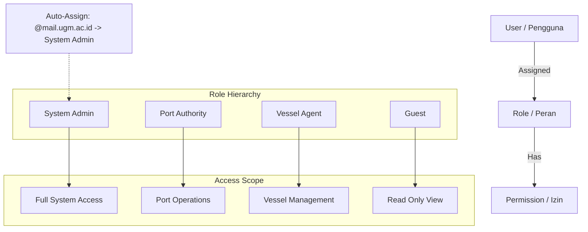

### Definisi Peran (Roles)

1.  **System Admin:** Akses penuh ke seluruh sistem. Dapat mengelola user, role, dan konfigurasi global.
    *   *Catatan:* Email dengan domain `@mail.ugm.ac.id` otomatis mendapatkan role ini.
2.  **Port Authority:** Otoritas pelabuhan yang berwenang menyetujui/menolak permintaan layanan (Service Requests) dan memantau lalu lintas di wilayahnya.
3.  **Vessel Agent:** Agen kapal yang dapat mengajukan permintaan layanan dan mendaftarkan kapal baru. Data dibatasi hanya untuk perusahaan mereka (Data Isolation).
4.  **Guest:** Pengguna umum yang hanya dapat melihat peta publik dan berita, tanpa akses ke data operasional sensitif.

## 10. Alur Kerja Pengguna (User Flow)

Diagram berikut menggambarkan alur interaksi pengguna mulai dari login hingga pengajuan layanan.

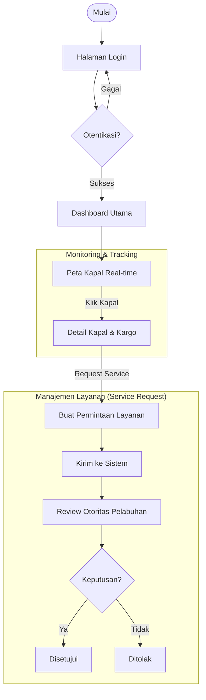

## 11. Modul Administrasi & Operasional

Selain fitur pemantauan real-time, HarborFlow menyediakan modul manajemen lengkap untuk operasional harian:

### A. Manajemen Kapal (Vessel Management)
Modul untuk mendaftarkan dan mengelola data kapal.
-   **Fitur:** CRUD Kapal, Integrasi data GFW (Dimensi, Bendera), Status Aktif/Non-aktif.
-   **Akses:** `SystemAdmin`, `VesselAgent` (hanya kapal perusahaan sendiri).

### B. Manajemen Layanan (Service Requests)
Sistem tiket untuk pengajuan layanan pelabuhan.
-   **Workflow:** *Pending* -> *Approved/Rejected* -> *In Progress* -> *Completed*.
-   **Fitur:** Pemilihan kapal, jenis layanan (Pilotage, Berthing, Bunkering), dan riwayat status.

### C. Manajemen Pengguna & Perusahaan
Fitur administratif untuk `SystemAdmin`.
-   **User Management:** Mengelola pengguna, menetapkan Role, dan reset password.
-   **Company Management:** Mendaftarkan perusahaan pelayaran dan menetapkan Tier layanan.

### D. Berita Maritim
Agregasi berita otomatis dari RSS feed industri maritim global, memberikan wawasan terkini langsung di dashboard.

## 12. Galeri Antarmuka

Berikut adalah tampilan antarmuka HarborFlow Suite yang telah dikembangkan:

### Dashboard Utama
Pusat komando operasional dengan ringkasan statistik dan akses cepat.
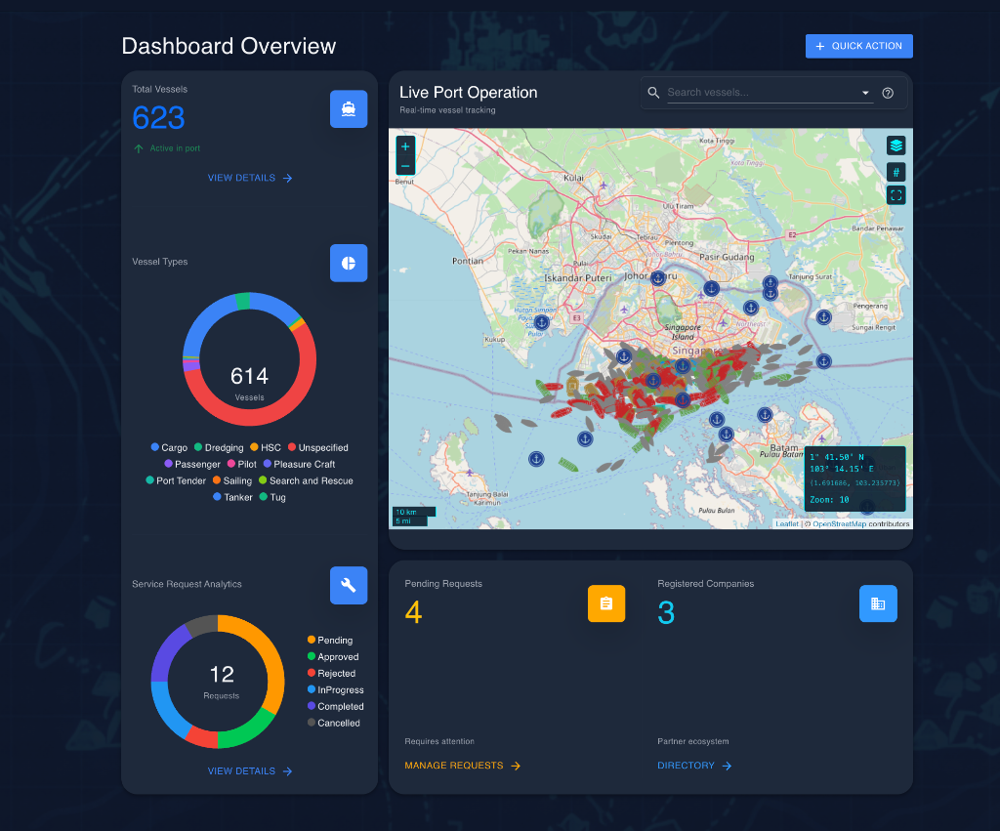

### Peta Nautikal (Nautical Chart)
Visualisasi detail peta laut OpenSeaMap untuk navigasi presisi.
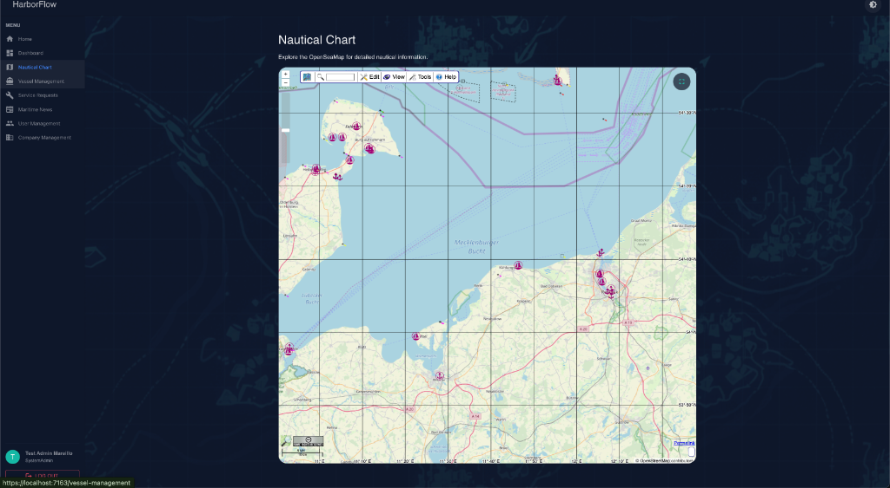

### Detail Peta (Zoom View)
Tampilan detail kedalaman dan navigasi pada peta.
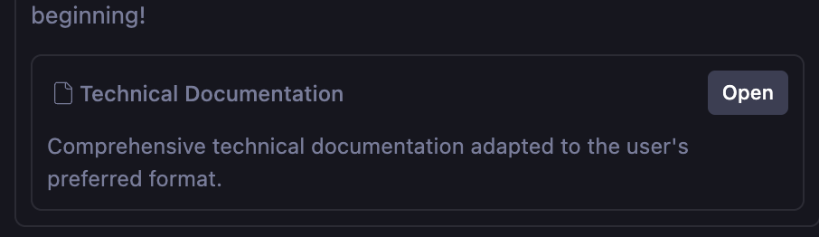

### Mode Terang (Light Mode)
Opsi tampilan cerah untuk lingkungan kerja dengan pencahayaan tinggi.
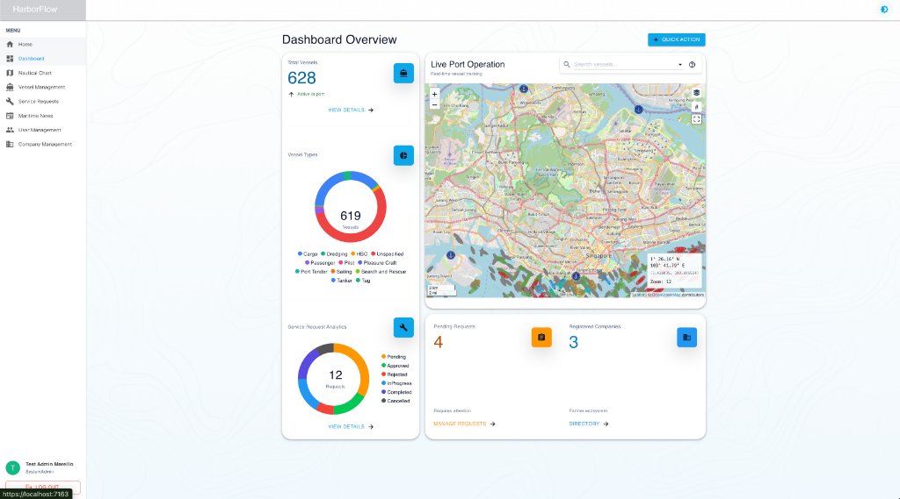

### Layar Login
Gerbang masuk aman dengan integrasi Firebase Authentication.
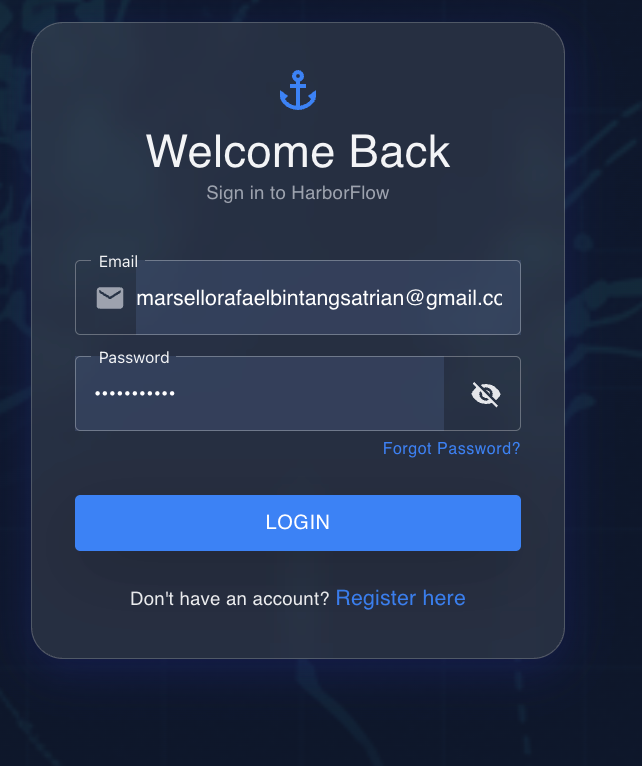

### Manajemen Kapal
Daftar kapal dengan fitur pencarian dan filter status.
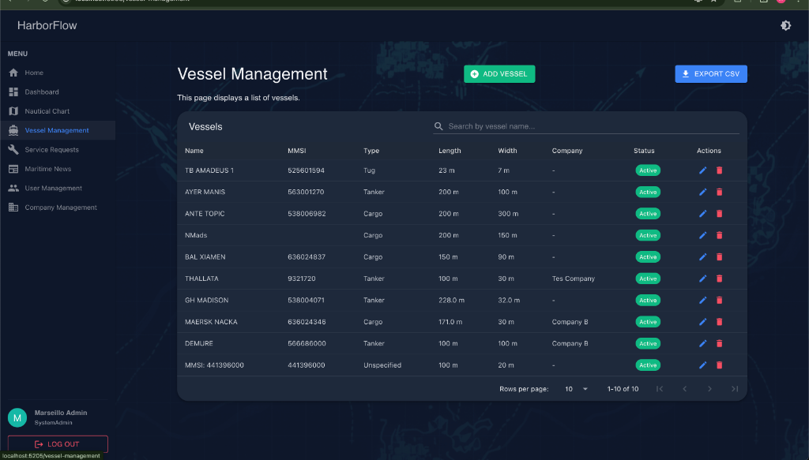

### Manajemen Permintaan Layanan
Dashboard status permintaan layanan dengan indikator warna.
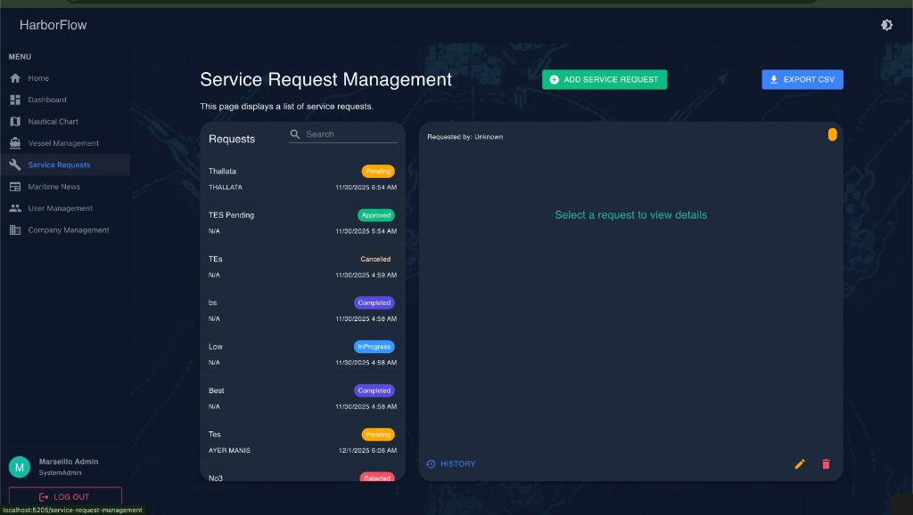

### Berita Maritim
Portal berita terintegrasi untuk informasi industri terkini.
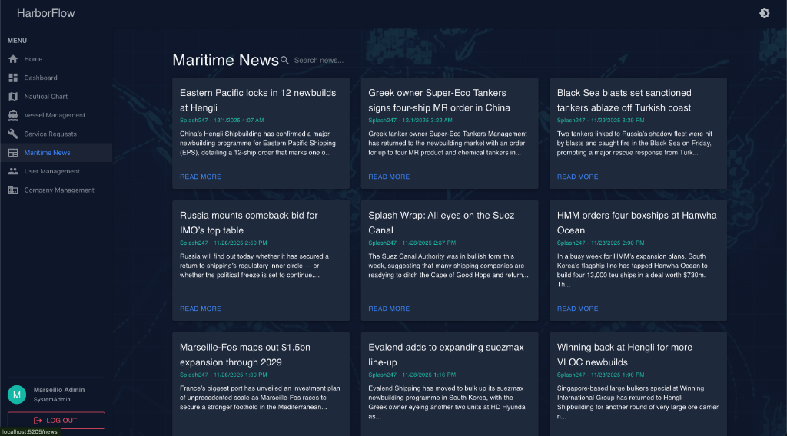

### Manajemen Pengguna (Admin)
Kontrol penuh atas akun pengguna dan penetapan peran.
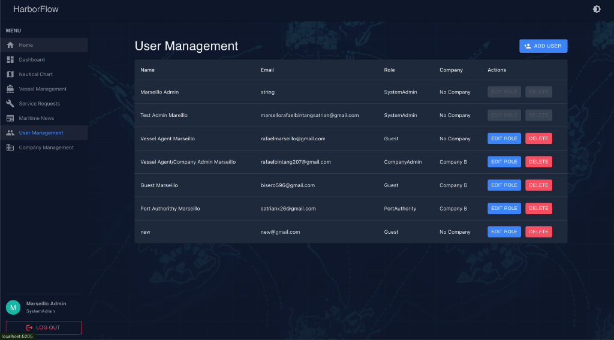

### Manajemen Perusahaan
Database perusahaan mitra dan agen pelayaran.
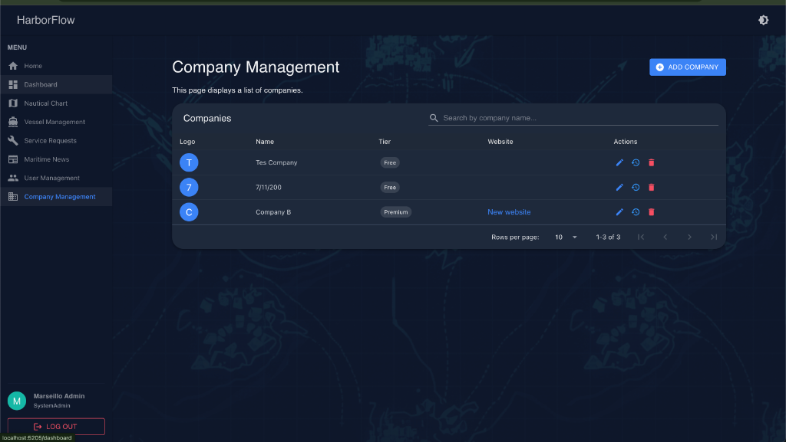

## 13. Cara Menjalankan Aplikasi

### Prasyarat
-   **Docker Desktop** (Wajib untuk Database)
-   **.NET 9.0 SDK**
-   **Firebase Credentials** (`firebase-adminsdk.json`)

### Langkah Cepat (Quick Start)

1.  **Siapkan Database (Docker):**
    Jalankan skrip berikut untuk menyalakan database PostgreSQL di port **5433**:
    ```bash
    ./start-dev.sh
    ```

2.  **Jalankan Backend Server:**
    Buka terminal baru di root folder:
    ```bash
    dotnet run --project HarborFlowSuite/HarborFlowSuite.Server --launch-profile https
    ```
    *   Swagger API: `https://localhost:7274/swagger`

3.  **Jalankan Frontend Client:**
    Buka terminal baru lainnya:
    ```bash
    dotnet run --project HarborFlowSuite/HarborFlowSuite.Client
    ```
    *   Web App: `https://localhost:7163`

### Verifikasi Database (Opsional)

Jika Anda ingin memeriksa data secara langsung di database Docker:

1.  Masuk ke container:
    ```bash
    docker exec -it harborflow-db psql -U postgres -d harborflow
    ```
2.  Tampilkan tabel:
    ```sql
    \dt
    ```
    Anda akan melihat tabel-tabel seperti `Users`, `Roles`, `Vessels`, `ServiceRequests`, dll.
3.  Keluar:
    ```sql
    \q
    ```

## 14. Batasan Saat Ini (Limitations)

-   **Data Historis:** Saat ini sistem hanya menampilkan posisi kapal *terkini* (real-time). Jejak pergerakan masa lalu belum disimpan secara permanen untuk efisiensi penyimpanan.
-   **Skalabilitas AIS:** Layanan `AisDataService` saat ini berjalan sebagai *single instance*. Untuk cakupan global penuh, arsitektur perlu ditingkatkan menjadi *distributed processing*.
-   **Ketergantungan API:** Data detail kapal (bendera, dimensi) bergantung pada API pihak ketiga (Global Fishing Watch) yang memiliki batas penggunaan (rate limits).
